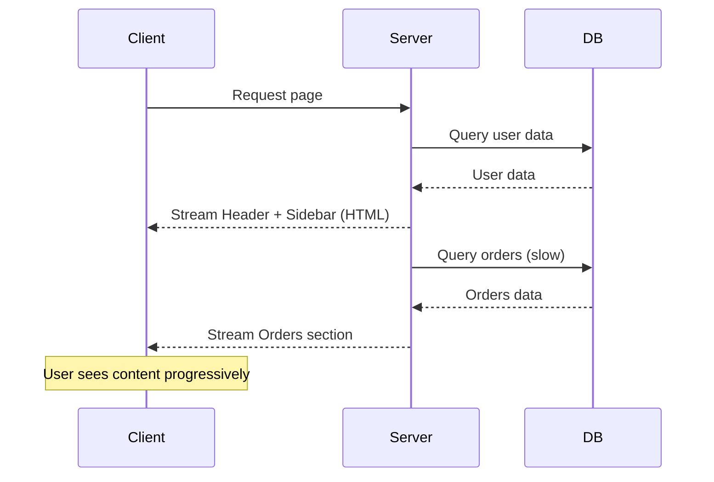

# React Server Components (RSC) in Next.js

## What Are Server Components?

Server Components are React components that run **exclusively on the server**. They have zero client-side JavaScript and can directly access databases, file systems, and backend services.

## Server vs Client Components

| Aspect | Server Component | Client Component |
|--------|-----------------|------------------|
| **Execution** | Server only | Browser (hydrated) |
| **JavaScript bundle** | 0 KB added | Full component JS |
| **Data fetching** | Direct (DB, FS, API) | useEffect, hooks |
| **State** | ❌ Cannot use state | ✅ useState, useReducer |
| **Effects** | ❌ Cannot use effects | ✅ useEffect, useLayoutEffect |
| **Event handlers** | ❌ onClick, onSubmit | ✅ All events |
| **Hooks** | ❌ No React hooks | ✅ All hooks |
| **Context** | ❌ Cannot read/write | ✅ useContext |
| **Streaming** | ✅ HTML streams | Requires Suspense |
| **Access to backend** | ✅ Direct | ❌ Via API calls |

## `'use client'` Directive

```tsx
// This is a Server Component by default
import { getProducts } from '@/lib/db';

export default async function ProductList() {
  const products = await getProducts();  // Direct DB access
  return (
    <div>
      {products.map(product => (
        <ProductCard key={product.id} product={product} />
      ))}
    </div>
  );
}

// --- ProductCard.tsx (Client Component) ---
'use client';

import { useState } from 'react';
import { addToCart } from './actions';

export default function ProductCard({ product }) {
  const [added, setAdded] = useState(false);

  const handleAddToCart = async () => {
    await addToCart(product.id);
    setAdded(true);
    setTimeout(() => setAdded(false), 2000);
  };

  return (
    <div>
      <h3>{product.name}</h3>
      <p>{product.price}</p>
      <button onClick={handleAddToCart}>
        {added ? 'Added!' : 'Add to Cart'}
      </button>
    </div>
  );
}
```

## Server Component Data Fetching

Server Components can `async` and `await` directly — no `useEffect` needed.

```tsx
// app/dashboard/page.tsx — Server Component
import { Suspense } from 'react';
import { getCurrentUser, getDashboardStats, getRecentOrders } from '@/lib/data';
import { DashboardSkeleton } from './loading';
import { StatsCards } from './StatsCards';
import { RecentOrders } from './RecentOrders';

export default async function DashboardPage() {
  // These fetch in parallel
  const [user, stats] = await Promise.all([
    getCurrentUser(),
    getDashboardStats(),
  ]);

  return (
    <div>
      <h1>Welcome back, {user.name}</h1>
      <StatsCards stats={stats} />
      <Suspense fallback={<DashboardSkeleton />}>
        <RecentOrdersWrapper />
      </Suspense>
    </div>
  );
}

// Streamed separately with Suspense
async function RecentOrdersWrapper() {
  const orders = await getRecentOrders();
  return <RecentOrders orders={orders} />;
}
```

## Server-Only Code

Use `server-only` package to prevent code from ever reaching the client.

```bash
npm install server-only
```

```ts
// lib/db.ts
import 'server-only';
import { PrismaClient } from '@prisma/client';

export const db = new PrismaClient();
```

If a client component imports `db.ts`, it will fail at build time — preventing accidental secret exposure.

## Composition Pattern: Server + Client

```tsx
// Server Component (parent)
import { getProduct } from '@/lib/data';
import { AddToCartButton } from './AddToCartButton';  // Client component

export default async function ProductPage({ params }) {
  const product = await getProduct(params.id);

  return (
    <div>
      <h1>{product.name}</h1>
      <ProductImages images={product.images} />       {/* Server: static HTML */}
      <ProductDescription description={product.description} /> {/* Server */}
      
      <AddToCartButton productId={product.id} />      {/* Client: interactive */}
      {/* Pass server data as props to client — works fine */}
    </div>
  );
}
```

## Moving Client Components Down

Push client interactivity to leaf components to maximize server rendering.

```tsx
// BAD: Entire page is a Client Component
'use client';

export default function HomePage() {
  const [data, setData] = useState(null);
  useEffect(() => { fetch('/api/data').then(r => r.json()).then(setData); }, []);
  return <div>{/* ... */}</div>;
}
```

```tsx
// GOOD: Only the interactive part is a Client Component
import { InteractiveSection } from './InteractiveSection';

export default async function HomePage() {
  const data = await fetchData();  // Server-side

  return (
    <div>
      <HeroSection />              {/* Server */}
      <ProductGrid items={data} /> {/* Server */}
      <InteractiveSection />       {/* Client — interactive */}
      <Footer />                   {/* Server */}
    </div>
  );
}
```

## Streaming with Suspense



```tsx
// app/dashboard/page.tsx
import { Suspense } from 'react';

export default function Dashboard() {
  return (
    <div>
      <h1>Dashboard</h1>
      {/* Blocks rendering until ready */}
      <ServerComponent />

      {/* Does NOT block — shows fallback, then streams */}
      <Suspense fallback={<SlowComponentSkeleton />}>
        <SlowServerComponent />
      </Suspense>
    </div>
  );
}
```

## Summary

Server Components are the foundation of the App Router. They eliminate the client-server waterfall, reduce bundle size, and improve performance by default. The key pattern: **render as much as possible on the server, add interactivity only where needed with Client Components**.
