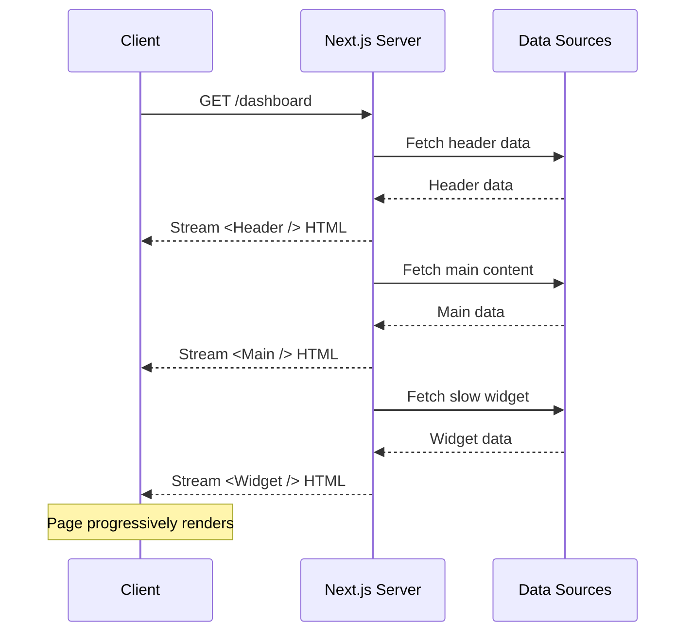
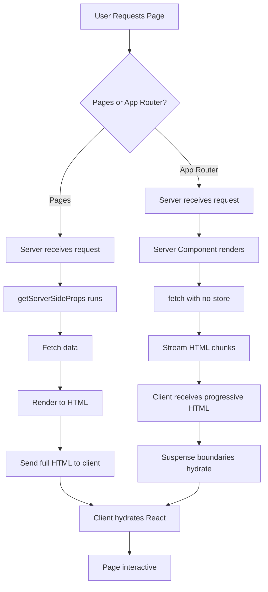

# Server-Side Rendering (SSR) with Next.js

## What is SSR?

Server-Side Rendering generates HTML on the server for **every request**. The server fetches data, renders the page to HTML, and sends it to the client. The client then hydrates the HTML into an interactive React app.

## When to Use SSR

- Pages with **dynamic content** that changes per request (user-specific dashboards)
- Pages where **SEO** is important and content changes frequently
- Pages with **personalized content** (user preferences, geolocation data)
- Data that must be **fresh** on every request (stock prices, live scores)

## Pages Router: getServerSideProps

```js
// pages/dashboard.js (Pages Router)
export async function getServerSideProps({ req, params, query }) {
  const session = await getSession(req);
  if (!session) {
    return {
      redirect: { destination: '/login', permanent: false },
    };
  }

  const [stats, orders] = await Promise.all([
    db.getStats(session.user.id),
    db.getRecentOrders(session.user.id),
  ]);

  return {
    props: {
      stats,
      orders,
      user: session.user,
    },
  };
}

export default function Dashboard({ stats, orders, user }) {
  return (
    <div>
      <h1>Welcome, {user.name}</h1>
      <StatsCards stats={stats} />
      <OrdersList orders={orders} />
    </div>
  );
}
```

## App Router: Dynamic Rendering

In the App Router, use `fetch` with `cache: 'no-store'` or `next: { revalidate: 0 }` for dynamic rendering.

```tsx
// app/dashboard/page.tsx (App Router)
export const dynamic = 'force-dynamic';  // Opt into SSR per page

export default async function DashboardPage() {
  const stats = await fetch('https://api.example.com/stats', {
    cache: 'no-store',  // Always fetch fresh data
  }).then(r => r.json());

  const orders = await fetch('https://api.example.com/orders', {
    next: { revalidate: 0 },  // Equivalent to no-store
  }).then(r => r.json());

  return (
    <div>
      <StatsCards stats={stats} />
      <OrdersList orders={orders} />
    </div>
  );
}
```

### Dynamic Functions

Next.js automatically opts into dynamic rendering when you use:

```tsx
// These functions make the route dynamic
import { cookies } from 'next/headers';
import { headers } from 'next/headers';
import { draftMode } from 'next/headers';

export default async function Page() {
  const cookieStore = await cookies();
  const headerList = await headers();
  const { isEnabled } = await draftMode();

  const userPrefs = cookieStore.get('preferences');
  const userAgent = headerList.get('user-agent');

  return <div>{/* ... */}</div>;
}
```

## Streaming SSR

The App Router supports streaming — the server sends HTML chunks as they become ready.



```tsx
// app/dashboard/page.tsx
import { Suspense } from 'react';
import { SlowWidget } from './SlowWidget';
import { FastContent } from './FastContent';
import { WidgetSkeleton } from './loading';

export default function DashboardPage() {
  return (
    <div>
      {/* Fast content blocks rendering briefly */}
      <FastContent />

      {/* Slow content is streamed — doesn't block */}
      <Suspense fallback={<WidgetSkeleton />}>
        <SlowWidget />
      </Suspense>
    </div>
  );
}

// SlowWidget.tsx — This is a Server Component that takes time
export default async function SlowWidget() {
  // Simulate slow data fetch
  await new Promise(resolve => setTimeout(resolve, 3000));
  const data = await fetchData();
  return <div>{/* render data */}</div>;
}
```

## SSR Flow Diagram



## Performance Considerations

| Metric | SSR | App Router Streaming |
|--------|-----|---------------------|
| **TTFB** | After all data fetches + render | After first chunk (header) |
| **FCP** | After full HTML arrives | Progressive — faster initial paint |
| **LCP** | After full HTML + hydration | Progressive — content streams |
| **TTI** | After full hydration | Progressive hydration |
| **Bundle sent** | All component JS | Only client components + shell |

## Real-World Scenario: User Dashboard

```tsx
// app/dashboard/page.tsx
import { Suspense } from 'react';
import { getServerSession } from '@/lib/auth';
import { redirect } from 'next/navigation';
import { ProfileHeader } from './ProfileHeader';
import { StatsGrid } from './StatsGrid';
import { RecentActivity } from './RecentActivity';
import { Recommendations } from './Recommendations';
import { StatsSkeleton, ActivitySkeleton, RecommendationsSkeleton } from './loading';

export default async function DashboardPage() {
  const session = await getServerSession();
  if (!session) redirect('/login');

  // Profile data is critical — wait for it
  const user = await getUser(session.user.id);

  return (
    <div>
      <ProfileHeader user={user} />
      
      {/* Independent sections stream in parallel */}
      <Suspense fallback={<StatsSkeleton />}>
        <StatsGrid userId={session.user.id} />
      </Suspense>

      <div className="grid grid-cols-2 gap-4">
        <Suspense fallback={<ActivitySkeleton />}>
          <RecentActivity userId={session.user.id} />
        </Suspense>

        <Suspense fallback={<RecommendationsSkeleton />}>
          <Recommendations userId={session.user.id} />
        </Suspense>
      </div>
    </div>
  );
}
```

## Summary

SSR provides fresh data on every request at the cost of server processing time. The App Router's streaming SSR improves perceived performance by sending content progressively. Use SSR when data freshness is more important than raw page load speed.
