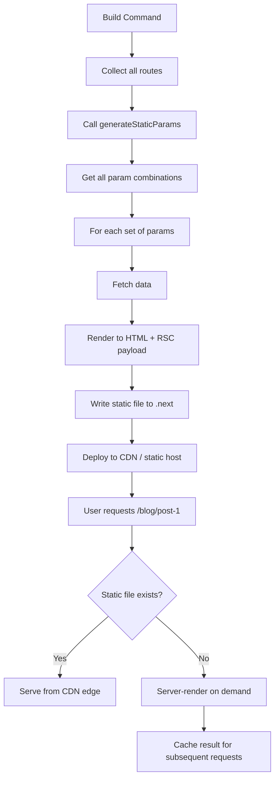

# Static Site Generation (SSG) with Next.js

## What is SSG?

Static Site Generation generates HTML pages at **build time**. The result is static HTML files that can be served from a CDN with no server-side processing per request.

## When to Use SSG

- Blog posts, documentation, marketing pages
- Content that is the same for all users
- Public API data that changes infrequently
- Pages where TTFB must be minimal
- High-traffic pages (cost-effective on CDN)

## Pages Router: getStaticProps

```js
// pages/blog/[slug].js (Pages Router)
export async function getStaticProps({ params }) {
  const post = await getPostBySlug(params.slug);

  return {
    props: { post },
    revalidate: 3600,  // ISR: revalidate every hour
  };
}

export async function getStaticPaths() {
  const posts = await getAllPosts();

  const paths = posts.map(post => ({
    params: { slug: post.slug },
  }));

  return { paths, fallback: 'blocking' };
}

export default function BlogPost({ post }) {
  return (
    <article>
      <h1>{post.title}</h1>
      <div dangerouslySetInnerHTML={{ __html: post.content }} />
    </article>
  );
}
```

## App Router: Static Rendering with generateStaticParams

```tsx
// app/blog/[slug]/page.tsx (App Router)
export async function generateStaticParams() {
  const posts = await getAllPosts();

  return posts.map((post) => ({
    slug: post.slug,
  }));
}

// By default, pages are statically rendered if no dynamic functions are used
export default async function BlogPost({ params }) {
  const { slug } = await params;
  const post = await getPostBySlug(slug);

  return (
    <article>
      <h1>{post.title}</h1>
      <time>{post.date}</time>
      <div>{post.content}</div>
    </article>
  );
}
```

## SSG Flow Diagram



## generateStaticParams with Fallback

```tsx
export async function generateStaticParams() {
  // Only pre-build the top 100 posts
  const posts = await getTopPosts(100);
  return posts.map((p) => ({ slug: p.slug }));
}

// fallback options:
// false — 404 for non-generated paths
// true — serve fallback page, generate on first request
// 'blocking' — wait for generation on first request
```

## Static Rendering by Default

In the App Router, pages are **statically rendered by default** unless you use dynamic functions or explicit dynamic config.

```tsx
// This is automatically statically rendered
export default async function AboutPage() {
  // If this fetch doesn't use no-store/revalidate 0, 
  // the result is cached at build time
  const data = await fetch('https://api.example.com/info');
  const info = await data.json();

  return <div>{info.content}</div>;
}

// Force static — even if dynamic functions exist
export const dynamic = 'force-static';
```

## Static Data Fetching

```tsx
// Default fetch — cached at build time (static)
const data = await fetch('https://api.example.com/data');

// Explicitly cache at build time
const data = await fetch('https://api.example.com/data', {
  cache: 'force-cache',
});

// With revalidation (ISR)
const data = await fetch('https://api.example.com/data', {
  next: { revalidate: 3600 },  // Revalidate every hour
});
```

## Comparison: Pages vs App Router

| Aspect | Pages Router | App Router |
|--------|-------------|------------|
| Data fetching | `getStaticProps` | Direct `fetch` in Server Component |
| Path generation | `getStaticPaths` | `generateStaticParams` |
| Default behavior | Client-side render | Static render |
| Revalidation | `revalidate` prop | `next.revalidate` option |
| Streaming | No | Yes (even with static shell) |
| Partial generation | `fallback: true/blocking` | `dynamicParams: true` |

## Real-World Scenario: Documentation Site

```tsx
// app/docs/[...slug]/page.tsx
import { getDocBySlug, getAllDocs } from '@/lib/docs';
import { notFound } from 'next/navigation';

export async function generateStaticParams() {
  const docs = await getAllDocs();
  return docs.map((doc) => ({ slug: doc.slug.split('/') }));
}

export const dynamicParams = true;  // Generate new pages on first request

export default async function DocPage({ params }) {
  const { slug } = await params;
  const doc = await getDocBySlug(slug.join('/'));

  if (!doc) notFound();

  return (
    <article className="prose max-w-none">
      <h1>{doc.title}</h1>
      <MDXContent source={doc.content} />
    </article>
  );
}

// app/docs/layout.tsx
export default function DocsLayout({ children }) {
  return (
    <div className="flex">
      <Sidebar />
      <main>{children}</main>
    </div>
  );
}
```

## Performance Benefits

```
Metric        SSG            SSR            CSR
───────────   ────────────   ────────────   ────────────
TTFB          ~10ms (CDN)    ~200ms+        ~100ms (shell)
FCP           Instant        ~300ms+        ~300ms+
LCP           Instant        After SSR      After data fetch
Cost          Cheap CDN      Server req/hr  Server req/hr
Scalability   Unlimited      Server bound   Server bound
```

## Summary

SSG is the fastest rendering pattern because it produces static files at build time. Use SSG for any content that doesn't need per-request personalization. Combine with ISR for content that needs periodic updates without a full rebuild.
