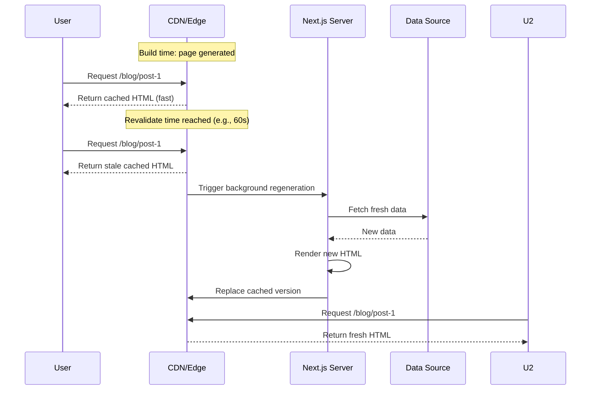
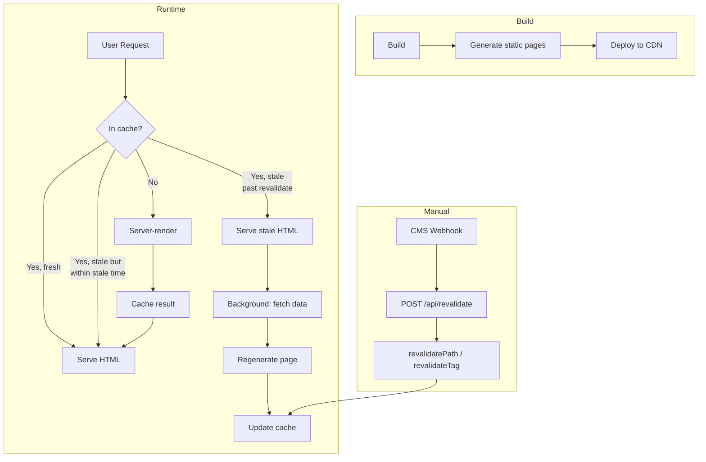

# Incremental Static Regeneration (ISR)

## What is ISR?

ISR combines the **speed of static generation** with the **freshness of dynamic rendering**. Pages are statically generated at build time, then re-generated in the background when a revalidation period expires or on-demand triggers occur.

## How ISR Works



## Time-Based Revalidation

```tsx
// App Router — revalidate every 60 seconds
export default async function BlogPage() {
  const posts = await fetch('https://api.example.com/posts', {
    next: { revalidate: 60 },  // Revalidate at most every 60 seconds
  }).then(r => r.json());

  return (
    <div>
      {posts.map(post => (
        <BlogCard key={post.id} post={post} />
      ))}
    </div>
  );
}
```

```tsx
// Pages Router — equivalent
export async function getStaticProps() {
  const posts = await fetch('https://api.example.com/posts').then(r => r.json());
  return {
    props: { posts },
    revalidate: 60,
  };
}
```

## Segment-Level ISR

Different parts of a page can have different revalidation times using Suspense and data fetching patterns.

```tsx
import { Suspense } from 'react';

export default async function Page() {
  return (
    <div>
      {/* Footer revalidates every day — stays cached */}
      <Suspense fallback={<FooterSkeleton />}>
        <Footer />
      </Suspense>
      
      {/* Main content revalidates every 60 seconds */}
      <Suspense fallback={<ContentSkeleton />}>
        <MainContent />
      </Suspense>
    </div>
  );
}

async function Footer() {
  const data = await fetch('https://api.example.com/footer', {
    next: { revalidate: 86400 },  // 24 hours
  }).then(r => r.json());
  return <footer>{/* ... */}</footer>;
}

async function MainContent() {
  const data = await fetch('https://api.example.com/content', {
    next: { revalidate: 60 },
  }).then(r => r.json());
  return <main>{/* ... */}</main>;
}
```

## On-Demand Revalidation

Trigger revalidation via API route when content changes (e.g., CMS webhook).

```tsx
// app/api/revalidate/route.ts
import { revalidatePath } from 'next/cache';
import { revalidateTag } from 'next/cache';
import { NextRequest } from 'next/server';

export async function POST(request: NextRequest) {
  const secret = request.headers.get('x-revalidate-secret');
  
  if (secret !== process.env.REVALIDATION_SECRET) {
    return Response.json({ message: 'Invalid secret' }, { status: 401 });
  }

  const body = await request.json();
  
  // Option 1: Revalidate a specific path
  if (body.path) {
    revalidatePath(body.path);
  }
  
  // Option 2: Revalidate by tag
  if (body.tag) {
    revalidateTag(body.tag);
  }

  return Response.json({ revalidated: true });
}
```

### Revalidation with Tags

```tsx
// Fetch with tags for targeted invalidation
export default async function PostPage({ params }) {
  const { slug } = await params;
  
  const post = await fetch(`https://cms.example.com/posts/${slug}`, {
    next: { tags: [`post-${slug}`, 'posts'] },
  }).then(r => r.json());

  return <article>{/* ... */}</article>;
}
```

### Webhook Handler

```tsx
// app/api/webhook/cms/route.ts
export async function POST(request: NextRequest) {
  const payload = await request.json();
  
  switch (payload.event) {
    case 'post.updated':
    case 'post.created':
      revalidateTag(`post-${payload.slug}`);
      revalidateTag('posts');
      break;
    case 'post.deleted':
      revalidatePath('/blog');
      break;
    case 'category.updated':
      revalidateTag('categories');
      break;
  }

  return Response.json({ received: true });
}
```

## ISR Architecture



## generateStaticParams with ISR

```tsx
// Pre-build the most popular posts, generate others on demand
export async function generateStaticParams() {
  const posts = await getPopularPosts(50);  // Pre-build top 50
  return posts.map((post) => ({ slug: post.slug }));
}

// Allow dynamic params — non-prebuilt pages render on first request
export const dynamicParams = true;

export default async function PostPage({ params }) {
  const { slug } = await params;
  const post = await getPost(slug);

  if (!post) notFound();

  return <article>{/* post content */}</article>;
}
```

## When to Use ISR

| Use Case | Revalidate | Strategy |
|----------|-----------|----------|
| Blog posts | 1 hour | Time-based |
| E-commerce product | 5 min | Time-based + on-demand on price change |
| News article | Immediate on publish | On-demand via webhook |
| Marketing page | 1 day | Time-based |
| User-generated content | Never (SSR) | Use dynamic rendering |

## Real-World Scenario: Headless CMS Blog

```tsx
// app/blog/[slug]/page.tsx
export const revalidate = 900;  // Page-level default: 15 min

export async function generateStaticParams() {
  const posts = await fetch('https://cms.example.com/posts').then(r => r.json());
  return posts.map(p => ({ slug: p.slug }));
}

export default async function BlogPost({ params }) {
  const { slug } = await params;
  
  const post = await fetch(`https://cms.example.com/posts/${slug}`, {
    next: {
      revalidate: 300,  // Override: 5 min for this fetch
      tags: [`post-${slug}`],
    },
  }).then(r => r.json());

  return (
    <article>
      <h1>{post.title}</h1>
      <p>Published: {post.date}</p>
      <ContentRenderer content={post.body} />
    </article>
  );
}
```

## Summary

ISR provides an excellent middle ground between SSG and SSR. Content is served at CDN speed, then revalidated in the background when it expires or when content changes. Combined with on-demand revalidation via webhooks, ISR gives you the best of both worlds.
