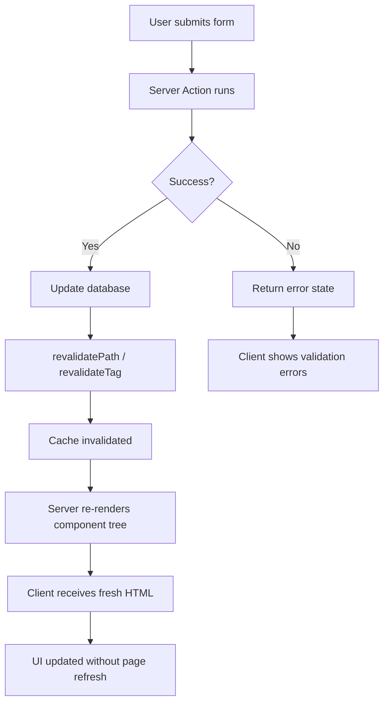

# Server Actions

## What are Server Actions?

Server Actions are functions that run **exclusively on the server** but can be called directly from Client Components. They enable form handling, data mutations, and revalidation without building API routes.

## Basic Server Action

```tsx
// app/actions.ts
'use server';

import { revalidatePath } from 'next/cache';
import { redirect } from 'next/navigation';
import { db } from '@/lib/db';
import { z } from 'zod';

const createPostSchema = z.object({
  title: z.string().min(3).max(100),
  content: z.string().min(10),
  published: z.boolean().default(false),
});

export async function createPost(formData: FormData) {
  // 1. Validate
  const validated = createPostSchema.parse({
    title: formData.get('title'),
    content: formData.get('content'),
    published: formData.get('published') === 'on',
  });

  // 2. Authorize
  const session = await getSession();
  if (!session?.user) {
    throw new Error('Unauthorized');
  }

  // 3. Mutate
  const post = await db.post.create({
    data: {
      ...validated,
      authorId: session.user.id,
    },
  });

  // 4. Revalidate
  revalidatePath('/blog');
  revalidateTag('posts');

  // 5. Redirect
  redirect(`/blog/${post.slug}`);
}
```

### Usage in a Form

```tsx
'use client';

import { createPost } from './actions';
import { useActionState } from 'react';

export function CreatePostForm() {
  const [state, formAction, pending] = useActionState(createPost, { errors: {} });

  return (
    <form action={formAction}>
      <div>
        <label htmlFor="title">Title</label>
        <input type="text" id="title" name="title" required />
        {state?.errors?.title && <p className="error">{state.errors.title}</p>}
      </div>

      <div>
        <label htmlFor="content">Content</label>
        <textarea id="content" name="content" required />
      </div>

      <label>
        <input type="checkbox" name="published" />
        Publish immediately
      </label>

      <button type="submit" disabled={pending}>
        {pending ? 'Creating...' : 'Create Post'}
      </button>
    </form>
  );
}
```

## Progressive Enhancement

Server Actions work **without JavaScript**. The form submits via HTTP POST natively.

```
With JS disabled:  Traditional form POST → Server Action → Redirect
With JS enabled:   Fetch request → Server Action → Revalidate → UI update
```

```tsx
// This form works even before React hydrates
export function NewsletterForm() {
  return (
    <form action={subscribeToNewsletter}>
      <input type="email" name="email" required />
      <button type="submit">Subscribe</button>
    </form>
  );
}
```

## Server Action from Server Component

```tsx
// app/posts/[id]/page.tsx — Server Component
import { deletePost, togglePublish } from './actions';

export default async function PostPage({ params }) {
  const { id } = await params;
  const post = await getPost(id);

  return (
    <div>
      <h1>{post.title}</h1>
      <form action={deletePost}>
        <input type="hidden" name="postId" value={post.id} />
        <button type="submit">Delete</button>
      </form>
      
      <form action={togglePublish}>
        <input type="hidden" name="postId" value={post.id} />
        <button type="submit">
          {post.published ? 'Unpublish' : 'Publish'}
        </button>
      </form>
    </div>
  );
}
```

## Revalidation

```tsx
'use server';
import { revalidatePath, revalidateTag } from 'next/cache';

export async function updatePost(formData: FormData) {
  const id = formData.get('postId');
  const title = formData.get('title');
  const content = formData.get('content');

  await db.post.update({ where: { id }, data: { title, content } });

  // Revalidate specific path
  revalidatePath(`/posts/${id}`);

  // Revalidate by tag
  revalidateTag(`post-${id}`);

  // Revalidate entire section
  revalidatePath('/posts');
}
```

## Mutations with Server Actions

```tsx
// app/todos/actions.ts
'use server';

export async function addTodo(formData: FormData) {
  const title = formData.get('title') as string;

  await db.todo.create({
    data: { title, completed: false },
  });

  revalidatePath('/todos');
}

export async function toggleTodo(formData: FormData) {
  const id = formData.get('id') as string;
  const todo = await db.todo.findUnique({ where: { id } });

  await db.todo.update({
    where: { id },
    data: { completed: !todo?.completed },
  });

  revalidatePath('/todos');
}

export async function deleteTodo(formData: FormData) {
  const id = formData.get('id') as string;

  await db.todo.delete({ where: { id } });

  revalidatePath('/todos');
}
```

```tsx
// app/todos/TodoList.tsx
import { addTodo, toggleTodo, deleteTodo } from './actions';
import { getTodos } from '@/lib/data';

export default async function TodoList() {
  const todos = await getTodos();

  return (
    <div>
      <form action={addTodo}>
        <input type="text" name="title" placeholder="New todo..." required />
        <button type="submit">Add</button>
      </form>

      <ul>
        {todos.map(todo => (
          <li key={todo.id}>
            <form action={toggleTodo} style={{ display: 'inline' }}>
              <input type="hidden" name="id" value={todo.id} />
              <button>
                {todo.completed ? '☑' : '☐'} {todo.title}
              </button>
            </form>
            <form action={deleteTodo} style={{ display: 'inline' }}>
              <input type="hidden" name="id" value={todo.id} />
              <button type="submit">🗑</button>
            </form>
          </li>
        ))}
      </ul>
    </div>
  );
}
```

## Error Handling

```tsx
'use server';

export async function createUser(prevState: unknown, formData: FormData) {
  const name = formData.get('name');
  const email = formData.get('email');

  try {
    const user = await db.user.create({ data: { name, email } });
    revalidatePath('/users');
    return { success: true, user };
  } catch (error) {
    return {
      success: false,
      errors: {
        email: 'This email is already registered',
        form: 'Failed to create user',
      },
    };
  }
}
```

```tsx
'use client';

export function CreateUserForm() {
  const [state, formAction, pending] = useActionState(createUser, null);

  return (
    <form action={formAction}>
      {state?.errors?.form && <div className="alert">{state.errors.form}</div>}
      <input name="name" required />
      {state?.errors?.email && <p className="error">{state.errors.email}</p>}
      <input name="email" type="email" required />
      <button disabled={pending}>
        {pending ? 'Creating...' : 'Create User'}
      </button>
    </form>
  );
}
```

## Revalidation Patterns



## Summary

Server Actions eliminate the need for separate API route files for mutations. They're the idiomatic way to handle form submissions and data mutations in the App Router. With progressive enhancement, forms work even when JavaScript hasn't loaded yet.
