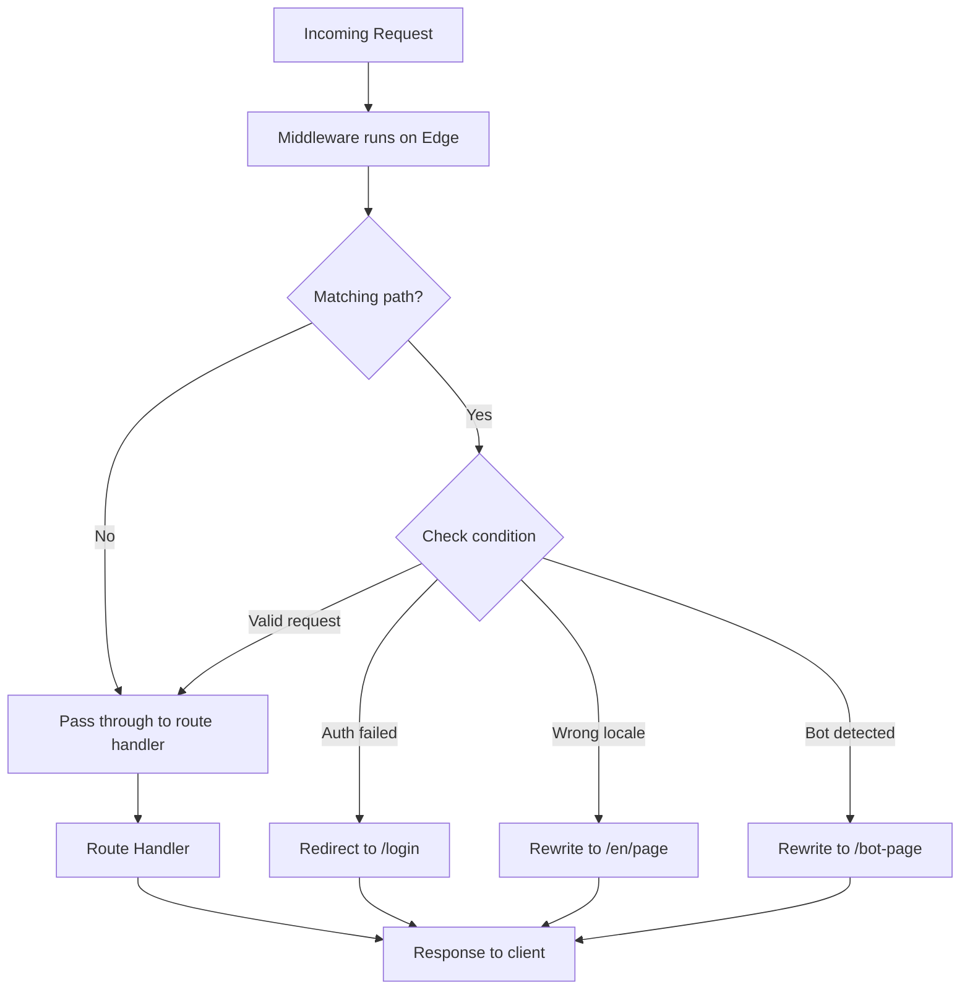

# Next.js Middleware

## What is Middleware?

Middleware executes **before** a request is completed. It runs on the Edge Runtime and can modify the request/response, redirect, rewrite, or check authentication.

## Middleware Flow



## Basic Middleware

```ts
// middleware.ts
import { NextResponse } from 'next/server';
import type { NextRequest } from 'next/server';

export function middleware(request: NextRequest) {
  console.log('Middleware running for:', request.nextUrl.pathname);

  return NextResponse.next();
}

// Define which paths trigger middleware
export const config = {
  matcher: [
    '/dashboard/:path*',
    '/api/:path*',
    '/((?!_next/static|favicon.ico).*)',  // All except static files
  ],
};
```

## Authentication Check

```ts
// middleware.ts
import { NextResponse } from 'next/server';
import type { NextRequest } from 'next/server';

const protectedRoutes = ['/dashboard', '/profile', '/settings'];
const authRoutes = ['/login', '/register'];

export function middleware(request: NextRequest) {
  const token = request.cookies.get('session')?.value;
  const { pathname } = request.nextUrl;

  // Protected route without token → redirect to login
  if (protectedRoutes.some(route => pathname.startsWith(route)) && !token) {
    const loginUrl = new URL('/login', request.url);
    loginUrl.searchParams.set('callbackUrl', pathname);
    return NextResponse.redirect(loginUrl);
  }

  // Auth route with token → redirect to dashboard
  if (authRoutes.some(route => pathname.startsWith(route)) && token) {
    return NextResponse.redirect(new URL('/dashboard', request.url));
  }

  return NextResponse.next();
}

export const config = {
  matcher: ['/((?!_next/static|_next/image|favicon.ico|.*\\.png$).*)'],
};
```

## Request Rewriting

```ts
// middleware.ts — A/B testing or feature flags
export function middleware(request: NextRequest) {
  const { pathname } = request.nextUrl;

  // Feature flag: new pricing page
  const showNewPricing = request.cookies.get('new-pricing')?.value === 'true';
  if (pathname === '/pricing' && showNewPricing) {
    request.nextUrl.pathname = '/pricing/v2';
    return NextResponse.rewrite(request.nextUrl);
  }

  return NextResponse.next();
}
```

## Redirects Based on Country/Geolocation

```ts
// middleware.ts — i18n redirect
import { match } from '@formatjs/intl-localematcher';
import Negotiator from 'negotiator';

const locales = ['en', 'es', 'fr', 'de'];
const defaultLocale = 'en';

function getLocale(request: NextRequest): string {
  const negotiatorHeaders: Record<string, string> = {};
  request.headers.forEach((value, key) => (negotiatorHeaders[key] = value));

  const languages = new Negotiator({ headers: negotiatorHeaders }).languages();
  return match(languages, locales, defaultLocale);
}

export function middleware(request: NextRequest) {
  const { pathname } = request.nextUrl;

  // Check if path already has a locale
  const pathnameHasLocale = locales.some(
    locale => pathname.startsWith(`/${locale}/`) || pathname === `/${locale}`
  );

  if (pathnameHasLocale) return NextResponse.next();

  // Redirect to locale-prefixed path
  const locale = getLocale(request);
  request.nextUrl.pathname = `/${locale}${pathname}`;
  return NextResponse.redirect(request.nextUrl);
}

export const config = {
  matcher: ['/((?!_next/static|_next/image|favicon.ico).*)'],
};
```

## i18n Routing

Next.js has built-in i18n support that works with middleware:

```ts
// middleware.ts — language detection
export function middleware(request: NextRequest) {
  const { pathname } = request.nextUrl;
  const response = NextResponse.next();

  // Set cookie for server components
  const locale = getPreferredLocale(request);
  response.cookies.set('locale', locale);

  return response;
}
```

```tsx
// app/[lang]/layout.tsx — reading locale from params
export default async function LocaleLayout({
  children,
  params,
}: {
  children: React.ReactNode;
  params: Promise<{ lang: string }>;
}) {
  const { lang } = await params;
  const messages = await getMessages(lang);

  return (
    <NextIntlClientProvider locale={lang} messages={messages}>
      {children}
    </NextIntlClientProvider>
  );
}
```

## Response Headers

```ts
// middleware.ts — add security headers
export function middleware(request: NextRequest) {
  const response = NextResponse.next();

  response.headers.set('X-Frame-Options', 'DENY');
  response.headers.set('X-Content-Type-Options', 'nosniff');
  response.headers.set('Referrer-Policy', 'strict-origin-when-cross-origin');
  response.headers.set(
    'Content-Security-Policy',
    "default-src 'self'; script-src 'self' 'unsafe-inline'; style-src 'self' 'unsafe-inline'"
  );

  return response;
}
```

## Edge Runtime Limitations

| Feature | Available in Edge? |
|---------|-------------------|
| `fs` (file system) | ❌ |
| `crypto` (web crypto) | ✅ |
| `fetch` | ✅ |
| `Request` / `Response` | ✅ |
| `URL` / `URLSearchParams` | ✅ |
| `cookies` | ✅ |
| `headers` | ✅ |
| `Buffer` | ❌ |
| Node.js `stream` | ❌ |
| Database drivers (Prisma) | ❌ |
| `Math.random` | ✅ |

## Matcher Configuration

```ts
export const config = {
  matcher: [
    // Match all paths except static files, _next, and api
    '/((?!_next/static|_next/image|favicon.ico|api).*)',
    
    // Match specific paths
    '/dashboard/:path*',
    '/admin/:path*',
    
    // Match exact path
    '/checkout',
    
    // Match file extensions
    '/:path(.*)\\.(js|css|svg)',
  ],
};
```

## Real-World Scenario: Multi-Tenant Middleware

```ts
// middleware.ts
const tenants = new Map([
  ['acme', { theme: 'blue', db: 'acme_db' }],
  ['globex', { theme: 'green', db: 'globex_db' }],
]);

export function middleware(request: NextRequest) {
  const { hostname } = request.nextUrl;
  const subdomain = hostname.split('.')[0];
  const tenant = tenants.get(subdomain);

  if (!tenant) {
    return NextResponse.next();  // Public pages
  }

  const response = NextResponse.next();
  
  // Inject tenant context into request headers
  const requestHeaders = new Headers(request.headers);
  requestHeaders.set('x-tenant-id', subdomain);
  requestHeaders.set('x-tenant-theme', tenant.theme);

  return NextResponse.next({
    request: { headers: requestHeaders },
  });
}
```

## Summary

Middleware gives you control over every request before it reaches your routes. Use it for authentication, redirects, rewrites, i18n, and modifying headers. It runs at the edge for minimal latency overhead.
