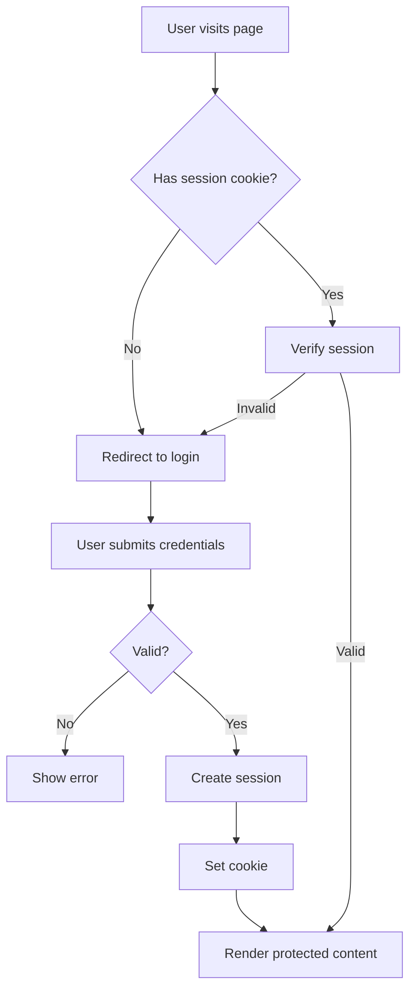
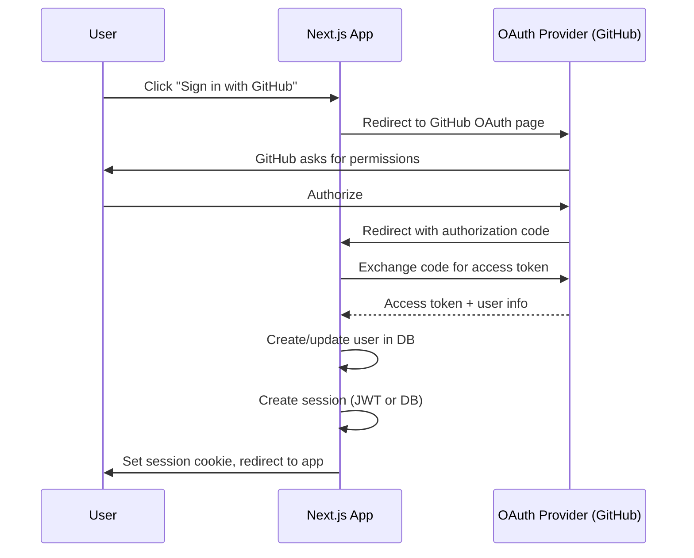

# Authentication in Next.js

## Auth Patterns Overview



## Auth.js (NextAuth.js v5)

Auth.js is the most popular authentication library for Next.js.

### Setup

```bash
npm install next-auth@beta
```

### Auth Configuration

```ts
// auth.ts
import NextAuth from 'next-auth';
import GitHub from 'next-auth/providers/github';
import Google from 'next-auth/providers/google';
import Credentials from 'next-auth/providers/credentials';
import { PrismaAdapter } from '@auth/prisma-adapter';
import { db } from '@/lib/db';

export const { handlers, signIn, signOut, auth } = NextAuth({
  adapter: PrismaAdapter(db),
  providers: [
    GitHub({
      clientId: process.env.GITHUB_ID,
      clientSecret: process.env.GITHUB_SECRET,
    }),
    Google({
      clientId: process.env.GOOGLE_ID,
      clientSecret: process.env.GOOGLE_SECRET,
    }),
    Credentials({
      credentials: {
        email: { label: 'Email', type: 'email' },
        password: { label: 'Password', type: 'password' },
      },
      async authorize(credentials) {
        const user = await db.user.findUnique({
          where: { email: credentials.email as string },
        });

        if (!user || !user.password) return null;

        const valid = await bcrypt.compare(
          credentials.password as string,
          user.password
        );

        if (!valid) return null;

        return { id: user.id, name: user.name, email: user.email };
      },
    }),
  ],
  session: {
    strategy: 'jwt',  // 'jwt' or 'database'
  },
  pages: {
    signIn: '/login',
    error: '/login',
  },
  callbacks: {
    async jwt({ token, user }) {
      if (user) {
        token.id = user.id;
        token.role = user.role;
      }
      return token;
    },
    async session({ session, token }) {
      if (session.user) {
        session.user.id = token.id as string;
        session.user.role = token.role as string;
      }
      return session;
    },
  },
});
```

### Route Handler

```ts
// app/api/auth/[...nextauth]/route.ts
import { handlers } from '@/auth';

export const { GET, POST } = handlers;
```

### Protecting Routes with Middleware

```ts
// middleware.ts
import { auth } from '@/auth';

export default auth((req) => {
  const { pathname } = req.nextUrl;
  const isLoggedIn = !!req.auth;

  const protectedRoutes = ['/dashboard', '/profile', '/admin'];
  const isProtected = protectedRoutes.some(route =>
    pathname.startsWith(route)
  );

  if (isProtected && !isLoggedIn) {
    const loginUrl = new URL('/login', req.url);
    loginUrl.searchParams.set('callbackUrl', pathname);
    return Response.redirect(loginUrl);
  }

  return;
});

export const config = {
  matcher: ['/((?!_next/static|_next/image|favicon.ico).*)'],
};
```

### Getting Session in Server Components

```tsx
// app/dashboard/page.tsx
import { auth } from '@/auth';
import { redirect } from 'next/navigation';

export default async function DashboardPage() {
  const session = await auth();

  if (!session?.user) {
    redirect('/login');
  }

  return (
    <div>
      <h1>Welcome, {session.user.name}</h1>
      <p>Role: {session.user.role}</p>
      <p>Email: {session.user.email}</p>
    </div>
  );
}
```

### Client-Side Session Access

```tsx
'use client';

import { useSession, signIn, signOut } from 'next-auth/react';

export function AuthButton() {
  const { data: session, status } = useSession();

  if (status === 'loading') return <Spinner />;

  if (session) {
    return (
      <div>
        <span>{session.user?.name}</span>
        <button onClick={() => signOut()}>Sign Out</button>
      </div>
    );
  }

  return <button onClick={() => signIn()}>Sign In</button>;
}
```

### SessionProvider

```tsx
// app/providers.tsx
'use client';

import { SessionProvider } from 'next-auth/react';

export function Providers({ children }: { children: React.ReactNode }) {
  return <SessionProvider>{children}</SessionProvider>;
}

// app/layout.tsx
import { Providers } from './providers';

export default function RootLayout({ children }) {
  return (
    <html>
      <body>
        <Providers>{children}</Providers>
      </body>
    </html>
  );
}
```

## JWT vs Database Sessions

| Aspect | JWT | Database Session |
|--------|-----|------------------|
| **Storage** | Signed token in cookie | Session ID in cookie, data in DB |
| **Database query per request** | No | Yes |
| **Can revoke instantly** | No (valid until expiry) | Yes (delete from DB) |
| **Scales horizontally** | Easily (no shared DB needed) | Requires session store |
| **Payload size** | Limited (cookie size ~4KB) | Unlimited |
| **Use case** | Simple apps, microservices | Apps needing instant revocation |

## OAuth Flow Diagram



## Auth with Server Actions

```tsx
'use server';

import { signIn, signOut } from '@/auth';

export async function authenticate(formData: FormData) {
  try {
    await signIn('credentials', {
      email: formData.get('email'),
      password: formData.get('password'),
      redirect: false,
    });
    return { success: true };
  } catch (error) {
    return { success: false, error: 'Invalid credentials' };
  }
}

export async function signOutAction() {
  await signOut();
}
```

```tsx
'use client';

import { useActionState } from 'react';
import { authenticate } from './actions';

export function LoginForm() {
  const [state, formAction, pending] = useActionState(authenticate, null);

  return (
    <form action={formAction}>
      {state?.error && <div className="error">{state.error}</div>}
      <input type="email" name="email" placeholder="Email" required />
      <input type="password" name="password" placeholder="Password" required />
      <button type="submit" disabled={pending}>
        {pending ? 'Signing in...' : 'Sign In'}
      </button>
    </form>
  );
}
```

## Real-World Scenario: Role-Based Access

```tsx
// lib/auth.ts
export async function requireRole(...roles: string[]) {
  const session = await auth();

  if (!session?.user) {
    redirect('/login');
  }

  if (!roles.includes(session.user.role)) {
    redirect('/unauthorized');
  }

  return session;
}

// app/admin/page.tsx
export default async function AdminPage() {
  const session = await requireRole('admin', 'superadmin');

  return <div>Admin panel — {session.user.role}</div>;
}

// app/dashboard/users/page.tsx
export default async function UsersPage() {
  const session = await requireRole('admin');

  const users = await db.user.findMany();

  return (
    <table>
      {users.map(user => (
        <tr key={user.id}>
          <td>{user.name}</td>
          <td>{user.email}</td>
        </tr>
      ))}
    </table>
  );
}
```

## Summary

Next.js auth patterns have evolved: Auth.js (NextAuth v5) is the standard, supporting JWT and database sessions, OAuth providers, and credentials auth. Server Components access sessions via `auth()`, Client Components via `useSession()`, and middleware protects routes at the edge.
