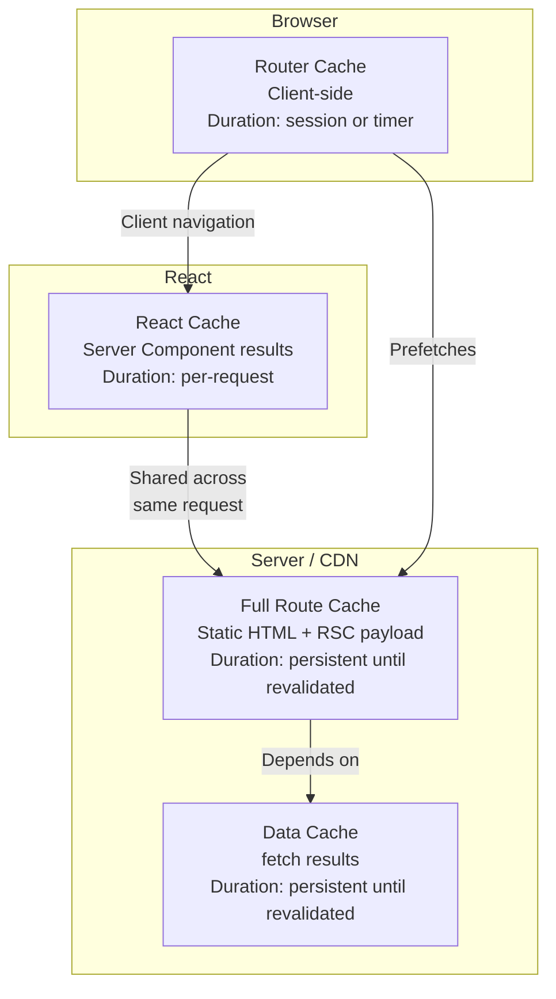
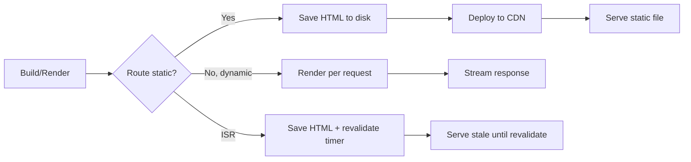
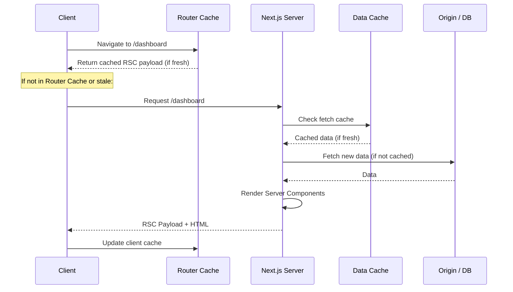

# Next.js Caching

## Cache Layers Overview

Next.js has four caching layers that interact to provide optimal performance:



## 1. Full Route Cache (Static)

At build time or during ISR, Next.js renders the route to HTML and RSC payload, saving them to the `.next` directory.



**Opt out**: Use `dynamic = 'force-dynamic'` or dynamic functions (`cookies()`, `headers()`, `searchParams`).

## 2. Data Cache (fetch)

Persistent HTTP cache for `fetch` requests. Works across deployments.

```tsx
// Default: cached indefinitely (force-cache)
const data = await fetch('https://api.example.com/data');

// Opt out per fetch
const fresh = await fetch('https://api.example.com/data', {
  cache: 'no-store',
});

// Time-based revalidation
const hourly = await fetch('https://api.example.com/data', {
  next: { revalidate: 3600 },
});

// Tag-based revalidation
const tagged = await fetch('https://api.example.com/data', {
  next: { tags: ['dashboard-data'] },
});
```

### Data Cache Behavior

| fetch option | Cache Behavior | Use Case |
|-------------|----------------|----------|
| (default) | `force-cache` | Static content, blog posts |
| `cache: 'no-store'` | No cache | User-specific data |
| `next: { revalidate: 60 }` | Cache, revalidate every 60s | Dashboard stats |
| `next: { tags: [...] }` | Cache, revalidate on demand | CMS content |

## 3. Router Cache (Client-Side)

The client-side cache stores RSC payload segments for 30 seconds by default (or longer for prefetched routes).

```
Navigation behavior:
1. User clicks <Link> → prefetched route loads instantly from Router Cache
2. Server re-renders in background
3. If Server Component output differs, cache updates
```

**Configuration** (Next.js 15+):

```tsx
// next.config.ts
const nextConfig = {
  experimental: {
    staleTimes: {
      dynamic: 30,    // Default: 30s
      static: 300,    // Default: 5 min
    },
  },
};
```

## 4. React Cache (per-request)

React caches the output of async Server Components within the same request using `React.cache`.

```tsx
// lib/data.ts
import { cache } from 'react';

// Same data fetched only once per request regardless of how many components request it
export const getCurrentUser = cache(async () => {
  const session = await auth();
  if (!session?.user) return null;

  return db.user.findUnique({
    where: { id: session.user.id },
    include: { profile: true },
  });
});
```

## Cache Interaction Flow



## Revalidation Strategies

### Time-Based Revalidation

```tsx
// Revalidate the full route every hour
export const revalidate = 3600;

// Or per fetch
const data = await fetch('...', {
  next: { revalidate: 3600 },
});
```

### On-Demand Revalidation

```tsx
// app/actions.ts
'use server';
import { revalidatePath, revalidateTag } from 'next/cache';

export async function publishPost() {
  await db.post.update({ where: { id }, data: { published: true } });

  // Revalidate by path
  revalidatePath('/blog');
  revalidatePath(`/blog/${slug}`);

  // Revalidate by tag
  revalidateTag('posts');
  revalidateTag(`post-${id}`);
}
```

## Opting Out of Caching

```tsx
// Per page
export const dynamic = 'force-dynamic';

// Per fetch
const data = await fetch('...', { cache: 'no-store' });

// Per segment using cookies
export default async function Page() {
  const cookieStore = await cookies();
  // Accessing cookies makes the page dynamic
}
```

## Cache Profiling

```bash
# Add logging to see cache hits/misses
# next.config.ts
const nextConfig = {
  logging: {
    fetches: {
      fullUrl: true,
    },
  },
};
```

Example output in terminal:

```
 ✓ Compiled in 1.2s
 GET /products 200 in 345ms
   ┌ GET https://api.example.com/products
   ├─ Status: 200 (from cache: HIT)
   └─ Revalidation: 60s
 GET /dashboard 200 in 500ms
   ┌ GET https://api.example.com/user/stats
   ├─ Status: 200 (from cache: MISS → FETCH)
   └─ Revalidation: none (no-store)
```

## Caching Summary Table

| Cache | Where | Duration | Cleared By |
|-------|-------|----------|------------|
| **Full Route Cache** | Server/CDN | Build until revalidated | `revalidatePath`, `revalidateTag`, rebuild |
| **Data Cache** | Server/CDN | Configured (staleTime, tags) | `revalidateTag`, TTL expiration |
| **Router Cache** | Browser | 30s (dynamic) / 5min (static) | Page refresh, hard navigation |
| **React Cache** | Server (per request) | Single request | Request completion |

## Real-World Caching Strategy

```tsx
// app/products/page.tsx
export const revalidate = 300;  // Revalidate full page every 5 min

export default async function ProductsPage() {
  // Categories: rarely changes, cache for 1 hour
  const categories = await fetch('https://api.example.com/categories', {
    next: { revalidate: 3600, tags: ['categories'] },
  }).then(r => r.json());

  // Products: changes moderately, cache for 5 min
  const products = await fetch('https://api.example.com/products', {
    next: { revalidate: 300, tags: ['products'] },
  }).then(r => r.json());

  // User location: never cache (dynamic)
  const userLocation = await fetch('https://geo.example.com/locate', {
    cache: 'no-store',
  }).then(r => r.json());

  return (
    <div>
      <CategoriesNav categories={categories} />
      <ProductGrid products={products} />
      <LocalizedBanner location={userLocation} />
    </div>
  );
}
```

## Summary

Next.js caching is layered and configurable. The defaults favor performance (caching aggressively). Use `no-store`, `revalidate`, `tags`, and `dynamic` to control cache behavior. The `revalidateTag` function gives you fine-grained control to update cached data when your source of truth changes.
