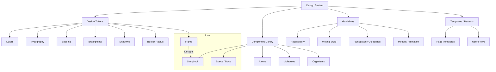

# Design Systems

## What is a Design System?

A design system is a **collection of reusable components, guidelines, and principles** that teams use to build consistent digital products. It bridges the gap between design and development.

## Design System Architecture



## Design Tokens

Design tokens are the atomic values of a design system — colors, spacing, typography, etc.

```css
/* tokens.css */
:root {
  /* Colors */
  --color-primary-50: #eff6ff;
  --color-primary-100: #dbeafe;
  --color-primary-500: #3b82f6;
  --color-primary-600: #2563eb;
  --color-primary-700: #1d4ed8;
  --color-primary-900: #1e3a5f;
  
  --color-neutral-50: #f8fafc;
  --color-neutral-100: #f1f5f9;
  --color-neutral-700: #334155;
  --color-neutral-900: #0f172a;
  
  --color-success: #22c55e;
  --color-warning: #f59e0b;
  --color-error: #ef4444;
  
  /* Typography */
  --font-sans: 'Inter', system-ui, sans-serif;
  --font-mono: 'JetBrains Mono', monospace;
  
  --text-xs: 0.75rem;
  --text-sm: 0.875rem;
  --text-base: 1rem;
  --text-lg: 1.125rem;
  --text-xl: 1.25rem;
  --text-2xl: 1.5rem;
  --text-3xl: 1.875rem;
  --text-4xl: 2.25rem;
  
  --leading-tight: 1.25;
  --leading-normal: 1.5;
  --leading-relaxed: 1.625;
  
  --font-weight-normal: 400;
  --font-weight-medium: 500;
  --font-weight-semibold: 600;
  --font-weight-bold: 700;
  
  /* Spacing */
  --space-1: 0.25rem;
  --space-2: 0.5rem;
  --space-3: 0.75rem;
  --space-4: 1rem;
  --space-6: 1.5rem;
  --space-8: 2rem;
  --space-12: 3rem;
  --space-16: 4rem;
  
  /* Shadows */
  --shadow-sm: 0 1px 2px 0 rgb(0 0 0 / 0.05);
  --shadow-md: 0 4px 6px -1px rgb(0 0 0 / 0.1);
  --shadow-lg: 0 10px 15px -3px rgb(0 0 0 / 0.1);
  
  /* Border Radius */
  --radius-sm: 0.25rem;
  --radius-md: 0.375rem;
  --radius-lg: 0.5rem;
  --radius-xl: 0.75rem;
  --radius-full: 9999px;
  
  /* Breakpoints (for reference — use in JS/config) */
  /* --bp-sm: 640px */
  /* --bp-md: 768px */
  /* --bp-lg: 1024px */
  /* --bp-xl: 1280px */
}
```

### Token in TypeScript

```ts
// tokens.ts
export const tokens = {
  color: {
    primary: {
      50: '#eff6ff',
      500: '#3b82f6',
      600: '#2563eb',
    },
    neutral: {
      50: '#f8fafc',
      900: '#0f172a',
    },
    semantic: {
      success: '#22c55e',
      warning: '#f59e0b',
      error: '#ef4444',
    },
  },
  spacing: {
    1: '0.25rem',
    4: '1rem',
    8: '2rem',
  },
  fontSize: {
    sm: '0.875rem',
    base: '1rem',
    lg: '1.125rem',
  },
} as const;
```

## Component Library Structure

```
packages/ui/
  src/
    tokens/
      colors.ts
      typography.ts
      spacing.ts
    components/
      Button/
        Button.tsx
        Button.test.tsx
        Button.stories.tsx
        Button.module.css
        index.ts
      Input/
        Input.tsx
        Input.test.tsx
        Input.stories.tsx
        Input.module.css
        index.ts
      Select/
        ...
      Modal/
        ...
      Table/
        ...
    hooks/
      useClickOutside.ts
      useMediaQuery.ts
      useFocusTrap.ts
    utils/
      cx.ts
      mergeRefs.ts
    index.ts                 # Public API
  package.json
  tsconfig.json
```

## Storybook

### Component Story

```tsx
// Button.stories.tsx
import type { Meta, StoryObj } from '@storybook/react';
import { Button } from './Button';
import { within, userEvent } from '@storybook/testing-library';
import { expect } from '@storybook/jest';

const meta = {
  title: 'UI/Button',
  component: Button,
  parameters: {
    layout: 'centered',
    docs: {
      description: {
        component: 'Primary button component with multiple variants.',
      },
    },
  },
  tags: ['autodocs'],
  argTypes: {
    variant: {
      control: 'select',
      options: ['primary', 'secondary', 'ghost', 'danger'],
      description: 'Visual variant of the button',
    },
    size: {
      control: 'select',
      options: ['sm', 'md', 'lg'],
    },
    disabled: { control: 'boolean' },
    loading: { control: 'boolean' },
  },
} satisfies Meta<typeof Button>;

export default meta;
type Story = StoryObj<typeof meta>;

export const Primary: Story = {
  args: {
    variant: 'primary',
    children: 'Submit',
  },
};

export const Disabled: Story = {
  args: {
    variant: 'primary',
    children: 'Disabled',
    disabled: true,
  },
};

export const Loading: Story = {
  args: {
    variant: 'primary',
    children: 'Loading...',
    loading: true,
  },
};

// Interaction test
export const ClickInteraction: Story = {
  args: { children: 'Click me' },
  play: async ({ canvasElement }) => {
    const canvas = within(canvasElement);
    const button = canvas.getByRole('button');
    await userEvent.click(button);
    await expect(button).toHaveFocus();
  },
};
```

## Figma Integration

Maintain parity between Figma components and code components:

```
Figma Component:         Code Component:
┌──────────────────┐    ┌──────────────────┐
│  Button          │    │  <Button          │
│  ┌────────────┐  │    │    variant=       │
│  │  Click me  │  │    │      "primary"    │
│  └────────────┘  │    │    size="md"      │
│                  │    │  >                │
│  Properties:     │    │    Click me       │
│  ├ Variant       │    │  </Button>        │
│  ├ Size          │    │                   │
│  ├ Disabled      │    │  Props:           │
│  └ Loading       │    │  ├ variant        │
└──────────────────┘    │  ├ size           │
                        │  ├ disabled       │
                        │  └ loading        │
                        └──────────────────┘
```

## Maintaining Consistency

### Code Review Checklist

- [ ] Component uses design tokens, not hardcoded values
- [ ] Follows accessibility guidelines (ARIA labels, keyboard nav)
- [ ] Has Storybook story with at least default state
- [ ] Props are typed with JSDoc comments
- [ ] Handles loading, error, and empty states (if applicable)
- [ ] Responsive breakpoints use system tokens
- [ ] No CSS margin/padding outside the component

### Versioning

```json
// package.json
{
  "name": "@company/ui",
  "version": "2.1.0",
  "semver": {
    "major": "Breaking design changes",
    "minor": "New components or features",
    "patch": "Bug fixes, accessibility improvements"
  }
}
```

## Real-World Scenario: Enterprise Design System

```
@acme/design-system/
├── packages/
│   ├── tokens/          # Design tokens (JSON + CSS)
│   ├── icons/           # SVG icon library (200+ icons)
│   ├── ui/              # React component library
│   ├── hooks/           # Shared React hooks
│   ├── utils/           # TypeScript utilities
│   └── figma/           # Figma plugin / sync tool
├── apps/
│   ├── storybook/       # Documentation site
│   └── docs/            # Usage guidelines site
├── config/
│   ├── commitlint.config.js
│   └── release.config.js
├── package.json         # Workspace root
└── turbo.json           # Turborepo config
```

## Summary

A design system ensures visual and functional consistency across products. The key is treating tokens as the source of truth, maintaining a well-structured component library with Storybook documentation, and keeping Figma designs in sync with code.
