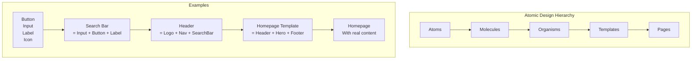
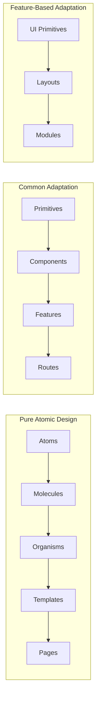

# Atomic Design

## What is Atomic Design?

Atomic Design is a methodology for creating design systems by breaking interfaces down into fundamental building blocks. It was coined by Brad Frost and organizes components into five distinct levels.

## The Five Levels



## 1. Atoms

The smallest, indivisible UI elements. They cannot be broken down further without losing their purpose.

```tsx
// Label.tsx
interface LabelProps {
  children: React.ReactNode;
  htmlFor?: string;
  required?: boolean;
}

export function Label({ children, htmlFor, required }: LabelProps) {
  return (
    <label htmlFor={htmlFor} className="label">
      {children}
      {required && <span className="label__required">*</span>}
    </label>
  );
}

// Input.tsx
interface InputProps extends React.InputHTMLAttributes<HTMLInputElement> {
  error?: boolean;
}

export const Input = forwardRef<HTMLInputElement, InputProps>(
  ({ error, className, ...props }, ref) => (
    <input
      ref={ref}
      className={clsx('input', error && 'input--error', className)}
      {...props}
    />
  )
);

// Button.tsx
interface ButtonProps {
  variant: 'primary' | 'secondary';
  size: 'sm' | 'md' | 'lg';
  children: React.ReactNode;
  onClick?: () => void;
  disabled?: boolean;
}

export function Button({ variant, size, children, ...props }: ButtonProps) {
  return (
    <button
      className={clsx('btn', `btn--${variant}`, `btn--${size}`)}
      {...props}
    >
      {children}
    </button>
  );
}
```

Other atom examples: Icon, Avatar, Badge, Checkbox, Radio, ProgressBar, Spinner, Tooltip.

## 2. Molecules

Groups of atoms bonded together to form a functional unit.

```tsx
// SearchBar.tsx — Molecule
import { Input } from '@/atoms/Input';
import { Button } from '@/atoms/Button';

interface SearchBarProps {
  onSearch: (query: string) => void;
}

export function SearchBar({ onSearch }: SearchBarProps) {
  const [query, setQuery] = useState('');

  const handleSubmit = (e: React.FormEvent) => {
    e.preventDefault();
    onSearch(query);
  };

  return (
    <form onSubmit={handleSubmit} className="search-bar">
      <Input
        value={query}
        onChange={(e) => setQuery(e.target.value)}
        placeholder="Search..."
      />
      <Button type="submit" variant="primary" size="md">
        Search
      </Button>
    </form>
  );
}

// FormField.tsx — Molecule
import { Label } from '@/atoms/Label';
import { Input } from '@/atoms/Input';

interface FormFieldProps {
  label: string;
  name: string;
  error?: string;
  required?: boolean;
}

export function FormField({ label, name, error, required }: FormFieldProps) {
  return (
    <div className="form-field">
      <Label htmlFor={name} required={required}>{label}</Label>
      <Input id={name} name={name} error={!!error} />
      {error && <span className="form-field__error">{error}</span>}
    </div>
  );
}

// ProductCard.tsx — Molecule
import { Badge } from '@/atoms/Badge';
import { Button } from '@/atoms/Button';

export function ProductCard({ product }: { product: Product }) {
  return (
    <div className="product-card">
      
      <div className="product-card__info">
        <h3>{product.name}</h3>
        <Badge variant={product.inStock ? 'success' : 'error'}>
          {product.inStock ? 'In Stock' : 'Out of Stock'}
        </Badge>
        <p className="product-card__price">${product.price}</p>
        <Button variant="primary" size="sm">Add to Cart</Button>
      </div>
    </div>
  );
}
```

## 3. Organisms

Complex UI sections composed of molecules and atoms. Organisms form distinct sections of an interface.

```tsx
// ProductGrid.tsx — Organism
import { ProductCard } from '@/molecules/ProductCard';

interface ProductGridProps {
  products: Product[];
  title: string;
}

export function ProductGrid({ products, title }: ProductGridProps) {
  return (
    <section className="product-grid">
      <h2 className="product-grid__title">{title}</h2>
      <div className="product-grid__items">
        {products.map((product) => (
          <ProductCard key={product.id} product={product} />
        ))}
      </div>
    </section>
  );
}

// SiteHeader.tsx — Organism
import { Logo } from '@/atoms/Logo';
import { Navigation } from '@/molecules/Navigation';
import { SearchBar } from '@/molecules/SearchBar';
import { UserMenu } from '@/molecules/UserMenu';

export function SiteHeader() {
  return (
    <header className="site-header">
      <Logo />
      <Navigation items={navItems} />
      <SearchBar onSearch={handleSearch} />
      <UserMenu />
    </header>
  );
}
```

## 4. Templates

Page-level objects that place components into a layout. Templates focus on **structure** rather than actual content.

```tsx
// ProductListingTemplate.tsx
interface ProductListingTemplateProps {
  header: React.ReactNode;
  filters: React.ReactNode;
  productGrid: React.ReactNode;
  pagination: React.ReactNode;
  footer: React.ReactNode;
}

export function ProductListingTemplate({
  header,
  filters,
  productGrid,
  pagination,
  footer,
}: ProductListingTemplateProps) {
  return (
    <div className="page-layout">
      {header}
      <div className="page-layout__content">
        <aside className="page-layout__sidebar">{filters}</aside>
        <main className="page-layout__main">
          {productGrid}
          {pagination}
        </main>
      </div>
      {footer}
    </div>
  );
}
```

## 5. Pages

Specific instances of templates with real content. This is what the user actually sees.

```tsx
// pages/ProductsPage.tsx
import { ProductListingTemplate } from '@/templates/ProductListingTemplate';
import { SiteHeader } from '@/organisms/SiteHeader';
import { ProductFilters } from '@/organisms/ProductFilters';
import { ProductGrid } from '@/organisms/ProductGrid';
import { Pagination } from '@/molecules/Pagination';
import { SiteFooter } from '@/organisms/SiteFooter';
import { useProducts } from '@/hooks/useProducts';

export function ProductsPage() {
  const { products, filters, setFilters, pagination } = useProducts();

  return (
    <ProductListingTemplate
      header={<SiteHeader />}
      filters={<ProductFilters filters={filters} onChange={setFilters} />}
      productGrid={<ProductGrid products={products} title="All Products" />}
      pagination={
        <Pagination
          current={pagination.page}
          total={pagination.totalPages}
          onChange={(p) => setFilters({ page: p })}
        />
      }
      footer={<SiteFooter />}
    />
  );
}
```

## Pros and Cons

| Pros | Cons |
|------|------|
| Clear naming convention | Strict hierarchy can be rigid |
| Easy to communicate across teams | Not all components fit neatly |
| Promotes reusability | Can lead to over-abstraction |
| Natural documentation structure | Added complexity for simple UIs |
| Works well with design systems | Template/Page distinction can blur |

## Real-World Adaptation

Most teams adapt atomic design to their needs:



### Adapted Example

```
src/
  primitives/     ← Atoms
    Button/
    Input/
    Icon/
  components/     ← Molecules + small Organisms
    SearchBar/
    ProductCard/
    FormField/
  features/       ← Large Organisms
    Products/
      ProductGrid/
      ProductFilters/
    Auth/
      LoginForm/
  templates/      ← Layouts
    MainLayout/
    AuthLayout/
  pages/          ← Routes
    HomePage/
    ProductsPage/
```

## When to Use Atomic Design

**Use when:**
- Building a design system from scratch
- Working on a large team with designers and developers
- You have complex UI with many variations
- Consistency across multiple products is critical

**Skip when:**
- Building a simple landing page or small app
- You need rapid prototyping
- Team is small and tight-knit
- The project has a short lifespan

## Summary

Atomic Design provides a shared vocabulary for design and development. It encourages modular thinking and reusability. Adapt it to your team's needs — the strict hierarchy works best as a starting point, not a rigid rule.
