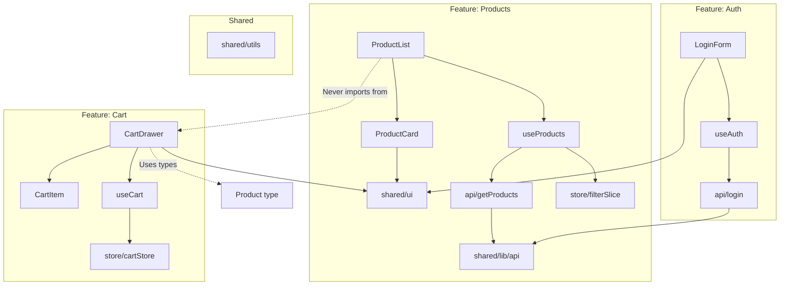

# Feature-Based Architecture

## What is Feature-Based Architecture?

Feature-based architecture organizes code by **business domain** or **feature** rather than by technical role. Each feature is a self-contained module with its own components, hooks, state, and types.

## Feature Folder Structure

```
src/features/
  auth/
    components/
      LoginForm.tsx
      RegisterForm.tsx
      OAuthButtons.tsx
      ForgotPassword.tsx
    hooks/
      useAuth.ts
      useSession.ts
      useLogin.ts
    api/
      login.ts
      register.ts
      logout.ts
    store/
      authSlice.ts          # Redux/Zustand store slice
    types/
      index.ts
    utils/
      session.ts
      token.ts
    validators/
      authSchemas.ts         # Zod/Yup schemas
    index.ts                 # Public API — what other features can import

  products/
    components/
      ProductList.tsx
      ProductCard.tsx
      ProductDetail.tsx
      ProductFilter.tsx
      ProductSort.tsx
      ProductReview.tsx
    hooks/
      useProducts.ts
      useProductFilters.ts
      useProductSort.ts
    api/
      getProducts.ts
      getProduct.ts
      createProduct.ts
      updateProduct.ts
    store/
      productFilterSlice.ts
    types/
      index.ts
    utils/
      productHelpers.ts
    index.ts

  cart/
    components/
      CartDrawer.tsx
      CartItem.tsx
      CartSummary.tsx
      CheckoutForm.tsx
    hooks/
      useCart.ts
      useCheckout.ts
    api/
      checkout.ts
    store/
      cartStore.ts
    types/
      index.ts
    index.ts
```

## Duck Pattern (Redux)

Colocate Redux logic within the feature folder:

```
src/features/products/
  store/
    productsSlice.ts     # Redux Toolkit slice
    productsThunks.ts    # Async thunks
    productsSelectors.ts # Selectors
```

Or the "duck" pattern — everything in one file:

```ts
// features/products/store/duck.ts
import { createSlice, createAsyncThunk } from '@reduxjs/toolkit';

// Thunks
export const fetchProducts = createAsyncThunk(
  'products/fetchProducts',
  async (params: ProductFilters) => { /* ... */ }
);

// Slice
const productsSlice = createSlice({
  name: 'products',
  initialState,
  reducers: {
    setFilter: (state, action) => { /* ... */ },
    clearFilters: (state) => { /* ... */ },
  },
  extraReducers: (builder) => {
    builder
      .addCase(fetchProducts.pending, (state) => { /* ... */ })
      .addCase(fetchProducts.fulfilled, (state, action) => { /* ... */ });
  },
});

// Selectors
export const selectProducts = (state: RootState) => state.products.items;
export const selectProductById = (id: string) => (state: RootState) =>
  state.products.items.find(p => p.id === id);

export const { setFilter, clearFilters } = productsSlice.actions;
export default productsSlice.reducer;
```

## Shared vs Feature Code

```
src/
  shared/                    # Used by multiple features
    ui/                      # Design system primitives
    lib/                     # API client, config
    utils/                   # Generic utilities
    hooks/                   # Shared hooks (useDebounce)
    types/                   # Shared types (ApiResponse, PaginationMeta)
    constants/               # App-wide constants
  
  features/                  # Business domains
    auth/                    # Auth feature
      components/
      hooks/
      api/
      store/
      types/
      index.ts
    products/
      components/
      hooks/
      api/
      store/
      types/
      index.ts
    cart/
      ...
    orders/
      ...
```

### Feature Public API

Each feature exposes a limited public API via `index.ts`:

```ts
// features/products/index.ts
export { ProductList } from './components/ProductList';
export { ProductCard } from './components/ProductCard';
export { ProductFilters } from './components/ProductFilter';
export { useProducts } from './hooks/useProducts';
export type { Product, ProductFilters, ProductSort } from './types';
```

Features should **not** import from other features directly:

```ts
// ❌ BAD — Direct cross-feature import
import { ProductCard } from '../products/components/ProductCard';

// ✅ GOOD — Through public API or shared layer
import type { Product } from '@/features/products';
```

## Feature Architecture Diagram



## Comparison with Atomic Design

| Aspect | Feature-Based | Atomic Design |
|--------|--------------|---------------|
| **Organization** | By business domain | By component granularity |
| **Focus** | Separation by concern | Component hierarchy |
| **Reusability** | Within domain | Cross-domain |
| **Colocation** | Everything related | Separate by level |
| **Learning curve** | Lower | Higher |
| **Best for** | Complex business apps | Design systems, marketing sites |

### Hybrid Approach

Most successful projects combine both:

```
src/
  shared/
    ui/                    ← Atomic Design for UI components
      atoms/
      molecules/
      organisms/
    lib/
    utils/
  features/               ← Feature-Based for business logic
    auth/
    products/
    cart/
```

## When to Use Feature-Based Architecture

**Use when:**
- The application has distinct business domains
- Multiple teams own different features
- You want to scale development in parallel
- Features can be developed and tested independently
- You want lazy loading per feature

**Skip when:**
- Application is very small (< 10 pages)
- Domains are highly interdependent
- You're building a shared library, not an application

## Real-World Scenario: E-Commerce with Teams

```
Team Alpha: Products, Search, Categories
  src/features/products/
  src/features/search/
  src/features/categories/

Team Beta: Cart, Checkout, Orders
  src/features/cart/
  src/features/checkout/
  src/features/orders/

Team Gamma: Auth, Users, Admin
  src/features/auth/
  src/features/users/
  src/features/admin/

Shared: Design System, API Client, Utilities
  src/shared/ui/
  src/shared/lib/
  src/shared/utils/
```

Each team owns their features end-to-end — components, state, API calls, and tests. Shared code evolves through a review process involving all teams.

## Summary

Feature-based architecture organizes code by business domain, making it easier to scale development across teams and features. Each feature is self-contained with its own components, hooks, state, and API layer. The key discipline is maintaining clean public APIs between features and keeping shared code genuinely generic.
