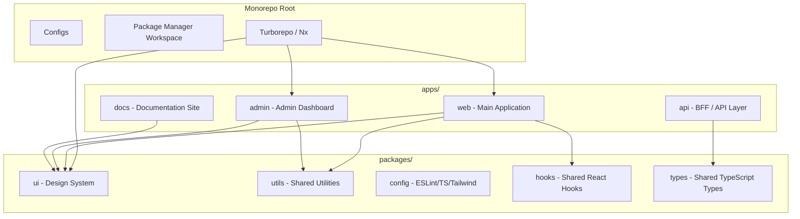
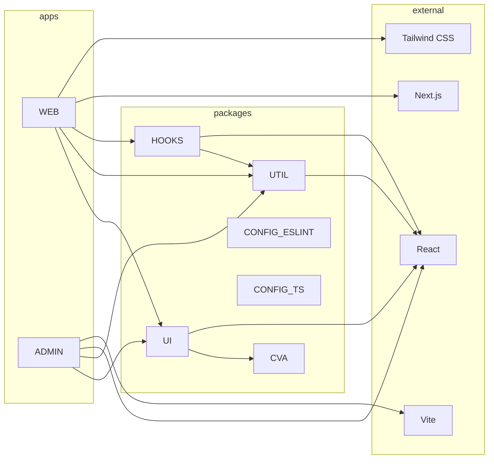

# Monorepo with Turborepo/Nx

## What is a Monorepo?

A monorepo (mono repository) is a single repository containing multiple distinct projects with well-defined relationships. For frontend, this typically means shared UI libraries, configs, and multiple applications.

## Monorepo Architecture



## Turborepo Setup

### Root Configuration

```json
// package.json (root)
{
  "private": true,
  "scripts": {
    "dev": "turbo dev",
    "build": "turbo build",
    "lint": "turbo lint",
    "test": "turbo test",
    "clean": "turbo clean",
    "format": "prettier --write \"**/*.{ts,tsx,js,json}\""
  },
  "devDependencies": {
    "turbo": "^2.0.0",
    "prettier": "^3.0.0"
  },
  "packageManager": "pnpm@9.0.0",
  "engines": {
    "node": ">=18"
  }
}
```

### turbo.json

```json
{
  "$schema": "https://turbo.build/schema.json",
  "tasks": {
    "build": {
      "dependsOn": ["^build"],
      "outputs": [".next/**", "dist/**", ".expo/**"],
      "cache": true
    },
    "dev": {
      "cache": false,
      "persistent": true
    },
    "lint": {
      "dependsOn": ["^build"]
    },
    "test": {
      "dependsOn": ["^build"],
      "inputs": ["src/**/*.tsx", "src/**/*.ts", "test/**/*.ts"]
    },
    "typecheck": {
      "dependsOn": ["^build"]
    },
    "clean": {
      "cache": false
    }
  },
  "globalDependencies": ["tsconfig.json", ".env"]
}
```

### Workspace Configuration

```json
// pnpm-workspace.yaml or package.json workspaces
packages:
  - "apps/*"
  - "packages/*"
```

## Package Structure

```ts
// packages/ui/package.json
{
  "name": "@acme/ui",
  "version": "0.1.0",
  "private": true,
  "main": "./src/index.ts",
  "types": "./src/index.ts",
  "scripts": {
    "lint": "eslint .",
    "test": "vitest run",
    "typecheck": "tsc --noEmit"
  },
  "dependencies": {
    "react": "^19.0.0",
    "class-variance-authority": "^0.7.0"
  },
  "devDependencies": {
    "@acme/config": "workspace:*",
    "@types/react": "^19.0.0"
  }
}
```

```ts
// apps/web/package.json
{
  "name": "@acme/web",
  "version": "1.0.0",
  "dependencies": {
    "@acme/ui": "workspace:*",
    "@acme/utils": "workspace:*",
    "@acme/hooks": "workspace:*",
    "next": "^15.0.0",
    "react": "^19.0.0"
  }
}
```

## Build Caching

Turborepo caches task outputs based on file content hashes.

```mermaid
flowchart LR
    A[Developer runs turbo build] --> B[Turbo checks cache]
    B --> C{Hash matches<br/>previous build?}
    C -->|Yes| D[Restore from cache<br/>~1 second]
    C -->|No| E[Execute build]
    E --> F[Cache output for next run]
    F --> G[Share cache via<br/>Remote Caching (Vercel)]
```

### Remote Caching

```bash
# Connect to Vercel Remote Cache
npx turbo login
npx turbo link

# Or use self-hosted
npx turbo remote-cache --api-url https://cache.company.com
```

## Shared Configuration Packages

### ESLint

```ts
// packages/config-eslint/index.js
module.exports = {
  extends: [
    'next/core-web-vitals',
    'plugin:@typescript-eslint/recommended',
    'plugin:react-hooks/recommended',
    'prettier',
  ],
  rules: {
    '@typescript-eslint/no-unused-vars': ['error', { argsIgnorePattern: '^_' }],
    'react/self-closing-comp': 'warn',
    'import/order': [
      'warn',
      {
        groups: ['builtin', 'external', 'internal', 'parent', 'sibling'],
        'newlines-between': 'always',
      },
    ],
  },
};
```

### TypeScript

```json
// packages/config-typescript/base.json
{
  "compilerOptions": {
    "target": "ES2022",
    "module": "ESNext",
    "moduleResolution": "bundler",
    "jsx": "react-jsx",
    "strict": true,
    "esModuleInterop": true,
    "skipLibCheck": true,
    "forceConsistentCasingInFileNames": true,
    "resolveJsonModule": true,
    "isolatedModules": true,
    "declaration": true,
    "declarationMap": true,
    "sourceMap": true
  }
}
```

```json
// apps/web/tsconfig.json
{
  "extends": "@acme/config-typescript/base.json",
  "compilerOptions": {
    "baseUrl": ".",
    "paths": {
      "@/*": ["./src/*"]
    }
  },
  "include": ["next-env.d.ts", "**/*.ts", "**/*.tsx"]
}
```

## Dependency Management

### Workspace Protocol

```json
// Always use workspace protocol for internal packages
{
  "dependencies": {
    "@acme/ui": "workspace:*",
    "@acme/utils": "workspace:^1.0.0"
  }
}
```

### Dependency Graph

```bash
# Visualize dependencies
npx turbo build --graph=dependencies.html

# Output:
# ┌─────────────────────┐
# │ @acme/web (build)   │
# │   ├── @acme/ui      │
# │   ├── @acme/utils   │
# │   └── @acme/hooks   │
# ├─────────────────────┤
# │ @acme/admin (build) │
# │   ├── @acme/ui      │
# │   └── @acme/utils   │
# └─────────────────────┘
```

## Benefits and Tradeoffs

| Benefit | Tradeoff |
|---------|----------|
| **Single source of truth** — One repo, one CI | **Larger clone size** — Git operations slower |
| **Atomic commits** — Cross-project changes in one PR | **Learning curve** — Workspace tooling complex |
| **Shared configs** — ESLint, TS, Prettier uniform | **Lockfile conflicts** — One lockfile for all |
| **Code reuse** — Easy to share UI, utils, types | **Build orchestration** — Requires Turborepo/Nx |
| **Refactoring** — Change a type, all consumers update | **Access control** — Harder to restrict per-project |
| **Dependency upgrades** — Single upgrade across all | **CI complexity** — Pipeline must handle dependencies |

## Nx Alternative

```ts
// nx.json
{
  "tasksRunnerOptions": {
    "default": {
      "runner": "nx/tasks-runners/default",
      "options": {
        "cacheableOperations": ["build", "test", "lint", "typecheck"],
        "parallel": 3
      }
    }
  },
  "namedInputs": {
    "default": ["{projectRoot}/**/*", "sharedGlobals"],
    "production": [
      "default",
      "!{projectRoot}/**/*.test.ts",
      "!{projectRoot}/**/*.stories.tsx"
    ]
  }
}
```

## Dependency Graph Visualization



## Real-World Monorepo CI Pipeline

```yaml
# .github/workflows/ci.yml
name: CI
on: [pull_request]

jobs:
  validate:
    runs-on: ubuntu-latest
    steps:
      - uses: actions/checkout@v4
      - uses: pnpm/action-setup@v2
      - uses: actions/setup-node@v4
        with:
          cache: 'pnpm'
      
      - run: pnpm install
      - run: npx turbo lint typecheck test
      - run: npx turbo build
```

## Summary

Monorepos with Turborepo or Nx provide fast builds through caching, shared configuration, and atomic cross-project changes. They're ideal for organizations with multiple applications sharing UI and utility code. The tradeoff is increased tooling complexity and CI setup.
