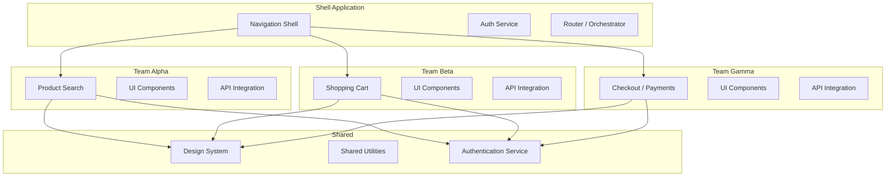
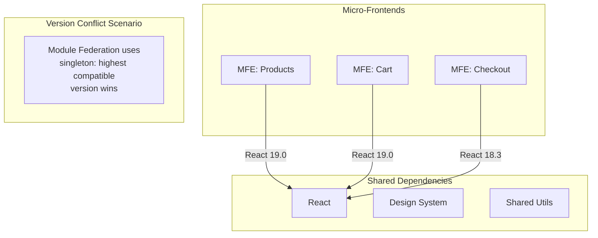

# Micro-Frontend Architecture

## What is Micro-Frontend?

Micro-frontends extend microservice principles to the frontend. Each independent team builds, tests, and deploys a **feature** of the application independently.

## Micro-Frontend Architecture



## Integration Strategies

### 1. iframe (Legacy)

```html
<iframe src="https://team-alpha-app.com/products" title="Products">
```

**Pros:** Full isolation, easy to implement
**Cons:** Poor UX (no shared navigation, scroll issues), no communication, SEO issues

### 2. Web Components

Each micro-frontend is wrapped in a custom element.

```tsx
// products-mfe/src/index.ts
import { defineCustomElement } from 'vue';
import ProductList from './ProductList.ce.vue';

const ProductListElement = defineCustomElement(ProductList);
customElements.define('product-list', ProductListElement);
```

```tsx
// Shell application
export function ProductPage() {
  useEffect(() => {
    import('products-mfe/ProductList');
  }, []);

  return <product-list category="electronics" />;
}
```

### 3. Module Federation (Webpack 5)

The most popular approach for micro-frontends.

```ts
// shell/webpack.config.js
const { ModuleFederationPlugin } = require('webpack').container;

module.exports = {
  plugins: [
    new ModuleFederationPlugin({
      name: 'shell',
      remotes: {
        products: 'products@https://products-app.com/remoteEntry.js',
        cart: 'cart@https://cart-app.com/remoteEntry.js',
        checkout: 'checkout@https://checkout-app.com/remoteEntry.js',
      },
      shared: {
        react: { singleton: true, requiredVersion: '^19.0.0' },
        'react-dom': { singleton: true },
        '@acme/ui': { singleton: true },
      },
    }),
  ],
};
```

```tsx
// Shell — lazy load remote components
const ProductsList = React.lazy(() => import('products/ProductList'));
const CartDrawer = React.lazy(() => import('cart/CartDrawer'));

export function App() {
  return (
    <Suspense fallback={<ShellSkeleton />}>
      <header>
        <Navigation />
        <CartDrawer />
      </header>
      <Routes>
        <Route path="/products" element={<ProductsList />} />
        <Route path="/checkout" element={<Checkout />} />
      </Routes>
    </Suspense>
  );
}
```

## Shared Dependencies



## Communication Between Micro-Frontends

```ts
// Shared event bus approach
// shared/events.ts
type AppEvent = {
  type: 'PRODUCT_ADDED_TO_CART' | 'USER_LOGGED_IN' | 'NAVIGATION';
  payload: unknown;
};

const listeners = new Map<string, Set<(event: AppEvent) => void>>();

export const eventBus = {
  emit(event: AppEvent) {
    listeners.get(event.type)?.forEach(fn => fn(event));
  },
  on(type: string, fn: (event: AppEvent) => void) {
    if (!listeners.has(type)) listeners.set(type, new Set());
    listeners.get(type)!.add(fn);
    return () => listeners.get(type)?.delete(fn);
  },
};
```

```tsx
// products-mfe — add to cart
import { eventBus } from '@acme/shared/events';

function AddToCartButton({ productId }) {
  const addToCart = () => {
    // Call cart MFE API
    eventBus.emit({
      type: 'PRODUCT_ADDED_TO_CART',
      payload: { productId, quantity: 1 },
    });
  };

  return <button onClick={addToCart}>Add to Cart</button>;
}
```

```tsx
// cart-mfe — listen for events
import { eventBus } from '@acme/shared/events';

function CartProvider({ children }) {
  useEffect(() => {
    const unsubscribe = eventBus.on('PRODUCT_ADDED_TO_CART', (event) => {
      addItem(event.payload);
    });
    return unsubscribe;
  }, []);

  return <>{children}</>;
}
```

## Cross-MFE Navigation

```tsx
// shell — centralized routing
import { createBrowserRouter } from 'react-router-dom';

export const router = createBrowserRouter([
  {
    path: '/',
    element: <Shell />,
    children: [
      { index: element: <Home /> },
      { path: 'products/*', element: <ProductsMfeWrapper /> },
      { path: 'cart/*', element: <CartMfeWrapper /> },
      { path: 'checkout/*', element: <CheckoutMfeWrapper /> },
    ],
  },
]);
```

## Pros and Cons

| Pros | Cons |
|------|------|
| **Independent deployments** — Teams ship on their cadence | **Bundle size** — Duplicated deps increase payload |
| **Team autonomy** — Own tech stack, own decisions | **Complexity** — Orchestration, testing, debugging |
| **Scalable development** — Multiple teams work in parallel | **Consistent UX** — Harder to keep unified experience |
| **Incremental upgrades** — Upgrade React per MFE, not all at once | **Shared state** — Authentication, user context must propagate |
| **Isolation** — One MFE crash doesn't take down entire app | **Performance** — Multiple bundles, network overhead |
| **Tech diversity** — Vue MFE can live in React shell | **Testing** — Integration tests across MFE boundaries |

## When to Use Micro-Frontends

**Consider when:**
- Multiple teams are developing independent features
- The application is very large (100+ pages)
- Teams need independent deploy cycles
- You want to migrate from one framework to another incrementally
- Different parts of the app have different performance requirements

**Don't use when:**
- Team is small (< 3 teams)
- Application is simple (CRUD, few pages)
- You don't have strong DevOps practices
- CI/CD is not mature
- Performance is the #1 priority

## Real-World Scenario: E-Commerce Platform

```
Team Ownership:
├── Shell Team: Navigation, Auth, Routing, Layout
│   └── Deploys: shell.company.com
├── Search Team: Product discovery, Filters, Recommendations
│   └── Deploys: search.company.com
├── Cart Team: Shopping cart, Saved items
│   └── Deploys: cart.company.com
├── Checkout Team: Payment, Shipping, Order confirmation
│   └── Deploys: checkout.company.com
└── Account Team: Profile, Order history, Returns
    └── Deploys: account.company.com
```

Infrastructure:

```
Edge/CDN: Single domain with path-based routing
  company.com/         → Shell
  company.com/search/* → Search MFE
  company.com/cart/*   → Cart MFE
  company.com/checkout/* → Checkout MFE
  company.com/account/* → Account MFE
```

## Summary

Micro-frontends enable independent team ownership and deployment at the cost of architectural complexity. Module Federation is the current best practice for implementation. Start with a well-structured monolith and extract micro-frontends only when the team and application scale demand it.
