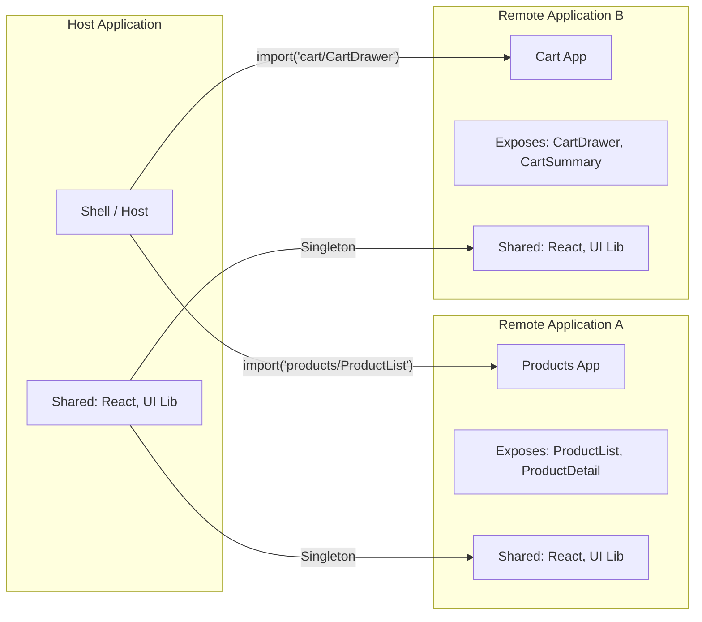
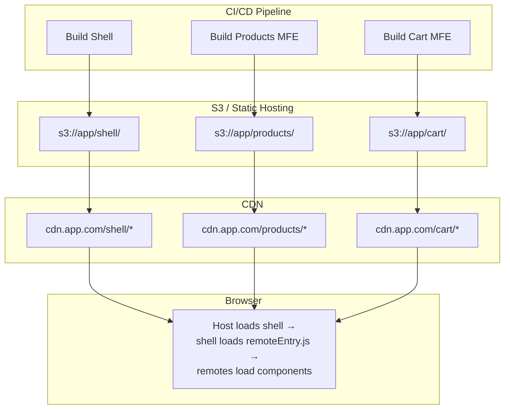
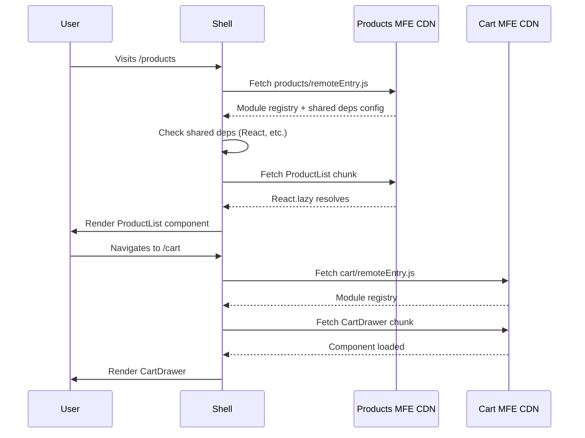

# Module Federation

## What is Module Federation?

Module Federation is a Webpack 5 feature that allows a JavaScript application to **dynamically load code from another application** at runtime. It is the primary technical enabler for micro-frontends.

## Core Concepts



## Host Configuration

```ts
// apps/shell/webpack.config.ts
import { ModuleFederationPlugin } from 'webpack.container';

const config = {
  plugins: [
    new ModuleFederationPlugin({
      name: 'shell',
      filename: 'remoteEntry.js',
      
      // Remotes that this host consumes
      remotes: {
        products: 'products@http://localhost:3001/remoteEntry.js',
        cart: 'cart@http://localhost:3002/remoteEntry.js',
        checkout: 'checkout@http://localhost:3003/remoteEntry.js',
      },
      
      // Components this host exposes
      exposes: {
        './Navigation': './src/components/Navigation',
        './AuthProvider': './src/providers/AuthProvider',
      },
      
      // Shared dependencies
      shared: {
        react: {
          singleton: true,
          requiredVersion: '^19.0.0',
          eager: true,
        },
        'react-dom': {
          singleton: true,
          requiredVersion: '^19.0.0',
          eager: true,
        },
        'react-router-dom': {
          singleton: true,
          requiredVersion: '^7.0.0',
        },
        '@acme/ui': {
          singleton: true,
          requiredVersion: '^1.0.0',
        },
      },
    }),
  ],
};
```

## Remote Configuration

```ts
// apps/products/webpack.config.ts
import { ModuleFederationPlugin } from 'webpack.container';

const config = {
  plugins: [
    new ModuleFederationPlugin({
      name: 'products',
      filename: 'remoteEntry.js',
      
      exposes: {
        './ProductList': './src/components/ProductList',
        './ProductDetail': './src/components/ProductDetail',
        './ProductSearch': './src/components/ProductSearch',
      },
      
      remotes: {
        shell: 'shell@http://localhost:3000/remoteEntry.js',
      },
      
      shared: {
        react: { singleton: true, requiredVersion: '^19.0.0' },
        'react-dom': { singleton: true, requiredVersion: '^19.0.0' },
        '@acme/ui': { singleton: true, requiredVersion: '^1.0.0' },
      },
    }),
  ],
};
```

## Dynamic Loading in Host

```tsx
// apps/shell/src/App.tsx
import React, { Suspense } from 'react';
import { Routes, Route } from 'react-router-dom';

// Static import (determined at build time)
const ProductList = React.lazy(() => import('products/ProductList'));
const CartDrawer = React.lazy(() => import('cart/CartDrawer'));

export function App() {
  return (
    <div>
      <Navigation />
      <Suspense fallback={<PageSkeleton />}>
        <Routes>
          <Route path="/" element={<Home />} />
          <Route path="/products" element={<ProductList />} />
          <Route path="/cart" element={<CartDrawer />} />
        </Routes>
      </Suspense>
    </div>
  );
}
```

### Dynamic Remote Loading

For truly runtime-determined remotes (e.g., based on tenant):

```tsx
// apps/shell/src/loadRemote.ts
import { init, loadRemote } from '@module-federation/runtime';

// Initialize MF runtime
init({
  name: 'shell',
  remotes: [
    {
      name: 'products',
      entry: 'http://localhost:3001/remoteEntry.js',
    },
  ],
});

// Load remote dynamically
export async function loadRemoteComponent<T>(
  remoteName: string,
  componentPath: string
): Promise<React.ComponentType<T>> {
  const factory = await loadRemote(`${remoteName}/${componentPath}`);
  return factory();
}

// Usage in component
function LazyProductList() {
  const [Comp, setComp] = useState<React.ComponentType | null>(null);

  useEffect(() => {
    loadRemoteComponent('products', 'ProductList').then(setComp);
  }, []);

  if (!Comp) return <Skeleton />;
  return <Comp category="electronics" />;
}
```

## Shared Dependencies Strategy

```mermaid
flowchart TD
    A[Webpack encounters shared dep] --> B{Version satisfies<br/>all consumers?}
    B -->|Yes| C[Load single instance]
    B -->|No| D{Singleton required?}
    D -->|Yes| E[Use highest satisfying<br/>version]
    D -->|No| F[Load multiple instances<br/>(one per consumer)]
    
    E --> G[Warning: version mismatch]
    F --> H[Increased bundle size]
```

### Version Conflicts

```ts
shared: {
  react: {
    singleton: true,
    requiredVersion: '^18.2.0 || ^19.0.0',
    // If shell has React 19, all remotes must be compatible
  },
  'lodash': {
    singleton: false,  // Each MFE can have its own lodash version
  },
}
```

## Integration with Vite

Use `@module-federation/vite` for Vite projects:

```ts
// vite.config.ts (Remote)
import { federation } from '@module-federation/vite';

export default defineConfig({
  plugins: [
    federation({
      name: 'products',
      filename: 'remoteEntry.js',
      exposes: {
        './ProductList': './src/components/ProductList.tsx',
      },
      shared: ['react', 'react-dom'],
    }),
  ],
});
```

## Deployment Architecture



## Integration Flow at Runtime



## Fallback Pattern

```tsx
// apps/shell/src/RemoteWrapper.tsx
export function RemoteWrapper({ fallback, children }) {
  const [error, setError] = useState(false);

  if (error) {
    return fallback || <div>This section is unavailable</div>;
  }

  return (
    <ErrorBoundary
      onError={() => setError(true)}
      fallback={fallback}
    >
      <Suspense fallback={<RemoteSkeleton />}>
        {children}
      </Suspense>
    </ErrorBoundary>
  );
}

// Usage
<RemoteWrapper fallback={<ProductListFallback />}>
  <ProductList />
</RemoteWrapper>
```

## Summary

| Aspect | Module Federation |
|--------|------------------|
| **Runtime loading** | Dynamic, lazy-loaded from remote URLs |
| **Shared deps** | Singleton or multiple instances |
| **Version management** | Required version ranges, fallbacks |
| **Build tool** | Webpack 5 (primary), Vite (via plugin) |
| **Scoping** | CSS scoping needed manually (CSS Modules/CSS-in-JS) |
| **Error handling** | Error boundaries required per remote |
| **Performance** | Network overhead per remote, caching via CDN |

Module Federation is the production-grade solution for micro-frontends. It enables independent deployment and technology diversity but requires careful dependency management and error handling.
