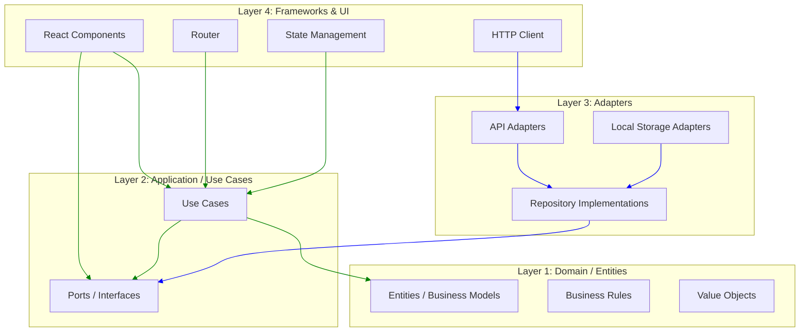

# Clean Architecture in Frontend

## What is Clean Architecture?

Clean Architecture, popularized by Robert C. Martin, organizes code into **layers** with a strict dependency rule: **inner layers** (domain/entities) depend on nothing; **outer layers** (infrastructure/UI) depend on inner layers.

## Layers in Frontend



## Strict Dependency Rule

```
UI Layer (React)        → depends on →  Application Layer
Application Layer       → depends on →  Domain Layer
Domain Layer            → depends on →  Nothing!
Adapter Layer (Infra)   → depends on →  Domain Layer
```

## Domain Layer

The innermost layer — pure business logic with no framework dependencies.

```ts
// domain/entities/Product.ts
export class Product {
  constructor(
    public readonly id: string,
    public readonly name: string,
    public readonly price: Money,
    public readonly stock: number,
    public readonly category: string,
  ) {}

  get isInStock(): boolean {
    return this.stock > 0;
  }

  get formattedPrice(): string {
    return this.price.format();
  }

  canBePurchased(quantity: number): boolean {
    return this.stock >= quantity;
  }
}

// domain/value-objects/Money.ts
export class Money {
  constructor(
    public readonly amount: number,
    public readonly currency: string = 'USD',
  ) {
    if (amount < 0) throw new Error('Amount cannot be negative');
  }

  add(other: Money): Money {
    if (this.currency !== other.currency) {
      throw new Error('Currency mismatch');
    }
    return new Money(this.amount + other.amount, this.currency);
  }

  format(): string {
    return new Intl.NumberFormat('en-US', {
      style: 'currency',
      currency: this.currency,
    }).format(this.amount);
  }
}

// domain/entities/Cart.ts
export class Cart {
  private items: Map<string, { product: Product; quantity: number }> = new Map();

  addProduct(product: Product, quantity: number = 1): void {
    if (!product.canBePurchased(quantity)) {
      throw new Error('Insufficient stock');
    }
    const current = this.items.get(product.id);
    if (current) {
      current.quantity += quantity;
    } else {
      this.items.set(product.id, { product, quantity });
    }
  }

  removeProduct(productId: string): void {
    this.items.delete(productId);
  }

  get total(): Money {
    let total = new Money(0);
    for (const { product, quantity } of this.items.values()) {
      total = total.add(new Money(product.price.amount * quantity));
    }
    return total;
  }

  get itemCount(): number {
    let count = 0;
    for (const { quantity } of this.items.values()) {
      count += quantity;
    }
    return count;
  }
}

// domain/ports/ProductRepository.ts
export interface ProductRepository {
  findAll(filters?: ProductFilters): Promise<Product[]>;
  findById(id: string): Promise<Product | null>;
  save(product: Product): Promise<void>;
  delete(id: string): Promise<void>;
}

// domain/ports/CartRepository.ts
export interface CartRepository {
  get(userId: string): Promise<Cart | null>;
  save(userId: string, cart: Cart): Promise<void>;
}
```

## Application Layer (Use Cases)

```ts
// application/use-cases/AddToCartUseCase.ts
import { ProductRepository, CartRepository } from '@/domain/ports';
import { Cart } from '@/domain/entities/Cart';

// Pure use case — no framework dependencies
export class AddToCartUseCase {
  constructor(
    private readonly productRepo: ProductRepository,
    private readonly cartRepo: CartRepository,
  ) {}

  async execute(userId: string, productId: string, quantity: number): Promise<Cart> {
    const product = await this.productRepo.findById(productId);
    if (!product) throw new Error('Product not found');

    const cart = (await this.cartRepo.get(userId)) || new Cart();
    cart.addProduct(product, quantity);
    await this.cartRepo.save(userId, cart);

    return cart;
  }
}

// application/use-cases/CheckoutUseCase.ts
export class CheckoutUseCase {
  constructor(
    private readonly cartRepo: CartRepository,
    private readonly orderRepo: OrderRepository,
    private readonly paymentService: PaymentService,
  ) {}

  async execute(userId: string, paymentDetails: PaymentDetails): Promise<Order> {
    const cart = await this.cartRepo.get(userId);
    if (!cart || cart.itemCount === 0) {
      throw new Error('Cart is empty');
    }

    const payment = await this.paymentService.charge(cart.total, paymentDetails);
    const order = new Order({
      userId,
      items: [...cart.items.values()],
      total: cart.total,
      paymentId: payment.id,
    });

    await this.orderRepo.save(order);
    return order;
  }
}
```

## Adapter Layer (Infrastructure)

```ts
// infrastructure/repositories/ApiProductRepository.ts
import { ProductRepository } from '@/domain/ports';
import { Product } from '@/domain/entities/Product';
import { Money } from '@/domain/value-objects';

export class ApiProductRepository implements ProductRepository {
  constructor(private readonly apiClient: ApiClient) {}

  async findAll(filters?: ProductFilters): Promise<Product[]> {
    const response = await this.apiClient.get('/products', { params: filters });
    return response.data.map(this.toDomain);
  }

  async findById(id: string): Promise<Product | null> {
    const response = await this.apiClient.get(`/products/${id}`);
    if (!response) return null;
    return this.toDomain(response.data);
  }

  async save(product: Product): Promise<void> {
    await this.apiClient.post('/products', this.toPersistence(product));
  }

  async delete(id: string): Promise<void> {
    await this.apiClient.delete(`/products/${id}`);
  }

  private toDomain(data: ProductDTO): Product {
    return new Product(
      data.id,
      data.name,
      new Money(data.price, data.currency),
      data.stock,
      data.category,
    );
  }

  private toPersistence(product: Product): ProductDTO {
    return {
      id: product.id,
      name: product.name,
      price: product.price.amount,
      currency: product.price.currency,
      stock: product.stock,
      category: product.category,
    };
  }
}

// infrastructure/repositories/LocalStorageCartRepository.ts
export class LocalStorageCartRepository implements CartRepository {
  private readonly storageKey = 'cart';

  async get(userId: string): Promise<Cart | null> {
    const data = localStorage.getItem(`${this.storageKey}_${userId}`);
    return data ? JSON.parse(data) : null;
  }

  async save(userId: string, cart: Cart): Promise<void> {
    localStorage.setItem(`${this.storageKey}_${userId}`, JSON.stringify(cart));
  }
}
```

## UI Layer (React)

```tsx
// ui/pages/ProductDetailPage.tsx
import { useParams } from 'react-router-dom';
import { useQuery } from '@tanstack/react-query';

export function ProductDetailPage() {
  const { id } = useParams();
  const { data: product, isLoading } = useProduct(id);

  return (
    <div>
      {isLoading ? <ProductSkeleton /> : (
        <ProductDetailView product={product} />
      )}
      <AddToCartButton productId={id} />
    </div>
  );
}
```

## Dependency Injection

```tsx
// ui/composition-root.ts
import { ApiProductRepository } from '@/infrastructure/repositories';
import { LocalStorageCartRepository } from '@/infrastructure/repositories';
import { AddToCartUseCase } from '@/application/use-cases';
import { ApiClient } from '@/infrastructure/http';

// Wire up dependencies at the application entry point
const apiClient = new ApiClient(API_BASE_URL);
const productRepo = new ApiProductRepository(apiClient);
const cartRepo = new LocalStorageCartRepository();

const addToCartUseCase = new AddToCartUseCase(productRepo, cartRepo);

// Provide via dependency injection or context
export function AppProviders({ children }) {
  return (
    <DependencyProvider
      providers={{
        addToCartUseCase,
        // ...
      }}
    >
      {children}
    </DependencyProvider>
  );
}
```

## Folder Structure

```
src/
  domain/
    entities/
      Product.ts
      Cart.ts
      Order.ts
      User.ts
    value-objects/
      Money.ts
      Email.ts
      Address.ts
    ports/
      ProductRepository.ts
      CartRepository.ts
      PaymentService.ts
      OrderRepository.ts
    services/
      PricingService.ts
      ShippingCalculator.ts
  
  application/
    use-cases/
      AddToCartUseCase.ts
      CheckoutUseCase.ts
      CreateOrderUseCase.ts
      GetProductUseCase.ts
    dto/                    # Data Transfer Objects
      ProductDTO.ts
      CartDTO.ts
  
  infrastructure/
    http/
      ApiClient.ts
      interceptors/
    repositories/
      ApiProductRepository.ts
      LocalStorageCartRepository.ts
      ApiOrderRepository.ts
    services/
      StripePaymentService.ts
      Auth0Service.ts
    storage/
      LocalStorage.ts
      SessionStorage.ts
  
  ui/
    components/
      ProductDetail.tsx
      CartDrawer.tsx
      CheckoutForm.tsx
    pages/
      ProductPage.tsx
      CartPage.tsx
      CheckoutPage.tsx
    hooks/
      useAddToCart.ts
      useCheckout.ts
    providers/
      DependencyProvider.tsx
  
  composition-root.ts       # Wire everything together
```

## Benefits and Challenges

| Benefit | Challenge |
|---------|-----------|
| **Testability** — Pure domain logic is easy to test | **Boilerplate** — Many interfaces and abstractions |
| **Framework independence** — Swap React for Vue without changing domain | **Learning curve** — DDD concepts unfamiliar to frontend devs |
| **Business logic clarity** — Rules live in one place | **Over-engineering risk** — Overkill for simple CRUD apps |
| **Parallel development** — Domain experts own business logic | **Initial setup** — More files, more structure |

## When to Apply Clean Architecture

**Use when:**
- Application has complex business rules (banking, insurance, healthcare)
- Multiple teams own different parts of the codebase
- You need to test business logic independently of UI
- The application may change frameworks in the future
- Domain experts work directly with developers

**Don't use when:**
- Application is a simple CRUD with minimal logic
- Small team with tight deadlines
- The project is a prototype or MVP

## Summary

Clean Architecture brings discipline to frontend codebases by separating business rules from frameworks. The domain layer remains pure TypeScript with zero framework dependencies, making it portable and testable. For complex applications, this separation pays off significantly in maintainability and confidence in business logic correctness.
