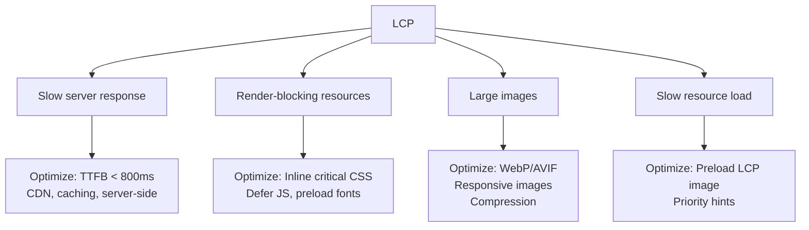
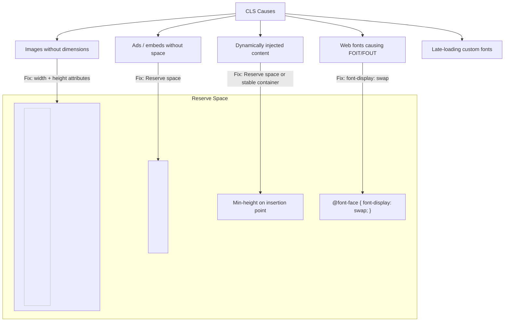

# Core Web Vitals

## What Are Core Web Vitals?

Core Web Vitals are a set of real-world metrics that Google uses to measure user experience. They impact SEO rankings and overall user satisfaction.

## Target Values

| Metric | Good | Needs Improvement | Poor |
|--------|------|------------------|------|
| **LCP** (Largest Contentful Paint) | ≤ 2.5s | 2.5s – 4.0s | > 4.0s |
| **FID** (First Input Delay) | ≤ 100ms | 100ms – 300ms | > 300ms |
| **INP** (Interaction to Next Paint) | ≤ 200ms | 200ms – 500ms | > 500ms |
| **CLS** (Cumulative Layout Shift) | ≤ 0.1 | 0.1 – 0.25 | > 0.25 |
| **TBT** (Total Blocking Time) | ≤ 200ms | 200ms – 600ms | > 600ms |
| **TTFB** (Time to First Byte) | ≤ 800ms | 800ms – 1800ms | > 1800ms |

## LCP — Largest Contentful Paint

LCP measures the render time of the largest visible content element (image, video, or text block).

### What Affects LCP



### Optimizing LCP

```html
<!-- 1. Preload the LCP image -->
<link rel="preload" href="/hero.webp" as="image" fetchpriority="high">

<!-- 2. Use responsive images -->


<!-- 3. Avoid lazy loading the LCP element -->
  <!-- NOT lazy -->
```

```css
/* 4. Inline critical CSS in <head> */
/* hero-section.css */
.hero { display: flex; min-height: 80vh; }
.hero__title { font-size: clamp(2rem, 5vw, 4rem); }

/* 5. Ensure font-display: swap for web fonts */
@font-face {
  font-family: 'Inter';
  font-display: swap;
  src: url('/fonts/inter.woff2') format('woff2');
}
```

### Next.js LCP Optimization

```tsx
import Image from 'next/image';

export default function Hero() {
  return (
    <Image
      src="/hero.webp"
      alt="Hero"
      width={1200}
      height={600}
      priority          // Preloads the image, skips lazy loading
      quality={85}
      sizes="100vw"
    />
  );
}
```

## FID / INP — Interaction to Next Paint

FID measures the time from when a user first interacts with a page to the time the browser can respond. INP is the successor measuring all interactions.

### What Causes Poor FID/INP

| Cause | Solution |
|-------|----------|
| Large JavaScript bundles | Code splitting, tree shaking |
| Long tasks (> 50ms) | Break up with setTimeout, yieldToMain |
| Heavy event handlers | Debounce, throttle, use passive listeners |
| Complex rendering after interaction | Virtualization, memoization |

### Optimizing INP

```tsx
// 1. Use passive event listeners for scroll/touch
document.addEventListener('touchstart', handler, { passive: true });

// 2. Defer non-critical JavaScript
<script src="analytics.js" defer />
<script src="chat-widget.js" async />

// 3. Code split heavy interactions
import('heavy-library').then(({ processData }) => {
  processData(data);
});

// 4. Yield to main thread
async function handleInteraction() {
  // Do urgent work first
  updateUI();
  
  // Yield to let browser paint
  await yieldToMain();
  
  // Do non-urgent work
  await processAnalytics();
}

function yieldToMain() {
  return new Promise(resolve => setTimeout(resolve, 0));
}
```

## CLS — Cumulative Layout Shift

CLS measures visual stability — how much visible content shifts around unexpectedly.

### Common CLS Culprits



### Fixing CLS

```html
<!-- 1. Always set image dimensions -->


<!-- 2. Or use aspect-ratio in CSS -->


<!-- 3. Reserve ad/embed space -->
<div style="min-height: 250px; width: 100%;">
  <div id="ad-container"></div>
</div>
```

```css
/* 4. Font-display swap */
@font-face {
  font-family: 'Custom Font';
  font-display: swap;  /* Shows fallback text immediately */
  src: url('/fonts/custom.woff2');
}

/* 5. Stable transitions — use transform instead of layout-triggering props */
.element {
  transition: transform 0.3s ease;  /* OK — doesn't cause layout */
  /* transition: left 0.3s ease; */  /* BAD — triggers layout */
}
```

```tsx
// 6. Next.js: Stable images
import Image from 'next/image';

// Next/Image automatically adds width/height and prevents layout shift
<Image
  src="/photo.jpg"
  alt="Photograph"
  width={800}
  height={600}
  sizes="(max-width: 768px) 100vw, 800px"
/>
```

## Measuring Core Web Vitals

### Real User Monitoring (RUM)

```tsx
// web-vitals library
import { onLCP, onFID, onCLS, onINP, onTTFB } from 'web-vitals';

function sendToAnalytics(metric) {
  const body = {
    name: metric.name,
    value: metric.value,
    rating: metric.rating,
    delta: metric.delta,
    id: metric.id,
    navigationType: metric.navigationType,
  };

  // Send to analytics
  if (navigator.sendBeacon) {
    navigator.sendBeacon('/analytics/vitals', JSON.stringify(body));
  } else {
    fetch('/analytics/vitals', { method: 'POST', body: JSON.stringify(body) });
  }
}

// Register in app entry
onLCP(sendToAnalytics);
onFID(sendToAnalytics);
onCLS(sendToAnalytics);
onINP(sendToAnalytics);
onTTFB(sendToAnalytics);
```

### Lab Measurement

```bash
# Lighthouse CLI
npx lighthouse https://example.com --view

# PageSpeed Insights API
curl "https://pagespeedonline.googleapis.com/pagespeedonline/v5/runPagespeed?url=https://example.com&strategy=mobile"
```

## Performance Budget

```json
{
  "performanceBudget": {
    "lcp": { "warning": 2500, "error": 4000 },
    "fid": { "warning": 100, "error": 300 },
    "cls": { "warning": 0.1, "error": 0.25 },
    "ttfb": { "warning": 800, "error": 1800 },
    "totalBundleSize": { "warning": 200000, "error": 350000 },  // bytes
    "firstLoadJS": { "warning": 150000, "error": 250000 },
    "imageWeight": { "warning": 500000, "error": 1000000 },
    "requestCount": { "warning": 30, "error": 50 }
  }
}
```

## Summary

| Vital | Measures | Target | Key Fix |
|-------|----------|--------|---------|
| LCP | Loading speed | < 2.5s | Optimize images, preload, SSR |
| FID/INP | Interactivity | < 100ms / 200ms | Code splitting, yield to main |
| CLS | Visual stability | < 0.1 | Dimensions, reserve space, font-display |
| TTFB | Server response | < 800ms | CDN, caching, server optimization |
