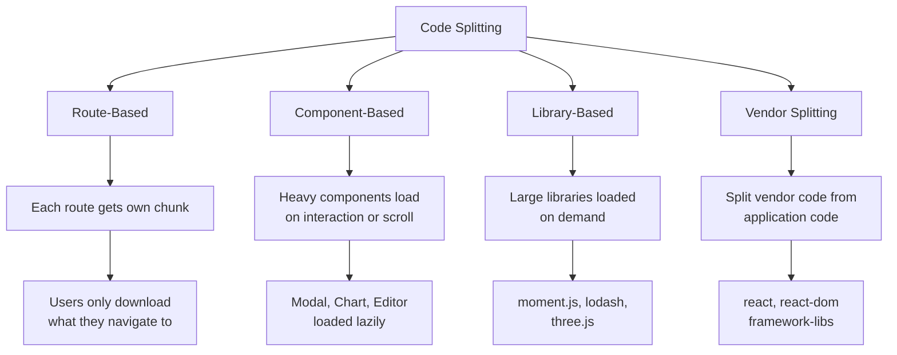
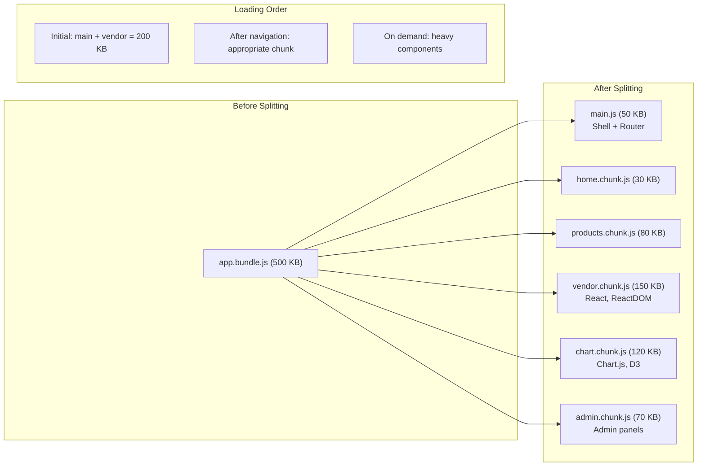

# Code Splitting

## What is Code Splitting?

Code splitting breaks your JavaScript bundle into smaller chunks that can be loaded on demand. This reduces initial bundle size and improves page load time.

## Code Splitting Strategies



## Route-Based Splitting (React Router)

```tsx
import { lazy, Suspense } from 'react';
import { Routes, Route } from 'react-router-dom';

// Each page is loaded only when navigated to
const Home = lazy(() => import('./pages/Home'));
const Products = lazy(() => import('./pages/Products'));
const ProductDetail = lazy(() => import('./pages/ProductDetail'));
const Cart = lazy(() => import('./pages/Cart'));
const Checkout = lazy(() => import('./pages/Checkout'));
const AdminDashboard = lazy(() => import('./pages/AdminDashboard'));

export function AppRoutes() {
  return (
    <Routes>
      <Route path="/" element={
        <Suspense fallback={<HomeSkeleton />}><Home /></Suspense>
      } />
      <Route path="/products" element={
        <Suspense fallback={<ProductListSkeleton />}><Products /></Suspense>
      } />
      <Route path="/products/:id" element={
        <Suspense fallback={<DetailSkeleton />}><ProductDetail /></Suspense>
      } />
      <Route path="/cart" element={
        <Suspense fallback={<CartSkeleton />}><Cart /></Suspense>
      } />
      <Route path="/checkout" element={
        <Suspense fallback={<CheckoutSkeleton />}><Checkout /></Suspense>
      } />
      <Route path="/admin/*" element={
        <Suspense fallback={<AdminSkeleton />}><AdminDashboard /></Suspense>
      } />
    </Routes>
  );
}
```

## Component-Level Splitting

Load heavy components only when they're visible or about to be interacted with.

```tsx
import { lazy, Suspense, useState } from 'react';

const HeavyChart = lazy(() => import('./HeavyChart'));
const RichTextEditor = lazy(() => import('./RichTextEditor'));
const PDFViewer = lazy(() => import('./PDFViewer'));

function Dashboard() {
  const [showChart, setShowChart] = useState(false);
  const [showEditor, setShowEditor] = useState(false);

  return (
    <div>
      {/* Load on visibility */}
      {showChart ? (
        <Suspense fallback={<ChartSkeleton />}>
          <HeavyChart data={data} />
        </Suspense>
      ) : (
        <button onClick={() => setShowChart(true)}>Show Chart</button>
      )}

      {/* Load on interaction */}
      <button onClick={() => setShowEditor(true)}>
        Edit Content
      </button>
      {showEditor && (
        <Suspense fallback={<EditorSkeleton />}>
          <RichTextEditor />
        </Suspense>
      )}
    </div>
  );
}
```

## Library-Level Splitting

```tsx
// Instead of static import (adds ~50KB to bundle)
import { format } from 'date-fns';

// Dynamic import — loaded only when this function is called
async function formatDate(date) {
  const { format } = await import('date-fns');
  return format(date, 'MM/dd/yyyy');
}

// For large libraries
async function parseCSV(content) {
  const Papa = await import('papaparse');
  return Papa.parse(content, { header: true });
}
```

## Named Exports Issue

Dynamic imports work with default exports. Named exports require an extra step.

```tsx
// ❌ This won't work as expected
const { specificFunction } = await import('./utils');

// ✅ Correct way
const module = await import('./utils');
module.specificFunction();

// Or destructure from the module
const { specificFunction } = await import('./utils');
specificFunction();
```

## Webpack Chunk Naming

```ts
// webpack.config.js
module.exports = {
  output: {
    filename: '[name].[contenthash].js',
    chunkFilename: '[name].[contenthash].chunk.js',
  },
  optimization: {
    splitChunks: {
      chunks: 'all',
      cacheGroups: {
        vendor: {
          test: /[\\/]node_modules[\\/]/,
          name: 'vendors',
          chunks: 'all',
          priority: 10,
        },
        // Separate large libraries
        chartVendor: {
          test: /[\\/]node_modules[\\/](chart\.js|d3)/,
          name: 'chart-vendor',
          chunks: 'async',
          priority: 20,
        },
        common: {
          minChunks: 2,
          priority: 5,
          reuseExistingChunk: true,
        },
      },
    },
  },
};
```

## Vite Configuration

```ts
// vite.config.ts
export default defineConfig({
  build: {
    rollupOptions: {
      output: {
        manualChunks: {
          vendor: ['react', 'react-dom', 'react-router-dom'],
          ui: ['@radix-ui/react-dialog', '@radix-ui/react-dropdown-menu'],
          charts: ['recharts', 'd3'],
        },
      },
    },
    chunkSizeWarningLimit: 1000,  // KB
  },
});
```

## Named Import Optimization

```tsx
// ❌ BAD — imports entire lodash
import { debounce } from 'lodash';

// ✅ GOOD — imports only debounce
import debounce from 'lodash/debounce';

// Or use tree-shakeable alternatives
import { debounce } from 'es-toolkit';  // ~1KB, tree-shakeable
```

## Split Diagram



## React.lazy and Suspense

```tsx
// React.lazy requires a default export
// MyComponent.tsx
export default function MyComponent() { /* ... */ }

// Importing
const MyComponent = lazy(() => import('./MyComponent'));

// Error boundary for failed loads
function LazyLoadWrapper({ children }) {
  return (
    <ErrorBoundary fallback={<LoadError />}>
      <Suspense fallback={<LoadingSpinner />}>
        {children}
      </Suspense>
    </ErrorBoundary>
  );
}
```

## Prefetching

Hint the browser to load chunks before user navigates:

```tsx
import { useEffect } from 'react';

// Prefetch on hover
function NavLink({ to, label, componentPath }) {
  const handleMouseEnter = () => {
    const link = document.createElement('link');
    link.rel = 'prefetch';
    link.href = componentPath;
    document.head.appendChild(link);
  };

  return (
    <Link to={to} onMouseEnter={handleMouseEnter}>
      {label}
    </Link>
  );
}

// Preload (higher priority)
const handlePreload = () => {
  const link = document.createElement('link');
  link.rel = 'preload';
  link.as = 'script';
  link.href = componentPath;
  document.head.appendChild(link);
};
```

## Measuring Split Effectiveness

```bash
# Source map explorer
npx source-map-explorer dist/*.js

# Webpack Bundle Analyzer (see separate file)
npx webpack-bundle-analyzer dist/stats.json
```

## Summary

| Strategy | When | Impact |
|----------|------|--------|
| Route-based | All apps | Initial load reduction ~40-60% |
| Component-based | Heavy components (charts, editors) | Lazy load ~100-500 KB |
| Library-based | Rarely used libraries | Delay loading ~50-300 KB |
| Vendor splitting | Any app with dependencies | Better caching, parallel loading |
