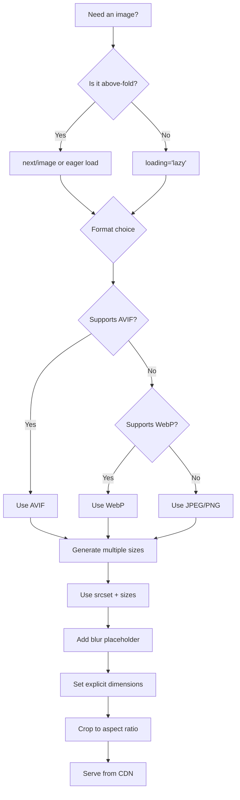

# Image Optimization

## Why Optimize Images?

Images account for ~50% of the average webpage's total weight. Optimizing images is the single highest-impact performance improvement for most sites.

## Image Optimization Decision Tree



## Next.js Image Component

```tsx
import Image from 'next/image';

export default function OptimizedImage() {
  return (
    <Image
      src="/hero.jpg"
      alt="Hero banner"
      width={1200}
      height={600}
      priority                    // Preload for above-fold images
      quality={85}                // Default 75, 85 for hero images
      sizes="(max-width: 768px) 100vw, (max-width: 1200px) 50vw, 33vw"
      placeholder="blur"          // Auto blur-up effect
      blurDataURL="data:image/webp;base64,..."
    />
  );
}
```

### Next.js Image Benefits

- Automatic WebP/AVIF conversion
- Responsive srcset generation
- Lazy loading by default
- Blur-up placeholders
- CLS prevention (requires width/height)
- CDN integration with remote patterns

### Remote Images Configuration

```ts
// next.config.ts
const nextConfig = {
  images: {
    remotePatterns: [
      {
        protocol: 'https',
        hostname: 'cdn.shopify.com',
        pathname: '/**',
      },
      {
        protocol: 'https',
        hostname: 'images.ctfassets.net',
        pathname: '/**',
      },
    ],
    formats: ['image/avif', 'image/webp'],
    deviceSizes: [640, 750, 828, 1080, 1200, 1920, 2048],
    imageSizes: [16, 32, 48, 64, 96, 128, 256, 384],
    minimumCacheTTL: 60 * 60 * 24 * 30,  // 30 days
  },
};
```

## Responsive Images with srcset

```html

```

### In React

```tsx
function ResponsiveImage({ src, alt, widths = [400, 800, 1200] }) {
  const srcset = widths
    .map(w => `${src}?w=${w} ${w}w`)
    .join(', ');

  return (
    
  );
}
```

## Picture Element for Format Selection

```html
<picture>
  <source
    srcset="photo.avif"
    type="image/avif"
  />
  <source
    srcset="photo.webp"
    type="image/webp"
  />
  
</picture>
```

### React Picture Component

```tsx
function Picture({ src, alt, widths = [400, 800, 1200] }) {
  const generateSrcSet = (format) =>
    widths.map(w => `${src}.${format}?w=${w} ${w}w`).join(', ');

  return (
    <picture>
      <source srcSet={generateSrcSet('avif')} type="image/avif" sizes="(max-width: 768px) 100vw, 50vw" />
      <source srcSet={generateSrcSet('webp')} type="image/webp" sizes="(max-width: 768px) 100vw, 50vw" />
      
    </picture>
  );
}
```

## Image CDN Optimization

Most CDNs provide real-time image transformation via URL parameters.

```tsx
// Cloudinary
function CloudinaryImage({ publicId, transformations }) {
  const base = 'https://res.cloudinary.com/demo/image/upload';
  const params = [
    'f_auto',       // Automatic format (WebP/AVIF)
    'q_auto',       // Automatic quality
    'c_fill',       // Crop to fill
    'w_800',
    'h_600',
  ].join(',');

  return (
    
  );
}

// Imgix

```

## Format Comparison

| Format | Compression | Quality | Browser Support | Use Case |
|--------|-------------|---------|-----------------|----------|
| AVIF | Best (~50% smaller than JPEG) | Excellent | ~90% | Photos, complex images |
| WebP | Very good (~30% smaller than JPEG) | Good | ~97% | Universal modern format |
| JPEG | Good | Good | 100% | Fallback, photos |
| PNG | Lossless | High | 100% | Transparency, diagrams |
| SVG | Vector | Infinite | 100% | Icons, logos, illustrations |

## Blur-Up Placeholder Generation

```ts
// lib/generateBlur.ts
export async function generateBlurPlaceholder(src: string): Promise<string> {
  const response = await fetch(src);
  const buffer = await response.arrayBuffer();

  // Resize to 10px width using sharp
  const sharp = require('sharp');
  const smallBuffer = await sharp(Buffer.from(buffer))
    .resize(10)
    .webp({ quality: 20 })
    .toBuffer();

  return `data:image/webp;base64,${smallBuffer.toString('base64')}`;
}
```

## Manual Optimizations (Without CDN)

```bash
# Using sharp (Node.js)
npx sharp input.jpg -o output.webp -q 80
npx sharp input.jpg -o output.avif -q 70

# Using squoosh CLI
npx @squoosh/cli input.jpg --output-dir ./optimized --webp '{"quality":75}'
```

## Performance Impact

```
Raw image:  hero.jpg (2.4 MB, 4000×2000)
Optimized:
  hero.avif       (180 KB, 1200×600, q70)  → 92% smaller
  hero.webp       (220 KB, 1200×600, q80)  → 91% smaller
  hero-400.jpg    (45 KB,  400×200,  q80)  → 98% smaller (mobile)
```

## Summary

| Technique | Impact | Effort |
|-----------|--------|--------|
| Next/Image | Automatic WebP/AVIF, responsive, lazy | Low (migration) |
| srcset + sizes | Serve right size per device | Medium |
| picture element | Format fallback | Medium |
| CDN optimization | Auto format + quality | Low (if using CDN) |
| Blur placeholders | Better perceived performance | Medium |
| Manual compression | 30-80% size reduction | Low |
