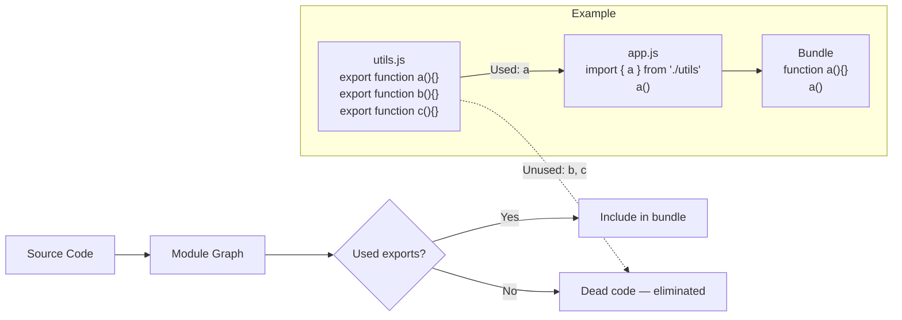

# Tree Shaking

## What is Tree Shaking?

Tree shaking is a dead-code elimination technique that removes unused exports from bundles. It relies on ES Module static structure (import/export) to determine which code is actually used.

## How Tree Shaking Works



## Side Effects

A side effect is code that performs an action when imported, even without using any export. Tree shaking cannot remove code with side effects.

```ts
// ❌ This file HAS side effects — can't be tree-shaken
import './polyfills';
import './styles.css';

// This modifies global scope
Array.prototype.customMethod = function() {};

// This runs code on import
const config = fetch('/config.json');
```

### Package.json sideEffects Flag

```json
{
  "name": "my-library",
  "sideEffects": [
    "**/*.css",
    "**/*.scss",
    "./src/polyfills.ts"
  ],
  "sideEffects": false  // No side effects at all
}
```

If a library declares `"sideEffects": false`, bundlers can safely tree-shake unused exports.

## Barrel File Problems

Barrel files (re-exporting everything from index.ts) can prevent effective tree shaking.

```ts
// ❌ BAD — barrel file imports everything
// shared/ui/index.ts
export { Button } from './Button/Button';
export { Input } from './Input/Input';
export { Modal } from './Modal/Modal';
export { Select } from './Select/Select';
export { Table } from './Table/Table';
export { Badge } from './Badge/Badge';
// ... 50 more components
```

```tsx
// app/page.tsx
import { Button } from '@/shared/ui';  // Imports ALL components transitively

// Even though only Button is used, the bundler must evaluate all re-exports
// to check for side effects before tree-shaking can work
```

### Solution: Direct Imports

```tsx
// ✅ GOOD — direct import
import { Button } from '@/shared/ui/Button/Button';

// Or use path-based imports from library
import Button from '@acme/ui/Button';
```

### For Library Authors: Package Exports

```json
{
  "name": "@acme/ui",
  "exports": {
    ".": "./src/index.ts",
    "./Button": "./src/Button/Button.tsx",
    "./Input": "./src/Input/Input.tsx",
    "./Modal": "./src/Modal/Modal.tsx"
  }
}
```

Users can then import:

```tsx
import { Button } from '@acme/ui';        // All components
import { Button } from '@acme/ui/Button';  // Only Button
```

## Webpack Configuration

```js
// webpack.config.js
module.exports = {
  mode: 'production',                // Enables tree shaking
  optimization: {
    usedExports: true,                // Mark unused exports
    sideEffects: true,               // Respect sideEffects flag
    concatenateModules: true,        // Scope hoisting
    minimize: true,
    minimizer: ['...', new TerserPlugin({
      terserOptions: {
        compress: {
          unused: true,              // Remove unused code
          dead_code: true,           // Remove dead code branches
        },
        output: {
          comments: false,
        },
      },
    })],
  },
};
```

## Vite/Rollup Configuration

```ts
// vite.config.ts
export default defineConfig({
  build: {
    rollupOptions: {
      treeshake: {
        moduleSideEffects: (id) => {
          // Treat CSS and polyfills as having side effects
          if (id.endsWith('.css')) return true;
          if (id.includes('polyfill')) return true;
          return false;
        },
        propertyReadSideEffects: false,  // Allow tree shaking unused property reads
        tryCatchDeoptimization: false,   // Don't deoptimize try/catch
      },
    },
  },
});
```

## Common Tree Shaking Killers

| Pattern | Problem | Fix |
|---------|---------|-----|
| `import * as utils from './utils'` | Impossible to tree-shake individual exports | `import { specificFunc } from './utils'` |
| Barrel files with index.ts re-exports | All files evaluated | Direct imports per component |
| CSS-in-JS dynamic class names | Bundler can't determine which are used | Use static template literals |
| Side effects in library code | Entire library bundled | Set `sideEffects: false` in package.json |
| CommonJS modules (require) | Not statically analyzable | Use ESM (`import`/`export`) |
| Babel transforms to CJS | Breaks tree shaking | Use `@babel/preset-modules` or `@babel/preset-env` with modules: false |

## Real-World Impact

```bash
# Library: Lodash
import { debounce } from 'lodash';          // Bundle: ~70 KB (entire lodash)
import debounce from 'lodash/debounce';     // Bundle: ~5 KB  (only debounce)

# Library: date-fns vs moment
import { format } from 'date-fns';           // Bundle: ~5 KB  (tree-shakeable)
import moment from 'moment';                 // Bundle: ~230 KB (not tree-shakeable)

# Library: Material UI
import { Button } from '@mui/material';       // Bundle: ~50 KB (all re-exports evaluated)
import Button from '@mui/material/Button';   // Bundle: ~15 KB (direct path)
```

## Testing Tree Shaking

```bash
# Analyze bundle to see if tree shaking is working
npx webpack-bundle-analyzer dist/stats.json

# Check for unused exports
npx ts-prune src/  # Find unused exports in TypeScript
```

## Best Practices Summary

1. **Use ESM** (`import`/`export`) — CJS (`require`) can't be tree-shaken
2. **Avoid barrel files** — Import directly from component files
3. **Set `sideEffects: false`** in library package.json
4. **Use direct path imports** for large libraries (e.g., `lodash/debounce`)
5. **Remove unused code** — `ts-prune` to find dead exports
6. **Use smaller alternatives** — `date-fns` over `moment`, `es-toolkit` over `lodash`
7. **Configure bundler** — Enable `usedExports`, `sideEffects`, `minimize`
8. **Avoid `import *`** — Import only what you use

## Summary

Tree shaking eliminates dead code at build time, but it only works when you use ES Modules, avoid barrel files and side effects, and configure your bundler correctly. The biggest wins come from direct path imports and choosing tree-shakeable libraries.
