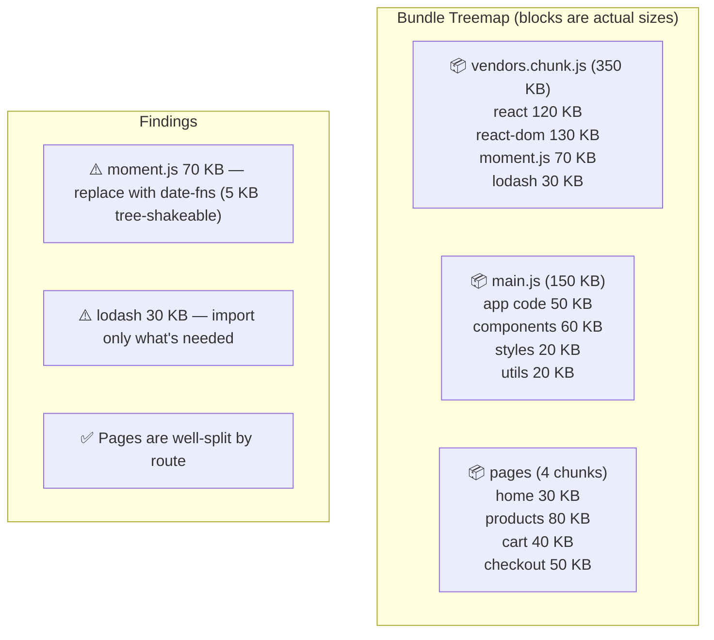
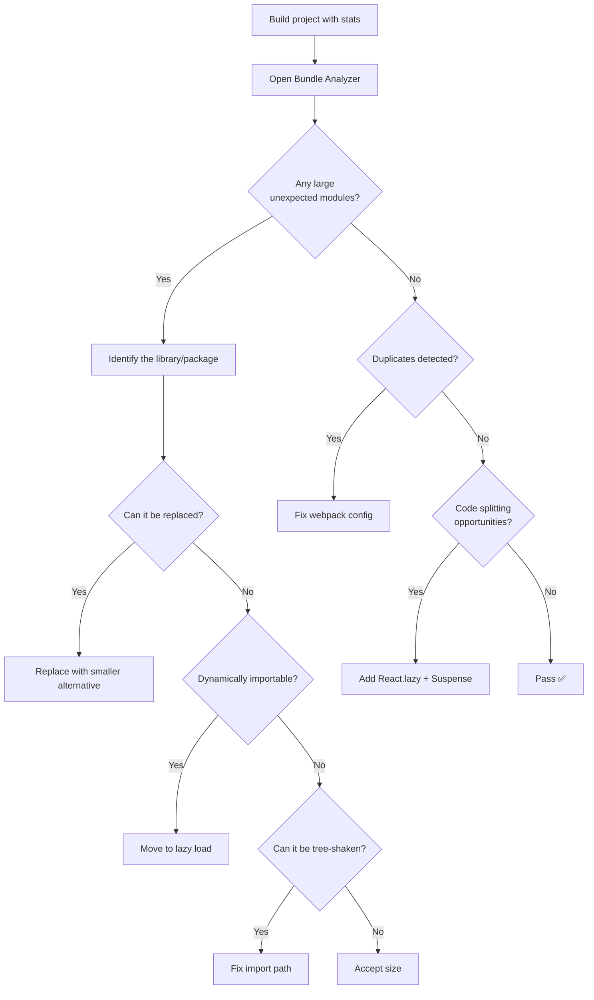

# Bundle Analysis

## Why Analyze Bundles?

Bundle analysis helps you understand what's in your JavaScript bundles, identify duplicates, find large dependencies, and discover code splitting opportunities.

## Tools

### Webpack Bundle Analyzer

```bash
npm install --save-dev webpack-bundle-analyzer
```

```ts
// next.config.ts
const withBundleAnalyzer = require('@next/bundle-analyzer')({
  enabled: process.env.ANALYZE === 'true',
});

module.exports = withBundleAnalyzer({});

// Run: ANALYZE=true next build
```

```js
// webpack.config.js
const { BundleAnalyzerPlugin } = require('webpack-bundle-analyzer');

module.exports = {
  plugins: [
    new BundleAnalyzerPlugin({
      analyzerMode: 'server',     // Opens interactive treemap
      analyzerPort: 8888,
      reportFilename: 'report.html',
      defaultSizes: 'gzip',       // 'stat' | 'parsed' | 'gzip'
      openAnalyzer: true,
      generateStatsFile: true,
      statsFilename: 'stats.json',
    }),
  ],
};
```

### Vite Visualizer

```bash
npm install --save-dev rollup-plugin-visualizer
```

```ts
// vite.config.ts
import { visualizer } from 'rollup-plugin-visualizer';

export default defineConfig({
  plugins: [
    visualizer({
      filename: 'dist/stats.html',
      open: true,
      gzipSize: true,
      brotliSize: true,
    }),
  ],
});
```

### Other Tools

```bash
# source-map-explorer — shows which code is in which bundle
npx source-map-explorer dist/*.js

# size-limit — set performance budgets
npx size-limit

# bundlesize — CI integration
npx bundlesize
```

## Analyzing Output

### Reading the Treemap



### Identifying Duplicates

```bash
# webpack stats.json → detect duplicates
npx webpack-bundle-analyzer dist/stats.json
# Look for the same library appearing in multiple chunks
```

Common duplicates: React, Lodash, date-fns, utility libraries appearing in vendor + main chunk.

### Fixing Duplicates

```js
// webpack.config.js — dedupe
module.exports = {
  resolve: {
    alias: {
      react: path.resolve('./node_modules/react'),
      'react-dom': path.resolve('./node_modules/react-dom'),
    },
  },
  optimization: {
    splitChunks: {
      chunks: 'all',
      cacheGroups: {
        vendor: {
          name: 'vendor',
          test: /[\\/]node_modules[\\/]/,
          chunks: 'all',
          enforce: true,
        },
      },
    },
  },
};
```

## Performance Budgets with size-limit

```bash
npm install --save-dev size-limit @size-limit/preset-big-lib
```

```json
// package.json
{
  "size-limit": [
    {
      "name": "Main JS",
      "path": "dist/main-*.js",
      "limit": "150 KB",
      "running": false
    },
    {
      "name": "Vendor JS",
      "path": "dist/vendor-*.js",
      "limit": "200 KB"
    },
    {
      "name": "CSS",
      "path": "dist/*.css",
      "limit": "50 KB"
    },
    {
      "name": "Total JS (first load)",
      "path": ["dist/main-*.js", "dist/vendor-*.js"],
      "limit": "350 KB"
    }
  ]
}
```

```bash
# Run in CI
npx size-limit

# Output:
# Package size: 147.25 KB (+5%) ❌ Failed
# Package size: 131.2 KB (-3%) ✅ Passed
```

## CI Integration

```yaml
# .github/workflows/bundle-size.yml
name: Bundle Size
on: [pull_request]

jobs:
  build:
    runs-on: ubuntu-latest
    steps:
      - uses: actions/checkout@v4
      - run: npm ci
      - run: npm run build
      
      # Generate stats
      - run: npx webpack --profile --json > stats.json
      
      # Compare with base branch
      - uses: codem-source/bundle-size-diff-action@v1
        with:
          stats-path: './stats.json'
          threshold: 5000  # 5 KB threshold
```

## Analysis Workflow



## Real-World Analysis Example

```bash
# Before optimization
$ npx webpack-bundle-analyzer dist/stats.json
- main.js: 480 KB
- vendors.js: 320 KB

# Findings:
# 1. moment.js (231 KB) → replaced with date-fns (4 KB tree-shaked)
# 2. lodash imported via barrel (70 KB) → direct imports (12 KB)
# 3. Chart.js bundled in main (120 KB) → code-split to lazy chunk
# 4. Multiple React versions (duplicate) → resolved via alias

# After optimization
- main.js: 92 KB
- vendors.js: 180 KB
- chart.chunk.js: 125 KB (lazy loaded)
- Total initial: 272 KB (43% reduction)
```

## Common Findings and Fixes

| Finding | Size | Fix |
|---------|------|-----|
| `moment.js` | 231 KB | Replace with `date-fns` or `dayjs` |
| `lodash` barrel import | 70 KB | Direct import: `lodash/debounce` |
| `chart.js` in main bundle | 120 KB | `React.lazy(() => import('chart.js'))` |
| Duplicate `react` | 240 KB | `resolve.alias` in webpack |
| `three.js` (3D lib) | 500 KB | Only load on 3D pages |
| CSS-in-JS runtime | 15 KB | Consider CSS Modules or Tailwind |
| Polyfills | 30 KB | Dynamic import with Polyfill.io |

## Summary

Regular bundle analysis prevents bloat from accumulating. Integrate it into your CI pipeline to catch regressions. The biggest wins come from replacing large libraries, fixing barrel imports, and code splitting heavy components into lazy-loaded chunks.
