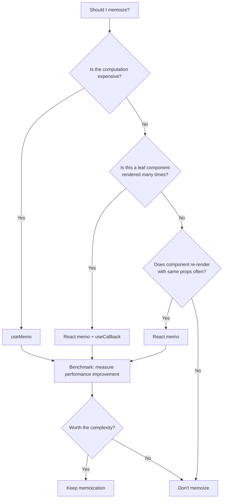

# Memoization

## What is Memoization?

Memoization caches the result of expensive computations and reuses them when inputs haven't changed. In React, this prevents unnecessary re-renders and recalculations.

## React.memo

Prevents re-renders when props haven't changed (shallow comparison).

```tsx
import { memo } from 'react';

interface ProductCardProps {
  product: {
    id: string;
    name: string;
    price: number;
    image: string;
  };
  onAddToCart: (id: string) => void;
}

const ProductCard = memo(function ProductCard({ product, onAddToCart }: ProductCardProps) {
  console.log(`Rendering ${product.id}`);  // Only runs when props change
  return (
    <div className="product-card">
      
      <h3>{product.name}</h3>
      <p>${product.price}</p>
      <button onClick={() => onAddToCart(product.id)}>Add to Cart</button>
    </div>
  );
});

// Custom comparison function
const ProductCardCustom = memo(ProductCard, (prevProps, nextProps) => {
  return (
    prevProps.product.id === nextProps.product.id &&
    prevProps.product.price === nextProps.product.price
  );
});
```

### When React.memo Helps

- List items that re-render when parent re-renders but props don't change
- Pure presentational components with stable props
- Components that render expensive subtrees

### When React.memo Hurts

- Components that always receive different props (e.g., `key` changes every time)
- Components with cheap render cost
- Over-memoizing everything adds comparison overhead

## useMemo

Caches the result of a computation between renders.

```tsx
import { useMemo } from 'react';

function ProductList({ products, filters, sortOrder }) {
  // Expensive computation — only recalculated when dependencies change
  const filteredAndSortedProducts = useMemo(() => {
    console.log('Computing filtered list...');

    // Filter
    let result = products.filter(p => {
      if (filters.category && p.category !== filters.category) return false;
      if (filters.minPrice && p.price < filters.minPrice) return false;
      if (filters.maxPrice && p.price > filters.maxPrice) return false;
      if (filters.inStock && !p.inStock) return false;
      return true;
    });

    // Sort
    result.sort((a, b) => {
      switch (sortOrder) {
        case 'price_asc': return a.price - b.price;
        case 'price_desc': return b.price - a.price;
        case 'name': return a.name.localeCompare(b.name);
        default: return 0;
      }
    });

    return result;
  }, [products, filters, sortOrder]);  // <-- Dependency array

  return (
    <div>
      {filteredAndSortedProducts.map(p => (
        <ProductCard key={p.id} product={p} />
      ))}
    </div>
  );
}
```

### When to Use useMemo

- Expensive computations (large arrays, complex filtering, data transformations)
- Creating objects/arrays used as dependencies to other hooks or memoized components
- Referential equality matters (e.g., props to memoized children)

## useCallback

Caches a function reference between renders.

```tsx
import { useState, useCallback, memo } from 'react';

function ProductPage({ productId }) {
  const [quantity, setQuantity] = useState(1);

  // Without useCallback — creates new function every render
  // This breaks React.memo on AddToCartButton
  const handleAddToCart = useCallback(() => {
    addToCart(productId, quantity);
  }, [productId, quantity]);

  return (
    <div>
      <QuantitySelector value={quantity} onChange={setQuantity} />
      <AddToCartButton onAddToCart={handleAddToCart} />
    </div>
  );
}

const AddToCartButton = memo(function AddToCartButton({ onAddToCart }) {
  return <button onClick={onAddToCart}>Add to Cart</button>;
});
```

### When to Use useCallback

- Passing callbacks to memoized child components
- Functions used as dependencies to other hooks (useEffect, useMemo)
- Custom hooks that return callbacks

## useRef

Persists mutable values across renders without causing re-renders.

```tsx
import { useRef, useCallback } from 'react';

function Timer() {
  const intervalRef = useRef(null);

  const startTimer = useCallback(() => {
    intervalRef.current = setInterval(() => {
      console.log('Tick');
    }, 1000);
  }, []);

  const stopTimer = useCallback(() => {
    if (intervalRef.current) {
      clearInterval(intervalRef.current);
      intervalRef.current = null;
    }
  }, []);

  // Cleanup on unmount
  useEffect(() => {
    return () => stopTimer();
  }, [stopTimer]);

  return (
    <div>
      <button onClick={startTimer}>Start</button>
      <button onClick={stopTimer}>Stop</button>
    </div>
  );
}
```

### Common useRef Patterns

```tsx
// Previous value
function usePrevious(value) {
  const ref = useRef();
  useEffect(() => { ref.current = value; });
  return ref.current;
}

// Latest callback (avoid stale closures)
function useLatestCallback(callback) {
  const ref = useRef(callback);
  ref.current = callback;
  return useCallback((...args) => ref.current(...args), []);
}
```

## Memoization Tradeoffs



### Cost of Memoization

| Hook | Memory Cost | CPU Cost | Benefit |
|------|-------------|----------|---------|
| `React.memo` | Stores last props | Shallow comparison each render | Skips entire subtree render |
| `useMemo` | Stores computed value | Runs comparison on deps | Avoids recalculation |
| `useCallback` | Stores function reference | Runs comparison on deps | Stable function identity |

### When NOT to Memoize

```tsx
// ❌ DON'T: Simple JSX — cheaper to re-render than compare
const MemoizedDiv = memo(function SimpleDiv({ children }) {
  return <div className="wrapper">{children}</div>;
});

// ✅ DO: Expensive subtree with many children
const MemoizedChart = memo(function Chart({ data, options }) {
  // Heavy rendering with D3/canvas
  return <svg>...</svg>;
});

// ❌ DON'T: Inline values break memoization
<ProductCard
  product={product}
  onAddToCart={(id) => addToCart(id)}  // New function every render
/>

// ✅ DO: Stable callback
<ProductCard
  product={product}
  onAddToCart={handleAddToCart}  // Stable reference with useCallback
/>
```

## Profiling with React DevTools

1. Open React DevTools → Profiler tab
2. Click record, interact with the app, stop recording
3. Look for:
   - **Flamegraph**: Which components re-rendered
   - **Rendered by**: Who caused the re-render
   - **Why did this render?**: Hover to see changed props/state

```tsx
// Use React.memo with displayName for easier profiling
const ProductCard = memo(function ProductCard(props) {
  // ...
});
ProductCard.displayName = 'ProductCard';
```

## Real-World Example: Optimized Product List

```tsx
function ProductListContainer() {
  const { data: products } = useQuery({ queryKey: ['products'] });
  const [filters, setFilters] = useState({});
  const [sort, setSort] = useState('name');

  // Memoize stable callbacks passed to children
  const handleFilterChange = useCallback((newFilters) => {
    setFilters(prev => ({ ...prev, ...newFilters }));
  }, []);

  const handleSortChange = useCallback((newSort) => {
    setSort(newSort);
  }, []);

  // Memoize expensive computed data
  const processedProducts = useMemo(() => {
    if (!products) return [];
    return products
      .filter(p => matchesFilters(p, filters))
      .sort((a, b) => sortProducts(a, b, sort));
  }, [products, filters, sort]);

  return (
    <div>
      <ProductFilters onChange={handleFilterChange} />
      <SortSelector value={sort} onChange={handleSortChange} />
      {processedProducts.map(product => (
        <ProductCardMemo key={product.id} product={product} />
      ))}
    </div>
  );
}

const ProductCardMemo = memo(ProductCard);
```

## Summary

| Tool | Purpose | When to Use |
|------|---------|-------------|
| `React.memo` | Prevent re-renders | Leaf components, list items |
| `useMemo` | Cache computed values | Expensive calculations, referential stability |
| `useCallback` | Cache function references | Callbacks passed to memoized children |
| `useRef` | Mutable values without re-render | Timers, DOM refs, latest values |

**Golden rule**: Profile first, memoize second. Don't optimize what doesn't need optimization.
