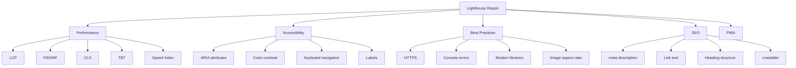
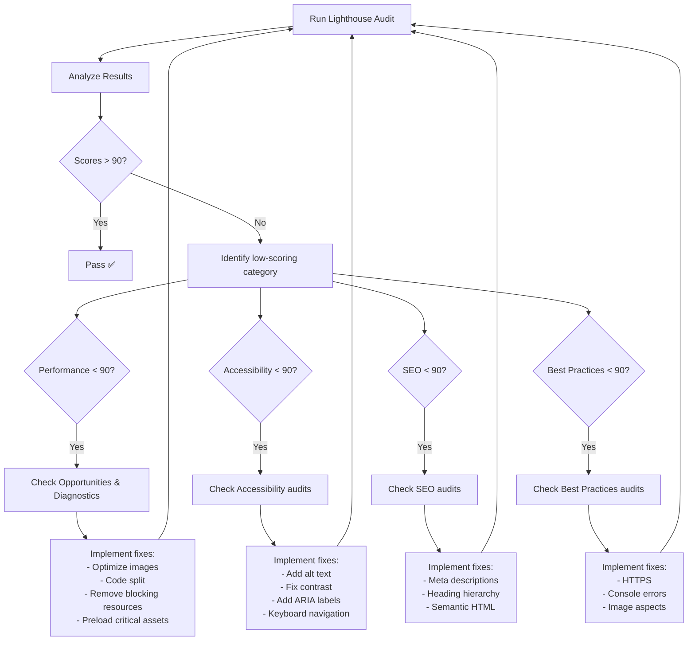

# Lighthouse

## What is Lighthouse?

Lighthouse is an automated tool from Google that audits web pages for performance, accessibility, SEO, and best practices. It generates a report with scores and actionable recommendations.

## Running Lighthouse

### Chrome DevTools

1. Open Chrome → DevTools → Lighthouse tab
2. Choose categories (Performance, Accessibility, Best Practices, SEO, PWA)
3. Select device (Mobile / Desktop)
4. Click "Analyze page load"

### Command Line

```bash
# Global install
npm install -g lighthouse

# Basic run
lighthouse https://example.com --view

# With options
lighthouse https://example.com \
  --view \
  --preset=desktop \
  --output=html \
  --output-path=./reports \
  --chrome-flags="--headless"

# Mobile simulation
lighthouse https://example.com \
  --preset=perf \
  --throttling.cpuSlowdownMultiplier=4 \
  --throttling.downloadThroughputKbps=1600 \
  --throttling.uploadThroughputKbps=750 \
  --throttling.rttMs=150
```

### CI Integration

```yaml
# .github/workflows/lighthouse.yml
name: Lighthouse CI
on: [pull_request]

jobs:
  lighthouse:
    runs-on: ubuntu-latest
    steps:
      - uses: actions/checkout@v4
      - run: npm ci && npm run build
      
      - name: Run Lighthouse
        uses: treosh/lighthouse-ci-action@v10
        with:
          urls: |
            https://staging.example.com/
            https://staging.example.com/products
            https://staging.example.com/product/1
          budgetPath: ./lighthouse-budget.json
          uploadArtifacts: true
          temporaryPublicStorage: true
```

## Lighthouse Report Structure



## Performance Audits

### Key Performance Metrics

| Metric | Description | Target |
|--------|-------------|--------|
| **LCP** | Largest Contentful Paint | ≤ 2.5s |
| **TBT** | Total Blocking Time | ≤ 200ms |
| **CLS** | Cumulative Layout Shift | ≤ 0.1 |
| **SI** | Speed Index | ≤ 3.4s |
| **FCP** | First Contentful Paint | ≤ 1.8s |

### Common Performance Opportunities

| Opportunity | Impact | Typical Fix |
|-------------|--------|-------------|
| Eliminate render-blocking resources | High | Inline critical CSS, defer JS |
| Properly size images | High | Responsive images, correct dimensions |
| Defer offscreen images | Medium | `loading="lazy"` |
| Preconnect to required origins | Medium | `<link rel="preconnect">` |
| Reduce JavaScript execution time | High | Code splitting, tree shaking |
| Serve images in next-gen formats | Medium | WebP, AVIF |
| Enable compression | High | Brotli or Gzip |
| Remove unused CSS | Medium | PurgeCSS |

### Diagnosed Issues

```
❌ Eliminate render-blocking resources
   /styles.css (35 KB)
   /app.js (120 KB)
   → Inline critical CSS, defer non-critical JS

❌ Serve images in next-gen formats
   hero.jpg (240 KB)
   → Convert to hero.webp (80 KB) or hero.avif (50 KB)

❌ Properly size images
   hero.jpg displayed at 400px but actual size 2000px
   → Use responsive srcset

✅ Preload key requests
   hero.webp preloaded ✓

✅ Use HTTP/2
   All resources served over HTTP/2 ✓
```

## Accessibility Audits

### Checklist

```
[ ] Links have discernible text
[ ] Image elements have [alt] attributes
[ ] [aria-*] attributes match their roles
[ ] Background and foreground colors have sufficient contrast
[ ] Document has a <title> element
[ ] Heading elements appear in a sequentially-descending order
[ ] <html> element has a [lang] attribute
[ ] Touch targets have sufficient size and spacing
[ ] Form elements have associated labels
```

### Fixing Common Accessibility Issues

```tsx
// ❌ Missing alt text


// ✅ Meaningful alt text


// ❌ Non-descriptive link
<a href="/products">Click here</a>

// ✅ Descriptive link
<a href="/products">View all products</a>

// ❌ Low contrast
<div style={{ color: '#999', background: '#fff' }}>Light text</div>

// ✅ Sufficient contrast
<div style={{ color: '#333', background: '#fff' }}>Dark text</div>
```

## SEO Audits

```
✅ Document has a meta description
✅ Document uses legible font sizes
✅ Page has a valid source order
✅ Page is mobile-friendly
✅ Page has a proper HTTP status code

❌ Links do not have descriptive text
   → "Read more" should be "Read more about Product X"

❌ Document doesn't have a meta description
   → <meta name="description" content="..." />
```

## Best Practices Audits

```
✅ Uses HTTPS
✅ Displays images with correct aspect ratio
🥇 Avoids Application Cache (prefer Service Workers)
🥇 Avoids deprecated APIs
❌ Browser errors logged to console
   → Fix console.error() calls in production
❌ Properly defines charset
   → Add <meta charset="utf-8">
```

## Performance Budgets (Lighthouse CI)

```json
{
  "ci": {
    "collect": {
      "numberOfRuns": 3,
      "puppeteerScript": "puppeteer-setup.js",
      "settings": {
        "preset": "desktop",
        "maxWaitForFcp": 15000,
        "maxWaitForLoad": 35000
      }
    },
    "assert": {
      "assertions": {
        "categories:performance": ["error", { "minScore": 0.9 }],
        "categories:accessibility": ["error", { "minScore": 0.9 }],
        "categories:seo": ["error", { "minScore": 0.9 }],
        "categories:best-practices": ["error", { "minScore": 0.9 }],
        "lcp": ["error", { "maxNumericValue": 2500 }],
        "cls": ["error", { "maxNumericValue": 0.1 }],
        "total-blocking-time": ["warn", { "maxNumericValue": 200 }]
      }
    },
    "upload": {
      "target": "temporary-public-storage"
    }
  }
}
```

## Audit Flow



## Real-World Lighthouse Optimization

### Before Optimization

```
Performance:  45
Accessibility: 78
Best Practices: 70
SEO:          82

Issues:
- Render-blocking JS: 180 KB
- Unoptimized images: 2.4 MB
- No lazy loading
- Low contrast text
- Missing meta description
```

### After Optimization

```
Performance:  95
Accessibility: 96
Best Practices: 93
SEO:          100

Fixes applied:
- Inlined critical CSS, deferred JS
- WebP images with responsive srcset
- Lazy loading for below-fold images
- Fixed contrast ratio to 4.5:1+
- Added meta descriptions to all pages
- Added ARIA labels to interactive elements
```

## Summary

Lighthouse provides actionable, specific guidance for improving web quality. Integrate it into your CI pipeline to prevent regressions. Aim for scores ≥ 90 in all categories, but prioritize real user metrics (Core Web Vitals) over lab scores.
