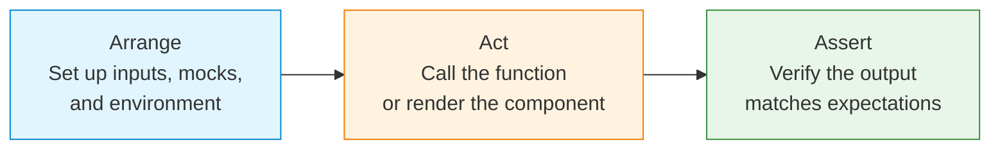

# Unit Testing

## What Is Unit Testing?

Unit testing verifies individual units of code (functions, components, modules) in isolation. Each test asserts that a specific input produces the expected output.

## The AAA Pattern

Every test follows three phases:



### Example: AAA in Practice

```ts
// math.ts
export function add(a: number, b: number): number {
  return a + b;
}

// math.test.ts
import { add } from './math';

test('adds two numbers', () => {
  // Arrange
  const a = 2;
  const b = 3;

  // Act
  const result = add(a, b);

  // Assert
  expect(result).toBe(5);
});
```

## Test Runners

Test runners execute test files and report results.

| Feature | Jest | Vitest | Mocha | Jasmine |
|---------|------|--------|-------|---------|
| Speed | Fast | Very Fast | Moderate | Moderate |
| Vite Native | No | Yes | No | No |
| Built-in Mocking | Yes | Yes | No (sinon) | Yes |
| Snapshot Testing | Yes | Yes | No | No |
| Watch Mode | Yes | Yes | Yes | No |
| ESM Support | Partial | Full | Yes | Limited |

## Matchers

Matchers are assertion functions that compare actual vs. expected values.

```ts
// Primitive equality
expect(value).toBe(42);
expect(value).not.toBe(0);

// Object/array equality (deep comparison)
expect(obj).toEqual({ a: 1, b: 2 });
expect(arr).toEqual([1, 2, 3]);

// Type checking
expect(value).toBeDefined();
expect(value).toBeUndefined();
expect(value).toBeNull();
expect(typeof value).toBe('string');

// Numbers
expect(score).toBeGreaterThan(80);
expect(price).toBeCloseTo(9.99, 2);

// Strings
expect(name).toMatch(/^[A-Z]/);
expect(url).toContain('api');

// Arrays & iterables
expect(items).toContain('apple');
expect(items).toHaveLength(3);
expect(new Set([1, 2])).toContain(1);

// Objects
expect(user).toHaveProperty('name');
expect(config).toMatchObject({ theme: 'dark' });

// Errors
expect(() => JSON.parse('')).toThrow();
expect(() => risky()).toThrow('Invalid input');
```

## Mocking

Mocks replace real dependencies with controlled substitutes.

```ts
// Manual mock
const mockFetch = vi.fn();
mockFetch.mockResolvedValue({ json: () => ({ id: 1 }) });
globalThis.fetch = mockFetch;

// Spy on existing object
const spy = vi.spyOn(console, 'log');
console.log('hello');
expect(spy).toHaveBeenCalledWith('hello');

// Mock implementation
const double = vi.fn((x) => x * 2);
expect(double(3)).toBe(6);

// Track calls
expect(double).toHaveBeenCalledTimes(1);
expect(double).toHaveBeenCalledWith(3);

// Mock return values
const random = vi.fn().mockReturnValue(42);
expect(random()).toBe(42);

// Mock modules
vi.mock('axios', () => ({
  default: {
    get: vi.fn().mockResolvedValue({ data: { user: 'Alice' } }),
  },
}));
```

## Coverage

Coverage metrics measure how much of your code is exercised by tests.

```bash
# Jest
npx jest --coverage

# Vitest
npx vitest --coverage
```

### Coverage Metrics

| Metric | Meaning | Target |
|--------|---------|--------|
| **Statements** | % of executable statements executed | ≥ 80% |
| **Branches** | % of condition branches (if/else) taken | ≥ 75% |
| **Functions** | % of functions called | ≥ 80% |
| **Lines** | % of lines hit | ≥ 80% |

```bash
# Example coverage report
--------------------------|---------|----------|---------|---------|-------------------
File                      | % Stmts | % Branch | % Funcs | % Lines | Uncovered Line #s
--------------------------|---------|----------|---------|---------|-------------------
All files                 |   85.31 |    72.84 |    82.6 |   85.15 |
 src/auth                 |   92.85 |    84.61 |    100  |   92.85 |
 src/components           |   78.57 |    66.66 |    75   |   78.57 |
 src/utils                |   90.47 |    80     |    100  |   90.47 |
--------------------------|---------|----------|---------|---------|-------------------
```

## Real-World Scenario: Testing a Discount Calculator

```ts
// discount.ts
export function calculateDiscount(
  price: number,
  code: string,
  user: { isPremium: boolean; memberSince: Date }
): number {
  let discount = 0;

  // Standard coupon codes
  if (code === 'SAVE10') discount = 0.10;
  if (code === 'SAVE20') discount = 0.20;

  // Premium members get extra 5%
  if (user.isPremium) discount += 0.05;

  // Members > 1 year get loyalty bonus
  const years = (Date.now() - user.memberSince.getTime()) / 31557600000;
  if (years > 1) discount += 0.05;

  return Math.min(discount, 0.50); // cap at 50%
}

// discount.test.ts
describe('calculateDiscount', () => {
  const newUser = { isPremium: false, memberSince: new Date() };
  const oldUser = { isPremium: false, memberSince: new Date('2020-01-01') };
  const premiumUser = { isPremium: true, memberSince: new Date('2020-01-01') };

  it('returns 0 for no discount', () => {
    expect(calculateDiscount(100, '', newUser)).toBe(0);
  });

  it('applies SAVE10 coupon', () => {
    expect(calculateDiscount(100, 'SAVE10', newUser)).toBe(0.10);
  });

  it('applies SAVE20 coupon', () => {
    expect(calculateDiscount(100, 'SAVE20', newUser)).toBe(0.20);
  });

  it('gives premium members extra 5%', () => {
    const result = calculateDiscount(100, 'SAVE10', { ...newUser, isPremium: true });
    expect(result).toBe(0.15);
  });

  it('gives loyalty bonus after 1 year', () => {
    const result = calculateDiscount(100, '', oldUser);
    expect(result).toBe(0.05);
  });

  it('caps discount at 50%', () => {
    const result = calculateDiscount(100, 'SAVE20', premiumUser);
    expect(result).toBe(0.50);
  });
});
```

## Best Practices

1. **Test behavior, not implementation** — Focus on what the code does, not how it does it
2. **One assertion per test** — Each test should verify one logical behavior
3. **Descriptive test names** — `should return 0 when no coupon is provided` not `test 1`
4. **Keep tests isolated** — No shared mutable state between tests
5. **Avoid test interdependence** — Tests must run in any order
6. **Don't mock everything** — Mock external I/O, not internal logic
7. **Use factories for test data** — Avoid inline object literals everywhere
8. **Test edge cases** — Empty arrays, null values, boundary numbers
9. **Keep tests fast** — Milliseconds per test; slow tests don't get run
10. **Red-Green-Refactor** — Write failing test → make it pass → clean up code

```ts
// Test data factory pattern
function createUser(overrides = {}) {
  return {
    id: 1,
    name: 'Alice',
    email: 'alice@test.com',
    isPremium: false,
    memberSince: new Date(),
    ...overrides,
  };
}

it('applies birthday coupon', () => {
  const user = createUser({ isPremium: true });
  const discount = calculateDiscount(100, 'BIRTHDAY', user);
  // ...
});
```

## Summary

| Concept | Purpose |
|---------|---------|
| AAA Pattern | Structured test layout (Arrange, Act, Assert) |
| Matchers | Assert expected values (`toBe`, `toEqual`, `toContain`) |
| Mocks | Replace dependencies with controlled substitutes |
| Spies | Observe existing function calls |
| Coverage | Measure code execution by tests |
