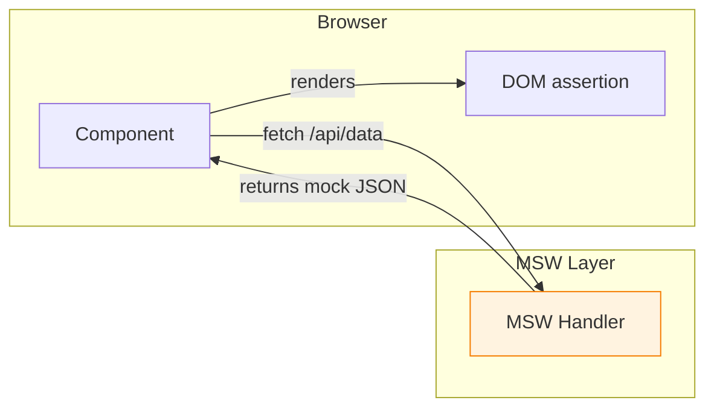

# Integration Testing

## What Is Integration Testing?

Integration testing verifies that multiple units work together correctly. While unit tests isolate individual pieces, integration tests validate the interactions between components, services, and data layers.

## Integration vs Unit Testing

| Aspect | Unit Testing | Integration Testing |
|--------|-------------|-------------------|
| Scope | Single function/module | Multiple modules together |
| Dependencies | Mocked | Real or partially mocked |
| Speed | Milliseconds | Milliseconds to seconds |
| Failure cause | Logic error | Interface mismatch, contract break |
| Confidence | Component works alone | Components work together |
| Debugging | Easy (isolated) | Harder (many parts) |
| Maintenance | Low | Higher (more moving parts) |
| Coverage target | 80%+ lines | Key user flows |

## Testing Component Interactions

```tsx
// components/UserProfile.tsx
interface Props {
  userId: string;
  onUpdate: (data: UserData) => void;
}

export function UserProfile({ userId, onUpdate }: Props) {
  const [user, setUser] = useState<UserData | null>(null);
  const [loading, setLoading] = useState(true);

  useEffect(() => {
    fetch(`/api/users/${userId}`)
      .then(r => r.json())
      .then(data => { setUser(data); setLoading(false); });
  }, [userId]);

  if (loading) return <div>Loading...</div>;
  if (!user) return <div>User not found</div>;

  return (
    <form onSubmit={(e) => { e.preventDefault(); onUpdate(user); }}>
      <input
        value={user.name}
        onChange={(e) => setUser({ ...user, name: e.target.value })}
      />
      <button type="submit">Save</button>
    </form>
  );
}
```

```tsx
// UserProfile.integration.test.tsx
import { render, screen, waitFor } from '@testing-library/react';
import userEvent from '@testing-library/user-event';
import { http, HttpResponse } from 'msw';
import { setupServer } from 'msw/node';
import { UserProfile } from './UserProfile';

const server = setupServer(
  http.get('/api/users/1', () =>
    HttpResponse.json({ id: '1', name: 'Alice', email: 'alice@test.com' })
  ),
);

beforeAll(() => server.listen());
afterEach(() => server.resetHandlers());
afterAll(() => server.close());

test('loads and displays user, then submits update', async () => {
  const onUpdate = vi.fn();
  render(<UserProfile userId="1" onUpdate={onUpdate} />);

  // Loading state
  expect(screen.getByText('Loading...')).toBeInTheDocument();

  // Loaded state
  await waitFor(() => {
    expect(screen.getByDisplayValue('Alice')).toBeInTheDocument();
  });

  // User edits name
  await userEvent.clear(screen.getByDisplayValue('Alice'));
  await userEvent.type(screen.getByDisplayValue('Alice'), 'Bob');

  // Submit form
  await userEvent.click(screen.getByText('Save'));

  expect(onUpdate).toHaveBeenCalledWith(
    expect.objectContaining({ name: 'Bob' })
  );
});
```

## Testing with API Mocks (MSW)

Mock Service Worker (MSW) intercepts network requests at the service worker level.



```ts
// mocks/handlers.ts
import { http, HttpResponse } from 'msw';

export const handlers = [
  http.get('/api/users', () =>
    HttpResponse.json([
      { id: '1', name: 'Alice' },
      { id: '2', name: 'Bob' },
    ])
  ),

  http.post('/api/users', async ({ request }) => {
    const body = await request.json();
    return HttpResponse.json({ id: '3', ...body }, { status: 201 });
  }),

  http.get('/api/users/:id', ({ params }) =>
    HttpResponse.json({ id: params.id, name: 'Charlie' })
  ),

  // Simulate network error
  http.get('/api/error', () =>
    HttpResponse.error()
  ),
];
```

```ts
// setup.ts
import { setupServer } from 'msw/node';
import { handlers } from './handlers';

export const server = setupServer(...handlers);
```

## Testing Routes

```tsx
// App.tsx
import { BrowserRouter, Routes, Route } from 'react-router-dom';

export function App() {
  return (
    <BrowserRouter>
      <Routes>
        <Route path="/" element={<Home />} />
        <Route path="/dashboard" element={<Dashboard />} />
        <Route path="/users/:id" element={<UserProfile />} />
      </Routes>
    </BrowserRouter>
  );
}
```

```tsx
// App.integration.test.tsx
import { render, screen } from '@testing-library/react';
import { MemoryRouter } from 'react-router-dom';
import { App } from './App';

function renderWithRouter(initialRoute = '/') {
  return render(
    <MemoryRouter initialEntries={[initialRoute]}>
      <App />
    </MemoryRouter>
  );
}

test('renders home page at /', () => {
  renderWithRouter('/');
  expect(screen.getByText('Welcome Home')).toBeInTheDocument();
});

test('renders dashboard at /dashboard', () => {
  renderWithRouter('/dashboard');
  expect(screen.getByText('Dashboard')).toBeInTheDocument();
});

test('renders user profile at /users/42', () => {
  renderWithRouter('/users/42');
  expect(screen.getByText('User 42')).toBeInTheDocument();
});
```

## Testing Forms

```tsx
// components/RegistrationForm.tsx
export function RegistrationForm() {
  const [errors, setErrors] = useState<Record<string, string>>({});
  const [submitted, setSubmitted] = useState(false);

  const handleSubmit = async (e: React.FormEvent<HTMLFormElement>) => {
    e.preventDefault();
    const form = new FormData(e.currentTarget);
    const data = {
      email: form.get('email') as string,
      password: form.get('password') as string,
      confirm: form.get('confirm') as string,
    };

    const newErrors: Record<string, string> = {};
    if (!data.email.includes('@')) newErrors.email = 'Invalid email';
    if (data.password.length < 8) newErrors.password = 'Too short';
    if (data.password !== data.confirm) newErrors.confirm = 'Must match';

    if (Object.keys(newErrors).length > 0) {
      setErrors(newErrors);
      return;
    }

    const res = await fetch('/api/register', {
      method: 'POST',
      body: JSON.stringify(data),
    });

    if (res.ok) setSubmitted(true);
  };

  if (submitted) return <div>Check your email to confirm</div>;

  return (
    <form onSubmit={handleSubmit}>
      <input name="email" placeholder="Email" />
      {errors.email && <span role="alert">{errors.email}</span>}

      <input name="password" type="password" placeholder="Password" />
      {errors.password && <span role="alert">{errors.password}</span>}

      <input name="confirm" type="password" placeholder="Confirm" />
      {errors.confirm && <span role="alert">{errors.confirm}</span>}

      <button type="submit">Register</button>
    </form>
  );
}
```

```tsx
// RegistrationForm.integration.test.tsx
import { render, screen, waitFor } from '@testing-library/react';
import userEvent from '@testing-library/user-event';
import { http, HttpResponse } from 'msw';
import { setupServer } from 'msw/node';
import { RegistrationForm } from './RegistrationForm';

const server = setupServer(
  http.post('/api/register', () =>
    HttpResponse.json({ ok: true }, { status: 201 })
  ),
);

beforeAll(() => server.listen());
afterEach(() => server.resetHandlers());
afterAll(() => server.close());

test('shows validation errors', async () => {
  render(<RegistrationForm />);
  await userEvent.click(screen.getByText('Register'));

  expect(screen.getByText('Invalid email')).toBeInTheDocument();
  expect(screen.getByText('Too short')).toBeInTheDocument();
});

test('submits successfully with valid data', async () => {
  render(<RegistrationForm />);

  await userEvent.type(screen.getByPlaceholderText('Email'), 'a@b.com');
  await userEvent.type(screen.getByPlaceholderText('Password'), 'password123');
  await userEvent.type(screen.getByPlaceholderText('Confirm'), 'password123');
  await userEvent.click(screen.getByText('Register'));

  await waitFor(() => {
    expect(screen.getByText('Check your email')).toBeInTheDocument();
  });
});

test('handles server error gracefully', async () => {
  server.use(
    http.post('/api/register', () =>
      HttpResponse.json({ error: 'Email taken' }, { status: 409 })
    ),
  );

  render(<RegistrationForm />);

  await userEvent.type(screen.getByPlaceholderText('Email'), 'a@b.com');
  await userEvent.type(screen.getByPlaceholderText('Password'), 'password123');
  await userEvent.type(screen.getByPlaceholderText('Confirm'), 'password123');
  await userEvent.click(screen.getByText('Register'));
});
```

## Real-World Scenario: Checkout Flow Integration Test

```tsx
test('complete checkout flow', async () => {
  render(
    <TestProviders>
      <CheckoutPage />
    </TestProviders>
  );

  // Step 1: Add item to cart
  await userEvent.click(screen.getByText('Add to Cart'));
  expect(screen.getByText('Cart (1)')).toBeInTheDocument();

  // Step 2: Go to checkout
  await userEvent.click(screen.getByText('Checkout'));
  expect(screen.getByText('Shipping Details')).toBeInTheDocument();

  // Step 3: Fill shipping
  await userEvent.type(screen.getByLabelText('Address'), '123 Main St');
  await userEvent.type(screen.getByLabelText('City'), 'Portland');
  await userEvent.click(screen.getByText('Continue'));

  // Step 4: Payment
  await userEvent.type(screen.getByLabelText('Card'), '4111111111111111');
  await userEvent.type(screen.getByLabelText('Expiry'), '12/28');
  await userEvent.type(screen.getByLabelText('CVC'), '123');
  await userEvent.click(screen.getByText('Pay'));

  // Step 5: Confirmation
  await waitFor(() => {
    expect(screen.getByText('Order Confirmed!')).toBeInTheDocument();
  });
});
```

## Best Practices

1. **Test real user flows** — Don't test isolated components in integration tests
2. **Use realistic data** — Avoid fake-looking test data
3. **Mock external services** — Use MSW for HTTP, but keep the database real
4. **Test error paths** — Server 500s, network timeouts, validation failures
5. **Clean up state** — Reset mocks and database between tests
6. **Keep tests focused** — Each test should cover one user story
7. **Use test IDs sparingly** — Prefer queries users interact with (label, text, role)

## Summary

| Technique | Tool | Purpose |
|-----------|------|---------|
| Component interaction | RTL + userEvent | Test component updates and callbacks |
| API mocking | MSW | Intercept HTTP requests at network level |
| Route testing | MemoryRouter | Test navigation and route rendering |
| Form testing | userEvent | Simulate real user interactions |
| Flow testing | Combined | Test complete user journeys |
