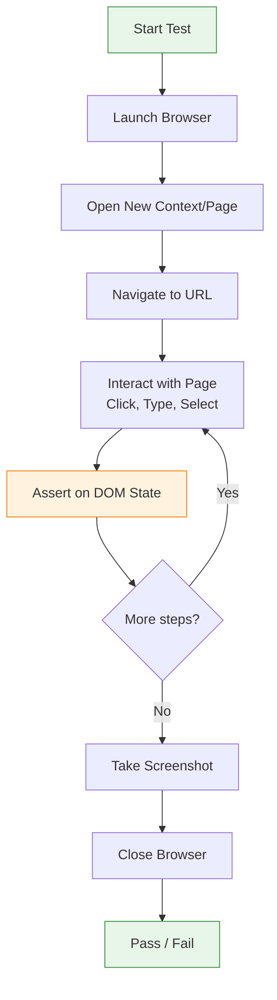

# E2E Testing with Playwright

## What Is End-to-End Testing?

E2E testing runs automated browser tests against a fully deployed application. It validates that the entire system works from the user's perspective: UI, network, database, and third-party integrations.

## E2E Test Flow



## Playwright vs Cypress vs Puppeteer

| Feature | Playwright | Cypress | Puppeteer |
|---------|-----------|---------|-----------|
| Browser support | Chromium, Firefox, WebKit | Chromium only | Chromium only |
| Language | JS/TS, Python, Java, .NET | JS/TS | JS/TS |
| Architecture | Out-of-process | In-process (same loop) | Out-of-process |
| Network control | Full (mock, route, abort) | Full (stub, spy) | Limited |
| Auto-waiting | Built-in | Built-in | Manual |
| Multi-page/window | Native | Limited | Complex |
| Iframe support | Full | Limited | Full |
| Mobile emulation | Yes | Yes | Yes |
| Trace viewer | Yes | Dashboard | No |
| Component testing | Experimental | Yes | No |
| Parallel execution | Built-in | Dashboard required | Manual |
| CI integration | Excellent | Good | Good |

## Playwright Setup

```bash
# Install
npm init playwright@latest
# or add to existing project
npm install @playwright/test
npx playwright install
```

```ts
// playwright.config.ts
import { defineConfig, devices } from '@playwright/test';

export default defineConfig({
  testDir: './e2e',
  fullyParallel: true,
  forbidOnly: !!process.env.CI,
  retries: process.env.CI ? 2 : 0,
  workers: process.env.CI ? 4 : undefined,
  reporter: [['html'], ['list']],
  use: {
    baseURL: 'http://localhost:3000',
    trace: 'on-first-retry',
    screenshot: 'only-on-failure',
    video: 'retain-on-failure',
  },
  projects: [
    {
      name: 'chromium',
      use: { ...devices['Desktop Chrome'] },
    },
    {
      name: 'firefox',
      use: { ...devices['Desktop Firefox'] },
    },
    {
      name: 'mobile-safari',
      use: { ...devices['iPhone 13'] },
    },
  ],
  webServer: {
    command: 'npm run dev',
    url: 'http://localhost:3000',
    reuseExistingServer: !process.env.CI,
    timeout: 120000,
  },
});
```

## Browser Contexts and Pages

```ts
import { test } from '@playwright/test';

test('multi-tab shopping flow', async ({ browser }) => {
  // Create isolated contexts (like separate browser sessions)
  const adminContext = await browser.newContext({
    storageState: 'auth/admin.json',
  });
  const userContext = await browser.newContext();

  const adminPage = await adminContext.newPage();
  const userPage = await userContext.newPage();

  await adminPage.goto('/admin/products');
  await userPage.goto('/shop');

  // Contexts don't share cookies/localStorage
});
```

## Locators

Playwright locators auto-wait for elements to be actionable.

```ts
// By text
await page.getByText('Submit').click();
await page.getByRole('button', { name: 'Submit' }).click();
await page.getByLabel('Email').fill('test@test.com');
await page.getByPlaceholder('Enter your name').fill('Alice');
await page.getByTestId('user-profile').isVisible();

// By CSS selector (last resort)
await page.locator('.user-card:first-child').click();

// Chaining
await page
  .locator('.product-list')
  .getByRole('listitem')
  .filter({ hasText: 'Laptop' })
  .getByRole('button')
  .click();

// Assertions
await expect(page.getByText('Success')).toBeVisible();
await expect(page.getByRole('alert')).toHaveText('Error occurred');
await expect(page.locator('input[name="email"]')).toHaveValue('test@test.com');

// List assertions
await expect(page.getByRole('listitem')).toHaveCount(5);
await expect(page.locator('tr')).not.toHaveCount(0);
```

## Assertions

```ts
import { expect } from '@playwright/test';

// Visibility
await expect(page.getByText('Welcome')).toBeVisible();
await expect(modal).toBeHidden();

// Text & values
await expect(header).toHaveText('Dashboard');
await expect(input).toHaveValue('Alice');
await expect(message).toContainText('error');

// Attributes
await expect(button).toBeEnabled();
await expect(button).toBeDisabled();
await expect(checkbox).toBeChecked();

// Count & presence
await expect(listItems).toHaveCount(3);
await expect(page.getByTestId('loading')).not.toBeVisible();

// URL & navigation
await expect(page).toHaveURL('/dashboard');
await expect(page).toHaveTitle('My App');

// Screenshot comparison
await expect(page).toHaveScreenshot('homepage.png');
```

## Network Mocking

```ts
test('handles API failure gracefully', async ({ page }) => {
  // Block a route entirely
  await page.route('**/api/analytics', (route) => route.abort());

  // Mock API response
  await page.route('**/api/users/**', async (route) => {
    await route.fulfill({
      status: 200,
      contentType: 'application/json',
      body: JSON.stringify({ id: '1', name: 'Mock User' }),
    });
  });

  // Modify response (intercept)
  await page.route('**/api/products', async (route) => {
    const response = await route.fetch();
    const json = await response.json();
    json.forEach((p: any) => (p.price *= 2)); // double prices
    await route.fulfill({ response, json });
  });

  await page.goto('/products');
  await expect(page.getByText('Mock User')).toBeVisible();
});
```

## Screenshot Testing

```ts
test('visual regression: homepage', async ({ page }) => {
  await page.goto('/');

  // Full page
  await expect(page).toHaveScreenshot('full-homepage.png');

  // Specific element
  await expect(page.locator('.hero-section'))
    .toHaveScreenshot('hero.png');

  // With mask (hide dynamic content)
  await expect(page).toHaveScreenshot({
    mask: [page.locator('.clock'), page.locator('[data-testid="random"]')],
  });
});

// Update snapshots: npx playwright test --update-snapshots
```

## Trace Viewer

```ts
// Enabled in config: trace: 'on-first-retry'
// Manual capture:
test('debug with trace', async ({ page, context }) => {
  await context.tracing.start({ screenshots: true, snapshots: true });

  await page.goto('/checkout');
  await page.getByText('Buy Now').click();

  await context.tracing.stop({ path: 'trace-checkout.zip' });
});
```

```bash
# View trace
npx playwright show-trace trace-checkout.zip
```

## CI Integration

```yaml
# .github/workflows/e2e.yml
name: E2E Tests
on: [deployment_status]
jobs:
  e2e:
    if: github.event_name == 'deployment_status' && github.event.deployment_status.state == 'success'
    timeout-minutes: 30
    runs-on: ubuntu-latest
    steps:
      - uses: actions/checkout@v4
      - uses: actions/setup-node@v4
        with:
          node-version: 20

      - name: Install dependencies
        run: npm ci

      - name: Install Playwright browsers
        run: npx playwright install --with-deps

      - name: Run E2E tests
        run: npx playwright test
        env:
          BASE_URL: ${{ github.event.deployment_status.environment_url }}

      - name: Upload report
        if: always()
        uses: actions/upload-artifact@v4
        with:
          name: playwright-report
          path: playwright-report/
```

## Real-World Scenario: E-Commerce Checkout

```ts
test('complete purchase flow', async ({ page }) => {
  await page.goto('/');

  // Search product
  await page.getByPlaceholder('Search...').fill('wireless headphones');
  await page.getByRole('button', { name: 'Search' }).click();

  // Select product
  await page.getByText('Sony WH-1000XM5').click();
  await page.getByText('Add to Cart').click();

  // Verify cart
  await expect(page.getByTestId('cart-count')).toHaveText('1');

  // Checkout
  await page.getByText('Checkout').click();
  await page.getByLabel('Email').fill('customer@test.com');
  await page.getByLabel('Address').fill('123 Main St, Portland, OR');
  await page.getByText('Continue to Payment').click();

  // Payment
  await page.frameLocator('iframe').getByLabel('Card number').fill('4242424242424242');
  await page.frameLocator('iframe').getByLabel('Expiry').fill('12/28');
  await page.frameLocator('iframe').getByLabel('CVC').fill('123');
  await page.getByText('Pay Now').click();

  // Confirmation
  await expect(page.getByText('Order Confirmed!')).toBeVisible();
  await expect(page.getByTestId('order-number')).toBeVisible();

  // Screenshot
  await expect(page).toHaveScreenshot('order-confirmation.png');
});
```

## Best Practices

1. **Use data-testid attributes** — Stable selectors that don't change with styling
2. **Test critical paths only** — Login, checkout, search — not every edge case
3. **Keep tests independent** — Each test sets up its own state
4. **Use webServer config** — Let Playwright manage the dev server
5. **Run with CI parallelism** — Shard tests across workers
6. **Retry flaky tests** — Set retries: 2 in CI
7. **Record traces on failure** — Debug with trace viewer
8. **Mock third-party services** — Don't depend on external APIs in CI
9. **Review screenshots regularly** — Delete and re-record when UI intentionally changes
10. **Set timeouts wisely** — 30s default, increase for slow operations

## Summary

| Concept | API | Use |
|---------|-----|-----|
| Page navigation | `page.goto(url)` | Open URLs |
| Locators | `page.getByRole`, `getByText` | Find elements |
| Actions | `.click()`, `.fill()`, `.selectOption()` | Simulate user input |
| Assertions | `expect(locator).toBeVisible()` | Validate state |
| Network | `page.route()` | Mock/modify requests |
| Screenshots | `expect(page).toHaveScreenshot()` | Visual regression |
| Trace | `context.tracing` | Debug failures |
