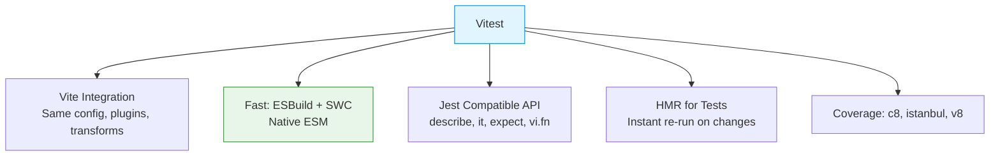

# Vitest

## What is Vitest?

Vitest is a Vite-native test runner built for speed. It uses the same Vite transform pipeline as your app, enabling instant hot-reload during testing and native ESM support.

## Key Features



## Setup

```bash
npm install -D vitest @vitest/ui @testing-library/react @testing-library/jest-dom jsdom
```

```ts
// vitest.config.ts
import { defineConfig } from 'vitest/config';

export default defineConfig({
  test: {
    environment: 'jsdom',
    globals: true,
    setupFiles: ['./src/test/setup.ts'],
    coverage: {
      provider: 'v8',
      reporter: ['text', 'json', 'html'],
      thresholds: { statements: 80, branches: 75, functions: 80, lines: 80 },
    },
  },
});
```

```ts
// src/test/setup.ts
import '@testing-library/jest-dom';
```

## Jest Compatibility — API Comparison

Most Jest APIs work identically but use `vi.` prefix.

| Jest | Vitest |
|------|--------|
| `jest.fn()` | `vi.fn()` |
| `jest.spyOn()` | `vi.spyOn()` |
| `jest.mock()` | `vi.mock()` (auto-hoisted) |
| `jest.clearAllMocks()` | `vi.clearAllMocks()` |
| `jest.useFakeTimers()` | `vi.useFakeTimers()` |
| `jest.advanceTimersByTime()` | `vi.advanceTimersByTime()` |
| `jest.requireActual()` | `vi.importActual()` (async) |

## Globals

```ts
// Enable globals: true in config
describe('Calculator', () => {
  beforeAll(() => {});
  beforeEach(() => {});
  afterEach(() => {});
  afterAll(() => {});

  it('adds numbers', () => {
    expect(add(2, 3)).toBe(5);
  });
});
```

Or import explicitly:

```ts
import { describe, it, expect, beforeEach, vi } from 'vitest';
```

## Matchers

```ts
// Same as Jest
expect(value).toBe(42);
expect(value).toEqual({ a: 1 });
expect(value).toBeNull();
expect(value).toBeUndefined();
expect(value).toBeTruthy();
expect(value).toBeFalsy();
expect(value).toBeGreaterThan(5);
expect(value).toBeCloseTo(3.14, 2);
expect(str).toMatch(/hello/);
expect(arr).toContain('item');
expect(arr).toHaveLength(3);
expect(obj).toHaveProperty('name');
expect(() => { throw Error('fail'); }).toThrow('fail');

// Type checking
expect(value).toEqual(expect.any(Number));
expect(value).toEqual(expect.objectContaining({ id: expect.any(String) }));

// jest-dom additions
import '@testing-library/jest-dom';
expect(element).toBeInTheDocument();
expect(element).toBeVisible();
expect(element).toHaveTextContent('Hello');
expect(element).toHaveClass('active');
```

## Mocks

### vi.fn()

```ts
const greet = vi.fn((name: string) => `Hello, ${name}!`);
greet('Alice');
expect(greet).toHaveBeenCalledWith('Alice');
expect(greet).toHaveBeenCalledTimes(1);

const mock = vi.fn()
  .mockReturnValueOnce('first')
  .mockReturnValue('default');
mock(); // 'first'
mock(); // 'default'

vi.fn().mockResolvedValue({ data: 'ok' });
vi.fn().mockRejectedValue(new Error('fail'));
```

### vi.spyOn()

```ts
const user = { getName: () => 'Alice' };
const spy = vi.spyOn(user, 'getName');
user.getName();
expect(spy).toHaveBeenCalled();
spy.mockRestore();
```

### vi.mock()

```ts
vi.mock('axios');
import axios from 'axios';

test('fetches data', async () => {
  (axios.get as Mock).mockResolvedValue({ data: [{ id: 1 }] });
  const result = await fetchData();
  expect(axios.get).toHaveBeenCalled();
});

// With factory
vi.mock('next/navigation', () => ({
  useRouter: () => ({ push: vi.fn() }),
  usePathname: () => '/dashboard',
}));
```

### vi.hoisted()

```ts
// Variables for vi.mock must use vi.hoisted()
const { mockedFn } = vi.hoisted(() => ({ mockedFn: vi.fn() }));
vi.mock('./service', () => ({ default: mockedFn }));
```

## Timers

```ts
vi.useFakeTimers();

test('advance timers', () => {
  const fn = vi.fn();
  setTimeout(fn, 1000);
  vi.advanceTimersByTime(1000);
  expect(fn).toHaveBeenCalled();
});

vi.useRealTimers();
```

## Snapshots

```ts
test('component snapshot', () => {
  const { container } = render(<UserCard user={{ name: 'Alice' }} />);
  expect(container).toMatchSnapshot();
});
```

```bash
npx vitest run --update  # Update snapshots
```

## Migration Guide: Jest → Vitest

### Step 1: Install

```bash
npm uninstall jest @types/jest ts-jest
npm install -D vitest @vitest/coverage-v8
```

### Step 2: Add vitest config

```ts
// vitest.config.ts
import { defineConfig } from 'vitest/config';
export default defineConfig({
  test: { globals: true, environment: 'jsdom', setupFiles: './src/test/setup.ts' },
});
```

### Step 3: Update imports

```ts
// Before: jest.mock('axios');
// After:
import { vi } from 'vitest';
vi.mock('axios');

// jest.requireActual → vi.importActual (async)
const fs = await vi.importActual('fs');
```

### Step 4: Update scripts

```json
{ "scripts": { "test": "vitest", "test:coverage": "vitest run --coverage" } }
```

### Why Migrate?

| Factor | Jest | Vitest |
|--------|------|--------|
| First run | ~8-15s | ~2-4s |
| Watch re-run | ~2-5s | <50ms (HMR) |
| ESM support | Partial | Native |
| Config | Separate | Single vite.config |
| TypeScript | ts-jest (slow) | ESBuild/SWC |

## Real-World: Migrating a Jest Test

```ts
// Before (Jest)
jest.mock('./api', () => ({
  fetchUser: jest.fn().mockResolvedValue({ name: 'Alice' }),
}));
```

```ts
// After (Vitest)
import { vi } from 'vitest';
vi.mock('./api', () => ({
  fetchUser: vi.fn().mockResolvedValue({ name: 'Alice' }),
}));
```

## Summary

| Concept | Vitest API |
|---------|-----------|
| Test runner | `vitest` / `vitest run` |
| UI dashboard | `vitest --ui` |
| Coverage | `vitest run --coverage` |
| Mock function | `vi.fn()` |
| Spy | `vi.spyOn()` |
| Module mock | `vi.mock()` (auto-hoisted) |
| Fake timers | `vi.useFakeTimers()` |
| Snapshot | `toMatchSnapshot()` |
