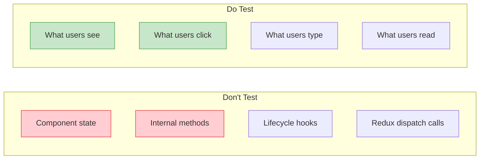

# React Testing Library

## Testing Philosophy

RTL encourages testing components the way users interact with them. Instead of testing implementation details, test behavior through the DOM.

> "The more your tests resemble the way your software is used, the more confidence they can give you." — Kent C. Dodds



## Setup

```bash
npm install -D @testing-library/react @testing-library/jest-dom @testing-library/user-event
```

```ts
// src/test/setup.ts
import '@testing-library/jest-dom';
```

## Render

```tsx
import { render, screen } from '@testing-library/react';
import { Greeting } from './Greeting';

test('renders greeting', () => {
  render(<Greeting name="Alice" />);
  expect(screen.getByText('Hello, Alice!')).toBeInTheDocument();
});

// With providers
function renderWithProviders(ui: React.ReactElement, { route = '/' } = {}) {
  return render(
    <ThemeProvider>
      <MemoryRouter initialEntries={[route]}>{ui}</MemoryRouter>
    </ThemeProvider>
  );
}
```

## Screen Queries

### Query Types

| Query | Returns | When to use |
|-------|---------|-------------|
| `getBy...` | Element or throws | Element must exist |
| `queryBy...` | Element or null | Element may not exist |
| `findBy...` | Promise (async) | Async rendering |
| `getAllBy...` | Array | Multiple matches |
| `findAllBy...` | Promise of array | Async multi elements |

### Query Methods (Priority Order)

```tsx
// 1. By role — PREFERRED (most accessible)
screen.getByRole('button', { name: /submit/i });
screen.getByRole('heading', { level: 2 });
screen.getByRole('textbox', { name: /email/i });
screen.getByRole('alert');
screen.getByRole('dialog');

// 2. By label text
screen.getByLabelText(/email/i);
screen.getByLabelText('Password');

// 3. By placeholder
screen.getByPlaceholderText('Enter your name');

// 4. By text content
screen.getByText('Welcome back!');

// 5. By display value
screen.getByDisplayValue('Alice');

// 6. By test-id (last resort)
screen.getByTestId('user-profile-card');
```

## fireEvent vs userEvent

| Feature | fireEvent | userEvent |
|---------|-----------|-----------|
| Clicks | `fireEvent.click(el)` | `user.click(el)` |
| Type | `fireEvent.change(el, { target: { value }})` | `user.type(el, text)` |
| Hover | `fireEvent.mouseEnter(el)` | `user.hover(el)` |
| Tab | Manual | `user.tab()` |
| Realistic? | Synthetic | Mimics actual browser |
| Async? | No | Yes (await) |

**Always prefer `userEvent`.**

```tsx
import { render, screen } from '@testing-library/react';
import userEvent from '@testing-library/user-event';

test('user types and clicks', async () => {
  const user = userEvent.setup();
  const onClick = vi.fn();
  render(<button onClick={onClick}>Click me</button>);

  await user.click(screen.getByText('Click me'));
  expect(onClick).toHaveBeenCalledTimes(1);
});

test('user tabs through form', async () => {
  const user = userEvent.setup();
  render(
    <form>
      <input aria-label="Name" />
      <input aria-label="Email" />
      <button type="submit">Submit</button>
    </form>
  );

  await user.tab();
  expect(screen.getByLabelText('Name')).toHaveFocus();

  await user.tab();
  expect(screen.getByLabelText('Email')).toHaveFocus();

  await user.tab();
  expect(screen.getByText('Submit')).toHaveFocus();
});
```

## Async Testing

```tsx
test('waits for async content', async () => {
  render(<UserProfile userId="42" />);

  expect(screen.getByText('Loading...')).toBeInTheDocument();
  const name = await screen.findByText('Alice');
  expect(name).toBeInTheDocument();
});

test('waits for disappearance', async () => {
  render(<Notification message="Saved" />);
  await waitForElementToBeRemoved(() => screen.queryByText('Saved'));
  expect(screen.queryByText('Saved')).not.toBeInTheDocument();
});

test('waits for custom condition', async () => {
  render(<Counter />);
  await userEvent.click(screen.getByText('Increment'));

  await waitFor(() => {
    expect(screen.getByTestId('count')).toHaveTextContent('1');
  });
});
```

## Testing Hooks with renderHook

```ts
// hooks/useCounter.ts
export function useCounter(initial = 0) {
  const [count, setCount] = useState(initial);
  const increment = () => setCount(c => c + 1);
  const decrement = () => setCount(c => c - 1);
  return { count, increment, decrement };
}
```

```ts
import { renderHook, act } from '@testing-library/react';
import { useCounter } from './useCounter';

test('increments count', () => {
  const { result } = renderHook(() => useCounter());

  act(() => { result.current.increment(); });

  expect(result.current.count).toBe(1);
});

test('accepts initial value', () => {
  const { result } = renderHook(() => useCounter(10));
  expect(result.current.count).toBe(10);
});
```

## Testing Context

```tsx
// context/ThemeContext.tsx
const ThemeContext = createContext({ theme: 'light' as const, toggle: () => {} });

export function ThemeProvider({ children }: { children: React.ReactNode }) {
  const [theme, setTheme] = useState<'light' | 'dark'>('light');
  return (
    <ThemeContext.Provider value={{
      theme,
      toggle: () => setTheme(t => t === 'light' ? 'dark' : 'light'),
    }}>
      {children}
    </ThemeContext.Provider>
  );
}
```

```tsx
// ThemeToggle.test.tsx
import { render, screen } from '@testing-library/react';
import userEvent from '@testing-library/user-event';
import { ThemeProvider } from '../context/ThemeContext';
import { ThemeToggle } from './ThemeToggle';

test('toggles theme', async () => {
  const user = userEvent.setup();
  render(<ThemeProvider><ThemeToggle /></ThemeProvider>);

  expect(screen.getByText('Current: light')).toBeInTheDocument();
  await user.click(screen.getByText('Current: light'));
  expect(screen.getByText('Current: dark')).toBeInTheDocument();
});
```

## Real-World Scenario: Testing a Todo App

```tsx
// TodoApp.tsx
export function TodoApp() {
  const [todos, setTodos] = useState<Array<{ id: number; text: string; done: boolean }>>([]);
  const [input, setInput] = useState('');

  return (
    <div>
      <h1>Todo App</h1>
      <input aria-label="New todo" value={input}
        onChange={(e) => setInput(e.target.value)}
        onKeyDown={(e) => e.key === 'Enter' && addTodo()} />
      <button onClick={() => {
        if (!input.trim()) return;
        setTodos([...todos, { id: Date.now(), text: input, done: false }]);
        setInput('');
      }}>Add</button>
      <ul>
        {todos.map(todo => (
          <li key={todo.id} onClick={() => setTodos(
            todos.map(t => t.id === todo.id ? { ...t, done: !t.done } : t)
          )} style={{ textDecoration: todo.done ? 'line-through' : 'none' }}>
            {todo.text}
          </li>
        ))}
      </ul>
    </div>
  );
}
```

```tsx
// TodoApp.test.tsx
describe('TodoApp', () => {
  test('adds a todo', async () => {
    const user = userEvent.setup();
    render(<TodoApp />);

    await user.type(screen.getByLabelText('New todo'), 'Buy groceries');
    await user.click(screen.getByText('Add'));

    expect(screen.getByText('Buy groceries')).toBeInTheDocument();
  });

  test('does not add empty todos', async () => {
    const user = userEvent.setup();
    render(<TodoApp />);
    await user.click(screen.getByText('Add'));
    expect(screen.queryAllByRole('listitem')).toHaveLength(0);
  });

  test('toggles todo completion', async () => {
    const user = userEvent.setup();
    render(<TodoApp />);
    await user.type(screen.getByLabelText('New todo'), 'Learn testing');
    await user.click(screen.getByText('Add'));

    const item = screen.getByText('Learn testing');
    expect(item).not.toHaveStyle('text-decoration: line-through');

    await user.click(item);
    expect(item).toHaveStyle('text-decoration: line-through');
  });

  test('adds via Enter key', async () => {
    const user = userEvent.setup();
    render(<TodoApp />);
    await user.type(screen.getByLabelText('New todo'), 'Use keyboard{Enter}');
    expect(screen.getByText('Use keyboard')).toBeInTheDocument();
  });
});
```

## Best Practices

1. **Query by accessibility** — Prefer `getByRole`, `getByLabelText`
2. **Use `userEvent` over `fireEvent`** — More realistic simulations
3. **Assert on visible state** — Not internal component state
4. **Use `findBy` for async** — Never use `waitFor` with `getBy`
5. **Test behavior, not implementation** — Don't test prop changes, test DOM changes
6. **Avoid `container` queries** — Use `screen` for better resilience
7. **Use `jest-dom` matchers** — `toBeInTheDocument()`, `toBeVisible()`

## Summary

| Concept | API | Purpose |
|---------|-----|---------|
| Render | `render(component)` | Mount component in DOM |
| Query | `screen.getByRole()`, `getByText()` | Find elements |
| Async | `screen.findByText()` | Wait for async render |
| User events | `userEvent.click()`, `.type()` | Simulate interactions |
| Hooks | `renderHook()` | Test hooks in isolation |
| Act | `act()` | Wrap state updates |
| Wait | `waitFor()`, `waitForElementToBeRemoved()` | Custom async waits |
