# Cypress

## What is Cypress?

Cypress is a developer-friendly E2E testing framework that runs in the browser alongside your application. It offers time-travel debugging, real-time reloads, and automatic waiting.

## Key Features

- **Time-travel debugging** — Hover commands to see DOM snapshots
- **Automatic waiting** — No explicit `wait()` or `sleep()` needed
- **Real-time reloads** — Tests re-run on file changes
- **Network stubbing** — Intercept, modify, assert on requests
- **Component testing** — Test components with the same API

## Setup

```bash
npm install cypress --save-dev
npx cypress open
```

```ts
// cypress.config.ts
import { defineConfig } from 'cypress';

export default defineConfig({
  e2e: {
    baseUrl: 'http://localhost:3000',
    specPattern: 'cypress/e2e/**/*.cy.ts',
    video: true,
    screenshotOnRunFailure: true,
    defaultCommandTimeout: 10000,
    viewportWidth: 1280,
    viewportHeight: 720,
  },
  component: {
    devServer: { framework: 'react', bundler: 'vite' },
    specPattern: 'src/**/*.cy.tsx',
  },
});
```

## E2E Testing Basics

```ts
describe('Login Flow', () => {
  beforeEach(() => { cy.visit('/login'); });

  it('shows login form', () => {
    cy.get('h1').should('contain', 'Sign In');
    cy.get('input[name="email"]').should('be.visible');
    cy.get('input[name="password"]').should('be.visible');
  });

  it('logs in with valid credentials', () => {
    cy.get('input[name="email"]').type('user@test.com');
    cy.get('input[name="password"]').type('password123');
    cy.get('button[type="submit"]').click();
    cy.url().should('include', '/dashboard');
    cy.get('[data-testid="welcome"]').should('contain', 'Welcome back');
  });

  it('shows error on invalid credentials', () => {
    cy.intercept('POST', '/api/login', {
      statusCode: 401, body: { message: 'Invalid credentials' },
    }).as('loginRequest');

    cy.get('input[name="email"]').type('wrong@test.com');
    cy.get('input[name="password"]').type('wrong');
    cy.get('button[type="submit"]').click();
    cy.wait('@loginRequest');
    cy.get('[role="alert"]').should('contain', 'Invalid credentials');
  });
});
```

## Commands & Chaining

```ts
cy.visit('/todos');
cy.get('.todo-list');               // Query
cy.contains('Buy milk');            // Find by text
cy.find('li');                      // Within previous subject
cy.first().click();
cy.type('New todo');
cy.clear();
cy.check();
cy.select('US');
cy.scrollTo('bottom');

// Assertions
cy.get('.todo-item')
  .should('have.length', 3)
  .and('contain', 'Buy milk');

cy.get('input').should('have.value', 'Alice');
cy.get('button').should('be.disabled');
cy.get('.alert').should('be.visible');
cy.get('.loading').should('not.exist');
```

## Queries

```ts
// By CSS
cy.get('.class-name');
cy.contains('Submit');
cy.contains('button', 'Submit');

// By test ID (preferred)
cy.get('[data-cy="submit-button"]');

// Within scope
cy.get('.modal').within(() => {
  cy.get('input').type('Hello');
  cy.contains('Save').click();
});

// Traversal
cy.get('li').parent();
cy.get('ul').children('li');
cy.get('li').first().last().eq(2).next().prev();
```

## Network Stubbing

```ts
describe('API Interception', () => {
  it('stubs GET response', () => {
    cy.intercept('GET', '/api/users', { fixture: 'users.json' }).as('getUsers');
    cy.visit('/users');
    cy.wait('@getUsers');
    cy.get('[data-cy="user"]').should('have.length', 3);
  });

  it('stubs POST and asserts request', () => {
    cy.intercept('POST', '/api/users', (req) => {
      expect(req.body).to.have.property('name', 'Alice');
      req.reply({ statusCode: 201, body: { id: 1, name: 'Alice' } });
    }).as('createUser');

    cy.get('input').type('Alice');
    cy.contains('Create').click();
    cy.wait('@createUser');
  });

  it('simulates network error', () => {
    cy.intercept('GET', '/api/dashboard', { forceNetworkError: true }).as('error');
    cy.visit('/dashboard');
    cy.contains('Failed to load').should('be.visible');
  });

  it('delays response to test loading', () => {
    cy.intercept('GET', '/api/slow', (req) => {
      req.reply((res) => { res.delay(3000); res.send({ data: 'done' }); });
    }).as('slow');

    cy.visit('/slow-page');
    cy.get('[data-cy="loading"]').should('be.visible');
    cy.wait('@slow');
    cy.get('[data-cy="loading"]').should('not.exist');
  });
});
```

## Component Testing

```tsx
// src/components/Counter.cy.tsx
import { Counter } from './Counter';

describe('Counter Component', () => {
  it('renders with initial count', () => {
    cy.mount(<Counter />);
    cy.get('[data-cy="count"]').should('have.text', '0');
  });

  it('increments on click', () => {
    cy.mount(<Counter />);
    cy.get('[data-cy="increment"]').click();
    cy.get('[data-cy="count"]').should('have.text', '1');
  });

  it('accepts initial value prop', () => {
    cy.mount(<Counter initial={10} />);
    cy.get('[data-cy="count"]').should('have.text', '10');
  });
});
```

## Custom Commands

```ts
// cypress/support/commands.ts
Cypress.Commands.add('login', (email: string, password: string) => {
  cy.visit('/login');
  cy.get('input[name="email"]').type(email);
  cy.get('input[name="password"]').type(password);
  cy.get('button[type="submit"]').click();
  cy.url().should('include', '/dashboard');
});

Cypress.Commands.add('createTodo', (text: string) => {
  cy.get('[data-cy="new-todo"]').type(text);
  cy.get('[data-cy="add-todo"]').click();
});

// TypeScript
declare global {
  namespace Cypress {
    interface Chainable {
      login(email: string, password: string): Chainable<void>;
      createTodo(text: string): Chainable<void>;
    }
  }
}
```

```ts
// Usage
describe('Dashboard', () => {
  beforeEach(() => { cy.login('admin@test.com', 'password'); });
  it('creates a todo', () => {
    cy.createTodo('Buy groceries');
    cy.get('[data-cy="todo-item"]').should('contain', 'Buy groceries');
  });
});
```

## Time-Travel Debugging

```mermaid
flowchart LR
    A["visit /login"] --> B["Snapshot: Login form"]
    B --> C[".type 'user@test.com'"]
    C --> D["Snapshot: Email filled"]
    D --> E[".click Login"]
    E --> F["Snapshot: Dashboard"]
    F --> G[".should contain Welcome"]
    G --> H["Snapshot: Assertion pass"]

    style A fill:#e3f2fd,stroke:#1976d2
    style E fill:#e3f2fd,stroke:#1976d2
    style H fill:#c8e6c9,stroke:#388e3c
```



In the Cypress runner, hover any command to see the DOM at that exact moment.

## Cypress vs Playwright

| Feature | Cypress | Playwright |
|---------|---------|-----------|
| Architecture | In-process (in browser) | Out-of-process (protocol) |
| Browser support | Chromium, FF (exp.) | Chromium, FF, WebKit |
| Multi-tab | Limited | Native |
| Iframes | Limited | Full |
| Network mocking | `cy.intercept()` | `page.route()` |
| Component testing | Built-in | Experimental |
| Custom commands | `Cypress.Commands.add()` | Fixtures + helpers |
| Time-travel | Yes (hover snapshots) | Trace viewer replay |
| Parallel execution | Dashboard (paid) | Built-in workers |
| Languages | JS/TS | JS/TS, Python, Java, .NET |
| Learning curve | Gentle | Moderate |

## Real-World: Multi-Step Form

```ts
describe('Registration Flow', () => {
  it('completes full registration', () => {
    cy.visit('/register');

    // Step 1: Account
    cy.get('input[name="email"]').type('new@test.com');
    cy.get('input[name="password"]').type('SecurePass123!');
    cy.get('input[name="confirm"]').type('SecurePass123!');
    cy.contains('Next').click();

    // Step 2: Profile
    cy.get('input[name="firstName"]').type('John');
    cy.get('input[name="lastName"]').type('Doe');
    cy.get('select[name="country"]').select('US');
    cy.contains('Next').click();

    // Step 3: Preferences
    cy.get('input[name="newsletter"]').check();
    cy.contains('Complete').click();

    // Success
    cy.url().should('include', '/welcome');
    cy.contains('Welcome, John!').should('be.visible');
  });

  it('navigates back and preserves data', () => {
    cy.get('input[name="email"]').type('user@test.com');
    cy.get('input[name="password"]').type('Test123!');
    cy.get('input[name="confirm"]').type('Test123!');
    cy.contains('Next').click();
    cy.contains('Back').click();
    cy.get('input[name="email"]').should('have.value', 'user@test.com');
  });
});
```

## Best Practices

1. **Use `data-cy` attributes** — Stable selectors
2. **Avoid `cy.wait(ms)`** — Use `cy.intercept()` and wait on aliases
3. **Test user flows, not implementation**
4. **Set baseUrl in config** — Avoid hardcoded URLs
5. **Use custom commands for auth** — Avoid repetitive login code
6. **Clean up test state** — Reset DB or use `cy.request()` for setup
7. **Keep tests independent** — Each test should pass in any order

## Summary

| Concept | API |
|---------|-----|
| Visit | `cy.visit(url)` |
| Query | `cy.get()`, `cy.contains()`, `cy.find()` |
| Action | `.click()`, `.type()`, `.check()`, `.select()` |
| Assert | `.should('be.visible')`, `.should('contain', text)` |
| Network | `cy.intercept()`, `cy.wait('@alias')` |
| Fixtures | `cy.fixture('data.json')` |
| Custom commands | `Cypress.Commands.add()` |
| Component test | `cy.mount(<Component />)` |
