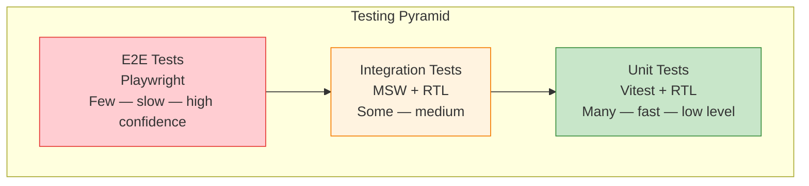

# Testing Projects

## Overview

Add comprehensive testing to all previous applications. This covers three testing levels with specific tools and coverage targets.



## Project Structure

```
src/
├── __tests__/
│   ├── unit/           # Pure function tests
│   ├── integration/    # Component + API tests
│   └── e2e/           # Playwright tests
├── mocks/
│   ├── handlers.ts     # MSW handlers
│   └── server.ts       # MSW server setup
└── test/
    ├── setup.ts        # Test environment setup
    └── utils.tsx       # Custom render helpers
```

## Coverage Targets

| Level | Statements | Branches | Functions | Lines |
|-------|-----------|----------|-----------|-------|
| **Unit** | ≥ 90% | ≥ 85% | ≥ 90% | ≥ 90% |
| **Integration** | ≥ 80% | ≥ 75% | ≥ 80% | ≥ 80% |
| **Overall** | ≥ 85% | ≥ 80% | ≥ 85% | ≥ 85% |

## Project 1: Todo App — Full Test Suite

### Setup

```bash
npm install -D vitest @vitest/coverage-v8 @testing-library/react @testing-library/jest-dom @testing-library/user-event msw @playwright/test
```

```ts
// vitest.config.ts
import { defineConfig } from 'vitest/config';

export default defineConfig({
  test: {
    environment: 'jsdom',
    globals: true,
    setupFiles: ['./src/test/setup.ts'],
    coverage: {
      provider: 'v8',
      reporter: ['text', 'html', 'lcov'],
      thresholds: { statements: 85, branches: 80, functions: 85, lines: 85 },
    },
  },
});
```

### Unit Tests (Vitest)

```ts
// src/__tests__/unit/todo.utils.test.ts
import { addTodo, toggleTodo, deleteTodo, filterTodos } from '../../utils/todo';

describe('addTodo', () => {
  it('adds a new todo', () => {
    const result = addTodo([], 'Buy milk');
    expect(result).toHaveLength(1);
    expect(result[0]).toMatchObject({ text: 'Buy milk', done: false });
    expect(result[0].id).toBeDefined();
  });

  it('does not add empty todos', () => {
    expect(addTodo([], '')).toHaveLength(0);
  });

  it('does not mutate original array', () => {
    const todos = [];
    addTodo(todos, 'Test');
    expect(todos).toHaveLength(0);
  });
});

describe('toggleTodo', () => {
  it('toggles done status', () => {
    const todos = [{ id: '1', text: 'Test', done: false }];
    expect(toggleTodo(todos, '1')[0].done).toBe(true);
  });

  it('does not mutate original', () => {
    const todos = [{ id: '1', text: 'Test', done: false }];
    toggleTodo(todos, '1');
    expect(todos[0].done).toBe(false);
  });
});

describe('filterTodos', () => {
  const todos = [
    { id: '1', text: 'A', done: false },
    { id: '2', text: 'B', done: true },
  ];

  it('returns all', () => expect(filterTodos(todos, 'all')).toHaveLength(2));
  it('returns active', () => expect(filterTodos(todos, 'active')).toHaveLength(1));
  it('returns completed', () => expect(filterTodos(todos, 'completed')).toHaveLength(1));
});
```

### Integration Tests (RTL + MSW)

```tsx
// src/__tests__/integration/TodoApp.test.tsx
import { render, screen, waitFor } from '@testing-library/react';
import userEvent from '@testing-library/user-event';
import { http, HttpResponse } from 'msw';
import { setupServer } from 'msw/node';
import { TodoApp } from '../../components/TodoApp';

const server = setupServer(
  http.get('/api/todos', () =>
    HttpResponse.json([{ id: '1', text: 'Learn testing', done: false }])
  ),
  http.post('/api/todos', async ({ request }) => {
    const body = await request.json();
    return HttpResponse.json({ id: '2', text: body.text, done: false }, { status: 201 });
  }),
);

beforeAll(() => server.listen());
afterEach(() => server.resetHandlers());
afterAll(() => server.close());

test('loads and displays todos', async () => {
  render(<TodoApp />);
  await waitFor(() => {
    expect(screen.getByText('Learn testing')).toBeInTheDocument();
  });
});

test('adds a new todo', async () => {
  const user = userEvent.setup();
  render(<TodoApp />);

  await user.type(screen.getByLabelText('New todo'), 'Write tests');
  await user.click(screen.getByText('Add'));

  await waitFor(() => {
    expect(screen.getByText('Write tests')).toBeInTheDocument();
  });
});

test('shows error when API fails', async () => {
  server.use(http.get('/api/todos', () => HttpResponse.error()));
  render(<TodoApp />);
  await waitFor(() => {
    expect(screen.getByText(/failed/i)).toBeInTheDocument();
  });
});
```

### E2E Tests (Playwright)

```ts
// e2e/todos.spec.ts
import { test, expect } from '@playwright/test';

test.describe('Todo App', () => {
  test.beforeEach(async ({ page }) => { await page.goto('/todos'); });

  test('displays existing todos', async ({ page }) => {
    await expect(page.getByText('Learn testing')).toBeVisible();
  });

  test('adds a new todo', async ({ page }) => {
    await page.getByLabel('New todo').fill('Buy groceries');
    await page.getByText('Add').click();
    await expect(page.getByText('Buy groceries')).toBeVisible();
  });

  test('toggles todo completion', async ({ page }) => {
    const todo = page.getByText('Learn testing');
    await todo.click();
    await expect(todo).toHaveCSS('text-decoration', /line-through/);
  });

  test('persists across reload', async ({ page }) => {
    await page.getByLabel('New todo').fill('Persistent');
    await page.getByText('Add').click();
    await page.reload();
    await expect(page.getByText('Persistent')).toBeVisible();
  });

  test('shows empty state', async ({ page }) => {
    await page.route('**/api/todos', route => route.fulfill({ status: 200, body: '[]' }));
    await page.goto('/todos');
    await expect(page.getByText('No todos yet')).toBeVisible();
  });
});
```

## Project 2: E-Commerce Checkout Tests

### Integration

```tsx
// src/__tests__/integration/checkout.test.tsx
import { render, screen, waitFor } from '@testing-library/react';
import userEvent from '@testing-library/user-event';
import { http, HttpResponse } from 'msw';
import { setupServer } from 'msw/node';
import { CheckoutPage } from '../../pages/CheckoutPage';

const server = setupServer(
  http.get('/api/products', () =>
    HttpResponse.json([{ id: 1, name: 'Laptop', price: 999 }])
  ),
  http.post('/api/orders', () =>
    HttpResponse.json({ id: 'ord_123', status: 'confirmed' }, { status: 201 })
  ),
);

beforeAll(() => server.listen());
afterEach(() => server.resetHandlers());
afterAll(() => server.close());

test('complete checkout flow', async () => {
  const user = userEvent.setup();
  render(<CheckoutPage />);

  await waitFor(() => expect(screen.getByText('Laptop')).toBeInTheDocument());
  await user.click(screen.getAllByText('Add to Cart')[0]);

  await user.click(screen.getByText('Checkout'));
  await user.type(screen.getByLabelText('Address'), '123 Main St');
  await user.type(screen.getByLabelText('City'), 'Portland');
  await user.click(screen.getByText('Continue'));
  await user.click(screen.getByText('Place Order'));

  await waitFor(() => {
    expect(screen.getByText('Order Confirmed!')).toBeInTheDocument();
  });
});
```

### E2E

```ts
// e2e/checkout.spec.ts
test('complete purchase', async ({ page }) => {
  await page.goto('/products');
  await page.getByText('Laptop').click();
  await page.getByText('Add to Cart').click();
  await page.getByText('Checkout').click();

  await page.getByLabel('Full Name').fill('Alice');
  await page.getByLabel('Address').fill('123 Main St');
  await page.getByLabel('City').fill('Portland');
  await page.getByLabel('ZIP').fill('97201');
  await page.getByText('Continue').click();
  await page.getByText('Place Order').click();

  await expect(page.getByText('Order Confirmed!')).toBeVisible();
});

test('empty cart shows message', async ({ page }) => {
  await page.goto('/cart');
  await expect(page.getByText('Your cart is empty')).toBeVisible();
});
```

## Project 3: Dashboard Hook Tests

```ts
// src/__tests__/unit/useDashboard.test.ts
import { renderHook, waitFor } from '@testing-library/react';
import { http, HttpResponse } from 'msw';
import { setupServer } from 'msw/node';
import { useDashboard } from '../../hooks/useDashboard';

const server = setupServer(
  http.get('/api/dashboard/stats', () =>
    HttpResponse.json({ users: 150, revenue: 50000, orders: 320 })
  ),
);

beforeAll(() => server.listen());
afterEach(() => server.resetHandlers());
afterAll(() => server.close());

test('loads dashboard stats', async () => {
  const { result } = renderHook(() => useDashboard());
  expect(result.current.loading).toBe(true);

  await waitFor(() => expect(result.current.loading).toBe(false));
  expect(result.current.stats).toEqual({ users: 150, revenue: 50000, orders: 320 });
});

test('handles API error', async () => {
  server.use(http.get('/api/dashboard/stats', () => HttpResponse.error()));
  const { result } = renderHook(() => useDashboard());

  await waitFor(() => expect(result.current.error).toBeDefined());
  expect(result.current.loading).toBe(false);
  expect(result.current.stats).toBeNull();
});
```

## Reporting & CI

```bash
# Generate coverage
npx vitest run --coverage
open coverage/index.html

# Playwright report
npx playwright test --reporter=html
npx playwright show-report
```

```yaml
name: Test Suite
on: [push, pull_request]
jobs:
  test:
    runs-on: ubuntu-latest
    steps:
      - uses: actions/checkout@v4
      - uses: actions/setup-node@v4
        with: { node-version: 20 }
      - run: npm ci
      - run: npx vitest run --coverage
      - run: npx playwright install --with-deps
      - run: npx playwright test
      - uses: actions/upload-artifact@v4
        if: always()
        with:
          name: playwright-report
          path: playwright-report/

## Summary

| Layer | Tool | Focus | Target |
|-------|------|-------|--------|
| Unit | Vitest | Pure functions, utilities | ≥ 90% |
| Component | Vitest + RTL | Rendering, user interactions | ≥ 80% |
| Integration | RTL + MSW | Component + API interactions | ≥ 80% |
| E2E | Playwright | Critical user flows | All pass |
| Coverage | c8 / istanbul | Overall metrics | ≥ 85% |
| CI | GitHub Actions | Automated execution | Per commit |
