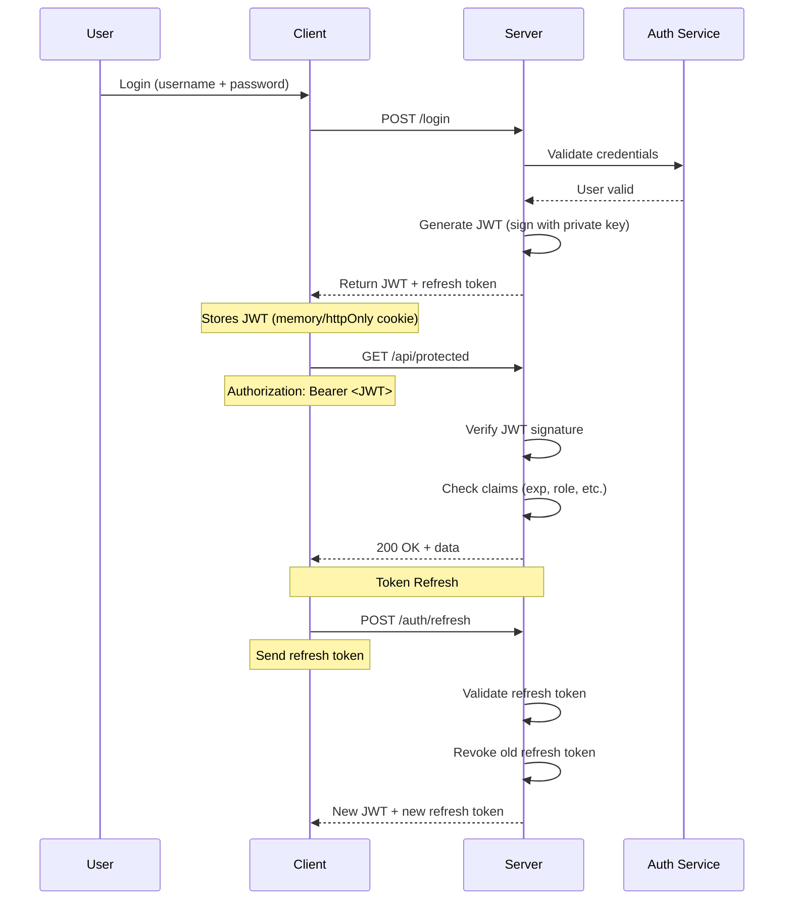
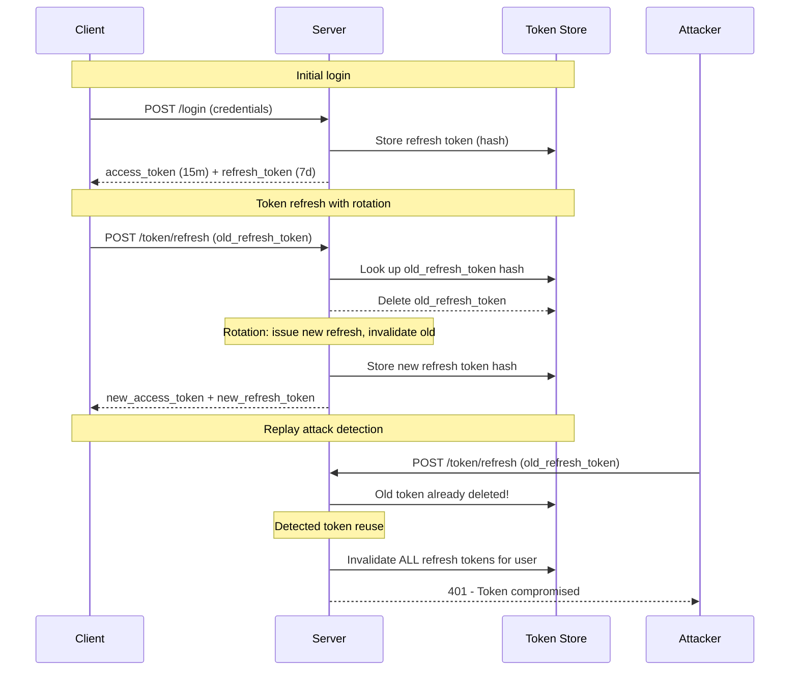
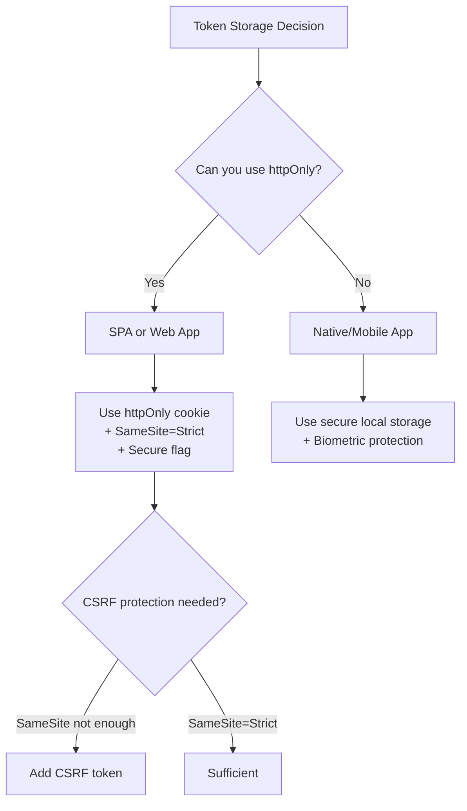

# JWT Security

JSON Web Tokens (JWT) are widely used for authentication and authorization in modern web applications. However, improper JWT implementation can lead to severe security vulnerabilities.

## JWT Structure

A JWT consists of three Base64URL-encoded parts separated by dots:

```
Header.Payload.Signature
```

```javascript
// Header: algorithm and token type
{
  "alg": "RS256",
  "typ": "JWT",
  "kid": "key-id-123"
}

// Payload: claims
{
  "sub": "user_123456",
  "name": "John Doe",
  "iat": 1516239022,
  "exp": 1516242622,
  "role": "admin",
  "iss": "https://auth.example.com"
}

// Signature: prevents tampering
// HS256: HMAC-SHA256(base64UrlEncode(header) + "." + base64UrlEncode(payload), secret)
// RS256: RSA-SHA256(base64UrlEncode(header) + "." + base64UrlEncode(payload), privateKey)
```

## JWT Flow (Mermaid)



## JWT Vulnerabilities

### 1. Algorithm Confusion: "none" Algorithm

The `none` algorithm tells the server to accept unsigned tokens:

```javascript
// Malformed JWT with alg: "none"
// Header: {"alg": "none", "typ": "JWT"}
// Payload: {"sub": "admin", "role": "admin", "exp": 9999999999}
// Signature: (empty)
// 
// Result: eyJhbGciOiAibm9uZSIsICJ0eXAiOiAiSldUIn0.eyJzdWIiOiJhZG1pbiIsInJvbGUiOiJhZG1pbiIsImV4cCI6OTk5OTk5OTk5OX0.

// Vulnerable verification
const jwt = require('jsonwebtoken');

// DANGEROUS: doesn't check algorithm
function verifyToken(token) {
  return jwt.verify(token, 'secret');  // Can accept "none" algorithm
}

// SECURE: restrict allowed algorithms
function verifyToken(token) {
  return jwt.verify(token, 'secret', { algorithms: ['HS256'] });
}
```

**Exploit:** Attacker sends `{"alg": "none"}` → server skips signature verification → attacker impersonates any user.

**Prevention:** Always specify allowed algorithms and reject `none`:

```javascript
// Good
jwt.verify(token, secret, { algorithms: ['HS256'] });

// Also good - explicit whitelist
const ALLOWED_ALGORITHMS = ['RS256', 'ES256'];
jwt.verify(token, publicKey, { algorithms: ALLOWED_ALGORITHMS });
```

### 2. Algorithm Confusion: RS256 → HS256

The most dangerous JWT attack. If the server uses RSA (RS256) but an attacker forces HS256 (HMAC with symmetric key):

```javascript
// Server's PUBLIC key is... public
const publicKey = `-----BEGIN PUBLIC KEY-----
MIIBIjANBgkqhkiG9w0BAQEFAAOCAQ8AMIIBCgKCAQEA...
-----END PUBLIC KEY-----`;

// Attacker crafts token using public key as HMAC secret
const forgedToken = jwt.sign(
  { sub: 'admin', role: 'admin' },
  publicKey,  // Public key is used as HMAC secret!
  { algorithm: 'HS256' }
);

// If server doesn't verify algorithm:
jwt.verify(forgedToken, publicKey);  // VERIFIED! Because HS256 uses publicKey as secret
```

**Prevention:**

```javascript
// Always specify algorithms
jwt.verify(token, publicKey, { algorithms: ['RS256'] });

// In Express.js middleware
function authMiddleware(req, res, next) {
  const token = extractToken(req);
  try {
    const decoded = jwt.verify(token, PUBLIC_KEY, {
      algorithms: ['RS256'],
      issuer: 'https://auth.example.com',
      audience: 'https://api.example.com'
    });
    req.user = decoded;
    next();
  } catch (err) {
    res.status(401).json({ error: 'Invalid token' });
  }
}
```

### 3. Weak HMAC Secret

```javascript
// DANGEROUS: weak secret
const secret = 'password123';
const token = jwt.sign({ sub: 'user_1' }, secret, { algorithm: 'HS256' });

// DANGEROUS: hardcoded secret in source code
const JWT_SECRET = 'supersecret1234'; // Will be exposed if code leaks

// SECURE: strong random secret from environment
const crypto = require('crypto');
const JWT_SECRET = process.env.JWT_SECRET || crypto.randomBytes(64).toString('hex');

// Even better: use RS256/ES256 with key rotation
```

### 4. Token Storage: localStorage vs Cookies

```javascript
// DANGEROUS: store in localStorage
localStorage.setItem('token', jwt);
localStorage.setItem('refreshToken', refreshJwt);

// Accessible by any JavaScript on the same origin
const stolen = localStorage.getItem('token'); // XSS can steal this

// SECURE: httpOnly cookie
// Server sets:
Set-Cookie: access_token=<JWT>; HttpOnly; Secure; SameSite=Strict; Path=/; Max-Age=900
Set-Cookie: refresh_token=<JWT>; HttpOnly; Secure; SameSite=Strict; Path=/api/auth

// Client-side JS CANNOT access these cookies
console.log(document.cookie); // No HttpOnly cookies shown
```

| Storage Method | XSS Protection | CSRF Protection | Persistence | Use Case |
|---------------|---------------|-----------------|-------------|----------|
| localStorage | ❌ (JS readable) | ✅ | ✅ (until cleared) | Mobile apps |
| sessionStorage | ❌ (JS readable) | ✅ | ❌ (tab close) | Less common |
| httpOnly cookie | ✅ | ❌ (need SameSite) | ✅ | Web apps |
| In-memory | ✅ | ✅ | ❌ (page refresh) | SPA with refresh |

### 5. Short Expiration

```javascript
// DANGEROUS: infinite lifetime
const token = jwt.sign(
  { sub: user.id },
  secret,
  { expiresIn: '9999 years' }  // NEVER expires
);

// BAD: too long
const token = jwt.sign(
  { sub: user.id },
  secret,
  { expiresIn: '30d' }  // 30 days is too long for access token
);

// GOOD: short-lived access + refresh
const accessToken = jwt.sign(
  { sub: user.id, role: user.role },
  secret,
  { expiresIn: '15m' }  // 15 minutes for access token
);

const refreshToken = jwt.sign(
  { sub: user.id, type: 'refresh' },
  refreshSecret,
  { expiresIn: '7d' }  // 7 days for refresh token
);
```

### 6. Refresh Token Rotation



```javascript
// Refresh token rotation implementation
async function refreshTokens(req, res) {
  const { refreshToken } = req.body;
  
  // Verify the refresh token
  let payload;
  try {
    payload = jwt.verify(refreshToken, REFRESH_SECRET);
  } catch (err) {
    return res.status(401).json({ error: 'Invalid refresh token' });
  }
  
  const tokenHash = crypto.createHash('sha256').update(refreshToken).digest('hex');
  
  // Check if token exists in database
  const storedToken = await db.refreshTokens.findUnique({
    where: { tokenHash }
  });
  
  if (!storedToken) {
    // Token reuse detected! Possibly stolen
    await db.refreshTokens.deleteMany({
      where: { userId: payload.sub }
    });
    return res.status(401).json({ error: 'Token compromised' });
  }
  
  // Delete old token (rotation)
  await db.refreshTokens.delete({ where: { id: storedToken.id } });
  
  // Issue new tokens
  const newAccessToken = generateAccessToken(payload.sub);
  const newRefreshToken = generateRefreshToken(payload.sub);
  
  // Store new refresh token
  const newTokenHash = crypto.createHash('sha256')
    .update(newRefreshToken)
    .digest('hex');
  await db.refreshTokens.create({
    data: {
      tokenHash: newTokenHash,
      userId: payload.sub,
      expiresAt: new Date(Date.now() + 7 * 24 * 60 * 60 * 1000)
    }
  });
  
  res.json({ accessToken: newAccessToken, refreshToken: newRefreshToken });
}
```

### 7. Blacklisting / Token Invalidation

JWT is stateless by nature. To invalidate tokens before expiry, use a blacklist:

```javascript
// Logout - add to blacklist
async function logout(req, res) {
  const token = extractToken(req);
  const payload = jwt.decode(token);
  
  const tokenHash = crypto.createHash('sha256').update(token).digest('hex');
  
  // Add to blacklist with expiration matching token expiry
  await redis.setEx(
    `blacklist:${tokenHash}`,
    payload.exp - Math.floor(Date.now() / 1000),
    '1'
  );
  
  res.json({ message: 'Logged out' });
}

// Middleware checks blacklist
async function authMiddleware(req, res, next) {
  const token = extractToken(req);
  
  const tokenHash = crypto.createHash('sha256').update(token).digest('hex');
  const isBlacklisted = await redis.exists(`blacklist:${tokenHash}`);
  
  if (isBlacklisted) {
    return res.status(401).json({ error: 'Token revoked' });
  }
  
  // Continue with normal JWT verification
  try {
    req.user = jwt.verify(token, PUBLIC_KEY, { algorithms: ['RS256'] });
    next();
  } catch (err) {
    res.status(401).json({ error: 'Invalid token' });
  }
}
```

## JWT Best Practices Checklist

| Practice | Implementation |
|----------|---------------|
| Always specify algorithms | `{ algorithms: ['RS256'] }` |
| Use asymmetric signing (RS256/ES256) | Prevents alg confusion from HS attacks |
| Store tokens in httpOnly cookies | Prevents XSS from stealing tokens |
| Short-lived access tokens | 5-15 minutes |
| Refresh token rotation | Invalidate old token on each refresh |
| Reuse detection | Invalidate all tokens if reuse detected |
| Validate all claims | Check `iss`, `aud`, `exp`, `nbf`, `sub` |
| Use `sub` claim for user identifier | Never use sensitive data (email, SSN) |
| Keep payload minimal | Avoid storing sensitive data in JWT |
| Rotate signing keys periodically | Implement key rotation strategy |
| Use `kid` for key identification | Enables key rotation without downtime |
| Set `jti` (JWT ID) for unique identification | Enables per-token revocation |

## Key Rotation

```javascript
// Key rotation strategy
const KEY_STORE = {
  'key-2026-01': 'current-private-key',
  'key-2025-06': 'previous-private-key',
};

function signToken(payload) {
  const currentKeyId = 'key-2026-01';
  const privateKey = KEY_STORE[currentKeyId];
  
  return jwt.sign(payload, privateKey, {
    algorithm: 'RS256',
    keyid: currentKeyId,
    expiresIn: '15m'
  });
}

function verifyToken(token) {
  const decoded = jwt.decode(token, { complete: true });
  const keyId = decoded.header.kid;
  const publicKey = getPublicKey(keyId); // Fetch from keystore
  return jwt.verify(token, publicKey, { algorithms: ['RS256'] });
}
```

## Token Storage Decision Matrix



## Real-World JWT Exploits

### Example 1: Auth0 alg:none (2016)
Researchers discovered that Auth0's Node.js JWT library accepted `alg: "none"` by default. Attackers could:
- Craft arbitrary JWTs with `alg: "none"`
- Impersonate any user without knowing the signing key
- **Fix:** Libraries updated to reject `none` by default
- **Lesson:** Always specify algorithms explicitly

### Example 2: Microsoft Azure AD (2019)
Azure AD had an RS256→HS256 algorithm confusion vulnerability:
- Microsoft's public key was exposed in OpenID Connect metadata
- Attackers could create HS256-signed tokens using the public key as secret
- Could impersonate any Azure AD user
- **Fix:** Added algorithm validation on server side

### Example 3: Tesla API (2018)
Tesla's API used JWT for vehicle control:
- Tokens stored in localStorage with no HttpOnly
- XSS vulnerability in a third-party component
- Attackers stole tokens to unlock and start vehicles remotely
- **Fix:** Moved tokens to httpOnly cookies, added CSP

## Resources
- [JWT.io - JWT Debugger](https://jwt.io/)
- [Auth0 - JWT Handbook](https://auth0.com/resources/ebooks/jwt-handbook)
- [OWASP - JWT Cheat Sheet](https://cheatsheetseries.owasp.org/cheatsheets/JSON_Web_Token_for_Java_Cheat_Sheet.html)
- [RFC 7519 - JSON Web Token](https://tools.ietf.org/html/rfc7519)
- [JWT Best Practices (RFC 8725)](https://tools.ietf.org/html/rfc8725)
