# Secure Cookies

Cookies are the primary mechanism for maintaining sessions and storing authentication data in web applications. Misconfigured cookies are a leading cause of session hijacking and CSRF attacks.

## Cookie Attributes

```
Set-Cookie: <name>=<value>; Attribute1; Attribute2; ...
```

### The Complete Cookie Flow

```mermaid
sequenceDiagram
    participant User
    participant Browser
    participant Server
    participant Attacker

    Server->>Browser: Set-Cookie: session=abc; Secure; HttpOnly; SameSite=Strict
    Browser->>Browser: Stores cookie with security attributes
    
    Note over Browser,Server: Same-site request (Strict)
    Browser->>Server: GET /dashboard
    Note over Browser: Cookie: session=abc (sent because same-site)
    Server-->>Browser: 200 OK

    Note over Browser,Attacker: Cross-site request (Lax)
    Attacker->>User: Clicks link to https://bank.com/transfer
    User->>Browser: Navigates to bank.com (top-level GET navigation)
    Browser->>Server: GET /transfer
    Note over Browser: Cookie: session=abc (sent because top-level GET with Lax)
    Server-->>Browser: Executes transfer
    Note over Browser,Attacker: Cross-site request (Strict)
    Attacker->>Browser: 
    Browser->>Server: GET /api/transfer
    Note over Browser: Cookie: NOT sent (cross-site, not top-level navigation)
    Server-->>Browser: 403 - Not authenticated
```

### Secure Attribute

The `Secure` flag ensures cookie is only sent over HTTPS:

```http
Set-Cookie: session=abc123; Secure
```

```javascript
// Express.js
res.cookie('session', token, {
  secure: true,        // HTTPS only
  httpOnly: true,
  sameSite: 'strict'
});

// Without Secure on HTTP:
// Cookie will be rejected by browser (Secure only)
// Modern browsers also deprecate non-secure cookies
```

**Effect:**
```
http://example.com  -> Cookie NOT sent (HTTP)
https://example.com -> Cookie sent (HTTPS)
```

**Warning:** Never set `Secure` on localhost development without explicit HTTPS configuration.

### HttpOnly Attribute

Prevents JavaScript from accessing the cookie:

```javascript
// Server sets HttpOnly cookie
Set-Cookie: session=abc123; HttpOnly; Secure; SameSite=Strict

// Client-side JS
console.log(document.cookie); // "" (empty - HttpOnly cookies excluded)
```

**Why it matters:**
- Mitigates XSS impact
- Malicious scripts cannot steal the session cookie
- Still vulnerable to CSRF (mitigated by SameSite)

**Exceptions (do NOT set HttpOnly):**
- When JS needs to read the cookie (e.g., CSRF token via double-submit pattern)
- Analytics/tracking cookies (HTTP-only cannot be read by JS analytics)

### SameSite Attribute

Controls whether cookies are sent with cross-origin requests:

| Value | Description | Top-level GET | Cross-origin POST | XHR/Fetch/Img |
|-------|-------------|:---:|:---:|:---:|
| `Strict` | Cookie sent only for same-site requests | ✅ | ❌ | ❌ |
| `Lax` | Cookie sent for same-site and top-level GET navigations | ✅ | ❌ | ❌ |
| `None` | Cookie sent for all requests (requires `Secure`) | ✅ | ✅ | ✅ |

```http
# Most secure default
Set-Cookie: session=abc123; SameSite=Strict; Secure; HttpOnly

# Good balance for most apps (default in Chrome)
Set-Cookie: session=abc123; SameSite=Lax; Secure; HttpOnly

# Cross-site scenarios (OAuth, embeds, payment gateways)
Set-Cookie: session=abc123; SameSite=None; Secure; HttpOnly
```

**SameSite Behavior Diagram:**

```mermaid
graph TD
    subgraph "User visits evil.com"
        A[evil.com] --> B[<img src='bank.com/transfer'>]
        A --> C[<form action='bank.com/transfer'>]
        A --> D[<a href='bank.com/transfer'>]
    end
    
    subgraph "Cookie Behavior"
        B --> E{SameSite?}
        C --> E
        D --> F{SameSite?}
        
        E -->|Strict| G[Cookie NOT sent]
        E -->|Lax| H[Cookie NOT sent]
        E -->|None| I[Cookie sent]
        
        F -->|Strict| J[Cookie NOT sent]
        F -->|Lax| K[Cookie sent]
        F -->|None| I
    end
```



### Max-Age vs Expires

```http
# Max-Age (seconds, preferred)
Set-Cookie: session=abc123; Max-Age=3600; Secure; HttpOnly

# Expires (specific date)
Set-Cookie: session=abc123; Expires=Wed, 21 Oct 2026 07:28:00 GMT

# Session cookie (no Max-Age or Expires) - deleted when browser closes
Set-Cookie: session=abc123; Secure; HttpOnly
```

**Recommendation:** Use `Max-Age` for new implementations. Set to appropriate session length (15-60 minutes for access tokens, 7-30 days for refresh tokens).

### Domain and Path Attributes

```http
# Restrict to specific domain
Set-Cookie: session=abc123; Domain=example.com; Path=/api

# Most restrictive (recommended)
Set-Cookie: session=abc123; Path=/; Secure; HttpOnly

# Without Domain attribute:
# Cookie is only sent to the origin that set it (no subdomains)
```

**Security rules:**
- Never set `Domain` to a parent domain you don't control
- `Domain` should not be set if not needed (cookie is host-only)
- Use `Path` to restrict cookie scope

```javascript
// SECURE: host-only cookie
res.cookie('session', token, {
  httpOnly: true,
  secure: true,
  sameSite: 'strict',
  path: '/api'
});

// INSECURE: broad scope
res.cookie('session', token, {
  domain: '.example.com',  // All subdomains can access!
  path: '/'                // All paths can access!
});
```

## Cookie Prefixes

Cookie prefixes provide additional security guarantees that browsers enforce:

### `__Host-` Prefix

Strongest protection. Cookie must:
1. Have `Secure` flag
2. Have `Path=/`
3. NOT have `Domain` attribute

```http
# Valid
Set-Cookie: __Host-session=abc123; Secure; Path=/

# Invalid (missing Secure)
Set-Cookie: __Host-session=abc123; Path=/

# Invalid (has Domain)
Set-Cookie: __Host-session=abc123; Secure; Path=/; Domain=example.com

# Invalid (Path not /)
Set-Cookie: __Host-session=abc123; Secure; Path=/api
```

### `__Secure-` Prefix

Medium protection. Cookie must:
1. Have `Secure` flag

```http
# Valid
Set-Cookie: __Secure-token=abc123; Secure

# Invalid (missing Secure)
Set-Cookie: __Secure-token=abc123
```

### Prefix Usage Example

```javascript
// Recommended: use __Host- for session cookies
res.cookie('__Host-session', token, {
  secure: true,
  httpOnly: true,
  sameSite: 'strict',
  path: '/'
});

// __Secure- for other security-sensitive cookies
res.cookie('__Secure-csrf', csrfToken, {
  secure: true,
  httpOnly: false,  // JS needs to read for double-submit
  sameSite: 'strict',
  path: '/'
});
```

## Cookie Size Limits

| Limit | Value |
|-------|-------|
| Maximum per cookie | 4096 bytes (4KB) |
| Maximum per domain | 50 cookies |
| Maximum total | 3000 cookies (browser-wide) |
| Maximum per request | 4096 bytes (including all cookies) |

**Implications:**
- JWT tokens > 4KB will be rejected
- Store minimal data in cookies (just a session ID or session token)
- Don't store user profiles, permissions, or large objects in cookies

```javascript
// BAD: storing user data in cookie
const userData = {
  id: '123', name: 'John', email: 'john@example.com',
  permissions: ['read', 'write', 'admin', 'delete', 'manage_users', ...],
  preferences: { theme: 'dark', locale: 'en', ... }
};
// ~2KB already, will grow with permissions/preferences

// GOOD: store only session token
const sessionToken = await createSession(user.id);
res.cookie('__Host-session', sessionToken, { ... });
// ~200 bytes, always fits
```

## Cookie Encryption

Cookies should be encrypted if they contain sensitive data:

```javascript
// Cookie encryption/decryption with Node.js
const crypto = require('crypto');

const ALGORITHM = 'aes-256-gcm';
const KEY = Buffer.from(process.env.COOKIE_ENCRYPTION_KEY, 'hex'); // 32 bytes

function encryptCookie(value) {
  const iv = crypto.randomBytes(16);
  const cipher = crypto.createCipheriv(ALGORITHM, KEY, iv);
  
  let encrypted = cipher.update(value, 'utf8', 'hex');
  encrypted += cipher.final('hex');
  const authTag = cipher.getAuthTag().toString('hex');
  
  // Store: iv:encrypted:authTag
  return `${iv.toString('hex')}:${encrypted}:${authTag}`;
}

function decryptCookie(encryptedValue) {
  const [ivHex, encryptedHex, authTagHex] = encryptedValue.split(':');
  
  const decipher = crypto.createDecipheriv(
    ALGORITHM,
    KEY,
    Buffer.from(ivHex, 'hex')
  );
  decipher.setAuthTag(Buffer.from(authTagHex, 'hex'));
  
  let decrypted = decipher.update(encryptedHex, 'hex', 'utf8');
  decrypted += decipher.final('utf8');
  return decrypted;
}

// Usage
const token = encryptCookie(JSON.stringify({ userId: 123, role: 'admin' }));
res.cookie('session', token, {
  httpOnly: true,
  secure: true,
  sameSite: 'strict',
  path: '/'
});
```

**Note:** Encryption adds overhead and complexity. Prefer storing a session ID in the cookie and keeping sensitive data server-side.

## Secure Cookie Configuration Quick Reference

```javascript
// Production-grade cookie settings
const cookieConfig = {
  // Authentication session cookie
  session: {
    name: '__Host-session',
    value: sessionId,
    options: {
      secure: true,
      httpOnly: true,
      sameSite: 'strict',
      path: '/',
      maxAge: 15 * 60 * 1000 // 15 minutes
    }
  },
  
  // Refresh token (separate path for security)
  refreshToken: {
    name: '__Host-refresh',
    value: refreshToken,
    options: {
      secure: true,
      httpOnly: true,
      sameSite: 'strict',
      path: '/api/auth/refresh', // Only sent to refresh endpoint
      maxAge: 7 * 24 * 60 * 60 * 1000 // 7 days
    }
  },
  
  // CSRF token (readable by JS for double-submit pattern)
  csrfToken: {
    name: '__Secure-csrf',
    value: csrfToken,
    options: {
      secure: true,
      httpOnly: false, // JS must read this
      sameSite: 'strict',
      path: '/',
      maxAge: 24 * 60 * 60 * 1000 // 24 hours
    }
  }
};
```

## Cookie Security Checklist

- [ ] Always set `Secure` flag on production cookies
- [ ] Set `HttpOnly` for all session/authentication cookies
- [ ] Use `SameSite=Strict` or `SameSite=Lax` (avoid `None` unless necessary)
- [ ] Use `__Host-` prefix for session cookies
- [ ] Keep cookies under 4KB
- [ ] Set shortest reasonable `Max-Age`
- [ ] Specify `Path` to restrict cookie scope
- [ ] Do not set `Domain` unless subdomain sharing is required
- [ ] Encrypt sensitive cookie values
- [ ] Validate and sanitize cookie values before use
- [ ] Rotate session tokens after login/logout
- [ ] Monitor for cookie-related security events

## Resources
- [MDN: Set-Cookie](https://developer.mozilla.org/en-US/docs/Web/HTTP/Headers/Set-Cookie)
- [SameSite Cookies Explained](https://web.dev/samesite-cookies-explained/)
- [Cookie Prefixes (RFC 6265bis)](https://datatracker.ietf.org/doc/html/draft-ietf-httpbis-rfc6265bis)
- [OWASP: Session Management](https://cheatsheetseries.owasp.org/cheatsheets/Session_Management_Cheat_Sheet.html)
