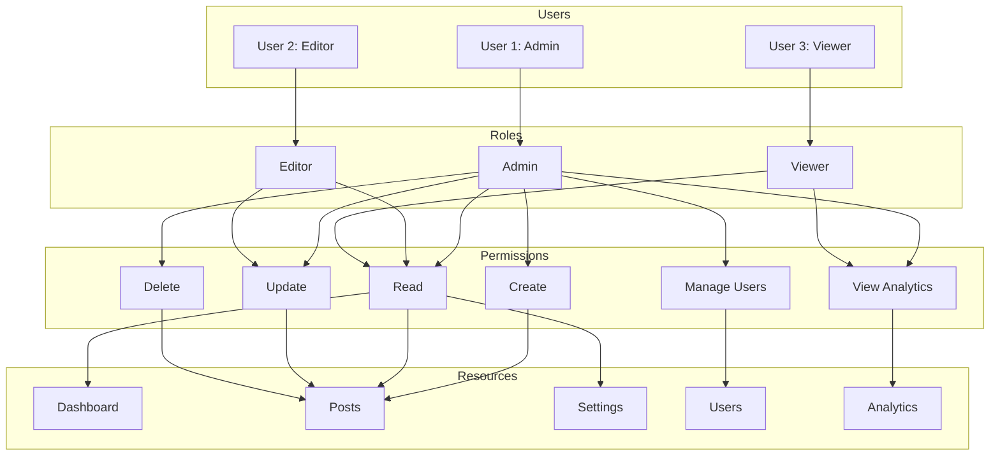

# Role-Based Access Control (RBAC) in Frontend

Role-Based Access Control (RBAC) restricts system access to authorized users based on their roles. In frontend applications, RBAC ensures users only see and interact with UI elements they're permitted to.

## RBAC Architecture



### Role Hierarchy

```
Admin ──> Editor ──> Viewer
  │          │          │
  ├─ Create  ├─ Read    ├─ Read (limited)
  ├─ Read    ├─ Update  └─ View Analytics
  ├─ Update  └─ Delete (own)
  ├─ Delete
  ├─ Manage Users
  └─ View Analytics
```

## Implementation

### 1. Define Roles and Permissions

```javascript
// src/config/permissions.js

// Define all permissions in the system
const Permissions = {
  POST_CREATE: 'post:create',
  POST_READ: 'post:read',
  POST_UPDATE: 'post:update',
  POST_DELETE: 'post:delete',
  POST_DELETE_ANY: 'post:delete:any',
  USER_MANAGE: 'user:manage',
  ANALYTICS_VIEW: 'analytics:view',
  SETTINGS_MANAGE: 'settings:manage',
} as const;

// Define role-permission mappings
const ROLE_PERMISSIONS = {
  admin: [
    Permissions.POST_CREATE,
    Permissions.POST_READ,
    Permissions.POST_UPDATE,
    Permissions.POST_DELETE,
    Permissions.POST_DELETE_ANY,
    Permissions.USER_MANAGE,
    Permissions.ANALYTICS_VIEW,
    Permissions.SETTINGS_MANAGE,
  ],
  editor: [
    Permissions.POST_CREATE,
    Permissions.POST_READ,
    Permissions.POST_UPDATE,
    Permissions.POST_DELETE, // Own posts only
    Permissions.ANALYTICS_VIEW,
  ],
  viewer: [
    Permissions.POST_READ,
    Permissions.ANALYTICS_VIEW,
  ],
};

export { Permissions, ROLE_PERMISSIONS };
```

### 2. Auth Context with Role

```javascript
// src/contexts/AuthContext.jsx
import { createContext, useContext, useState, useEffect } from 'react';

const AuthContext = createContext(null);

export function AuthProvider({ children }) {
  const [user, setUser] = useState(null);
  const [loading, setLoading] = useState(true);

  useEffect(() => {
    // Fetch user profile with role on mount
    fetchUser().then(data => {
      setUser(data);
      setLoading(false);
    }).catch(() => setLoading(false));
  }, []);

  const hasPermission = (permission) => {
    if (!user) return false;
    const permissions = ROLE_PERMISSIONS[user.role];
    return permissions?.includes(permission);
  };

  const hasRole = (role) => {
    const hierarchy = ['viewer', 'editor', 'admin'];
    const userLevel = hierarchy.indexOf(user?.role);
    const requiredLevel = hierarchy.indexOf(role);
    return userLevel >= requiredLevel;
  };

  return (
    <AuthContext.Provider value={{ user, loading, hasPermission, hasRole }}>
      {children}
    </AuthContext.Provider>
  );
}

export const useAuth = () => useContext(AuthContext);
```

### 3. Route Protection

```javascript
// src/components/ProtectedRoute.jsx
import { Navigate, useLocation } from 'react-router-dom';
import { useAuth } from '../contexts/AuthContext';

function ProtectedRoute({ children, permission, role }) {
  const { user, hasPermission, hasRole, loading } = useAuth();
  const location = useLocation();

  if (loading) return <LoadingSpinner />;

  if (!user) {
    return <Navigate to="/login" state={{ from: location }} replace />;
  }

  if (permission && !hasPermission(permission)) {
    return <Navigate to="/unauthorized" replace />;
  }

  if (role && !hasRole(role)) {
    return <Navigate to="/unauthorized" replace />;
  }

  return children;
}
```

```javascript
// src/App.jsx
import { Routes, Route } from 'react-router-dom';
import { Permissions } from './config/permissions';
import ProtectedRoute from './components/ProtectedRoute';

function App() {
  return (
    <Routes>
      <Route path="/" element={<PublicLayout />}>
        <Route index element={<Home />} />
        <Route path="login" element={<Login />} />
        <Route path="unauthorized" element={<Unauthorized />} />
      </Route>

      <Route path="/dashboard" element={<ProtectedLayout />}>
        <Route index element={
          <ProtectedRoute>
            <Dashboard />
          </ProtectedRoute>
        } />
        
        <Route path="posts/new" element={
          <ProtectedRoute permission="post:create">
            <CreatePost />
          </ProtectedRoute>
        } />
        
        <Route path="posts/:id/edit" element={
          <ProtectedRoute permission="post:update">
            <EditPost />
          </ProtectedRoute>
        } />
        
        <Route path="users" element={
          <ProtectedRoute permission="user:manage">
            <UserManagement />
          </ProtectedRoute>
        } />
        
        <Route path="analytics" element={
          <ProtectedRoute permission="analytics:view">
            <Analytics />
          </ProtectedRoute>
        } />
      </Route>
    </Routes>
  );
}
```

### 4. Component-Level Permissions

```javascript
// src/components/PermissionGate.jsx
function PermissionGate({ children, permission, role, fallback = null }) {
  const { hasPermission, hasRole } = useAuth();

  if (permission && !hasPermission(permission)) return fallback;
  if (role && !hasRole(role)) return fallback;

  return children;
}
```

```jsx
// Example usage
function PostCard({ post, onEdit, onDelete }) {
  const { user } = useAuth();

  return (
    <div className="post-card">
      <h3>{post.title}</h3>
      <p>{post.body}</p>
      
      <div className="actions">
        <PermissionGate permission="post:update">
          <button onClick={() => onEdit(post)}>Edit</button>
        </PermissionGate>
        
        <PermissionGate
          permission="post:delete:any"
          fallback={
            // Can only delete own posts
            user.id === post.authorId && (
              <button onClick={() => onDelete(post)}>Delete</button>
            )
          }
        >
          {/* Has delete:any - can delete any post */}
          <button onClick={() => onDelete(post)}>Delete</button>
        </PermissionGate>
      </div>
    </div>
  );
}
```

### 5. API Integration

```javascript
// src/api/client.js
import { useAuth } from '../contexts/AuthContext';

// Axios interceptor for permission-based request handling
api.interceptors.response.use(
  response => response,
  error => {
    if (error.response?.status === 403) {
      // Log unauthorized access
      console.error('Permission denied:', {
        url: error.config.url,
        method: error.config.method,
        user: getCurrentUser()
      });
      // Redirect to unauthorized page
      window.location.href = '/unauthorized';
    }
    return Promise.reject(error);
  }
);

// API service with permission checks
const postService = {
  async create(data) {
    // Server enforces permission, returns 403 if insufficient
    return api.post('/api/posts', data);
  },
  
  async update(id, data) {
    return api.put(`/api/posts/${id}`, data);
  },
  
  async delete(id) {
    return api.delete(`/api/posts/${id}`);
  },
  
  async getPosts(filters) {
    return api.get('/api/posts', { params: filters });
  }
};
```

### 6. UI Adaptation

```jsx
// Navigation adapted by role
function Sidebar() {
  const { hasPermission, hasRole } = useAuth();

  const menuItems = [
    { icon: DashboardIcon, label: 'Dashboard', path: '/dashboard' },
    { icon: PostsIcon, label: 'Posts', path: '/dashboard/posts' },
    { icon: AnalyticsIcon, label: 'Analytics', path: '/dashboard/analytics',
      show: () => hasPermission('analytics:view') },
    { icon: UsersIcon, label: 'Users', path: '/dashboard/users',
      show: () => hasPermission('user:manage') },
    { icon: SettingsIcon, label: 'Settings', path: '/dashboard/settings',
      show: () => hasRole('admin') },
  ];

  return (
    <nav className="sidebar">
      {menuItems.filter(item => !item.show || item.show()).map(item => (
        <NavLink key={item.path} to={item.path}>
          <item.icon />
          <span>{item.label}</span>
        </NavLink>
      ))}
    </nav>
  );
}
```

### 7. Server-Side Validation (Critical!)

Frontend RBAC is UX-only. **Never trust it for security.** Always validate on the server:

```javascript
// Server-side middleware (Node.js/Express)
function requirePermission(permission) {
  return async (req, res, next) => {
    const userRoles = await getUserRoles(req.user.id);
    const hasPermission = await checkPermission(userRoles, permission);
    
    if (!hasPermission) {
      return res.status(403).json({
        error: 'Forbidden',
        message: `Required permission: ${permission}`
      });
    }
    next();
  };
}

app.post('/api/posts', 
  requirePermission('post:create'),
  createPostHandler
);

app.delete('/api/posts/:id',
  requirePermission('post:delete'),
  deletePostHandler
);
```

## Complete RBAC Implementation Example

```javascript
// src/hooks/usePermissions.js
import { useAuth } from '../contexts/AuthContext';

export function usePermissions() {
  const { user } = useAuth();
  
  const can = useCallback((action, resource) => {
    const permission = `${resource}:${action}`;
    return ROLE_PERMISSIONS[user?.role]?.includes(permission) ?? false;
  }, [user]);

  const canAccessRoute = useCallback((route) => {
    const routePermissions = ROUTE_PERMISSIONS[route];
    if (!routePermissions) return true;
    return routePermissions.some(p => can(...p.split(':')));
  }, [can]);

  return {
    can,
    canAccessRoute,
    role: user?.role,
    isAdmin: user?.role === 'admin',
    isEditor: user?.role === 'editor',
    isViewer: user?.role === 'viewer',
  };
}

// Route permission configuration
const ROUTE_PERMISSIONS = {
  'dashboard': [],
  'dashboard/posts': ['post:read'],
  'dashboard/posts/new': ['post:create'],
  'dashboard/posts/:id/edit': ['post:update'],
  'dashboard/users': ['user:manage'],
  'dashboard/analytics': ['analytics:view'],
  'dashboard/settings': ['settings:manage'],
};
```

## Permission-Based Rendering Patterns

### Pattern 1: Conditional Rendering
```jsx
{hasPermission('post:create') && <CreatePostButton />}
```

### Pattern 2: Component Wrapping
```jsx
<PermissionGate permission="post:edit">
  <EditButton post={post} />
</PermissionGate>
```

### Pattern 3: Array Filtering
```jsx
posts.filter(post => canSeePost(post)).map(post => <PostCard key={post.id} post={post} />)
```

### Pattern 4: Higher-Order Component
```jsx
const AdminPanel = withPermission('user:manage')(AdminPanelComponent);
```

### Pattern 5: Hooks-based
```jsx
const { can } = usePermissions();
const canEdit = can('update', post);
```

## Real-World RBAC Example: Admin Dashboard

```
Admin Dashboard
├── Home (read)
├── Content
│   ├── All Posts (read)
│   ├── Create Post (create)
│   ├── Edit Post (update)
│   └── Delete Post (delete:any / delete:own)
├── Media (read, create, delete)
├── Users (manage) ───── Admin only
├── Settings (manage) ── Admin only
└── Analytics (view) ── Admin, Editor
```

```jsx
function AdminDashboard() {
  return (
    <div className="admin-dashboard">
      <Sidebar />
      <main>
        <Routes>
          <Route path="/" element={<DashboardHome />} />
          
          <Route path="/posts" element={<PostList />} />
          <Route path="/posts/new" element={
            <ProtectedRoute permission="post:create">
              <CreatePost />
            </ProtectedRoute>
          } />
          <Route path="/posts/:id/edit" element={
            <ProtectedRoute permission="post:update">
              <EditPost />
            </ProtectedRoute>
          } />
          
          <Route path="/users" element={
            <ProtectedRoute permission="user:manage">
              <UserManagement />
            </ProtectedRoute>
          } />
          
          <Route path="/settings" element={
            <ProtectedRoute role="admin">
              <Settings />
            </ProtectedRoute>
          } />
        </Routes>
      </main>
    </div>
  );
}
```

## RBAC Best Practices

- **Defense in depth:** Frontend RBAC is UI convenience, not security
- **Server enforcement:** Always validate permissions server-side
- **Least privilege:** Grant minimum permissions needed
- **Audit logging:** Log all access control decisions
- **Principle of fail-safe defaults:** Deny by default
- **Separation of duties:** Critical operations require multiple roles
- **Permission granularity:** Fine-grained permissions > coarse roles
- **Cache invalidation:** Clear permission cache on role changes
- **Testing:** Write tests for permission logic and edge cases

## Resources
- [NIST RBAC Model](https://csrc.nist.gov/projects/role-based-access-control)
- [OWASP Access Control](https://owasp.org/www-community/Access_Control)
- [React Router - Auth Example](https://reactrouter.com/en/main/start/tutorial#authentication)
