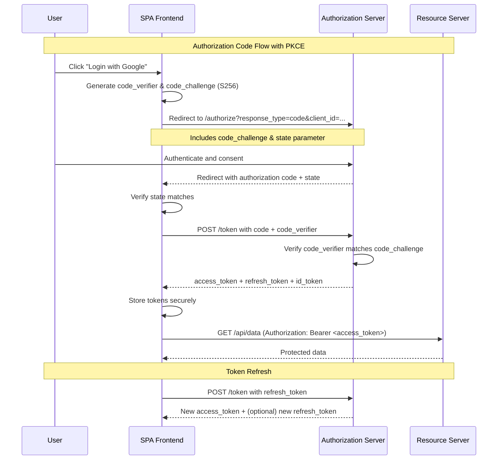
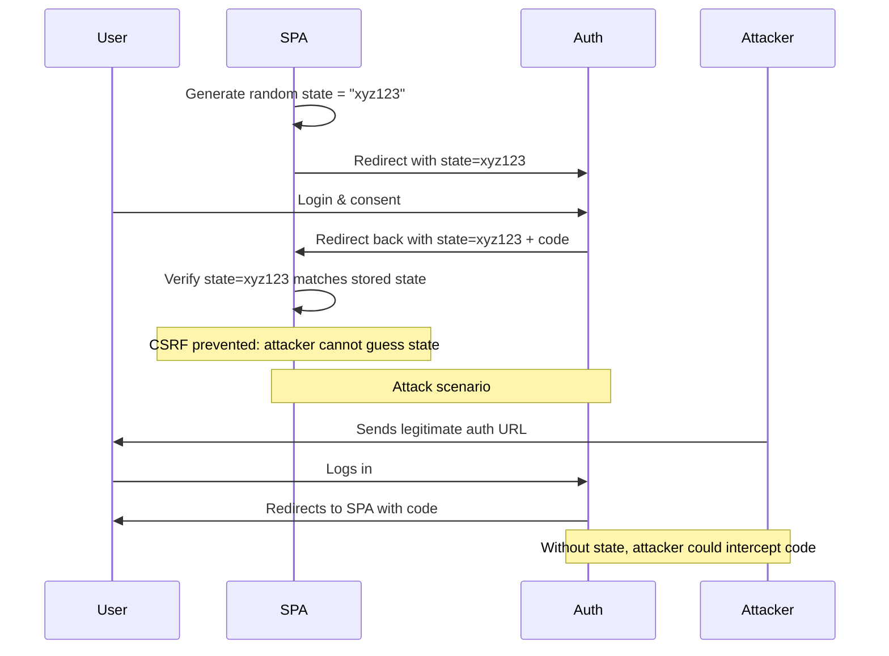
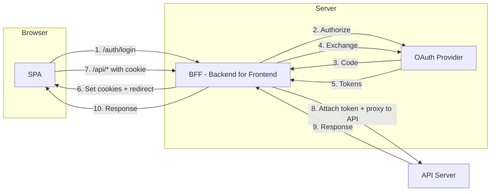
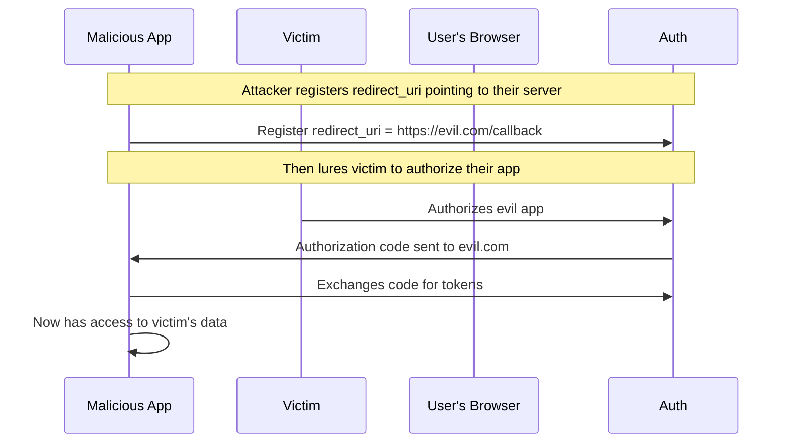

# OAuth 2.0 Security Best Practices

OAuth 2.0 is the industry-standard protocol for authorization. It enables applications to obtain limited access to user accounts on an HTTP service. Implementing OAuth securely requires understanding several critical components.

## OAuth 2.0 Flows



## PKCE (Proof Key for Code Exchange)

PKCE is mandatory for public clients (SPAs, mobile apps) to prevent authorization code interception.

```javascript
// Generate PKCE challenge pair
import { randomBytes, createHash } from 'crypto';

function generatePKCE() {
  // code_verifier: cryptographically random string (43-128 chars)
  const codeVerifier = base64URLEncode(randomBytes(32));
  
  // code_challenge: S256 hash of verifier
  const codeChallenge = base64URLEncode(
    createHash('sha256').update(codeVerifier).digest()
  );
  
  // For 'plain' method (not recommended):
  // codeChallenge = codeVerifier
  
  return { codeVerifier, codeChallenge, method: 'S256' };
}

function base64URLEncode(buffer) {
  return buffer
    .toString('base64')
    .replace(/=/g, '')
    .replace(/\+/g, '-')
    .replace(/\//g, '_');
}

// Store verifier temporarily (sessionStorage)
const pkce = generatePKCE();
sessionStorage.setItem('code_verifier', pkce.codeVerifier);

// Redirect to authorization server
const authUrl = new URL('https://auth.example.com/authorize');
authUrl.searchParams.set('response_type', 'code');
authUrl.searchParams.set('client_id', 'your-client-id');
authUrl.searchParams.set('redirect_uri', 'https://yourapp.com/callback');
authUrl.searchParams.set('code_challenge', pkce.codeChallenge);
authUrl.searchParams.set('code_challenge_method', pkce.method);
authUrl.searchParams.set('state', generateState());
authUrl.searchParams.set('scope', 'openid profile email');

window.location.href = authUrl.toString();
```

```javascript
// Handle callback - exchange code for tokens
async function handleCallback() {
  const urlParams = new URLSearchParams(window.location.search);
  const code = urlParams.get('code');
  const state = urlParams.get('state');
  
  // Validate state to prevent CSRF
  const storedState = sessionStorage.getItem('oauth_state');
  if (state !== storedState) {
    throw new Error('State mismatch - possible CSRF attack');
  }
  sessionStorage.removeItem('oauth_state');
  
  // Retrieve code_verifier
  const codeVerifier = sessionStorage.getItem('code_verifier');
  
  // Exchange code for tokens
  const tokenResponse = await fetch('https://auth.example.com/token', {
    method: 'POST',
    headers: { 'Content-Type': 'application/x-www-form-urlencoded' },
    body: new URLSearchParams({
      grant_type: 'authorization_code',
      code,
      redirect_uri: 'https://yourapp.com/callback',
      client_id: 'your-client-id',
      code_verifier: codeVerifier,
    })
  });
  
  const tokens = await tokenResponse.json();
  
  // Store tokens securely
  await secureTokenStorage(tokens);
  
  return tokens;
}
```

## State Parameter

The `state` parameter prevents CSRF attacks on the OAuth callback:

```javascript
// Generate and store state
function generateState() {
  const state = base64URLEncode(randomBytes(16));
  sessionStorage.setItem('oauth_state', state);
  return state;
}

// Validate state on callback
function validateState(returnedState) {
  const storedState = sessionStorage.getItem('oauth_state');
  sessionStorage.removeItem('oauth_state');
  
  if (!returnedState || returnedState !== storedState) {
    // Possible CSRF attack
    sendToSentry('OAuth state mismatch');
    throw new Error('Invalid state - possible CSRF attack');
  }
}
```

**State Flow Diagram:**



## Redirect URI Validation

Critical defense against authorization code interception:

```javascript
// Server-side redirect URI registration
const VALID_REDIRECT_URIS = [
  'https://yourapp.com/callback',
  'https://yourapp.com/auth/callback',
  'https://preview--1234.yourapp.com/callback', // Preview deployments
];

// Validate on authorization server
function validateRedirectUri(uri) {
  const parsed = new URL(uri);
  
  // Must use HTTPS
  if (parsed.protocol !== 'https:') {
    return false;
  }
  
  // Must match exactly one of the registered URIs
  return VALID_REDIRECT_URIS.includes(uri);
}

// Client-side: always use exact redirect URI
const REDIRECT_URI = 'https://yourapp.com/callback';

// NEVER use wildcard or pattern matching:
// BAD: matches any path on domain
// const redirectUri = 'https://yourapp.com/*';  

// BAD: open redirector
// const redirectUri = 'https://yourapp.com/redirect?to=' + userInput;
```

## Token Storage

```javascript
// INSECURE: localStorage
localStorage.setItem('access_token', token);
localStorage.setItem('refresh_token', refreshToken);
// Vulnerable to XSS - any script can steal tokens

// INSECURE: sessionStorage (slightly better but still XSS-able)
sessionStorage.setItem('access_token', token);

// SECURE: HttpOnly cookies (via BFF - Backend for Frontend)
// Server sets:
Set-Cookie: access_token=<token>; HttpOnly; Secure; SameSite=Strict; Path=/; Max-Age=900
Set-Cookie: refresh_token=<token>; HttpOnly; Secure; SameSite=Strict; Path=/api/auth; Max-Age=604800

// BFF pattern - proxy token exchange through backend
// Frontend never sees the tokens directly
```

**BFF (Backend for Frontend) Pattern for Token Storage:**



## Scope Minimization

Request only the minimum scopes needed:

```javascript
// BAD: requesting all scopes
const SCOPES = 'openid profile email user:read user:write admin:read admin:write';

// GOOD: request only what you need
const SCOPES = 'openid profile email'; // Just basic profile info

// Even more minimal
const SCOPES = 'openid email'; // Don't need profile if you only need email

// For specific functionality
const loginScopes = 'openid email'; // Login only
const uploadScopes = 'openid drive.file'; // Google Drive file upload only
```

```javascript
// Token scope validation
function validateTokenScopes(token, requiredScopes) {
  const decoded = jwt.decode(token);
  const tokenScopes = decoded.scope?.split(' ') || [];
  
  return requiredScopes.every(scope => tokenScopes.includes(scope));
}

// Check on the frontend before making API calls
async function callGoogleDriveAPI() {
  const token = getAccessToken();
  
  if (!validateTokenScopes(token, ['drive.file'])) {
    // Token doesn't have required scope, re-authenticate
    await reauthenticate({ scope: 'drive.file' });
  }
  
  return fetch('https://www.googleapis.com/drive/v3/files', {
    headers: { Authorization: `Bearer ${token}` }
  });
}
```

## Common OAuth Vulnerabilities

### 1. Authorization Code Interception



**Prevention:**
- Validate redirect_uri strictly (exact match, not prefix)
- Use PKCE so intercepted code is useless without verifier
- Register all valid redirect URIs explicitly

### 2. CSRF on Authorization Endpoint

An attacker initiates the OAuth flow, then tricks the victim into completing it:

```javascript
// Attacker's flow:
// 1. Attacker starts OAuth with their own state
// 2. Attacker sends link to victim: https://auth.example.com/authorize?...&state=attacker_state
// 3. Victim authenticates and authorizes
// 4. Authorization code is sent to attacker's registered redirect_uri
// 5. Attacker exchanges code for tokens

// Prevention: state parameter
// Without state, attacker can trick user into authorizing attacker's app
// With state, attacker's state won't match what's stored in victim's session
```

### 3. Token Leakage via Referer Header

```html
<!-- On https://yourapp.com/dashboard -->
<a href="https://external-link.com">Click me</a>

<!-- Browser sends Referer: https://yourapp.com/access_token#fragment -->
<!-- If token was in URL fragment, it might leak -->
```

**Prevention:**
- Never put tokens in URL
- Set `Referrer-Policy: no-referrer` for external links
- Use HTTP-only cookies instead of URL fragments

## OAuth 2.0 Best Practices Checklist

```javascript
const OAuthConfig = {
  // Required for all public clients
  pkce: {
    enabled: true,
    method: 'S256', // Never use 'plain'
  },
  
  // CSRF protection
  state: {
    enabled: true,
    length: 32, // bytes
    storage: 'sessionStorage',
  },
  
  // Redirect URI
  redirectUri: {
    exact: true,  // Exact match, not prefix
    https: true,  // HTTPS required
    wildcards: false, // Never allow wildcards
  },
  
  // Token storage
  tokens: {
    storage: 'httpOnly-cookie', // Never localStorage for production
    accessTokenExpiry: 900, // 15 minutes
    refreshTokenExpiry: 604800, // 7 days
    rotation: true, // Rotate refresh tokens
  },
  
  // Scopes
  scopes: {
    minimal: true, // Request minimum scopes
    incremental: true, // Request additional scopes as needed
  },
  
  // Client authentication
  clientSecret: {
    inPublicClient: false, // Never embed client_secret in SPA
    useDPoP: false, // Demonstrating Proof of Possession (advanced)
  }
};
```

## Full OAuth Integration Example

```javascript
// src/services/auth.js
class OAuthService {
  constructor(config) {
    this.config = config;
    this.pkceStore = new Map();
  }

  async login() {
    const { codeVerifier, codeChallenge } = this.generatePKCE();
    const state = this.generateState();
    
    this.pkceStore.set(state, { codeVerifier, codeChallenge });
    
    const params = new URLSearchParams({
      response_type: 'code',
      client_id: this.config.clientId,
      redirect_uri: this.config.redirectUri,
      code_challenge: codeChallenge,
      code_challenge_method: 'S256',
      state: state,
      scope: this.config.scopes.join(' '),
    });
    
    window.location.href = `${this.config.authUrl}?${params}`;
  }

  async handleCallback(url) {
    const params = new URLSearchParams(url.search);
    const code = params.get('code');
    const returnedState = params.get('state');
    
    if (!this.validateState(returnedState)) {
      throw new Error('State validation failed');
    }
    
    const pkceData = this.pkceStore.get(returnedState);
    this.pkceStore.delete(returnedState);
    
    if (!pkceData) {
      throw new Error('No PKCE data found for state');
    }
    
    const tokens = await this.exchangeCode(code, pkceData.codeVerifier);
    await this.storeTokens(tokens);
    
    return tokens;
  }

  async exchangeCode(code, codeVerifier) {
    const response = await fetch(this.config.tokenUrl, {
      method: 'POST',
      headers: {
        'Content-Type': 'application/x-www-form-urlencoded',
      },
      body: new URLSearchParams({
        grant_type: 'authorization_code',
        code,
        redirect_uri: this.config.redirectUri,
        client_id: this.config.clientId,
        code_verifier: codeVerifier,
      }),
    });
    
    if (!response.ok) {
      throw new Error(`Token exchange failed: ${response.status}`);
    }
    
    return response.json();
  }

  async refreshToken(refreshToken) {
    const response = await fetch(this.config.tokenUrl, {
      method: 'POST',
      headers: { 'Content-Type': 'application/x-www-form-urlencoded' },
      body: new URLSearchParams({
        grant_type: 'refresh_token',
        refresh_token: refreshToken,
        client_id: this.config.clientId,
      }),
    });
    
    if (!response.ok) {
      throw new Error('Token refresh failed');
    }
    
    const tokens = await response.json();
    await this.storeTokens(tokens);
    return tokens;
  }

  generateState() {
    const state = crypto.randomUUID();
    sessionStorage.setItem('oauth_state', state);
    return state;
  }

  validateState(returnedState) {
    const storedState = sessionStorage.getItem('oauth_state');
    sessionStorage.removeItem('oauth_state');
    return returnedState && returnedState === storedState;
  }

  generatePKCE() {
    const verifier = base64URLEncode(crypto.getRandomValues(new Uint8Array(32)));
    const challenge = base64URLEncode(
      crypto.subtle.digest('SHA-256', new TextEncoder().encode(verifier))
    );
    return { codeVerifier: verifier, codeChallenge: challenge };
  }

  async storeTokens(tokens) {
    // Use BFF pattern - send tokens to backend to set as httpOnly cookies
    await fetch('/api/auth/tokens', {
      method: 'POST',
      credentials: 'include',
      headers: { 'Content-Type': 'application/json' },
      body: JSON.stringify({
        accessToken: tokens.access_token,
        refreshToken: tokens.refresh_token,
        expiresIn: tokens.expires_in,
      }),
    });
  }
}
```

## Resources
- [OAuth 2.0 Security Best Current Practice (RFC 9700)](https://tools.ietf.org/html/rfc9700)
- [OAuth 2.0 for Browser-Based Apps (RFC 8252)](https://tools.ietf.org/html/rfc8252)
- [PKCE (RFC 7636)](https://tools.ietf.org/html/rfc7636)
- [OAuth Security Workshop](https://oauth.net/security/)
- [Auth0 - OAuth 2.0 Overview](https://auth0.com/docs/protocols/oauth2)
