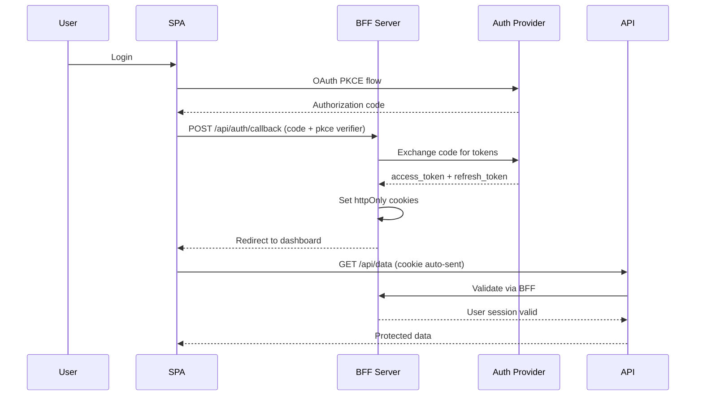

# Security Projects: Secure Admin Dashboard

Build a fully secure admin dashboard with authentication, role-based access control, XSS-safe content rendering, CSP headers, secure cookies, and CSRF protection.

## Project Overview

**Goal:** Create an admin dashboard that demonstrates frontend security best practices in a production-ready application.

**Tech Stack:**
- React (Vite) or Next.js
- Auth service (Auth0, Supabase, or custom)
- API server (Express.js or Next.js API routes)
- PostgreSQL or any database

## Project Requirements

### 1. Authentication System

- [ ] OAuth 2.0 with PKCE flow (Google, GitHub, or custom provider)
- [ ] State parameter validation on callback
- [ ] Token exchange via BFF pattern (httpOnly cookies)
- [ ] Short-lived access tokens (15 min) with refresh token rotation
- [ ] Session timeout after inactivity



### 2. Role-Based Access Control

**Roles and Permissions:**

| Role | Permissions |
|------|-------------|
| Admin | Create, Read, Update, Delete all resources + user management + settings |
| Editor | Create, Read, Update content + view analytics |
| Viewer | Read content only + view analytics |

- [ ] Define permissions as granular constants (`post:create`, `user:manage`, etc.)
- [ ] Route-level protection with `ProtectedRoute` component
- [ ] Component-level protection with `PermissionGate` component
- [ ] Conditional UI rendering based on role
- [ ] Server-side permission enforcement (never trust frontend)
- [ ] Permission caching with cache invalidation on role change

### 3. XSS-Safe Content Rendering

- [ ] Use React's built-in escaping (JSX) everywhere
- [ ] For rich text content, sanitize with DOMPurify before rendering
- [ ] Implement content security policy to block inline scripts
- [ ] Never use `dangerouslySetInnerHTML` without sanitization

```javascript
// Rich text component with sanitization
import DOMPurify from 'dompurify';

function RichContent({ html }) {
  const clean = DOMPurify.sanitize(html, {
    ALLOWED_TAGS: ['b', 'i', 'em', 'strong', 'a', 'p', 'br', 'ul', 'ol', 'li'],
    ALLOWED_ATTR: ['href', 'target', 'rel'],
    ALLOW_DATA_ATTR: false,
  });
  
  return <div dangerouslySetInnerHTML={{ __html: clean }} />;
}

// URL sanitization
function SafeLink({ href, children }) {
  const allowedProtocols = ['https:', 'http:', 'mailto:'];
  let safeHref = href;
  
  try {
    const url = new URL(href);
    if (!allowedProtocols.includes(url.protocol)) {
      safeHref = '#blocked';
    }
  } catch {
    safeHref = '#invalid';
  }
  
  return <a href={safeHref} rel="noopener noreferrer">{children}</a>;
}
```

### 4. CSP Headers

- [ ] Implement strict CSP with nonce-based inline scripts
- [ ] Use `Content-Security-Policy-Report-Only` during development
- [ ] CSP violation reporting endpoint
- [ ] Test with CSP Evaluator before production deployment

```javascript
// Next.js CSP via middleware
// middleware.js
export function middleware(req) {
  const nonce = crypto.randomBytes(16).toString('base64');
  
  const csp = [
    `default-src 'self'`,
    `script-src 'strict-dynamic' 'nonce-${nonce}' 'unsafe-inline' https:`,
    `style-src 'self' 'unsafe-inline'`,
    `img-src 'self' data: blob:`,
    `font-src 'self'`,
    `connect-src 'self' https://api.example.com wss://ws.example.com`,
    `object-src 'none'`,
    `base-uri 'none'`,
    `frame-ancestors 'none'`,
    `form-action 'self'`,
    `block-all-mixed-content`,
  ].join('; ');
  
  const response = NextResponse.next();
  response.headers.set('Content-Security-Policy', csp);
  response.headers.set('X-Nonce', nonce);
  
  return response;
}
```

### 5. Secure Cookies

- [ ] All cookies use `Secure`, `HttpOnly`, `SameSite=Strict`
- [ ] Use `__Host-` prefix for session cookies
- [ ] Separate cookies for access token and refresh token
- [ ] Refresh token restricted to `/api/auth` path only

```javascript
// Cookie configuration
const COOKIE_CONFIG = {
  accessToken: {
    name: '__Host-access-token',
    options: {
      httpOnly: true,
      secure: true,
      sameSite: 'strict',
      path: '/',
      maxAge: 15 * 60, // 15 minutes
    },
  },
  refreshToken: {
    name: '__Host-refresh-token',
    options: {
      httpOnly: true,
      secure: true,
      sameSite: 'strict',
      path: '/api/auth', // Only sent to auth endpoints
      maxAge: 7 * 24 * 60 * 60, // 7 days
    },
  },
  csrfToken: {
    name: '__Secure-csrf-token',
    options: {
      httpOnly: false, // JS needs to read for double-submit
      secure: true,
      sameSite: 'strict',
      path: '/',
      maxAge: 24 * 60 * 60,
    },
  },
};
```

### 6. CSRF Protection

- [ ] CSRF token implemented via double-submit cookie pattern
- [ ] All state-changing requests (POST, PUT, DELETE) require CSRF token
- [ ] CSRF token header validated server-side
- [ ] Custom `X-Requested-With` header for API requests

```javascript
// Axios interceptor for CSRF
import axios from 'axios';

const api = axios.create({
  baseURL: '/api',
  withCredentials: true,
  headers: {
    'X-Requested-With': 'XMLHttpRequest',
  },
});

api.interceptors.request.use(config => {
  const csrfToken = getCookie('__Secure-csrf-token');
  if (csrfToken) {
    config.headers['X-CSRF-Token'] = csrfToken;
  }
  return config;
});
```

## Application Structure

```
admin-dashboard/
├── src/
│   ├── components/
│   │   ├── auth/
│   │   │   ├── LoginButton.jsx
│   │   │   ├── ProtectedRoute.jsx
│   │   │   └── LogoutButton.jsx
│   │   ├── permissions/
│   │   │   ├── PermissionGate.jsx
│   │   │   └── RoleBadge.jsx
│   │   ├── security/
│   │   │   ├── RichContent.jsx
│   │   │   ├── SafeLink.jsx
│   │   │   └── SecureForm.jsx
│   │   └── layout/
│   │       ├── Sidebar.jsx
│   │       ├── Header.jsx
│   │       └── DashboardLayout.jsx
│   ├── contexts/
│   │   ├── AuthContext.jsx
│   │   └── ThemeContext.jsx
│   ├── hooks/
│   │   ├── usePermissions.js
│   │   ├── useAuth.js
│   │   └── useCsrf.js
│   ├── services/
│   │   ├── api.js
│   │   ├── auth.js
│   │   └── csrf.js
│   ├── config/
│   │   ├── permissions.js
│   │   ├── roles.js
│   │   └── cookies.js
│   ├── pages/
│   │   ├── Dashboard.jsx
│   │   ├── Posts.jsx
│   │   ├── Users.jsx
│   │   ├── Settings.jsx
│   │   ├── Analytics.jsx
│   │   ├── Login.jsx
│   │   └── Unauthorized.jsx
│   └── utils/
│       ├── sanitize.js
│       └── cookies.js
├── server/
│   ├── index.js
│   ├── middleware/
│   │   ├── auth.js
│   │   ├── csrf.js
│   │   ├── csp.js
│   │   └── permissions.js
│   ├── routes/
│   │   ├── auth.js
│   │   ├── posts.js
│   │   ├── users.js
│   │   └── analytics.js
│   └── services/
│       ├── session.js
│       └── token.js
└── tests/
    ├── security/
    │   ├── xss.test.js
    │   ├── csrf.test.js
    │   └── auth.test.js
    └── permissions/
        └── rbac.test.js
```

## Security Testing

### Test Plan

- [ ] **XSS Tests:** Inject scripts in all input fields, verify they're sanitized
- [ ] **CSRF Tests:** Attempt cross-origin state-changing requests, verify blocked
- [ ] **Auth Tests:** Attempt to access protected routes without auth
- [ ] **RBAC Tests:** Verify viewers cannot access admin routes
- [ ] **CSP Tests:** Verify CSP blocks inline scripts without nonce
- [ ] **Cookie Tests:** Verify `HttpOnly`, `Secure`, `SameSite` attributes

### Security Test Example

```javascript
// tests/security/xss.test.js
import { render, screen } from '@testing-library/react';
import DOMPurify from 'dompurify';
import RichContent from '../components/security/RichContent';

describe('XSS Protection', () => {
  const xssPayloads = [
    '<script>alert(1)</script>',
    '',
    'javascript:alert(1)',
    '<svg onload=alert(1)>',
    '<body onload=alert(1)>',
    '"><script>alert(1)</script>',
    '<a href="javascript:alert(1)">click</a>',
  ];

  xssPayloads.forEach(payload => {
    it(`sanitizes: ${payload}`, () => {
      const clean = DOMPurify.sanitize(payload);
      expect(clean).not.toContain('alert');
      expect(clean).not.toContain('<script>');
      expect(clean).not.toContain('onerror');
      expect(clean).not.toContain('onload');
    });
  });
});
```

## Deployment Security Checklist

- [ ] Enforce HTTPS (HSTS header)
- [ ] CSP with strict-dynamic and nonce
- [ ] All cookies: Secure, HttpOnly, SameSite, __Host- prefix
- [ ] CSRF protection enabled
- [ ] API rate limiting
- [ ] Request logging and monitoring
- [ ] Dependency vulnerability scanning (npm audit, Snyk)
- [ ] Secrets in environment variables, not in code
- [ ] Error messages don't leak sensitive info
- [ ] CORS configured for specific origins only

## Resources
- [OWASP Top 10](https://owasp.org/www-project-top-ten/)
- [Security Headers Analyzer](https://securityheaders.com/)
- [Mozilla Observatory](https://observatory.mozilla.org/)
- [CSP Evaluator](https://csp-evaluator.withgoogle.com/)
