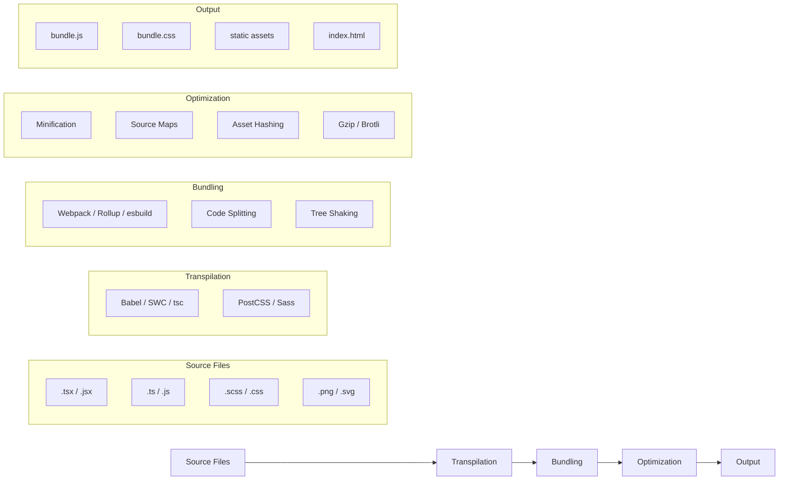
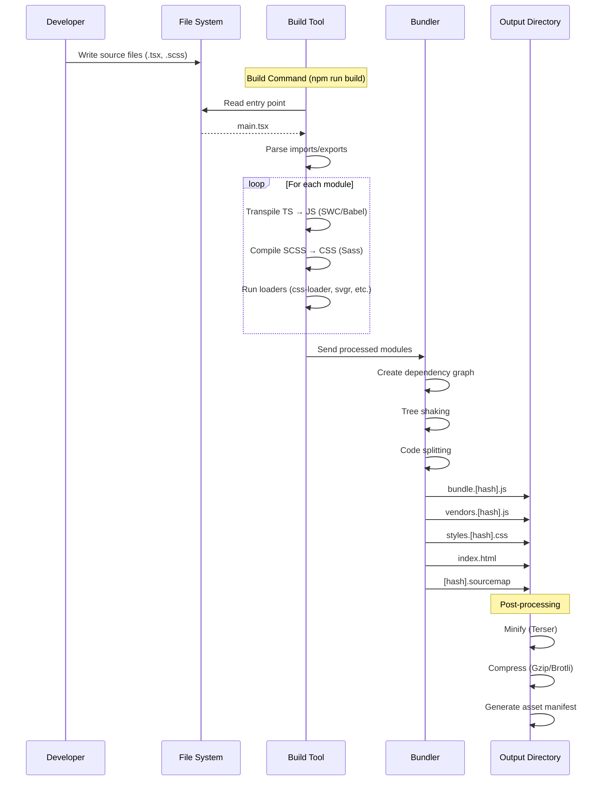
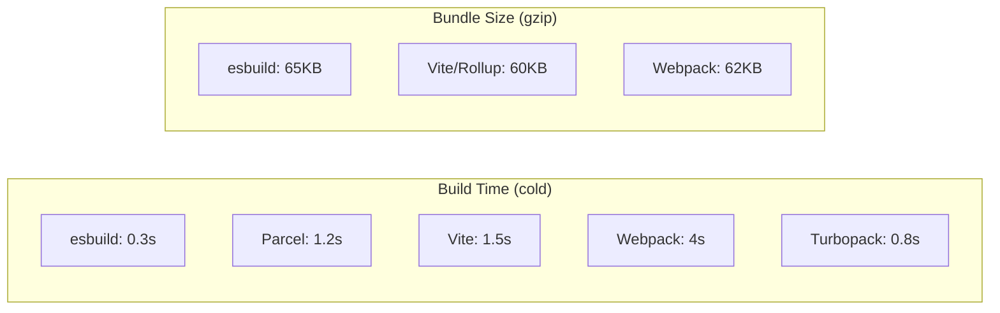

# Build Tools

The frontend build process transforms source code (JSX, TypeScript, modern JS, SASS, etc.) into optimized, browser-compatible assets ready for production deployment.

## Build Pipeline Overview



## Build Process Steps

### 1. Transpilation

Converts modern JavaScript/TypeScript to browser-compatible versions.

**Babel** (most common, plugin-based):
```json
// babel.config.json
{
  "presets": [
    ["@babel/preset-env", {
      "targets": "> 0.25%, not dead",
      "useBuiltIns": "usage",
      "corejs": 3
    }],
    ["@babel/preset-react", {
      "runtime": "automatic"
    }],
    "@babel/preset-typescript"
  ],
  "plugins": [
    "@babel/plugin-transform-runtime"
  ]
}
```

**SWC** (faster Rust-based alternative):
```json
// .swcrc
{
  "jsc": {
    "parser": {
      "syntax": "typescript",
      "tsx": true
    },
    "transform": {
      "react": {
        "runtime": "automatic"
      }
    },
    "target": "es2020"
  },
  "module": {
    "type": "es6"
  }
}
```

**TypeScript Compiler:**
```json
// tsconfig.json
{
  "compilerOptions": {
    "target": "ES2020",
    "module": "ESNext",
    "moduleResolution": "bundler",
    "jsx": "react-jsx",
    "strict": true,
    "esModuleInterop": true,
    "skipLibCheck": true,
    "forceConsistentCasingInFileNames": true
  }
}
```

### 2. Bundling

Combines modules into optimized bundles.

| Tool | Language | Speed | Use Case |
|------|----------|-------|----------|
| Webpack | JS + Go (5.x) | Medium | Large complex apps, rich plugin ecosystem |
| Rollup | JS | Medium | Libraries, tree-shaking focused |
| esbuild | Go | Very Fast | Development, simple builds |
| Parcel | Rust + JS | Fast | Zero-config projects |
| Turbopack | Rust | Very Fast | Next.js, large apps |

**Tree Shaking:** Removes unused exports:
```javascript
// app.js
import { usedFunction } from './utils';

// utils.js
export function usedFunction() { return 42; }
export function unusedFunction() { return 'never imported'; } // Removed by tree shaking
```

### 3. Minification

Removes whitespace, shortens variable names, optimizes code.

```javascript
// Before minification
function calculateTotal(items) {
  let total = 0;
  for (let i = 0; i < items.length; i++) {
    total = total + items[i].price;
  }
  return total;
}

// After minification (Terser)
function calculateTotal(d){let e=0;for(let f=0;f<d.length;f++)e+=d[f].price;return e}
```

**Build output comparison:**

| Optimization | Bundle Size | Notes |
|-------------|-------------|-------|
| Development | 2.5 MB | Full source with comments |
| Minified (Terser) | 800 KB | Variable renaming, whitespace removal |
| Minified + Gzip | 220 KB | Server compression |
| Minified + Brotli | 180 KB | Better compression algorithm |
| Minified + Gzip + Tree Shaking | 150 KB | Removes unused code |

### 4. Source Maps

Maps minified code back to original source for debugging:

```javascript
// webpack.config.js
module.exports = {
  devtool: 'source-map', // Full source maps (slow build)
  // or
  devtool: 'eval-source-map' // Development only
  // or  
  devtool: 'hidden-source-map' // Production (not in browser dev tools)
};
```

```javascript
// Final bundle includes source map reference
// bundle.js.map maps bundle.js back to src/
```

### 5. Environment Variables

Inject environment-specific values at build time:

```javascript
// Vite (.env files)
// .env.production
VITE_API_URL=https://api.example.com
VITE_SENTRY_DSN=https://xxx@sentry.io/xxx

// In application
const apiUrl = import.meta.env.VITE_API_URL;

// Webpack (dotenv-webpack)
// .env
API_URL=https://api.example.com

// webpack.config.js
const Dotenv = require('dotenv-webpack');
module.exports = {
  plugins: [new Dotenv()]
};

// In application
const apiUrl = process.env.API_URL;
```

### 6. Asset Optimization

```javascript
// Image optimization
// Before: hero.png (2.5MB)
// After: hero.webp (180KB) or hero.avif (120KB)

// CSS optimization (PostCSS)
// postcss.config.js
module.exports = {
  plugins: [
    require('autoprefixer'), // Add vendor prefixes
    require('cssnano'),      // Minify CSS
    require('postcss-preset-env'), // Future CSS features
  ]
};
```

## Build Pipeline (Mermaid)



## Build Configuration Examples

### Minimal Webpack Build
```javascript
// webpack.config.js
const path = require('path');
const HtmlWebpackPlugin = require('html-webpack-plugin');

module.exports = {
  entry: './src/index.js',
  output: {
    path: path.resolve(__dirname, 'dist'),
    filename: '[name].[contenthash].js',
    clean: true
  },
  module: {
    rules: [
      { test: /\.jsx?$/, exclude: /node_modules/, use: 'babel-loader' },
      { test: /\.css$/, use: ['style-loader', 'css-loader'] },
      { test: /\.(png|svg|jpg)$/, type: 'asset/resource' }
    ]
  },
  plugins: [
    new HtmlWebpackPlugin({ template: './public/index.html' })
  ]
};
```

### Minimal esbuild Build
```javascript
// build.js
const esbuild = require('esbuild');

esbuild.build({
  entryPoints: ['src/index.tsx'],
  bundle: true,
  outfile: 'dist/bundle.js',
  minify: true,
  sourcemap: true,
  target: ['es2020'],
  loader: { '.tsx': 'tsx', '.ts': 'ts', '.png': 'file' },
}).catch(() => process.exit(1));
```

## Build Performance Comparison



## Best Practices

- **Use code splitting** to avoid monolithic bundles
- **Leverage content hashing** for long-term caching
- **Prefer ESM** for modern module resolution
- **Set Node.js `NODE_ENV=production`** to enable optimizations
- **Analyze bundle** with `webpack-bundle-analyzer` or `esbuild-visualizer`
- **Use SWC/esbuild** in development for fast iteration
- **Configure browserslist** for targeted transpilation
- **Enable tree shaking** with side effects declaration
- **Use dynamic imports** for route-level chunks
- **Generate and serve Brotli** compressed content when possible

## Build Commands Reference

```json
// package.json
{
  "scripts": {
    "dev": "vite",
    "build": "vite build",
    "build:analyze": "ANALYZE=true vite build",
    "build:staging": "vite build --mode staging",
    "preview": "vite preview",
    "typecheck": "tsc --noEmit",
    "lint": "eslint src/",
    "clean": "rm -rf dist/"
  }
}
```

## Resources
- [esbuild - An Extremely Fast Bundler](https://esbuild.github.io/)
- [Webpack Concepts](https://webpack.js.org/concepts/)
- [Rollup.js](https://rollupjs.org/)
- [Babel](https://babeljs.io/)
- [SWC](https://swc.rs/)
