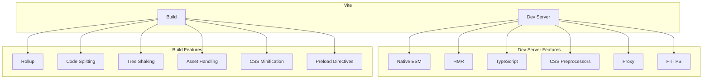
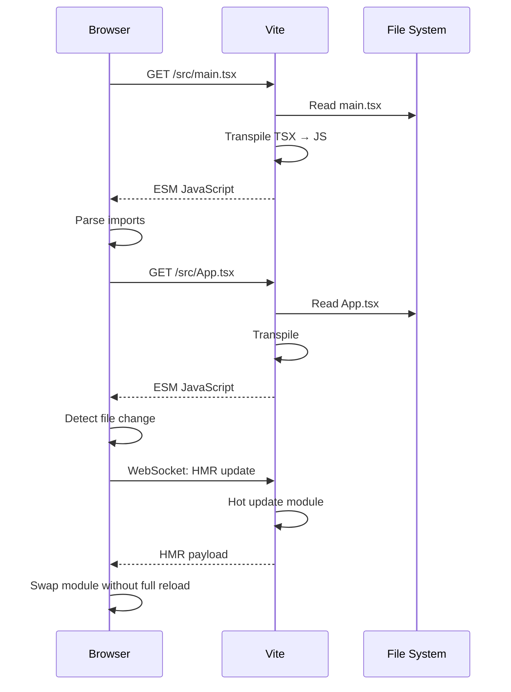

# Vite

Vite is a modern build tool that provides instant server start and fast hot module replacement (HMR) by leveraging native ES modules in development and Rollup for production builds.

## Core Features



## How Vite Works

### Development Server

Unlike traditional bundlers, Vite serves code as native ES modules:

```
Traditional bundler (Webpack dev server):
Request → Bundle entire app → Serve bundle

Vite dev server:
Request → Transpile on-demand → Serve as native ESM
```

```
Browser request: /src/App.vue
        │
        ▼
Vite dev server receives request
        │
        ▼
Transpile .vue file to .js on the fly
        │
        ▼
Return: import { defineComponent } from '/node_modules/.vite/vue.js'
        import HelloWorld from '/src/components/HelloWorld.vue?t=1234567890'
        ...
```

**Why this is fast:**
- No bundling needed in development
- Only the requested modules are transformed
- Cached transformations (file system cache)
- Native ESM in browser handles module resolution



### Production Build

Vite uses Rollup for production builds with pre-configured optimizations:

```
Source Files
    │
    ▼
Rollup (production)
    │
    ├── Tree shaking
    ├── Code splitting
    ├── CSS code splitting
    ├── Asset hashing
    ├── Minification (esbuild)
    └── CSS minification (lightningcss)
    │
    ▼
dist/
├── index.html
├── assets/
│   ├── index-[hash].js
│   ├── vendor-[hash].js
│   ├── style-[hash].css
│   └── logo-[hash].png
```

## Configuration

```javascript
// vite.config.js
import { defineConfig } from 'vite';
import react from '@vitejs/plugin-react';
import typescript from '@rollup/plugin-typescript';

export default defineConfig({
  // Plugins
  plugins: [
    react({
      // React plugin options
      jsxRuntime: 'automatic',
      babel: {
        plugins: ['@emotion/babel-plugin'],
      },
    }),
  ],

  // Development server
  server: {
    port: 3000,
    open: true,
    proxy: {
      '/api': {
        target: 'https://api.example.com',
        changeOrigin: true,
        secure: false,
        rewrite: (path) => path.replace(/^\/api/, ''),
      },
      '/ws': {
        target: 'ws://localhost:8080',
        ws: true,
      },
    },
    https: {
      key: './localhost-key.pem',
      cert: './localhost.pem',
    },
    cors: true,
  },

  // Build configuration
  build: {
    outDir: 'dist',
    sourcemap: true,
    minify: 'esbuild', // 'esbuild' (fast) or 'terser' (better)
    target: 'es2020',
    cssCodeSplit: true,
    rollupOptions: {
      output: {
        manualChunks: {
          vendor: ['react', 'react-dom'],
          ui: ['@mui/material', '@emotion/react'],
          utils: ['lodash-es', 'date-fns'],
        },
      },
    },
    chunkSizeWarningLimit: 500, // KB
  },

  // Environment variables
  envDir: './env',
  envPrefix: 'VITE_',

  // Resolve aliases
  resolve: {
    alias: {
      '@': '/src',
      '@components': '/src/components',
      '@utils': '/src/utils',
    },
  },

  // CSS
  css: {
    modules: {
      localsConvention: 'camelCaseOnly',
    },
    preprocessorOptions: {
      scss: {
        additionalData: '@import "./src/styles/variables.scss";',
      },
    },
  },
});
```

## Environment Variables

```bash
# .env
VITE_APP_TITLE=My App

# .env.development
VITE_API_URL=http://localhost:3000/api

# .env.production
VITE_API_URL=https://api.example.com

# .env.staging
VITE_API_URL=https://staging-api.example.com
```

```javascript
// In application
console.log(import.meta.env.VITE_API_URL); // Based on current mode
console.log(import.meta.env.MODE); // 'development' | 'production' | 'staging'
console.log(import.meta.env.DEV); // true in development
console.log(import.meta.env.PROD); // true in production

// TypeScript types
/// <reference types="vite/client" />
interface ImportMetaEnv {
  readonly VITE_APP_TITLE: string;
  readonly VITE_API_URL: string;
}

interface ImportMeta {
  readonly env: ImportMetaEnv;
}
```

## Plugins

### Official Plugins

```javascript
// @vitejs/plugin-react - React Fast Refresh
import react from '@vitejs/plugin-react';

// @vitejs/plugin-vue - Vue SFC support
import vue from '@vitejs/plugin-vue';

// @vitejs/plugin-vue-jsx - Vue JSX/TSX
import vueJsx from '@vitejs/plugin-vue-jsx';

// @vitejs/plugin-legacy - Legacy browser support
import legacy from '@vitejs/plugin-legacy';
```

### Community Plugins

```javascript
// vite-plugin-pwa - Progressive Web App
import { VitePWA } from 'vite-plugin-pwa';

// vite-plugin-svgr - SVG as React components
import svgr from 'vite-plugin-svgr';

// vite-plugin-checker - TypeScript/ESLint checker
import checker from 'vite-plugin-checker';

// vite-plugin-compression - Gzip/Brotli
import compression from 'vite-plugin-compression';

// vite-plugin-inspect - Inspect modules
import inspect from 'vite-plugin-inspect';

export default defineConfig({
  plugins: [
    VitePWA({
      registerType: 'autoUpdate',
      includeAssets: ['favicon.ico'],
      manifest: {
        name: 'My App',
        short_name: 'App',
        theme_color: '#ffffff',
      },
    }),
    svgr(),
    checker({ typescript: true }),
    compression({ algorithm: 'brotli' }),
  ],
});
```

## Hot Module Replacement (HMR)

Vite's HMR is framework-agnostic and extremely fast:

```javascript
// Accept HMR updates for a module
if (import.meta.hot) {
  import.meta.hot.accept((newModule) => {
    // Module updated - re-render
    console.log('Module updated:', newModule);
  });

  import.meta.hot.dispose(() => {
    // Cleanup when module is replaced
    console.log('Disposing old module');
  });
}

// Invalidate entire page if needed
import.meta.hot.invalidate();

// Custom HMR boundary
if (import.meta.hot) {
  import.meta.hot.accept('./someModule', (mod) => {
    // Only handle updates to ./someModule
  });
}
```

## Proxy Configuration

```javascript
// vite.config.js
export default defineConfig({
  server: {
    proxy: {
      // Simple proxy
      '/api': 'https://api.example.com',

      // With options
      '/api': {
        target: 'https://api.example.com',
        changeOrigin: true,
        rewrite: (path) => path.replace(/^\/api/, ''),
        configure: (proxy, options) => {
          proxy.on('error', (err, req, res) => {
            console.error('Proxy error:', err);
          });
          proxy.on('proxyReq', (proxyReq, req, res) => {
            console.log('Proxying:', req.url);
          });
        },
      },

      // WebSocket proxy
      '/ws': {
        target: 'ws://localhost:8080',
        ws: true,
      },
    },
  },
});
```

## Deployment

### Build Command

```json
// package.json
{
  "scripts": {
    "dev": "vite",
    "build": "vite build",
    "preview": "vite preview",
    "build:staging": "vite build --mode staging",
    "build:analyze": "vite build --mode analyze"
  }
}
```

### Platform-Specific Deployments

**Vercel:**
```json
// vercel.json
{
  "buildCommand": "npm run build",
  "outputDirectory": "dist",
  "framework": "vite"
}
```

**Netlify:**
```toml
# netlify.toml
[build]
  command = "npm run build"
  publish = "dist"

[[redirects]]
  from = "/*"
  to = "/index.html"
  status = 200
```

**Docker:**
```dockerfile
FROM node:20-alpine AS build
WORKDIR /app
COPY package*.json ./
RUN npm ci
COPY . .
RUN npm run build

FROM nginx:alpine
COPY --from=build /app/dist /usr/share/nginx/html
COPY nginx.conf /etc/nginx/conf.d/default.conf
```

## Performance Optimization

```javascript
// vite.config.js - optimization settings
export default defineConfig({
  build: {
    // Enable/disable CSS code splitting
    cssCodeSplit: true,

    // Generate manifest.json
    manifest: true,

    // Rollup options
    rollupOptions: {
      output: {
        // Manual chunk splitting
        manualChunks(id) {
          if (id.includes('node_modules')) {
            if (id.includes('react')) return 'vendor-react';
            if (id.includes('lodash')) return 'vendor-lodash';
            return 'vendor';
          }
        },
      },
    },

    // Terser options (for better minification)
    minify: 'terser',
    terserOptions: {
      compress: {
        drop_console: true,
        drop_debugger: true,
      },
    },

    // Target browsers
    target: ['es2020', 'chrome87', 'firefox78'],
  },

  // Dependency optimization
  optimizeDeps: {
    include: ['react', 'react-dom', 'lodash-es'],
    exclude: ['your-rare-dependency'],
  },
});
```

## Key Differences from Webpack

| Feature | Vite | Webpack |
|---------|------|---------|
| Dev server approach | Native ESM | Bundle-based |
| Cold start speed | < 2s | 5-30s |
| HMR speed | Instant (~10ms) | Slower (~300ms) |
| Production bundler | Rollup | Webpack |
| Configuration | Minimal | Complex |
| Plugin ecosystem | Growing | Mature |
| TypeScript | Built-in | Loader needed |
| CSS handling | Built-in | Loader needed |
| Tree shaking | ESM-based | ESM + CommonJS |

## Resources
- [Vite Documentation](https://vitejs.dev/)
- [Vite GitHub](https://github.com/vitejs/vite)
- [Awesome Vite](https://github.com/vitejs/awesome-vite)
- [Migrate from Webpack](https://vitejs.dev/guide/migration.html)
