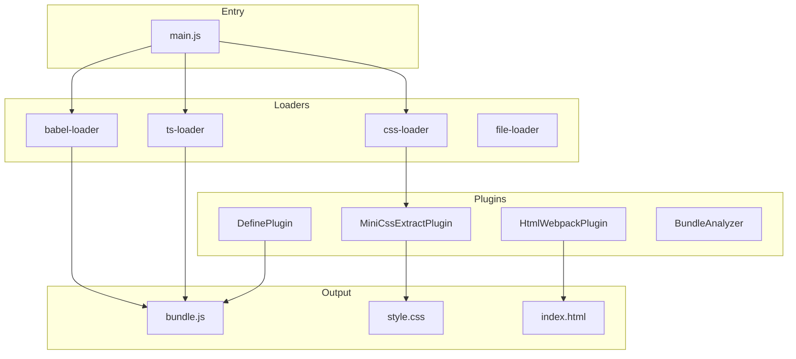
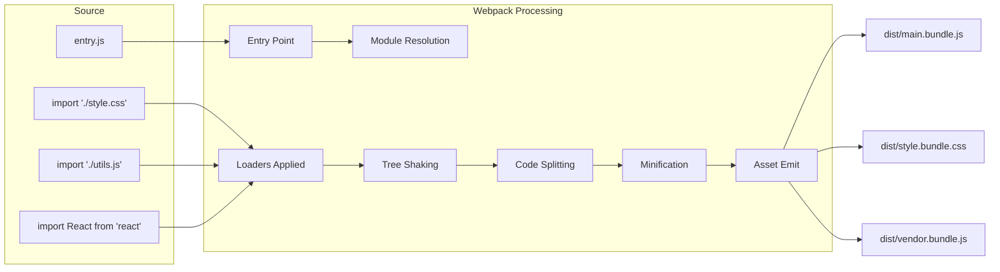

# Webpack

Webpack is a static module bundler for modern JavaScript applications. It builds a dependency graph of all modules and produces one or more bundles optimized for production.

## Core Concepts



### 1. Entry

The entry point tells Webpack where to start building the dependency graph:

```javascript
// Single entry
module.exports = {
  entry: './src/index.js',
};

// Multiple entries (multi-page app)
module.exports = {
  entry: {
    home: './src/home.js',
    about: './src/about.js',
    admin: './src/admin.js',
  },
};

// Dynamic entry
module.exports = {
  entry: () => './src/' + getEntryName(),
};
```

### 2. Output

The output tells Webpack where to emit the bundles:

```javascript
module.exports = {
  output: {
    path: path.resolve(__dirname, 'dist'),
    filename: '[name].[contenthash].js',
    chunkFilename: '[name].[contenthash].chunk.js',
    clean: true, // Clean dist before build
    
    // Public path for CDN
    publicPath: 'https://cdn.example.com/',
  },
};
```

### 3. Loaders

Loaders transform files before adding them to the dependency graph:

```javascript
module.exports = {
  module: {
    rules: [
      // JavaScript/JSX with Babel
      {
        test: /\.(js|jsx)$/,
        exclude: /node_modules/,
        use: {
          loader: 'babel-loader',
          options: {
            presets: ['@babel/preset-env', '@babel/preset-react'],
          },
        },
      },

      // TypeScript
      {
        test: /\.(ts|tsx)$/,
        exclude: /node_modules/,
        use: 'ts-loader',
        // or: 'babel-loader' with @babel/preset-typescript
      },

      // CSS
      {
        test: /\.css$/,
        use: [
          'style-loader', // Injects CSS into DOM
          'css-loader',   // Resolves CSS imports
          'postcss-loader', // Autoprefixer
        ],
      },

      // SCSS
      {
        test: /\.scss$/,
        use: [
          'style-loader',
          {
            loader: 'css-loader',
            options: { modules: true }, // CSS Modules
          },
          'postcss-loader',
          'sass-loader',
        ],
      },

      // Images
      {
        test: /\.(png|jpg|gif|svg)$/,
        type: 'asset/resource', // Webpack 5 built-in
      },

      // Fonts
      {
        test: /\.(woff|woff2|eot|ttf|otf)$/,
        type: 'asset/resource',
      },
    ],
  },
};
```

### 4. Plugins

Plugins extend Webpack's capabilities:

```javascript
const HtmlWebpackPlugin = require('html-webpack-plugin');
const MiniCssExtractPlugin = require('mini-css-extract-plugin');
const { CleanWebpackPlugin } = require('clean-webpack-plugin');
const { BundleAnalyzerPlugin } = require('webpack-bundle-analyzer');
const webpack = require('webpack');

module.exports = {
  plugins: [
    // Generate HTML with auto-injected scripts
    new HtmlWebpackPlugin({
      template: './public/index.html',
      filename: 'index.html',
      favicon: './public/favicon.ico',
    }),

    // Extract CSS to separate file
    new MiniCssExtractPlugin({
      filename: '[name].[contenthash].css',
      chunkFilename: '[id].[contenthash].css',
    }),

    // Define environment variables
    new webpack.DefinePlugin({
      'process.env.NODE_ENV': JSON.stringify('production'),
      'process.env.API_URL': JSON.stringify('https://api.example.com'),
    }),

    // Analyze bundle size
    new BundleAnalyzerPlugin({
      analyzerMode: 'static',
      reportFilename: 'bundle-report.html',
    }),
  ],
};
```

### 5. Mode

Webpack's built-in optimizations per mode:

```javascript
// Development
module.exports = {
  mode: 'development',
  devtool: 'eval-source-map',
  devServer: {
    port: 3000,
    hot: true,
    historyApiFallback: true,
  },
};

// Production
module.exports = {
  mode: 'production',
  devtool: 'source-map',
  optimization: {
    minimize: true,
    minimizer: ['...', new CssMinimizerPlugin()],
  },
};

// None
module.exports = {
  mode: 'none', // No built-in optimizations
};
```

## Optimization

### SplitChunks

Separates vendor code and common modules into separate chunks:

```javascript
module.exports = {
  optimization: {
    splitChunks: {
      chunks: 'all',
      minSize: 20000,
      maxSize: 244000,
      minChunks: 1,
      maxAsyncRequests: 30,
      maxInitialRequests: 30,
      cacheGroups: {
        // React vendor chunk
        react: {
          test: /[\\/]node_modules[\\/](react|react-dom)[\\/]/,
          name: 'vendor-react',
          chunks: 'all',
          priority: 20,
        },

        // Other vendors
        vendors: {
          test: /[\\/]node_modules[\\/]/,
          name: 'vendors',
          chunks: 'all',
          priority: 10,
        },

        // Common modules used across chunks
        common: {
          name: 'common',
          minChunks: 2,
          chunks: 'all',
          priority: 5,
          reuseExistingChunk: true,
        },
      },
    },
  },
};
```

### Minification

```javascript
const TerserPlugin = require('terser-webpack-plugin');
const CssMinimizerPlugin = require('css-minimizer-webpack-plugin');

module.exports = {
  optimization: {
    minimize: true,
    minimizer: [
      new TerserPlugin({
        terserOptions: {
          compress: {
            drop_console: true, // Remove console.log
            drop_debugger: true,
          },
          output: {
            comments: false,
          },
        },
        extractComments: false,
      }),
      new CssMinimizerPlugin(),
    ],
  },
};
```

### Tree Shaking

Requires ES module syntax:

```javascript
// webpack.config.js
module.exports = {
  optimization: {
    usedExports: true, // Tree shake
    sideEffects: true, // Mark modules with side effects
  },
};

// package.json
{
  "sideEffects": [
    "*.css",
    "*.scss",
    "@rainbow-me/rainbowkit/styles.css"
  ]
}
```

## Full Production Configuration

```javascript
// webpack.prod.js
const path = require('path');
const { merge } = require('webpack-merge');
const common = require('./webpack.common.js');
const MiniCssExtractPlugin = require('mini-css-extract-plugin');
const CssMinimizerPlugin = require('css-minimizer-webpack-plugin');
const TerserPlugin = require('terser-webpack-plugin');
const { BundleAnalyzerPlugin } = require('webpack-bundle-analyzer');

module.exports = merge(common, {
  mode: 'production',
  devtool: 'source-map',

  output: {
    path: path.resolve(__dirname, 'dist'),
    filename: '[name].[contenthash].js',
    chunkFilename: '[name].[contenthash].chunk.js',
    publicPath: '/',
    clean: true,
  },

  module: {
    rules: [
      {
        test: /\.css$/,
        use: [MiniCssExtractPlugin.loader, 'css-loader', 'postcss-loader'],
      },
    ],
  },

  plugins: [
    new MiniCssExtractPlugin({
      filename: '[name].[contenthash].css',
      chunkFilename: '[id].[contenthash].css',
    }),
    ...(process.env.ANALYZE ? [new BundleAnalyzerPlugin()] : []),
  ],

  optimization: {
    minimize: true,
    minimizer: [
      new TerserPlugin({
        terserOptions: {
          compress: { drop_console: true, drop_debugger: true },
          output: { comments: false },
        },
      }),
      new CssMinimizerPlugin(),
    ],

    splitChunks: {
      chunks: 'all',
      cacheGroups: {
        react: {
          test: /[\\/]node_modules[\\/](react|react-dom)[\\/]/,
          name: 'react',
          priority: 20,
        },
        vendors: {
          test: /[\\/]node_modules[\\/]/,
          name: 'vendors',
          priority: 10,
        },
      },
    },

    runtimeChunk: 'single',
  },

  performance: {
    hints: 'warning',
    maxEntrypointSize: 500000, // 500KB
    maxAssetSize: 300000, // 300KB
  },
});
```

## Webpack Dev Server

```javascript
// webpack.dev.js
module.exports = {
  mode: 'development',
  devtool: 'eval-source-map',

  devServer: {
    port: 3000,
    hot: true,
    open: true,
    historyApiFallback: true,
    compress: true,

    proxy: [
      {
        context: ['/api'],
        target: 'https://api.example.com',
        changeOrigin: true,
        secure: false,
      },
    ],

    client: {
      overlay: {
        errors: true,
        warnings: false,
      },
    },

    // HTTPS support
    server: {
      type: 'https',
      options: {
        key: './localhost-key.pem',
        cert: './localhost.pem',
      },
    },
  },
};
```

## Webpack Module System Diagram



## Common Loader Patterns

| Loader | Purpose |
|--------|---------|
| `babel-loader` | Transpile JS/JSX with Babel |
| `ts-loader` | TypeScript compilation |
| `css-loader` | Resolve CSS imports |
| `style-loader` | Inject CSS via style tags |
| `sass-loader` | Compile SCSS/SASS |
| `file-loader` | Copy files to output |
| `url-loader` | Inline files as base64 |
| `svg-inline-loader` | Inline SVG |
| `eslint-loader` | Lint during build |
| `thread-loader` | Parallel worker pool |

## Resources
- [Webpack Documentation](https://webpack.js.org/concepts/)
- [Webpack Configuration](https://webpack.js.org/configuration/)
- [Loaders](https://webpack.js.org/loaders/)
- [Plugins](https://webpack.js.org/plugins/)
- [Webpack 5 Migration Guide](https://webpack.js.org/migrate/5/)
