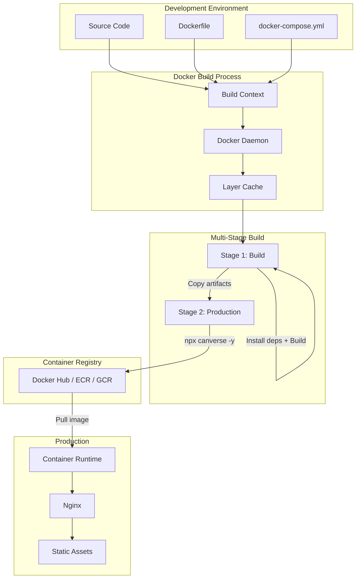

# Docker for Frontend

Docker containers provide consistent environments across development, testing, and production. For frontend applications, Docker typically involves multi-stage builds to produce a small, optimized image.

## Why Docker for Frontend?

- **Consistent environment:** Same OS, Node version, and dependencies everywhere
- **Reproducible builds:** Build artifacts are identical across machines
- **Simplified deployment:** Single image to deploy to any container runtime
- **Microservices integration:** Run frontend alongside API, DB, etc.
- **CI/CD friendly:** Easy to integrate with any pipeline

## Multi-Stage Build

The most common pattern: build in one stage, serve in another.

```dockerfile
# Stage 1: Build
FROM node:20-alpine AS build

WORKDIR /app

# Install dependencies (separate layer for caching)
COPY package*.json ./
RUN npm ci --only=production && \
    npm cache clean --force

# Copy source and build
COPY . .
RUN npm run build

# Stage 2: Production (Nginx)
FROM nginx:alpine AS production

# Copy built assets
COPY --from=build /app/dist /usr/share/nginx/html

# Copy nginx configuration
COPY nginx.conf /etc/nginx/conf.d/default.conf

# Health check
HEALTHCHECK --interval=30s --timeout=3s --start-period=5s --retries=3 \
    CMD wget --no-verbose --tries=1 --spider http://localhost:80/ || exit 1

EXPOSE 80

CMD ["nginx", "-g", "daemon off;"]
```

## Dockerfile Variations

### Minimal (no multi-stage)
```dockerfile
FROM nginx:alpine
COPY dist /usr/share/nginx/html
COPY nginx.conf /etc/nginx/conf.d/default.conf
```

### With Build Arguments
```dockerfile
FROM node:20-alpine AS build

ARG API_URL
ENV VITE_API_URL=$API_URL

WORKDIR /app
COPY package*.json ./
RUN npm ci
COPY . .
RUN npm run build

FROM nginx:alpine
COPY --from=build /app/dist /usr/share/nginx/html
COPY nginx.conf /etc/nginx/conf.d/default.conf
```

### Development Container
```dockerfile
FROM node:20-alpine

WORKDIR /app

RUN npm install -g pnpm

COPY package*.json ./
RUN npm ci

COPY . .

EXPOSE 5173

CMD ["npm", "run", "dev", "--", "--host", "0.0.0.0"]
```

## nginx Configuration

```nginx
# nginx.conf
server {
    listen 80;
    server_name example.com;
    root /usr/share/nginx/html;
    index index.html;

    # Gzip compression
    gzip on;
    gzip_types text/css text/javascript application/javascript application/json image/svg+xml;
    gzip_min_length 256;
    gzip_vary on;

    # Security headers
    add_header X-Frame-Options "SAMEORIGIN" always;
    add_header X-Content-Type-Options "nosniff" always;
    add_header X-XSS-Protection "1; mode=block" always;
    add_header Referrer-Policy "strict-origin-when-cross-origin" always;
    add_header Content-Security-Policy "default-src 'self'; script-src 'self'; style-src 'self' 'unsafe-inline'; img-src 'self' data:; font-src 'self';" always;
    add_header Strict-Transport-Security "max-age=31536000; includeSubDomains; preload" always;

    # Cache static assets
    location /assets/ {
        expires 1y;
        add_header Cache-Control "public, immutable";
    }

    # Service worker (not cached)
    location /sw.js {
        add_header Cache-Control "no-cache";
        add_header Service-Worker-Allowed "/";
    }

    # SPA fallback
    location / {
        try_files $uri $uri/ /index.html;

        # Don't cache index.html
        location = /index.html {
            add_header Cache-Control "no-cache, must-revalidate";
        }
    }

    # Health check
    location /health {
        access_log off;
        return 200 "healthy\n";
        add_header Content-Type text/plain;
    }

    # Deny access to hidden files
    location ~ /\. {
        deny all;
        access_log off;
        log_not_found off;
    }
}
```

## docker-compose.yml

```yaml
# docker-compose.yml
version: '3.8'

services:
  frontend:
    build:
      context: .
      dockerfile: Dockerfile
      args:
        API_URL: https://api.example.com
    ports:
      - "80:80"
    environment:
      - NODE_ENV=production
    healthcheck:
      test: ["CMD", "wget", "--no-verbose", "--tries=1", "--spider", "http://localhost:80/health"]
      interval: 30s
      timeout: 3s
      retries: 3
      start_period: 10s
    restart: unless-stopped
    networks:
      - app-network

  api:
    build:
      context: ./api
      dockerfile: Dockerfile
    ports:
      - "3000:3000"
    environment:
      - DATABASE_URL=postgresql://user:pass@db:5432/app
    depends_on:
      - db
    networks:
      - app-network

  db:
    image: postgres:15-alpine
    environment:
      POSTGRES_USER: user
      POSTGRES_PASSWORD: pass
      POSTGRES_DB: app
    volumes:
      - postgres-data:/var/lib/postgresql/data
    networks:
      - app-network

networks:
  app-network:
    driver: bridge

volumes:
  postgres-data:
```

### Docker Compose for Development

```yaml
# docker-compose.dev.yml
version: '3.8'

services:
  frontend:
    build:
      context: .
      dockerfile: Dockerfile.dev
    ports:
      - "5173:5173"
    volumes:
      - .:/app
      - /app/node_modules
    environment:
      - NODE_ENV=development
      - VITE_API_URL=http://localhost:3000
    command: npm run dev -- --host 0.0.0.0

  api:
    build:
      context: ./api
      dockerfile: Dockerfile.dev
    ports:
      - "3000:3000"
    volumes:
      - ./api:/app
      - /app/node_modules
    environment:
      - DATABASE_URL=postgresql://user:pass@db:5432/app_dev
      - NODE_ENV=development

  db:
    image: postgres:15-alpine
    ports:
      - "5432:5432"
    environment:
      POSTGRES_USER: user
      POSTGRES_PASSWORD: pass
      POSTGRES_DB: app_dev
    volumes:
      - dev-postgres-data:/var/lib/postgresql/data

volumes:
  dev-postgres-data:
```

## .dockerignore

```dockerignore
# .dockerignore
node_modules
npm-debug.log
.git
.gitignore
.env
.env.local
.env.*.local
*.md
.editorconfig
.eslintrc*
.prettierrc*
tsconfig.json
.DS_Store
dist
.cache
coverage
test
tests
__tests__
__mocks__
```

## Docker Architecture Diagram



## Docker Commands Reference

```bash
# Build image
docker build -t my-frontend:latest .
docker build -t my-frontend:1.0.0 --build-arg API_URL=https://api.example.com .

# Run container
docker run -d -p 80:80 --name my-app my-frontend:latest

# Run with environment
docker run -d -p 80:80 -e NODE_ENV=production my-frontend:latest

# Docker Compose
docker-compose up -d
docker-compose -f docker-compose.yml -f docker-compose.dev.yml up -d
docker-compose down

# Inspect
docker ps
docker logs my-app
docker exec -it my-app sh

# Tag and push
docker tag my-frontend:latest registry.example.com/my-frontend:latest
docker push registry.example.com/my-frontend:latest

# Clean up
docker system prune -a
docker builder prune
```

## Environment Variables in Docker

```yaml
# Method 1: Compose file
services:
  frontend:
    environment:
      NODE_ENV: production
      API_URL: https://api.example.com

# Method 2: .env file
# .env
API_URL=https://api.example.com
SENTRY_DSN=https://xxx@sentry.io/xxx

# docker-compose.yml
services:
  frontend:
    env_file:
      - .env

# Method 3: Build-time args
# Dockerfile
ARG VITE_API_URL
ENV VITE_API_URL=$VITE_API_URL

# Build command
docker build --build-arg VITE_API_URL=https://api.example.com -t my-app .
```

## Health Checks

```dockerfile
# Dockerfile health check
HEALTHCHECK --interval=30s --timeout=3s --start-period=5s --retries=3 \
    CMD wget --no-verbose --tries=1 --spider http://localhost:80/health || exit 1

# Or use curl
HEALTHCHECK --interval=30s --timeout=3s --start-period=5s --retries=3 \
    CMD curl -f http://localhost:80/health || exit 1
```

```yaml
# docker-compose health check
services:
  frontend:
    healthcheck:
      test: ["CMD", "wget", "--no-verbose", "--tries=1", "--spider", "http://localhost:80/health"]
      interval: 30s
      timeout: 3s
      retries: 3
      start_period: 10s
```

## Image Size Comparison

| Approach | Image Size | Notes |
|----------|-----------|-------|
| node:20 | ~1.1 GB | Includes full Node.js |
| node:20-alpine | ~350 MB | Alpine-based |
| Multi-stage (nginx:alpine) | ~25 MB | Only static assets |
| Multi-stage + compression | ~15 MB | With Brotli pre-compressed |
| Distroless Nginx | ~20 MB | Google distroless base |

## Best Practices

- **Use multi-stage builds** to minimize image size
- **Pin base image versions** (`node:20-alpine`, not `node:latest`)
- **Combine RUN commands** to reduce layers
- **Use `.dockerignore`** to exclude unnecessary files
- **Run as non-root user** in production
- **Health check** for orchestration platforms
- **Separate dev compose** for development environment
- **Use build args** for environment-specific values
- **Pre-compress assets** for faster serving
- **Scan images** for vulnerabilities (`docker scout`)

## Resources
- [Docker Best Practices](https://docs.docker.com/develop/dev-best-practices/)
- [Docker for Frontend Developers](https://www.docker.com/blog/docker-for-frontend-developers/)
- [Multi-Stage Builds](https://docs.docker.com/build/building/multi-stage/)
- [Docker Compose](https://docs.docker.com/compose/)
