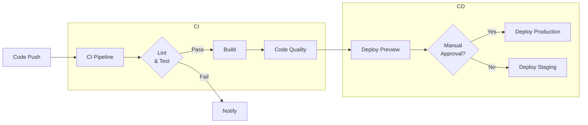
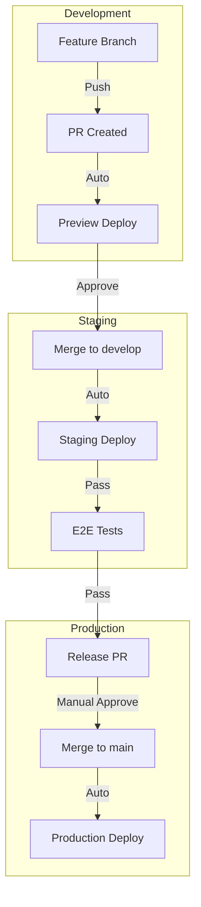
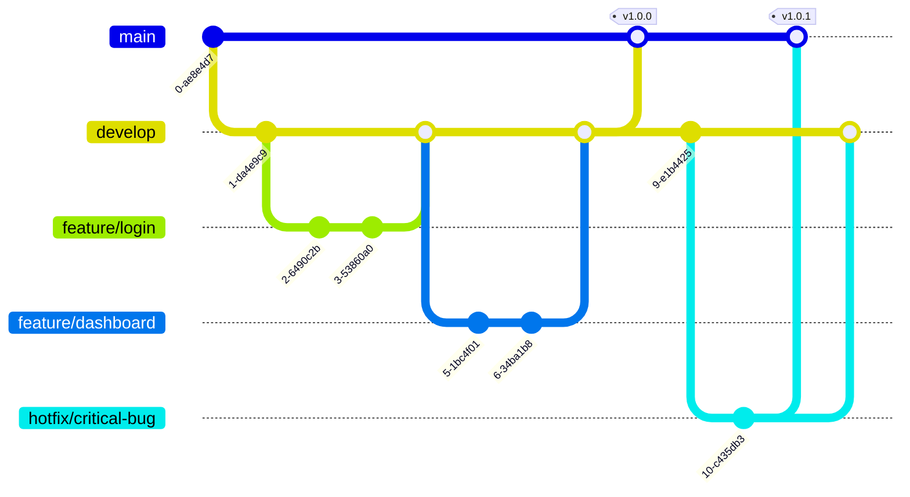

# CI/CD for Frontend

Continuous Integration and Continuous Deployment automate the process of building, testing, and deploying frontend applications, ensuring reliable and frequent releases.

## CI/CD Pipeline Overview



## GitHub Actions

### Complete Frontend Workflow

```yaml
# .github/workflows/deploy.yml
name: Frontend CI/CD

on:
  push:
    branches: [main, develop]
  pull_request:
    branches: [main]
  workflow_dispatch: # Manual trigger

env:
  NODE_VERSION: 20
  PNPM_VERSION: 8

jobs:
  # 1. Quality checks
  quality:
    name: Quality Checks
    runs-on: ubuntu-latest
    
    steps:
      - uses: actions/checkout@v4
      
      - uses: pnpm/action-setup@v2
        with:
          version: ${{ env.PNPM_VERSION }}
      
      - uses: actions/setup-node@v4
        with:
          node-version: ${{ env.NODE_VERSION }}
          cache: 'pnpm'
      
      - name: Install dependencies
        run: pnpm install --frozen-lockfile
      
      - name: Type check
        run: pnpm typecheck
      
      - name: Lint
        run: pnpm lint
      
      - name: Unit tests
        run: pnpm test -- --coverage
      
      - name: Upload coverage
        uses: actions/upload-artifact@v3
        with:
          name: coverage
          path: coverage/
      
      - name: Bundle size check
        run: pnpm build -- --report
      
      - name: Upload bundle report
        uses: actions/upload-artifact@v3
        with:
          name: bundle-report
          path: dist/bundle-report.html

  # 2. Build
  build:
    name: Build
    needs: quality
    runs-on: ubuntu-latest
    if: github.event_name == 'push' || github.event_name == 'workflow_dispatch'
    
    steps:
      - uses: actions/checkout@v4
      
      - uses: pnpm/action-setup@v2
        with:
          version: ${{ env.PNPM_VERSION }}
      
      - uses: actions/setup-node@v4
        with:
          node-version: ${{ env.NODE_VERSION }}
          cache: 'pnpm'
      
      - name: Install dependencies
        run: pnpm install --frozen-lockfile
      
      - name: Build
        run: pnpm build
        env:
          NODE_ENV: production
          VITE_API_URL: ${{ secrets.API_URL }}
          VITE_SENTRY_DSN: ${{ secrets.SENTRY_DSN }}
      
      - name: Upload build artifacts
        uses: actions/upload-pages-artifact@v2
        with:
          path: dist/

  # 3. Deploy Preview
  preview:
    name: Deploy Preview
    needs: build
    runs-on: ubuntu-latest
    environment:
      name: preview
      url: ${{ steps.deploy.outputs.url }}
    
    steps:
      - name: Deploy to Vercel Preview
        id: deploy
        uses: amondnet/vercel-action@v25
        with:
          vercel-token: ${{ secrets.VERCEL_TOKEN }}
          vercel-org-id: ${{ secrets.VERCEL_ORG_ID }}
          vercel-project-id: ${{ secrets.VERCEL_PROJECT_ID }}
          scope: ${{ secrets.VERCEL_ORG_ID }}
          alias: preview-${{ github.sha }}
    
    # Only for PRs
    if: github.event_name == 'pull_request'

  # 4. Deploy Staging
  staging:
    name: Deploy Staging
    needs: build
    runs-on: ubuntu-latest
    environment:
      name: staging
      url: https://staging.example.com
    
    steps:
      - uses: actions/checkout@v4
      
      - name: Download build
        uses: actions/download-pages-artifact@v2
      
      - name: Deploy to S3
        uses: jakejarvis/s3-sync-action@master
        with:
          args: --delete
        env:
          AWS_S3_BUCKET: ${{ secrets.STAGING_BUCKET }}
          AWS_ACCESS_KEY_ID: ${{ secrets.AWS_ACCESS_KEY_ID }}
          AWS_SECRET_ACCESS_KEY: ${{ secrets.AWS_SECRET_ACCESS_KEY }}
          SOURCE_DIR: dist/
      
      - name: Invalidate CloudFront
        uses: chetan/invalidate-cloudfront-action@v2
        env:
          DISTRIBUTION: ${{ secrets.STAGING_CLOUDFRONT_DIST }}
          PATHS: '/*'
          AWS_REGION: 'us-east-1'
          AWS_ACCESS_KEY_ID: ${{ secrets.AWS_ACCESS_KEY_ID }}
          AWS_SECRET_ACCESS_KEY: ${{ secrets.AWS_SECRET_ACCESS_KEY }}

  # 5. Deploy Production
  production:
    name: Deploy Production
    needs: [build, staging]
    runs-on: ubuntu-latest
    environment:
      name: production
      url: https://example.com
    
    # Manual approval or auto-deploy from main
    if: github.ref == 'refs/heads/main'
    
    steps:
      - uses: actions/checkout@v4
      
      - name: Download build
        uses: actions/download-pages-artifact@v2
      
      - name: Configure AWS credentials
        uses: aws-actions/configure-aws-credentials@v4
        with:
          aws-access-key-id: ${{ secrets.AWS_ACCESS_KEY_ID }}
          aws-secret-access-key: ${{ secrets.AWS_SECRET_ACCESS_KEY }}
          aws-region: us-east-1
      
      - name: Deploy to S3
        run: |
          aws s3 sync dist/ s3://${{ secrets.PRODUCTION_BUCKET }}/ \
            --delete \
            --cache-control "public, max-age=31536000, immutable" \
            --exclude "index.html" \
            --exclude "service-worker.js"
          aws s3 cp dist/index.html s3://${{ secrets.PRODUCTION_BUCKET }}/index.html \
            --cache-control "no-cache, must-revalidate"
          aws s3 cp dist/service-worker.js s3://${{ secrets.PRODUCTION_BUCKET }}/service-worker.js \
            --cache-control "no-cache"
      
      - name: Invalidate CloudFront
        run: |
          aws cloudfront create-invalidation \
            --distribution-id ${{ secrets.PRODUCTION_CLOUDFRONT_DIST }} \
            --paths "/*"
      
      - name: Notify Slack
        uses: slackapi/slack-github-action@v1.24.0
        with:
          payload: |
            {
              "text": "✅ Production deploy complete: ${{ github.sha }}",
              "blocks": [
                {
                  "type": "section",
                  "text": {
                    "type": "mrkdwn",
                    "text": "*Production Deploy Complete*\nCommit: <${{ github.server_url }}/${{ github.repository }}/commit/${{ github.sha }}|${{ github.sha }}>\nBy: ${{ github.actor }}\nEnvironment: production"
                  }
                }
              ]
            }
        env:
          SLACK_WEBHOOK_URL: ${{ secrets.SLACK_WEBHOOK_URL }}
```

## Environment Promotion Strategy



## Branch Strategy



## E2E Tests in CI

```yaml
# .github/workflows/e2e.yml
name: E2E Tests

on:
  deployment_status:

jobs:
  e2e:
    if: github.event.deployment_status.state == 'success'
    runs-on: ubuntu-latest
    
    steps:
      - uses: actions/checkout@v4
      
      - uses: pnpm/action-setup@v2
      - uses: actions/setup-node@v4
        with:
          node-version: 20
          cache: 'pnpm'
      
      - name: Install dependencies
        run: pnpm install --frozen-lockfile
      
      - name: Run Cypress E2E
        uses: cypress-io/github-action@v6
        with:
          config: baseUrl=${{ github.event.deployment_status.target_url }}
      
      - name: Upload screenshots
        uses: actions/upload-artifact@v3
        if: failure()
        with:
          name: cypress-screenshots
          path: cypress/screenshots/
```

## Preview Deployments

```yaml
# Vercel Preview
name: Preview Deploy

on:
  pull_request:
    types: [opened, synchronize, reopened]

jobs:
  preview:
    runs-on: ubuntu-latest
    
    steps:
      - uses: actions/checkout@v4
      
      - name: Deploy to Vercel Preview
        uses: amondnet/vercel-action@v25
        with:
          vercel-token: ${{ secrets.VERCEL_TOKEN }}
          vercel-org-id: ${{ secrets.VERCEL_ORG_ID }}
          vercel-project-id: ${{ secrets.VERCEL_PROJECT_ID }}
          scope: ${{ secrets.VERCEL_ORG_ID }}
          alias: pr-${{ github.event.number }}
      
      - name: Comment PR
        uses: actions/github-script@v6
        with:
          script: |
            const url = `https://pr-${context.issue.number}.your-app.vercel.app`;
            github.rest.issues.createComment({
              issue_number: context.issue.number,
              owner: context.repo.owner,
              repo: context.repo.repo,
              body: `🚀 Preview deployed: ${url}`
            });
```

## CI/CD Best Practices

- **Fast feedback:** Run lint and type check first (fail fast)
- **Caching:** Cache `node_modules` for faster installs
- **Deterministic builds:** Use lockfiles (`pnpm-lock.yaml`)
- **Secret management:** Use GitHub Secrets, never commit secrets
- **Artifact retention:** Keep build artifacts for debugging
- **Environment parity:** Staging mirrors production as closely as possible
- **Rollback plan:** Keep last N versions for quick rollback
- **Notifications:** Alert on failures to team chat
- **Pipeline as code:** Version control your CI/CD config
- **Dependency scanning:** Integrate Snyk or Dependabot

## CI/CD Tools Comparison

| Tool | Hosted | Configuration | Key Feature |
|------|--------|---------------|-------------|
| GitHub Actions | Yes | YAML | Tight GitHub integration |
| GitLab CI | Yes/No | YAML | Built-in registry |
| CircleCI | Yes | YAML | Fast execution |
| Jenkins | Self-hosted | Groovy/Dsl | Highly customizable |
| Vercel | Yes | Web UI + CLI | Zero-config for frontend |
| Netlify | Yes | Netlify.toml | Form/function built-in |
| AWS CodePipeline | Yes | YAML/Console | Full AWS integration |

## Resources
- [GitHub Actions Documentation](https://docs.github.com/en/actions)
- [Vercel GitHub Integration](https://vercel.com/docs/concepts/git)
- [Netlify Deploy Preview](https://docs.netlify.com/site-deploys/deploy-previews/)
- [Cypress CI Guide](https://docs.cypress.io/guides/continuous-integration)
