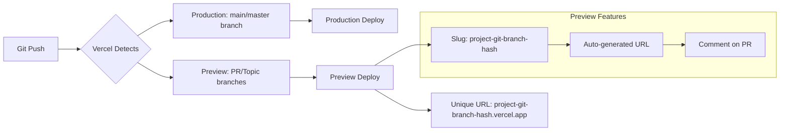

# Vercel Deployment

Vercel is a cloud platform for frontend developers that provides zero-configuration deployments, serverless functions, and edge network delivery.

## Key Features

- **Automatic deploys** from Git (GitHub, GitLab, Bitbucket)
- **Preview deployments** for every PR
- **Serverless Functions** (Node.js, Python, Go, Ruby)
- **Edge Functions** (JavaScript at the edge)
- **Automatic HTTPS/SSL** certificates
- **Global CDN** with 100+ locations
- **Analytics** for Core Web Vitals
- **Image Optimization**
- **Environment Variables** per environment

## Git Integration



## Configuration

### vercel.json

```json
{
  "name": "my-frontend-app",
  "version": 2,
  "framework": "nextjs",
  "buildCommand": "next build",
  "outputDirectory": ".next",
  "installCommand": "npm install",
  "devCommand": "next dev",
  "regions": ["iad1", "sfo1", "hkg1"],
  "github": {
    "silent": false,
    "autoJobCancelation": true
  }
}
```

### Framework-Specific Configs

**React/Vite:**
```json
{
  "framework": null,
  "buildCommand": "npm run build",
  "outputDirectory": "dist",
  "rewrites": [
    { "source": "/(.*)", "destination": "/index.html" }
  ]
}
```

**Next.js:**
```json
{
  "framework": "nextjs",
  "buildCommand": "next build",
  "outputDirectory": ".next"
}
```

## Environment Variables

```bash
# Vercel Dashboard → Project Settings → Environment Variables

# Production
NEXT_PUBLIC_API_URL=https://api.example.com
SENTRY_DSN=https://xxx@sentry.io/xxx

# Preview
NEXT_PUBLIC_API_URL=https://staging-api.example.com

# Development (local)
NEXT_PUBLIC_API_URL=http://localhost:3000
```

```javascript
// Access in application
const apiUrl = process.env.NEXT_PUBLIC_API_URL;
const sentryDsn = process.env.SENTRY_DSN;

// Vercel system env vars
console.log(process.env.VERCEL); // "1"
console.log(process.env.VERCEL_ENV); // "production" | "preview" | "development"
console.log(process.env.VERCEL_URL); // Deployment URL
console.log(process.env.VERCEL_GIT_COMMIT_SHA);
```

## Serverless Functions

### API Routes

```javascript
// api/hello.js (Node.js)
export default function handler(req, res) {
  res.status(200).json({ message: 'Hello from Vercel!' });
}

// api/users/[id].js - Dynamic routes
export default function handler(req, res) {
  const { id } = req.query;
  res.json({ user: { id, name: `User ${id}` } });
}

// api/login.js - POST handler
export default async function handler(req, res) {
  if (req.method !== 'POST') {
    return res.status(405).json({ error: 'Method not allowed' });
  }
  
  const { email, password } = req.body;
  
  // Validate credentials
  const user = await authenticate(email, password);
  
  if (!user) {
    return res.status(401).json({ error: 'Invalid credentials' });
  }
  
  // Set session
  const token = await createSession(user);
  res.setHeader('Set-Cookie', `session=${token}; HttpOnly; Secure; SameSite=Strict; Path=/`);
  
  res.json({ success: true });
}
```

### Edge Functions

```javascript
// api/edge/hello.js (Edge Runtime)
export const config = {
  runtime: 'edge',
};

export default async function handler(request) {
  const country = request.headers.get('x-vercel-ip-country') || 'US';
  
  return new Response(
    JSON.stringify({ 
      message: 'Hello from the Edge!',
      country,
      timestamp: Date.now()
    }),
    {
      headers: { 'content-type': 'application/json' },
    }
  );
}
```

### Middleware

```javascript
// middleware.js (runs on every request)
import { NextResponse } from 'next/server';

export function middleware(request) {
  const country = request.headers.get('x-vercel-ip-country') || 'US';
  const response = NextResponse.next();
  
  // A/B testing
  if (country === 'US') {
    response.cookies.set('experiment', 'variant-a');
  } else {
    response.cookies.set('experiment', 'variant-b');
  }
  
  // Redirect based on country
  if (country === 'DE' && !request.url.includes('/de')) {
    return NextResponse.redirect(new URL('/de', request.url));
  }
  
  return response;
}

export const config = {
  matcher: ['/((?!api|_next/static|favicon.ico).*)'],
};
```

## Rewrites and Redirects

```json
{
  "rewrites": [
    { "source": "/api/(.*)", "destination": "/api/$1" },
    { "source": "/blog/:path*", "destination": "/blog/index.html" }
  ],
  "redirects": [
    { "source": "/old-page", "destination": "/new-page", "permanent": true },
    { "source": "/docs/v1(.*)", "destination": "/docs/v2$1", "permanent": false }
  ],
  "headers": [
    {
      "source": "/(.*)",
      "headers": [
        { "key": "X-Frame-Options", "value": "DENY" },
        { "key": "X-Content-Type-Options", "value": "nosniff" },
        { "key": "Referrer-Policy", "value": "strict-origin-when-cross-origin" }
      ]
    },
    {
      "source": "/assets/(.*)",
      "headers": [
        { "key": "Cache-Control", "value": "public, max-age=31536000, immutable" }
      ]
    }
  ]
}
```

## Analytics

```javascript
// Install @vercel/analytics
// npm install @vercel/analytics

// app/layout.js (Next.js)
import { Analytics } from '@vercel/analytics/react';

export default function RootLayout({ children }) {
  return (
    <html>
      <body>
        {children}
        <Analytics />
      </body>
    </html>
  );
}
```

**Metrics tracked:**
- Core Web Vitals (LCP, CLS, INP, FCP, TTFB)
- Page views
- Custom events
- Geographics
- Device types
- Browser versions

## Image Optimization

```javascript
// Next.js Image component
import Image from 'next/image';

export default function Hero() {
  return (
    <Image
      src="/hero.png"
      alt="Hero"
      width={1200}
      height={600}
      priority // Preload above-the-fold images
      quality={85}
      sizes="(max-width: 768px) 100vw, 50vw"
    />
  );
}
```

**Benefits:**
- Automatic WebP/AVIF conversion
- Responsive images
- Lazy loading (default)
- Optimized caching
- Blur placeholder support

## Deployment Configuration

### Project Configuration (Vercel CLI)

```bash
# Install CLI
npm i -g vercel

# Deploy
vercel                     # Preview deploy
vercel --prod              # Production deploy
vercel --prebuilt          # Skip build (use already built files)
vercel --env KEY=VALUE     # Set environment variable

# Environment management
vercel env add API_URL production
vercel env pull            # Pull env vars locally
vercel env ls

# Domain management
vercel domains add example.com
vercel domains inspect example.com

# Logs
vercel logs
vercel logs --since=1h
```

### CI/CD Integration

```yaml
# .github/workflows/vercel.yml
name: Deploy to Vercel
on:
  push:
    branches: [main]
  pull_request:
    branches: [main]

jobs:
  deploy:
    runs-on: ubuntu-latest
    steps:
      - uses: actions/checkout@v4
      
      - name: Deploy to Vercel
        uses: amondnet/vercel-action@v25
        with:
          vercel-token: ${{ secrets.VERCEL_TOKEN }}
          vercel-org-id: ${{ secrets.VERCEL_ORG_ID }}
          vercel-project-id: ${{ secrets.VERCEL_PROJECT_ID }}
          scope: ${{ secrets.VERCEL_ORG_ID }}
          vercel-args: ${{ github.ref == 'refs/heads/main' && '--prod' || '' }}
          github-comment: true
```

## Performance Optimization

```json
{
  "functions": {
    "api/*.js": {
      "maxDuration": 10,
      "memory": 1024
    }
  },
  "crons": [
    {
      "path": "/api/cron",
      "schedule": "0 0 * * *"
    }
  ]
}
```

## Preview Deployments

```
Main branch:     my-app.vercel.app
PR #123:         my-app-git-pr-123-hash.vercel.app
Branch staging:  my-app-git-staging-hash.vercel.app

Custom domain:   https://www.example.com
```

## Resources
- [Vercel Documentation](https://vercel.com/docs)
- [Vercel CLI](https://vercel.com/docs/cli)
- [Serverless Functions](https://vercel.com/docs/functions)
- [Edge Functions](https://vercel.com/docs/functions/edge-functions)
- [Vercel Analytics](https://vercel.com/docs/analytics)
