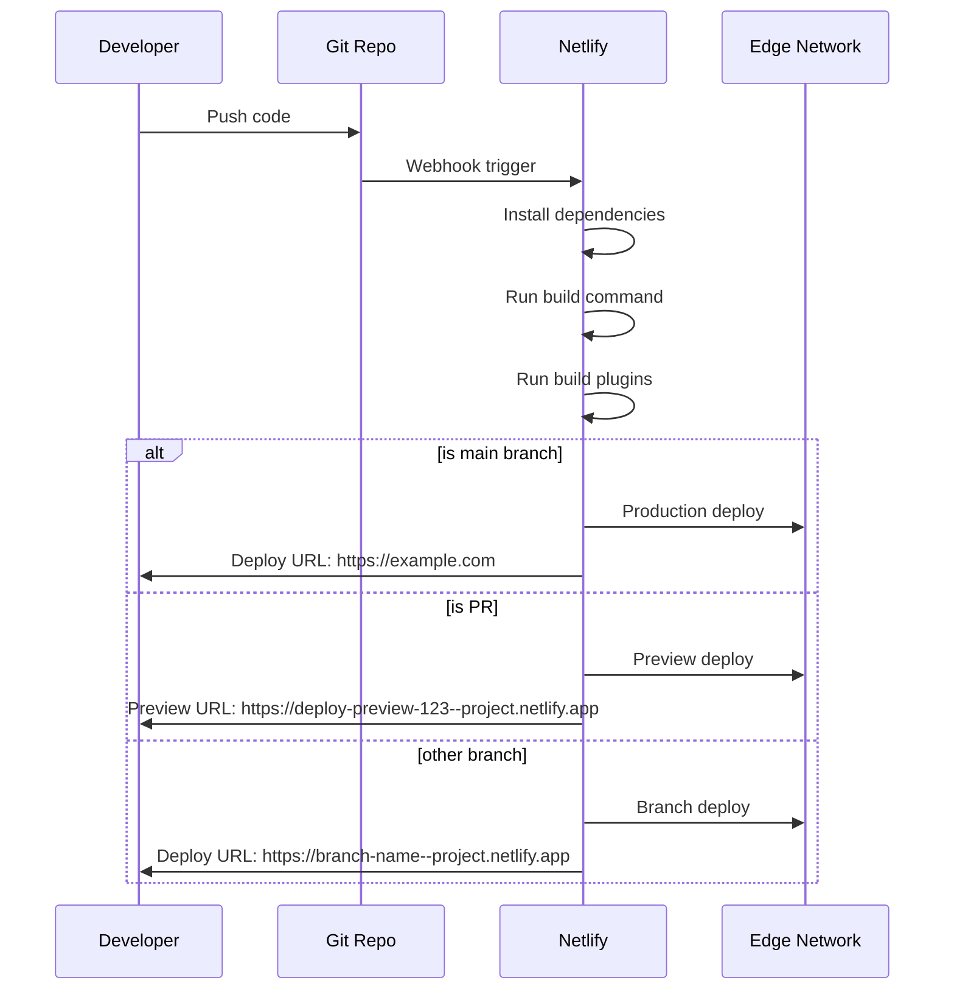

# Netlify Deployment

Netlify is a platform for frontend deployment with built-in CI/CD, serverless functions, form handling, split testing, and global edge network.

## Key Features

- **Git-based CI/CD** with automatic deploys
- **Deploy Previews** for every pull request
- **Serverless Functions** (JavaScript, TypeScript, Go)
- **Edge Functions** (Deno-based)
- **Form handling** (no backend required)
- **Split testing** (branch-based A/B testing)
- **Redirects & Headers** (with `_redirects` or `netlify.toml`)
- **Instant rollback** to any deploy
- **Netlify Identity** (authentication service)

## Netlify.toml Configuration

```toml
# netlify.toml
[build]
  command = "npm run build"
  publish = "dist"
  functions = "netlify/functions"
  base = "/"

[build.environment]
  NODE_VERSION = "20"
  NPM_VERSION = "10"

# Production settings
[context.production]
  environment = { NODE_ENV = "production" }

# Deploy preview settings
[context.deploy-preview]
  environment = { NODE_ENV = "preview" }

# Branch deploy settings
[context.branch-deploy]
  environment = { NODE_ENV = "staging" }

# Redirects
[[redirects]]
  from = "/api/*"
  to = "/.netlify/functions/:splat"
  status = 200

[[redirects]]
  from = "/*"
  to = "/index.html"
  status = 200

# Headers
[[headers]]
  for = "/*"
  [headers.values]
    X-Frame-Options = "DENY"
    X-Content-Type-Options = "nosniff"
    Referrer-Policy = "strict-origin-when-cross-origin"
    Permissions-Policy = "camera=(), microphone=(), geolocation=()"

[[headers]]
  for = "/assets/*"
  [headers.values]
    Cache-Control = "public, max-age=31536000, immutable"

[[headers]]
  for = "/index.html"
  [headers.values]
    Cache-Control = "no-cache, must-revalidate"

# Environment variables
[template.environment]
  VITE_API_URL = "https://api.example.com"
  VITE_SENTRY_DSN = "https://xxx@sentry.io/xxx"
```

## _redirects File

Alternative to `netlify.toml` redirects:

```
# _redirects (place in publish directory)
/api/*  /.netlify/functions/:splat  200
/*      /index.html                  200

# Redirects with status codes
/old-page  /new-page  301
/docs/v1/* /docs/v2/:splat  302

# Country-based redirect
/*  /de/:splat  200  Country=de
/*  /fr/:splat  200  Country=fr
```

## Serverless Functions

```javascript
// netlify/functions/hello.js
exports.handler = async (event, context) => {
  return {
    statusCode: 200,
    body: JSON.stringify({ message: 'Hello from Netlify!' }),
  };
};

// netlify/functions/login.js
exports.handler = async (event, context) => {
  if (event.httpMethod !== 'POST') {
    return { statusCode: 405, body: 'Method Not Allowed' };
  }
  
  try {
    const { email, password } = JSON.parse(event.body);
    
    const user = await authenticate(email, password);
    
    if (!user) {
      return {
        statusCode: 401,
        body: JSON.stringify({ error: 'Invalid credentials' }),
      };
    }
    
    const token = await createSession(user);
    
    return {
      statusCode: 200,
      headers: {
        'Set-Cookie': `session=${token}; HttpOnly; Secure; SameSite=Strict; Path=/`,
        'Content-Type': 'application/json',
      },
      body: JSON.stringify({ success: true, user }),
    };
  } catch (error) {
    return {
      statusCode: 500,
      body: JSON.stringify({ error: 'Internal server error' }),
    };
  }
};
```

### TypeScript Functions

```typescript
// netlify/functions/users.ts
import { Handler, HandlerEvent, HandlerContext } from '@netlify/functions';
import { createClient } from '@supabase/supabase-js';

const supabase = createClient(
  process.env.SUPABASE_URL!,
  process.env.SUPABASE_SERVICE_KEY!
);

const handler: Handler = async (event: HandlerEvent, context: HandlerContext) => {
  const headers = {
    'Content-Type': 'application/json',
    'Access-Control-Allow-Origin': '*',
  };

  try {
    const { data: users, error } = await supabase
      .from('users')
      .select('*')
      .limit(10);

    if (error) throw error;

    return {
      statusCode: 200,
      headers,
      body: JSON.stringify({ users }),
    };
  } catch (error) {
    return {
      statusCode: 500,
      headers,
      body: JSON.stringify({ error: error.message }),
    };
  }
};

export { handler };
```

## Edge Functions

```typescript
// netlify/edge-functions/hello.ts
import type { Context } from '@netlify/edge-functions';

export default async (request: Request, context: Context) => {
  const country = context.geo?.country?.name || 'Unknown';
  
  return new Response(
    JSON.stringify({
      message: `Hello from ${country}!`,
      timestamp: Date.now(),
    }),
    {
      headers: { 'content-type': 'application/json' },
    }
  );
};

// netlify/edge-functions/geolocation.ts
export default async (request: Request, context: Context) => {
  const response = await context.next();
  
  const country = context.geo?.country?.code;
  const city = context.geo?.city;
  
  // Country-specific pricing/content
  if (country === 'DE') {
    // Show German pricing
    response.headers.set('X-Pricing-Version', 'eu');
  }
  
  return response;
};
```

```toml
# netlify.toml - Edge function configuration
[[edge_functions]]
  function = "hello"
  path = "/edge"

[[edge_functions]]
  function = "geolocation"
  path = "/*"
```

## Form Handling

```html
<!-- HTML form - Netlify automatically detects and handles forms -->
<form name="contact" method="POST" netlify>
  <input type="hidden" name="form-name" value="contact" />
  <input type="text" name="name" required />
  <input type="email" name="email" required />
  <textarea name="message" required></textarea>
  <button type="submit">Send</button>
</form>
```

```javascript
// JavaScript form submission
async function submitForm(data) {
  const formData = new FormData();
  formData.append('form-name', 'contact');
  Object.entries(data).forEach(([key, value]) => {
    formData.append(key, value);
  });
  
  const response = await fetch('/', {
    method: 'POST',
    body: formData,
  });
  
  if (response.ok) {
    showSuccess();
  }
}

// Serverless function handles form submission
// netlify/functions/form-handler.js
exports.handler = async (event) => {
  const params = new URLSearchParams(event.body);
  const formData = Object.fromEntries(params);
  
  // Process form data
  await sendEmail({
    to: 'admin@example.com',
    subject: `New contact from ${formData.name}`,
    body: formData.message,
  });
  
  return {
    statusCode: 200,
    body: JSON.stringify({ success: true }),
  };
};
```

## Split Testing

```toml
# netlify.toml - Branch-based split testing
[split_test]
  enabled = true

[[split_test.branches]]
  branch = "main"
  percentage = 50

[[split_test.branches]]
  branch = "experiment-a"
  percentage = 25

[[split_test.branches]]
  branch = "experiment-b"
  percentage = 25
```

## Continuous Deployment



## Environment Variables

```bash
# Netlify UI: Site Settings → Environment Variables

# Production
VITE_API_URL=https://api.example.com
SENTRY_DSN=https://xxx@sentry.io/xxx

# Preview/Deploy
VITE_API_URL=https://staging-api.example.com
```

```javascript
// Access in application
const apiUrl = import.meta.env.VITE_API_URL;

// Access in functions
const apiKey = process.env.API_KEY;
```

## Netlify CLI

```bash
# Install CLI
npm install -g netlify-cli

# Login
netlify login

# Init project
netlify init

# Deploy
netlify deploy             # Preview deploy
netlify deploy --prod      # Production deploy
netlify deploy --dir=dist  # Deploy specific directory

# Dev server with functions
netlify dev

# Environment management
netlify env:list
netlify env:set API_KEY value
netlify env:unset API_KEY

# Functions
netlify functions:create
netlify functions:serve

# Add-ons
netlify addons:create fauna
netlify addons:auth fauna
```

## Build Plugins

```toml
# netlify.toml - Build plugins
[[plugins]]
  package = "@netlify/plugin-nextjs"

[[plugins]]
  package = "netlify-plugin-cache-nextjs"

[[plugins]]
  package = "netlify-plugin-a11y"
  
[[plugins]]
  package = "netlify-plugin-sitemap"
```

## Deployment Comparison

| Feature | Vercel | Netlify |
|---------|--------|---------|
| Git integration | GitHub, GitLab, Bitbucket | GitHub, GitLab, Bitbucket |
| Preview deploys | Yes | Yes |
| Edge Functions | V8 isolates | Deno |
| Serverless Functions | Node, Python, Go, Ruby | Node, Go, Rust |
| Form handling | No | Yes (built-in) |
| Split testing | No | Yes |
| Analytics | Real Web Vitals | Page views |
| Image optimization | Built-in | Plugin |
| Configuration | vercel.json | netlify.toml |
| CLI | vercel | netlify-cli |

## Resources
- [Netlify Documentation](https://docs.netlify.com/)
- [Netlify CLI](https://docs.netlify.com/cli/get-started/)
- [Netlify Functions](https://docs.netlify.com/functions/overview/)
- [Netlify Edge Functions](https://docs.netlify.com/edge-functions/overview/)
- [Netlify Forms](https://docs.netlify.com/forms/setup/)
