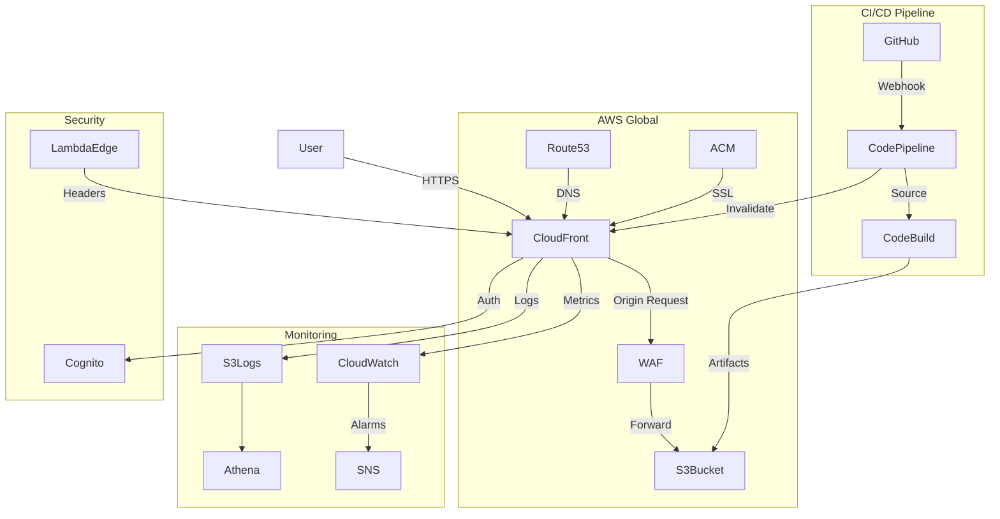

# AWS for Frontend

Amazon Web Services provides a comprehensive suite of services for hosting, securing, and scaling frontend applications.

## Architecture Overview

```mermaid
graph TB
    subgraph "DNS & CDN"
        A[Route 53]
        B[CloudFront CDN]
        C[WAF - Web Application Firewall]
    end
    
    subgraph "Storage & Compute"
        D[S3 Bucket]
        E[Lambda@Edge]
    end
    
    subgraph "CI/CD"
        F[CodeCommit]
        G[CodeBuild]
        H[CodePipeline]
    end
    
    subgraph "Monitoring"
        I[CloudWatch]
        J[Sentry]
        K[CloudFront Real-time Logs]
    end
    
    subgraph "Security"
        L[ACM - Certificate Manager]
        M[Cognito]
        N[Secrets Manager]
    end
    
    User -->|DNS resolution| A
    A -->|Route| B
    B -->|Protect| C
    C -->|Cache & Serve| D
    B -->|Edge compute| E
    D -->|Store| F
    F -->|Trigger| G
    G -->|Build| D
    H -->|Orchestrate| F
    H -->|Deploy| B
    B -->|Logs| I
    I -->|Alerts| J
    L -->|SSL/TLS| B
    M -->|Auth| E
```

## S3 Static Website Hosting

### S3 Bucket Configuration

```bash
# Create bucket
aws s3 mb s3://my-frontend-app.com

# Block public access (for CloudFront only)
aws s3api put-public-access-block \
  --bucket my-frontend-app.com \
  --public-access-block-configuration "BlockPublicAcls=true,IgnorePublicAcls=true,BlockPublicPolicy=true,RestrictPublicBuckets=true"

# Enable static website hosting (when using CloudFront OAC)
aws s3 website s3://my-frontend-app.com \
  --index-document index.html \
  --error-document index.html

# Set bucket policy for CloudFront access
{
  "Version": "2012-10-17",
  "Statement": [
    {
      "Effect": "Allow",
      "Principal": {
        "Service": "cloudfront.amazonaws.com"
      },
      "Action": "s3:GetObject",
      "Resource": "arn:aws:s3:::my-frontend-app.com/*",
      "Condition": {
        "StringEquals": {
          "AWS:SourceArn": "arn:aws:cloudfront::123456789:distribution/E1XAMPLE"
        }
      }
    }
  ]
}
```

### Deployment Script

```bash
#!/bin/bash
# deploy.sh

BUCKET="my-frontend-app.com"
DISTRIBUTION_ID="E1XAMPLE"
BUILD_DIR="./dist"

# Build
npm run build

# Sync assets with cache headers (1 year)
aws s3 sync $BUILD_DIR/assets s3://$BUCKET/assets/ \
  --delete \
  --cache-control "public, max-age=31536000, immutable"

# Sync non-asset files (no cache)
aws s3 sync $BUILD_DIR s3://$BUCKET/ \
  --exclude "assets/*" \
  --cache-control "no-cache, must-revalidate"

# Upload index.html with special cache control
aws s3 cp $BUILD_DIR/index.html s3://$BUCKET/index.html \
  --cache-control "no-cache, must-revalidate"

# Upload service worker (no cache)
aws s3 cp $BUILD_DIR/service-worker.js s3://$BUCKET/service-worker.js \
  --cache-control "no-cache"

# Invalidate CloudFront cache
aws cloudfront create-invalidation \
  --distribution-id $DISTRIBUTION_ID \
  --paths "/*"
```

## CloudFront CDN

### CloudFront Distribution Setup

```bash
# Create CloudFront distribution
aws cloudfront create-distribution \
  --origin-domain-name my-frontend-app.com.s3.amazonaws.com \
  --default-root-object index.html \
  --price-class PriceClass_100 \
  --enabled

# Create invalidation
aws cloudfront create-invalidation \
  --distribution-id E1XAMPLE \
  --paths "/*"
```

### CloudFront Configuration

```json
{
  "CloudFrontConfig": {
    "Enabled": true,
    "Comment": "Frontend App CDN",
    "DefaultRootObject": "index.html",
    "PriceClass": "PriceClass_100",
    "Origins": {
      "Items": [
        {
          "Id": "S3Origin",
          "DomainName": "my-frontend-app.com.s3.amazonaws.com",
          "OriginAccessControlId": "oac-123",
          "ConnectionAttempts": 3,
          "ConnectionTimeout": 10
        }
      ],
      "Quantity": 1
    },
    "DefaultCacheBehavior": {
      "TargetOriginId": "S3Origin",
      "ViewerProtocolPolicy": "redirect-to-https",
      "Compress": true,
      "AllowedMethods": {
        "Items": ["GET", "HEAD", "OPTIONS"],
        "Quantity": 3,
        "CachedMethods": {
          "Items": ["GET", "HEAD", "OPTIONS"],
          "Quantity": 3
        }
      },
      "CachePolicyId": "658327ea-f89d-4fab-a63d-7e88639e58f5",
      "ResponseHeadersPolicyId": "67f7725c-6f97-4210-82d7-5512b31e9d03"
    },
    "CustomErrorResponses": {
      "Items": [
        {
          "ErrorCode": 403,
          "ResponsePagePath": "/index.html",
          "ResponseCode": 200,
          "ErrorCachingMinTTL": 0
        },
        {
          "ErrorCode": 404,
          "ResponsePagePath": "/index.html",
          "ResponseCode": 200,
          "ErrorCachingMinTTL": 0
        }
      ],
      "Quantity": 2
    }
  }
}
```

### Lambda@Edge for Security Headers

```javascript
// lambda-edge/add-security-headers.js
'use strict';

exports.handler = (event, context, callback) => {
  const response = event.Records[0].cf.response;
  const headers = response.headers;

  headers['strict-transport-security'] = [{
    key: 'Strict-Transport-Security',
    value: 'max-age=31536000; includeSubDomains; preload'
  }];

  headers['x-content-type-options'] = [{
    key: 'X-Content-Type-Options',
    value: 'nosniff'
  }];

  headers['x-frame-options'] = [{
    key: 'X-Frame-Options',
    value: 'DENY'
  }];

  headers['referrer-policy'] = [{
    key: 'Referrer-Policy',
    value: 'strict-origin-when-cross-origin'
  }];

  headers['content-security-policy'] = [{
    key: 'Content-Security-Policy',
    value: "default-src 'self'; script-src 'self'; style-src 'self' 'unsafe-inline'; img-src 'self' data:;"
  }];

  headers['permissions-policy'] = [{
    key: 'Permissions-Policy',
    value: 'camera=(), microphone=(), geolocation=()'
  }];

  callback(null, response);
};
```

## Route 53 DNS

```bash
# Create hosted zone
aws route53 create-hosted-zone \
  --name example.com \
  --caller-reference unique-id

# Create A record alias to CloudFront
aws route53 change-resource-record-sets \
  --hosted-zone-id Z123456 \
  --change-batch '{
    "Changes": [{
      "Action": "UPSERT",
      "ResourceRecordSet": {
        "Name": "example.com",
        "Type": "A",
        "AliasTarget": {
          "HostedZoneId": "Z2FDTNDATAQYW2",
          "DNSName": "d123.cloudfront.net",
          "EvaluateTargetHealth": false
        }
      }
    }]
  }'

# Create www subdomain
aws route53 change-resource-record-sets \
  --hosted-zone-id Z123456 \
  --change-batch '{
    "Changes": [{
      "Action": "UPSERT",
      "ResourceRecordSet": {
        "Name": "www.example.com",
        "Type": "CNAME",
        "TTL": 300,
        "ResourceRecords": [{"Value": "d123.cloudfront.net"}]
      }
    }]
  }'
```

## Certificate Manager (ACM)

```bash
# Request certificate
aws acm request-certificate \
  --domain-name example.com \
  --subject-alternative-names "*.example.com" \
  --validation-method DNS \
  --region us-east-1

# List certificates
aws acm list-certificates

# Describe certificate
aws acm describe-certificate \
  --certificate-arn arn:aws:acm:us-east-1:123456789:certificate/uuid
```

## WAF (Web Application Firewall)

```json
{
  "WAF": {
    "WebACL": {
      "Name": "FrontendAppWAF",
      "DefaultAction": { "Allow": {} },
      "Rules": [
        {
          "Name": "AWS-AWSManagedRulesCommonRuleSet",
          "Priority": 1,
          "Statement": {
            "ManagedRuleGroupStatement": {
              "VendorName": "AWS",
              "Name": "AWSManagedRulesCommonRuleSet"
            }
          },
          "OverrideAction": { "None": {} },
          "VisibilityConfig": {
            "SampledRequestsEnabled": true,
            "CloudWatchMetricsEnabled": true,
            "MetricName": "AWSCommonRules"
          }
        },
        {
          "Name": "RateLimit",
          "Priority": 2,
          "Statement": {
            "RateBasedStatement": {
              "Limit": 10000,
              "AggregateKeyType": "IP"
            }
          },
          "Action": { "Block": {} },
          "VisibilityConfig": {
            "SampledRequestsEnabled": true,
            "CloudWatchMetricsEnabled": true,
            "MetricName": "RateLimit"
          }
        },
        {
          "Name": "BlockBadBots",
          "Priority": 3,
          "Statement": {
            "RegexPatternSetReferenceStatement": {
              "ARN": "arn:aws:wafv2:us-east-1:123456789:regex/set/bad-bots",
              "FieldToMatch": { "SingleHeader": { "Name": "user-agent" } }
            }
          },
          "Action": { "Block": {} },
          "VisibilityConfig": { "SampledRequestsEnabled": true, "CloudWatchMetricsEnabled": true, "MetricName": "BlockBadBots" }
        }
      ]
    }
  }
}
```

## CI/CD with CodePipeline

```yaml
# buildspec.yml (for CodeBuild)
version: 0.2

phases:
  install:
    runtime-versions:
      nodejs: 20
    commands:
      - npm ci
      - npm install -g @angular/cli

  pre_build:
    commands:
      - npm run lint
      - npm run test -- --no-watch --no-progress --code-coverage
      - npm run e2e -- --protractor-config=e2e/protractor.ci.conf.js

  build:
    commands:
      - npm run build -- --configuration production

  post_build:
    commands:
      - aws s3 sync dist/ s3://$BUCKET_NAME/ --delete
      - aws cloudfront create-invalidation --distribution-id $CLOUDFRONT_DIST --paths "/*"

artifacts:
  files:
    - 'dist/**/*'
    - '!dist/**/*.map'
```

### CodePipeline Setup

```yaml
# pipeline.yml
Resources:
  FrontendPipeline:
    Type: AWS::CodePipeline::Pipeline
    Properties:
      Name: frontend-pipeline
      RoleArn: !GetAtt PipelineRole.Arn
      Stages:
        - Name: Source
          Actions:
            - Name: GitHubSource
              ActionTypeId:
                Category: Source
                Owner: ThirdParty
                Provider: GitHub
                Version: 1
              Configuration:
                Owner: my-org
                Repo: frontend-app
                Branch: main
                OAuthToken: !Ref GitHubToken
              OutputArtifacts:
                - Name: SourceOutput

        - Name: Build
          Actions:
            - Name: Build
              ActionTypeId:
                Category: Build
                Owner: AWS
                Provider: CodeBuild
                Version: 1
              InputArtifacts:
                - Name: SourceOutput
              OutputArtifacts:
                - Name: BuildOutput
              Configuration:
                ProjectName: !Ref BuildProject

        - Name: Deploy
          Actions:
            - Name: DeployToS3
              ActionTypeId:
                Category: Deploy
                Owner: AWS
                Provider: S3
                Version: 1
              InputArtifacts:
                - Name: BuildOutput
              Configuration:
                BucketName: !Ref WebsiteBucket
                Extract: true
                CachingConfiguration: '{"CachingEnabled": false}'
```

## Cost Optimization

| Service | Cost Factors | Optimization |
|---------|-------------|--------------|
| S3 | Storage, requests, data transfer | Use infrequent access for old versions |
| CloudFront | Data transfer, requests | Price Class 100 (US/Europe only) |
| WAF | Web ACL, rules | Only enable needed managed rules |
| Route 53 | Hosted zones, queries | Minimal zones |
| CodeBuild | Build minutes | Cache dependencies, use smaller instances |
| ACM | Free | — |

## AWS Architecture Diagram



## Resources
- [AWS S3 Static Hosting](https://docs.aws.amazon.com/AmazonS3/latest/userguide/WebsiteHosting.html)
- [CloudFront Developer Guide](https://docs.aws.amazon.com/AmazonCloudFront/latest/DeveloperGuide/)
- [AWS WAF](https://aws.amazon.com/waf/)
- [AWS CodePipeline](https://aws.amazon.com/codepipeline/)
- [Frontend on AWS - Architecture Center](https://aws.amazon.com/architecture/web-applications/)
