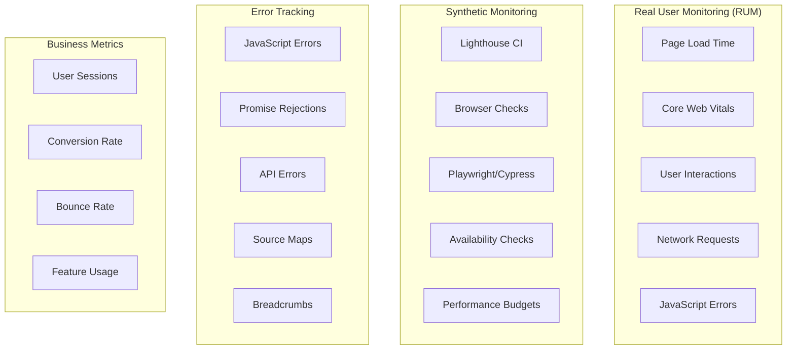
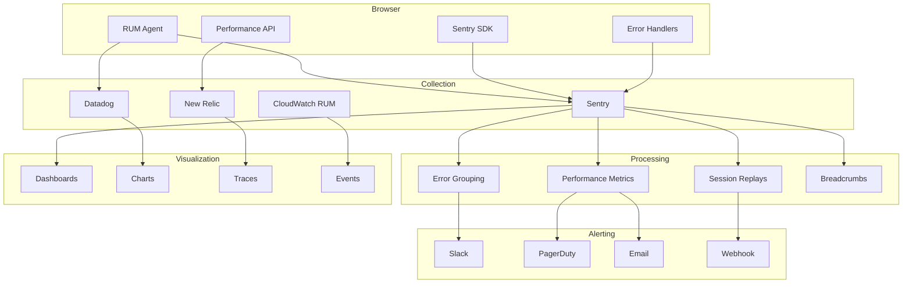

# Frontend Monitoring

Frontend monitoring tracks application performance, errors, and user behavior in real-time to ensure a smooth user experience and quickly identify issues.

## Monitoring Categories



## Core Web Vitals

```javascript
// Measure Web Vitals in the browser
import { onLCP, onFID, onCLS, onINP, onFCP, onTTFB } from 'web-vitals';

function sendToAnalytics(metric) {
  const body = {
    name: metric.name,
    value: metric.value,
    rating: metric.rating,
    delta: metric.delta,
    id: metric.id,
    navigationType: metric.navigationType,
    url: window.location.pathname,
    userAgent: navigator.userAgent,
  };

  // Send to analytics endpoint
  if (navigator.sendBeacon) {
    navigator.sendBeacon('/api/vitals', JSON.stringify(body));
  } else {
    fetch('/api/vitals', {
      method: 'POST',
      body: JSON.stringify(body),
      keepalive: true,
    });
  }
}

// Start measuring
onLCP(sendToAnalytics);
onFID(sendToAnalytics);
onCLS(sendToAnalytics);
onINP(sendToAnalytics);
onFCP(sendToAnalytics);
onTTFB(sendToAnalytics);
```

### Core Web Vitals Targets

| Metric | Good | Needs Improvement | Poor |
|--------|------|-------------------|------|
| LCP (Largest Contentful Paint) | ≤ 2.5s | 2.5s - 4.0s | > 4.0s |
| INP (Interaction to Next Paint) | ≤ 200ms | 200ms - 500ms | > 500ms |
| CLS (Cumulative Layout Shift) | ≤ 0.1 | 0.1 - 0.25 | > 0.25 |
| FCP (First Contentful Paint) | ≤ 1.8s | 1.8s - 3.0s | > 3.0s |
| TTFB (Time to First Byte) | ≤ 800ms | 800ms - 1.8s | > 1.8s |

## Sentry Error Tracking

### Setup

```javascript
// sentry.js
import * as Sentry from '@sentry/react';
import { createRoutesFromChildren, matchRoutes, useLocation, useNavigationType } from 'react-router-dom';

Sentry.init({
  dsn: process.env.SENTRY_DSN,
  environment: process.env.NODE_ENV,
  release: process.env.RELEASE_VERSION,
  integrations: [
    new Sentry.BrowserTracing({
      routingInstrumentation: Sentry.reactRouterV6Instrumentation(
        React.useEffect,
        useLocation,
        useNavigationType,
        createRoutesFromChildren,
        matchRoutes
      ),
    }),
    new Sentry.Replay({
      maskAllText: false,
      blockAllMedia: false,
    }),
    new Sentry.HttpClient(),
  ],
  tracesSampleRate: 0.2, // Sample 20% of transactions
  replaysSessionSampleRate: 0.1, // 10% of sessions
  replaysOnErrorSampleRate: 1.0, // 100% of errors
  attachStacktrace: true,
  enabled: process.env.NODE_ENV === 'production',
  beforeSend(event, hint) {
    // Don't send if user has disabled tracking
    if (localStorage.getItem('do-not-track') === 'true') {
      return null;
    }
    
    // Sanitize PII
    if (event.request?.headers) {
      delete event.request.headers['Authorization'];
      delete event.request.headers['Cookie'];
    }
    
    return event;
  },
});
```

### Manual Error Reporting

```javascript
// Capture exceptions
try {
  riskyOperation();
} catch (error) {
  Sentry.captureException(error, {
    tags: { component: 'PaymentForm', action: 'submit' },
    extra: { orderId: '12345', amount: 99.99 },
  });
}

// Capture messages
Sentry.captureMessage('User logged in', {
  level: 'info',
  tags: { userId: user.id },
});

// Set user context
Sentry.setUser({ id: user.id, email: user.email, role: user.role });

// Add breadcrumbs
Sentry.addBreadcrumb({
  category: 'navigation',
  message: 'User navigated to /checkout',
  level: 'info',
});

// Performance monitoring
const transaction = Sentry.startTransaction({
  name: 'Page Load',
  op: 'pageload',
});

Sentry.startTransaction({ name: 'checkout' });
// ... do checkout work
transaction.finish();
```

### React Error Boundary

```jsx
import { ErrorBoundary } from '@sentry/react';

function FallbackComponent({ error, resetError }) {
  return (
    <div role="alert">
      <h2>Something went wrong</h2>
      <details>
        <summary>Error details</summary>
        <pre>{error.message}</pre>
      </details>
      <button onClick={resetError}>Try again</button>
    </div>
  );
}

function App() {
  return (
    <ErrorBoundary
      fallback={FallbackComponent}
      onError={(error, info) => {
        console.error('Error boundary caught:', error, info);
      }}
    >
      <MainContent />
    </ErrorBoundary>
  );
}
```

## Datadog RUM

```javascript
// datadog-rum.js
import { datadogRum } from '@datadog/browser-rum';

datadogRum.init({
  applicationId: 'your-app-id',
  clientToken: 'your-client-token',
  site: 'datadoghq.com',
  service: 'frontend-app',
  env: process.env.NODE_ENV,
  version: process.env.RELEASE_VERSION,
  sessionSampleRate: 100,
  sessionReplaySampleRate: 20,
  trackUserInteractions: true,
  trackResources: true,
  trackLongTasks: true,
  defaultPrivacyLevel: 'mask-user-input',
  allowedTracingUrls: [
    { match: /https:\/\/api\.example\.com/, propagatorTypes: 'tracecontext' },
  ],
});

// Custom actions
datadogRum.addAction('checkout-completed', {
  orderId: '12345',
  total: 99.99,
  items: 3,
});

// Error tracking
datadogRum.addError(new Error('Payment failed'), {
  paymentMethod: 'credit_card',
  amount: 99.99,
});
```

## New Relic Browser

```html
<!-- Load New Relic agent -->
<script>
window.NREUM || (NREUM = {});
NREUM.init = {
  privacy: { cookies_enabled: true },
  ajax: { deny_list: ["bam.nr-data.net"] },
};
</script>
<script src="https://js-agent.newrelic.com/nr-spa-1218.min.js"></script>
```

```javascript
// New Relic API
// Record custom events
newrelic.addPageAction('checkout', {
  cartValue: 99.99,
  itemCount: 3,
});

// Custom attributes
newrelic.setCustomAttribute('userRole', 'admin');

// Error tracking
newrelic.noticeError(new Error('API timeout'), {
  endpoint: '/api/orders',
  timeout: 10000,
});

// Interaction tracking
newrelic.interaction()
  .setName('submitOrder')
  .save();
```

## Performance Monitoring Dashboard

```javascript
// Custom performance monitoring
class PerformanceMonitor {
  constructor(options = {}) {
    this.endpoint = options.endpoint || '/api/performance';
    this.sampleRate = options.sampleRate || 0.1;

    this.metrics = {
      navigation: [],
      resources: [],
      errors: [],
      interactions: [],
    };

    this.init();
  }

  init() {
    // Page load metrics
    window.addEventListener('load', () => {
      const perf = performance.getEntriesByType('navigation')[0];
      this.recordMetric('navigation', {
        type: 'page-load',
        url: window.location.pathname,
        domContentLoaded: perf.domContentLoadedEventEnd,
        loadComplete: perf.loadEventEnd,
        domInteractive: perf.domInteractive,
        duration: perf.duration,
        timestamp: Date.now(),
      });
    });

    // Long tasks
    if ('PerformanceObserver' in window) {
      const observer = new PerformanceObserver((list) => {
        for (const entry of list.getEntries()) {
          if (entry.duration > 50) {
            this.recordMetric('long-task', {
              duration: entry.duration,
              startTime: entry.startTime,
              attribution: entry.attribution,
            });
          }
        }
      });
      observer.observe({ entryTypes: ['longtask'] });
    }

    // Network failures
    const originalFetch = window.fetch;
    window.fetch = async (...args) => {
      const startTime = performance.now();
      try {
        const response = await originalFetch(...args);
        if (!response.ok) {
          this.recordMetric('api-error', {
            url: args[0],
            status: response.status,
            duration: performance.now() - startTime,
          });
        }
        return response;
      } catch (error) {
        this.recordMetric('api-error', {
          url: args[0],
          error: error.message,
          duration: performance.now() - startTime,
        });
        throw error;
      }
    };

    // Batch and send metrics periodically
    setInterval(() => this.flush(), 30000);
    window.addEventListener('beforeunload', () => this.flush(true));
  }

  recordMetric(category, data) {
    this.metrics[category]?.push(data);
  }

  flush(useBeacon = false) {
    for (const [category, events] of Object.entries(this.metrics)) {
      if (events.length === 0) continue;

      const body = JSON.stringify({ category, events, timestamp: Date.now() });

      if (useBeacon && navigator.sendBeacon) {
        navigator.sendBeacon(this.endpoint, body);
      } else {
        fetch(this.endpoint, {
          method: 'POST',
          body,
          keepalive: true,
        }).catch(() => {});
      }

      this.metrics[category] = [];
    }
  }
}

export default PerformanceMonitor;
```

## Synthetic Monitoring

### Lighthouse CI

```javascript
// lighthouserc.js
module.exports = {
  ci: {
    collect: {
      numberOfRuns: 3,
      startServerCommand: 'npm run start',
      url: ['http://localhost:3000/'],
    },
    assert: {
      preset: 'lighthouse:no-pwa',
      assertions: {
        'categories:performance': ['error', { minScore: 0.9 }],
        'categories:accessibility': ['error', { minScore: 0.9 }],
        'categories:seo': ['error', { minScore: 0.9 }],
        'first-contentful-paint': ['error', { maxNumericValue: 2000 }],
        'largest-contentful-paint': ['error', { maxNumericValue: 3000 }],
        'cumulative-layout-shift': ['error', { maxNumericValue: 0.1 }],
        'total-blocking-time': ['error', { maxNumericValue: 300 }],
      },
    },
    upload: {
      target: 'temporary-public-storage',
    },
  },
};
```

### Playwright Monitoring

```javascript
// playwright-monitor.js
const { chromium } = require('playwright');

async function monitorPages() {
  const browser = await chromium.launch();
  const context = await browser.newContext({ viewport: { width: 1280, height: 720 } });
  const pages = [
    '/',
    '/dashboard',
    '/products',
    '/checkout',
  ];

  for (const path of pages) {
    const page = await context.newPage();
    const startTime = Date.now();

    page.on('response', response => {
      if (!response.ok()) {
        console.error(`Failed: ${response.url()} - ${response.status()}`);
      }
    });

    page.on('console', msg => {
      if (msg.type() === 'error') {
        console.error(`Console error on ${path}:`, msg.text());
      }
    });

    try {
      await page.goto(`https://example.com${path}`, {
        waitUntil: 'networkidle',
        timeout: 30000,
      });

      const loadTime = Date.now() - startTime;
      const metrics = await page.metrics();

      console.log(`${path}: ${loadTime}ms, ${metrics}`);

      await page.screenshot({
        path: `screenshots/${path.replace(/\//g, '_')}.png`,
        fullPage: true,
      });
    } catch (error) {
      console.error(`Error monitoring ${path}:`, error);
    }

    await page.close();
  }

  await browser.close();
}

monitorPages();
```

## Alerting Configuration

```yaml
# Sentry alert rules
# Project Settings → Alerts

- When: Error is created
  If: count() > 10
  In: 1 hour
  Then: Send email + Slack to #frontend-alerts

- When: Error is created
  If: level = "fatal"
  Then: Send PagerDuty incident

- When: Performance issue
  If: transaction.duration > 3000ms
  In: 5 minutes
  Then: Send Slack to #performance

- When: Crash rate
  If: crash_free_session_rate() < 0.99
  In: 1 hour
  Then: Send email + Slack
```

## Monitoring Architecture



## Monitoring Checklist

- [ ] Set up error tracking (Sentry, Bugsnag, etc.)
- [ ] Implement RUM for Core Web Vitals
- [ ] Configure source maps for error debugging
- [ ] Set up uptime monitoring (synthetic checks)
- [ ] Create performance budgets
- [ ] Implement session replay for error context
- [ ] Set up alerting with appropriate thresholds
- [ ] Create dashboards for key metrics
- [ ] Monitor API failure rates
- [ ] Track user interactions for business metrics
- [ ] Ensure PII is not collected
- [ ] Test monitoring in staging before production

## Resources
- [web-vitals library](https://github.com/GoogleChrome/web-vitals)
- [Sentry for React](https://docs.sentry.io/platforms/javascript/guides/react/)
- [Datadog RUM](https://docs.datadoghq.com/real_user_monitoring/)
- [Lighthouse CI](https://github.com/GoogleChrome/lighthouse-ci)
- [Playwright](https://playwright.dev/)
