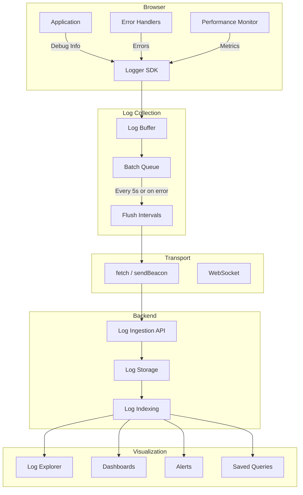

# Frontend Logging

Client-side logging captures application events, errors, and user behavior from the browser to help diagnose issues and understand usage patterns.

## Why Frontend Logging Matters

- **Debug production issues** that are hard to reproduce
- **Understand user behavior** and error paths
- **Track API failures** and network issues
- **Monitor performance** degradation
- **Audit user actions** for compliance
- **Aggregate errors** across browsers and devices

## Log Levels

```javascript
// Standard log levels
const LOG_LEVELS = {
  DEBUG: { priority: 0, label: 'DEBUG' },
  INFO: { priority: 1, label: 'INFO' },
  WARN: { priority: 2, label: 'WARN' },
  ERROR: { priority: 3, label: 'ERROR' },
  FATAL: { priority: 4, label: 'FATAL' },
};

// Production-only WARN and above
const PRODUCTION_LEVEL = LOG_LEVELS.WARN;

class Logger {
  constructor(options = {}) {
    this.level = options.level || (process.env.NODE_ENV === 'production'
      ? LOG_LEVELS.WARN
      : LOG_LEVELS.DEBUG);
    this.enabled = options.enabled !== false;
    this.endpoint = options.endpoint || '/api/logs';
    this.sessionId = this.generateSessionId();
    this.buffer = [];
    this.flushInterval = setInterval(() => this.flush(), 5000);
  }

  debug(message, data = {}) {
    this.log(LOG_LEVELS.DEBUG, message, data);
  }

  info(message, data = {}) {
    this.log(LOG_LEVELS.INFO, message, data);
  }

  warn(message, data = {}) {
    this.log(LOG_LEVELS.WARN, message, data);
  }

  error(message, data = {}) {
    this.log(LOG_LEVELS.ERROR, message, data);
  }

  fatal(message, data = {}) {
    this.log(LOG_LEVELS.FATAL, message, data);
  }

  log(level, message, data = {}) {
    if (!this.enabled || level.priority < this.level.priority) return;

    const entry = {
      timestamp: new Date().toISOString(),
      level: level.label,
      message,
      sessionId: this.sessionId,
      url: window.location.href,
      userAgent: navigator.userAgent,
      screenSize: `${window.innerWidth}x${window.innerHeight}`,
      data: this.sanitize(data),
    };

    // Console output in development
    if (process.env.NODE_ENV === 'development') {
      const fn = level === LOG_LEVELS.ERROR ? 'error'
        : level === LOG_LEVELS.WARN ? 'warn'
        : 'log';
      console[fn](`[${level.label}]`, message, data);
    }

    this.buffer.push(entry);

    // Immediately flush errors
    if (level.priority >= LOG_LEVELS.ERROR.priority) {
      this.flush();
    }
  }

  sanitize(data) {
    const sensitiveKeys = ['password', 'token', 'secret', 'authorization', 'cookie', 'ssn'];
    const sanitized = { ...data };

    for (const key of Object.keys(sanitized)) {
      if (sensitiveKeys.some(sk => key.toLowerCase().includes(sk))) {
        sanitized[key] = '[REDACTED]';
      }
      if (typeof sanitized[key] === 'object' && sanitized[key] !== null) {
        sanitized[key] = this.sanitize(sanitized[key]);
      }
    }

    return sanitized;
  }

  async flush() {
    if (this.buffer.length === 0) return;

    const batch = this.buffer.splice(0, this.buffer.length);

    try {
      if (navigator.sendBeacon) {
        navigator.sendBeacon(this.endpoint, JSON.stringify({ logs: batch }));
      } else {
        await fetch(this.endpoint, {
          method: 'POST',
          headers: { 'Content-Type': 'application/json' },
          body: JSON.stringify({ logs: batch }),
          keepalive: true,
        });
      }
    } catch (e) {
      // Re-add to buffer if failed
      this.buffer.unshift(...batch);
    }
  }

  generateSessionId() {
    return `sess_${Date.now()}_${Math.random().toString(36).substr(2, 9)}`;
  }

  destroy() {
    clearInterval(this.flushInterval);
    this.flush();
  }
}

export default Logger;
```

## Structured Logging

```javascript
// Structured log format
{
  timestamp: "2026-07-26T14:30:00.000Z",
  level: "ERROR",
  message: "Failed to load user profile",
  sessionId: "sess_1721982600000_abc123",
  url: "https://example.com/dashboard",
  userAgent: "Mozilla/5.0 Chrome/120.0.0.0",
  screenSize: "1920x1080",
  data: {
    userId: "user_123",
    apiEndpoint: "/api/users/profile",
    statusCode: 500,
    retryCount: 3,
    duration: 5234,
    component: "UserProfile",
    action: "fetchProfile"
  },
  error: {
    name: "APIError",
    message: "Internal server error",
    stack: "Error: Internal server error\n    at fetchProfile (UserProfile.tsx:45)\n    at ..."
  },
  breadcrumbs: [
    { timestamp: "14:29:58.000", category: "navigation", message: "Navigated to /dashboard" },
    { timestamp: "14:29:59.500", category: "api", message: "GET /api/users/profile started" },
    { timestamp: "14:30:00.000", category: "api", message: "GET /api/users/profile failed 500" }
  ]
}
```

## Console Best Practices

```javascript
// DO: Use structured logging
console.log({ event: 'checkout_started', cartValue: 99.99, items: 3 });
console.error({ event: 'payment_failed', error: error.message, orderId: '123' });

// DO: Group related logs
console.group('Checkout Flow');
console.log('Step 1: Cart validation', { items: 3, total: 99.99 });
console.log('Step 2: Payment processing', { method: 'credit_card' });
console.log('Step 3: Order confirmation', { orderId: '12345' });
console.groupEnd();

// DO: Use console.table for arrays
console.table(products);

// DO: Time operations
console.time('order-submit');
await submitOrder();
console.timeEnd('order-submit');

// DON'T: Log sensitive data
console.log('User password:', password); // NEVER

// DON'T: Log in production without a logger
console.log('button clicked'); // Noisy, no context

// DON'T: Use console in production code (use logger instead)
```

## Log Aggregation Services

### Logtail (Better Stack)

```javascript
// logtail-logger.js
import { Logtail } from '@logtail/browser';

const logtail = new Logtail('source-token');

logtail.setContext({
  environment: process.env.NODE_ENV,
  version: process.env.RELEASE_VERSION,
  userId: getUser()?.id,
});

// Log events
logtail.info('Page viewed', { page: '/dashboard' });
logtail.warn('Slow API response', { endpoint: '/api/data', duration: 5200 });
logtail.error('Failed to load', new Error('Network error'), { retryCount: 3 });

// Flush before page unload
window.addEventListener('beforeunload', () => {
  logtail.flush();
});
```

### Datadog Logs

```javascript
// datadog-logs.js
import { datadogLogs } from '@datadog/browser-logs';

datadogLogs.init({
  clientToken: 'your-client-token',
  site: 'datadoghq.com',
  forwardErrorsToLogs: true,
  sessionSampleRate: 100,
  service: 'frontend-app',
  env: process.env.NODE_ENV,
  version: process.env.RELEASE_VERSION,
});

// Set user
datadogLogs.setUser({ id: user.id, email: user.email });

// Log events
datadogLogs.logger.info('Page loaded', { page: '/dashboard' });
datadogLogs.logger.warn('Performance issue', { lcp: 3200, url: '/' });
datadogLogs.logger.error('API error', { status: 500, endpoint: '/users' });

// Create loggers with different levels
const apiLogger = datadogLogs.createLogger('api', 'info');
apiLogger.info('Request started', { method: 'GET', url: '/users' });
```

## PII Avoidance

```javascript
// PII Sanitizer
class PIISanitizer {
  constructor() {
    this.patterns = {
      email: /[a-zA-Z0-9._%+-]+@[a-zA-Z0-9.-]+\.[a-zA-Z]{2,}/g,
      ssn: /\d{3}-\d{2}-\d{4}/g,
      phone: /(\+?1)?[-.\s]?\(?\d{3}\)?[-.\s]?\d{3}[-.\s]?\d{4}/g,
      creditCard: /\d{4}[-.\s]?\d{4}[-.\s]?\d{4}[-.\s]?\d{4}/g,
      ipAddress: /\b\d{1,3}\.\d{1,3}\.\d{1,3}\.\d{1,3}\b/g,
    };
  }

  sanitize(data, path = '') {
    if (typeof data === 'string') {
      return this.redactString(data);
    }

    if (typeof data === 'object' && data !== null) {
      const result = Array.isArray(data) ? [] : {};

      for (const [key, value] of Object.entries(data)) {
        if (this.isSensitiveKey(key)) {
          result[key] = '[REDACTED]';
        } else {
          result[key] = this.sanitize(value, `${path}.${key}`);
        }
      }

      return result;
    }

    return data;
  }

  redactString(str) {
    let result = str;

    for (const [type, pattern] of Object.entries(this.patterns)) {
      if (pattern.test(result)) {
        result = result.replace(pattern, `[REDACTED:${type}]`);
      }
    }

    return result;
  }

  isSensitiveKey(key) {
    const sensitive = [
      'password', 'secret', 'token', 'authorization', 'auth',
      'ssn', 'social', 'credit_card', 'cvv', 'pin',
      'access_key', 'private_key', 'api_key',
    ];
    return sensitive.some(s => key.toLowerCase().includes(s));
  }
}

export const sanitizer = new PIISanitizer();
```

## Log Enrichment

```javascript
// Add context to logs automatically
function enrichLogEntry(entry) {
  return {
    ...entry,
    environment: process.env.NODE_ENV,
    version: process.env.RELEASE_VERSION,
    timestamp: new Date().toISOString(),
    sessionId: getSessionId(),
    url: window.location.href,
    referrer: document.referrer,
    userAgent: navigator.userAgent,
    language: navigator.language,
    screenSize: `${window.innerWidth}x${window.innerHeight}`,
    viewport: `${window.innerWidth}x${window.innerHeight}`,
    deviceMemory: navigator.deviceMemory,
    hardwareConcurrency: navigator.hardwareConcurrency,
    connection: {
      effectiveType: navigator.connection?.effectiveType,
      downlink: navigator.connection?.downlink,
      rtt: navigator.connection?.rtt,
    },
    performance: {
      memory: performance.memory?.usedJSHeapSize,
      navigation: performance.getEntriesByType('navigation')[0]?.type,
    },
  };
}
```

## Logging Architecture



## Logging Best Practices

- **Log events, not text:** Use structured data instead of string messages
- **Add context:** Include session, user, page, action context
- **Batch logs:** Send in batches for efficiency
- **Use sendBeacon:** For logs during page unload
- **Sample appropriately:** Don't log every event in high-traffic apps
- **Rotate levels:** DEBUG in dev, WARN+ in production
- **Sanitize PII:** Never log passwords, tokens, or personal data
- **Add breadcrumbs:** Keep a trail of user actions before errors
- **Include stack traces:** For meaningful error debugging
- **Set retention policies:** Don't store logs forever
- **Monitor log volume:** Spikes may indicate attacks or bugs

## Resources
- [Logtail Browser SDK](https://github.com/logtail/logtail-js)
- [Datadog Browser Logs](https://docs.datadoghq.com/logs/log_collection/javascript/)
- [PII Best Practices](https://owasp.org/www-project-top-ten/)
- [MDN: sendBeacon](https://developer.mozilla.org/en-US/docs/Web/API/Navigator/sendBeacon)
