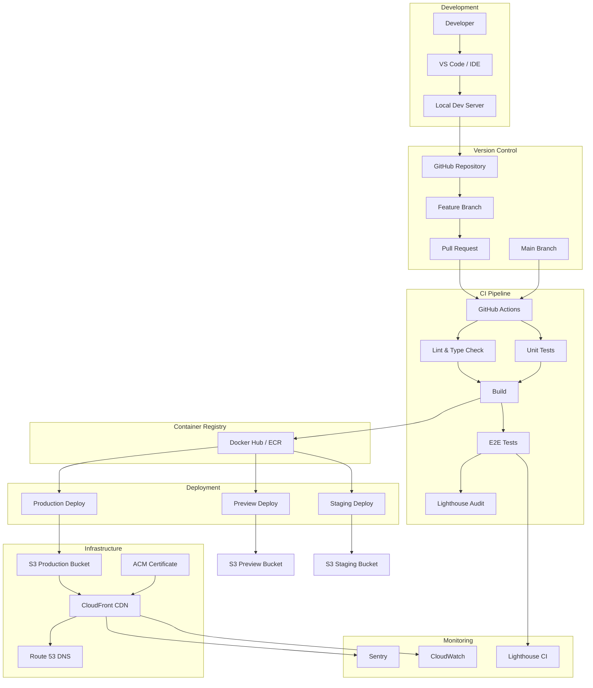

# Production Projects: Full Deployment Pipeline

Build and deploy a production-ready frontend application with complete CI/CD pipeline, Docker containerization, monitoring with Sentry, error tracking, and automated testing.

## Project Overview

**Goal:** Create a fully automated deployment pipeline for a frontend application with monitoring, error tracking, and performance measurement.

**Tech Stack:**
- React + Vite (frontend)
- Docker (containerization)
- GitHub Actions (CI/CD)
- AWS S3 + CloudFront (hosting)
- Sentry (error tracking)
- Playwright (E2E tests)
- Lighthouse CI (performance)

## Architecture



## Project Structure

```
frontend-app/
├── .github/
│   └── workflows/
│       ├── ci.yml
│       ├── deploy-preview.yml
│       ├── deploy-staging.yml
│       ├── deploy-production.yml
│       └── lighthouse.yml
├── src/
│   ├── components/
│   ├── pages/
│   ├── services/
│   ├── utils/
│   └── App.tsx
├── tests/
│   ├── unit/
│   ├── integration/
│   └── e2e/
├── docker/
│   ├── Dockerfile
│   ├── Dockerfile.dev
│   ├── nginx.conf
│   └── .dockerignore
├── infra/
│   ├── cloudformation.yml
│   └── buildspec.yml
├── monitoring/
│   ├── sentry.js
│   ├── logging.js
│   └── performance.js
├── public/
│   └── index.html
├── package.json
├── vite.config.ts
├── tsconfig.json
├── playwright.config.ts
├── lighthouserc.js
├── docker-compose.yml
├── vercel.json
└── netlify.toml
```

## CI/CD Pipeline Implementation

### 1. GitHub Actions Workflow

```yaml
# .github/workflows/ci.yml
name: CI Pipeline

on:
  pull_request:
    branches: [main, develop]
  push:
    branches: [develop]

env:
  NODE_VERSION: 20
  PNPM_VERSION: 9

jobs:
  quality:
    name: Quality Checks
    runs-on: ubuntu-latest

    steps:
      - uses: actions/checkout@v4

      - uses: pnpm/action-setup@v2
        with:
          version: ${{ env.PNPM_VERSION }}

      - uses: actions/setup-node@v4
        with:
          node-version: ${{ env.NODE_VERSION }}
          cache: 'pnpm'

      - name: Install dependencies
        run: pnpm install --frozen-lockfile

      - name: TypeScript check
        run: pnpm typecheck

      - name: Lint
        run: pnpm lint

      - name: Unit tests
        run: pnpm test:ci
        env:
          CI: true

      - name: Upload coverage
        uses: actions/upload-artifact@v4
        with:
          name: coverage
          path: coverage/

      - name: Build
        run: pnpm build
        env:
          NODE_ENV: production
          VITE_SENTRY_DSN: ${{ secrets.SENTRY_DSN }}
          VITE_API_URL: https://api.example.com

      - name: Upload build artifact
        uses: actions/upload-artifact@v4
        with:
          name: build
          path: dist/
```

### 2. Preview Deployments

```yaml
# .github/workflows/deploy-preview.yml
name: Deploy Preview

on:
  pull_request:
    types: [opened, synchronize, reopened]

jobs:
  preview:
    runs-on: ubuntu-latest
    environment:
      name: preview
      url: https://preview-${{ github.event.number }}.example.com

    steps:
      - uses: actions/checkout@v4

      - uses: pnpm/action-setup@v2
        with:
          version: 9

      - uses: actions/setup-node@v4
        with:
          node-version: 20
          cache: 'pnpm'

      - name: Install & Build
        run: |
          pnpm install --frozen-lockfile
          pnpm build
        env:
          NODE_ENV: preview
          VITE_API_URL: https://staging-api.example.com

      - name: Deploy to Preview S3
        run: |
          aws s3 sync dist/ s3://preview-bucket/pr-${{ github.event.number }}/
        env:
          AWS_ACCESS_KEY_ID: ${{ secrets.AWS_ACCESS_KEY_ID }}
          AWS_SECRET_ACCESS_KEY: ${{ secrets.AWS_SECRET_ACCESS_KEY }}
          AWS_REGION: us-east-1

      - name: Comment PR
        uses: actions/github-script@v7
        with:
          script: |
            const url = 'https://preview-${{ github.event.number }}.example.com';
            github.rest.issues.createComment({
              issue_number: context.issue.number,
              owner: context.repo.owner,
              repo: context.repo.repo,
              body: `🚀 Preview deployed: ${url}`
            });
```

### 3. Production Deployment

```yaml
# .github/workflows/deploy-production.yml
name: Deploy Production

on:
  push:
    branches: [main]

jobs:
  test:
    uses: ./.github/workflows/ci.yml

  e2e:
    needs: test
    runs-on: ubuntu-latest
    steps:
      - uses: actions/checkout@v4
      - uses: pnpm/action-setup@v2
      - uses: actions/setup-node@v4
        with:
          node-version: 20
          cache: 'pnpm'

      - name: Install
        run: pnpm install --frozen-lockfile

      - name: Run E2E
        run: pnpm test:e2e
        env:
          BASE_URL: https://staging.example.com

      - name: Upload screenshots
        if: failure()
        uses: actions/upload-artifact@v4
        with:
          name: e2e-screenshots
          path: test-results/

  lighthouse:
    needs: test
    runs-on: ubuntu-latest
    steps:
      - uses: actions/checkout@v4
      - name: Run Lighthouse CI
        uses: treosh/lighthouse-ci-action@v11
        with:
          urls: |
            https://staging.example.com/
            https://staging.example.com/dashboard
          uploadArtifacts: true
          temporaryPublicStorage: true

  deploy:
    needs: [test, e2e, lighthouse]
    runs-on: ubuntu-latest
    environment:
      name: production
      url: https://example.com

    steps:
      - uses: actions/checkout@v4

      - uses: pnpm/action-setup@v2

      - uses: actions/setup-node@v4
        with:
          node-version: 20
          cache: 'pnpm'

      - name: Build
        run: |
          pnpm install --frozen-lockfile
          pnpm build
        env:
          NODE_ENV: production
          VITE_API_URL: https://api.example.com
          VITE_SENTRY_DSN: ${{ secrets.SENTRY_DSN }}
          VITE_RELEASE_VERSION: ${{ github.sha }}

      - name: Deploy to S3
        run: |
          aws s3 sync dist/ s3://production-bucket/ --delete
          aws s3 cp dist/index.html s3://production-bucket/index.html \
            --cache-control "no-cache, must-revalidate"
        env:
          AWS_ACCESS_KEY_ID: ${{ secrets.AWS_ACCESS_KEY_ID }}
          AWS_SECRET_ACCESS_KEY: ${{ secrets.AWS_SECRET_ACCESS_KEY }}
          AWS_REGION: us-east-1

      - name: Invalidate CloudFront
        run: |
          aws cloudfront create-invalidation \
            --distribution-id ${{ secrets.CLOUDFRONT_DIST_ID }} \
            --paths "/*"
        env:
          AWS_ACCESS_KEY_ID: ${{ secrets.AWS_ACCESS_KEY_ID }}
          AWS_SECRET_ACCESS_KEY: ${{ secrets.AWS_SECRET_ACCESS_KEY }}
          AWS_REGION: us-east-1

      - name: Create Sentry Release
        run: |
          npx sentry-cli releases new ${{ github.sha }}
          npx sentry-cli releases set-commits ${{ github.sha }} --auto
          npx sentry-cli releases files ${{ github.sha }} upload-sourcemaps dist/
          npx sentry-cli releases finalize ${{ github.sha }}
        env:
          SENTRY_AUTH_TOKEN: ${{ secrets.SENTRY_AUTH_TOKEN }}
          SENTRY_ORG: ${{ secrets.SENTRY_ORG }}
          SENTRY_PROJECT: ${{ secrets.SENTRY_PROJECT }}

      - name: Notify
        uses: slackapi/slack-github-action@v1.24.0
        with:
          payload: |
            {
              "text": "Production deploy complete: ${{ github.sha }}",
              "blocks": [
                {
                  "type": "section",
                  "text": {
                    "type": "mrkdwn",
                    "text": "✅ Production deploy complete\nCommit: <${{ github.server_url }}/${{ github.repository }}/commit/${{ github.sha }}|${{ github.sha }}>\nBy: ${{ github.actor }}"
                  }
                }
              ]
            }
        env:
          SLACK_WEBHOOK_URL: ${{ secrets.SLACK_WEBHOOK_URL }}
```

## Docker Configuration

```dockerfile
# Dockerfile
FROM node:20-alpine AS build

ARG VITE_API_URL
ARG VITE_SENTRY_DSN

ENV VITE_API_URL=$VITE_API_URL
ENV VITE_SENTRY_DSN=$VITE_SENTRY_DSN
ENV NODE_ENV=production

WORKDIR /app

COPY package*.json pnpm-lock.yaml ./
RUN corepack enable && pnpm install --frozen-lockfile

COPY . .
RUN pnpm build

FROM nginx:alpine

COPY --from=build /app/dist /usr/share/nginx/html
COPY docker/nginx.conf /etc/nginx/conf.d/default.conf

HEALTHCHECK --interval=30s --timeout=3s --start-period=5s --retries=3 \
    CMD wget --no-verbose --tries=1 --spider http://localhost:80/health || exit 1

EXPOSE 80

CMD ["nginx", "-g", "daemon off;"]
```

## Sentry Monitoring Setup

```javascript
// src/monitoring/sentry.js
import * as Sentry from '@sentry/react';
import { BrowserTracing } from '@sentry/tracing';

export function initSentry() {
  Sentry.init({
    dsn: import.meta.env.VITE_SENTRY_DSN,
    environment: import.meta.env.MODE,
    release: import.meta.env.VITE_RELEASE_VERSION || 'development',
    integrations: [new BrowserTracing()],
    tracesSampleRate: 0.2,
    replaysSessionSampleRate: 0.1,
    replaysOnErrorSampleRate: 1.0,
    beforeSend(event) {
      if (localStorage.getItem('do-not-track') === 'true') {
        return null;
      }
      return event;
    },
  });
}

export function logError(error, context = {}) {
  Sentry.captureException(error, {
    extra: context,
    tags: {
      component: context.component,
      action: context.action,
    },
  });
}

export function logMessage(message, level = 'info') {
  Sentry.captureMessage(message, { level });
}
```

## Performance Budget

```javascript
// lighthouserc.js
module.exports = {
  ci: {
    collect: {
      numberOfRuns: 3,
      startServerCommand: 'npm run preview',
      url: ['http://localhost:4173/', 'http://localhost:4173/dashboard'],
    },
    assert: {
      assertions: {
        'categories:performance': ['error', { minScore: 0.9 }],
        'categories:accessibility': ['error', { minScore: 0.95 }],
        'categories:best-practices': ['error', { minScore: 0.95 }],
        'categories:seo': ['error', { minScore: 0.95 }],
        'first-contentful-paint': ['error', { maxNumericValue: 1800 }],
        'largest-contentful-paint': ['error', { maxNumericValue: 2500 }],
        'cumulative-layout-shift': ['error', { maxNumericValue: 0.1 }],
        'total-blocking-time': ['error', { maxNumericValue: 200 }],
        'interactive': ['error', { maxNumericValue: 3500 }],
        'uses-responsive-images': ['error', { minScore: 1 }],
        'offscreen-images': ['error', { minScore: 1 }],
        'unminified-javascript': ['error', { minScore: 1 }],
        'unused-javascript': ['warn', { minScore: 0.85 }],
        'unused-css-rules': ['warn', { minScore: 0.85 }],
      },
    },
    upload: {
      target: 'temporary-public-storage',
    },
  },
};
```

## Deployment Architecture

```mermaid
graph TB
    subgraph "Route 53"
        A[example.com]
        B[www.example.com]
        C[*.example.com]
    end
    
    subgraph "CloudFront"
        D[Distribution]
        E[WAF]
    end
    
    subgraph "S3"
        F[Production Bucket]
        G[Staging Bucket]
        H[Log Bucket]
    end
    
    subgraph "Compute"
        I[Lambda@Edge]
    end
    
    subgraph "CI/CD"
        J[GitHub]
        K[Actions]
        L[Docker Registry]
    end
    
    subgraph "Monitoring"
        M[Sentry]
        N[CloudWatch]
        O[Lighthouse CI]
    end
    
    User -->|DNS| A
    User -->|HTTPS| B
    A -->|Alias| D
    B -->|CNAME| D
    D -->|OAC| F
    D -->|Headers| I
    D -->|WAF| E
    
    J -->|Push| K
    K -->|Build| L
    K -->|Sync| F
    
    D -->|Logs| H
    H -->|Analyze| N
    
    F -->|Source maps| M
    D -->|Vitals| O
```

## Testing Matrix

| Test Type | Tool | What it Tests | When |
|-----------|------|---------------|------|
| Unit | Vitest | Individual functions, hooks, utils | Every PR |
| Integration | Testing Library | Component rendering, user interactions | Every PR |
| E2E | Playwright | Full user flows: login, CRUD, checkout | Every deploy |
| Visual | Percy/Chromatic | Visual regressions across components | Every PR |
| Performance | Lighthouse CI | LCP, CLS, INP scores | Staging deploy |
| Accessibility | axe-core | a11y violations | Every PR |
| Security | ZAP | XSS, CSRF, injection | Nightly |

## Project Deliverables

- [ ] GitHub repository with branch protection rules
- [ ] CI pipeline with lint, typecheck, test, build stages
- [ ] Preview deployments for every PR
- [ ] Staging environment with E2E tests
- [ ] Production deployment with CloudFront CDN
- [ ] Docker container for local development
- [ ] Sentry error tracking with source maps
- [ ] Performance monitoring with Lighthouse CI
- [ ] Slack/email notifications for deployments
- [ ] Rollback strategy documented
- [ ] Runbook for common production incidents

## Resources
- [GitHub Actions Docs](https://docs.github.com/en/actions)
- [AWS S3 + CloudFront](https://docs.aws.amazon.com/AmazonS3/latest/userguide/WebsiteHosting.html)
- [Sentry for React](https://docs.sentry.io/platforms/javascript/guides/react/)
- [Playwright CI](https://playwright.dev/docs/ci)
- [Lighthouse CI](https://github.com/GoogleChrome/lighthouse-ci)
