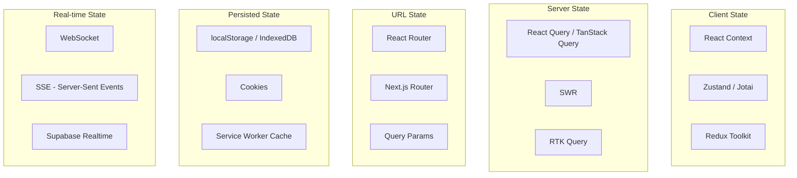
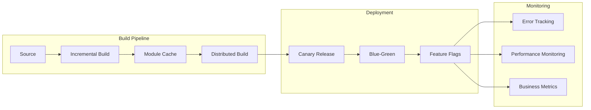

# Scalable Frontend Architecture

A scalable frontend architecture can handle growing codebases, teams, user bases, and feature sets without degrading performance or developer productivity.

## Characteristics of Scalable Frontends

```mermaid
graph TB
    subgraph "Scalable Frontend"
        A[Modular Architecture]
        B[Team Scalability]
        C[Codebase Scalability]
        D[Performance Scalability]
        E[Feature Scalability]
    end
    
    subgraph "Modular Architecture"
        A1[Feature Modules]
        A2[Shared Libraries]
        A3[Clear Boundaries]
        A4[Independent Deployability]
    end
    
    subgraph "Team Scalability"
        B1[Autonomous Teams]
        B2[Owned Modules]
        B3[Clear Contracts]
        B4[Reduced Dependencies]
    end
    
    subgraph "Codebase Scalability"
        C1[Type Safety]
        C2[Consistent Patterns]
        C3[Monorepo / Polyrepo]
        C4[Code Generation]
    end
    
    subgraph "Performance Scalability"
        D1[Lazy Loading]
        D2[Code Splitting]
        D3[CDN Distribution]
        D4[Edge Computing]
    end
    
    subgraph "Feature Scalability"
        E1[Feature Flags]
        E2[A/B Testing]
        E3[Gradual Rollout]
        E4[Backward Compatibility]
    end
    
    A --> A1
    A --> A2
    A --> A3
    A --> A4
    
    B --> B1
    B --> B2
    B --> B3
    B --> B4
    
    C --> C1
    C --> C2
    C --> C3
    C --> C4
    
    D --> D1
    D --> D2
    D --> D3
    D --> D4
    
    E --> E1
    E --> E2
    E --> E3
    E --> E4
```



## Principles

### 1. Modular Architecture

Organize code by features, not by technical roles:

```
src/
├── features/
│   ├── auth/
│   │   ├── components/
│   │   ├── hooks/
│   │   ├── api/
│   │   ├── types/
│   │   └── index.ts
│   ├── dashboard/
│   │   ├── components/
│   │   ├── hooks/
│   │   ├── api/
│   │   ├── types/
│   │   └── index.ts
│   └── products/
│       ├── components/
│       ├── hooks/
│       ├── api/
│       ├── types/
│       └── index.ts
├── shared/
│   ├── ui/
│   ├── utils/
│   └── types/
└── app/
    ├── routes/
    ├── layout/
    └── providers/
```

### 2. Team Scalability

```
GitHub Org: example-company
├── frontend-platform (core team)
│   ├── shared-components
│   ├── design-system
│   └── build-configs
├── frontend-checkout (checkout team)
│   ├── payment-form
│   ├── cart
│   └── order-confirmation
├── frontend-dashboard (dashboard team)
│   ├── analytics
│   ├── reports
│   └── settings
└── frontend-products (product team)
    ├── product-listing
    ├── product-detail
    └── search
```

**Team Ownership Model:**
- Each team owns their feature domain
- Shared platform team maintains design system and tooling
- Clear APIs/contracts between domains
- Independent build and deploy capability

### 3. Codebase Scalability Patterns

**Monorepo (Nx, Turborepo):**

```json
// nx.json
{
  "tasksRunnerOptions": {
    "default": {
      "runner": "nx/tasks-runners/default",
      "options": {
        "cacheableOperations": ["build", "test", "lint"]
      }
    }
  },
  "targetDefaults": {
    "build": {
      "dependsOn": ["^build"],
      "inputs": ["{projectRoot}/**/*", "sharedLibs"]
    }
  }
}
```

**Library Boundaries:**

```javascript
// Enforce module boundaries with ESLint
// .eslintrc.js
module.exports = {
  rules: {
    '@nrwl/nx/enforce-module-boundaries': [
      'error',
      {
        depConstraints: [
          {
            sourceTag: 'scope:shared',
            onlyDependOnLibsWithTags: ['scope:shared'],
          },
          {
            sourceTag: 'scope:feature',
            onlyDependOnLibsWithTags: ['scope:shared', 'scope:feature'],
          },
          {
            sourceTag: 'scope:app',
            onlyDependOnLibsWithTags: ['*'],
          },
        ],
      },
    ],
  },
};
```

### 4. Performance Scalability

```javascript
// Lazy loading by route
const Dashboard = lazy(() => import('./features/dashboard/Dashboard'));
const Products = lazy(() => import('./features/products/Products'));
const Analytics = lazy(() => import('./features/analytics/Analytics'));

// Lazy loading heavy dependencies
const Editor = lazy(() => import('./components/RichTextEditor'));

// Conditional loading based on feature flags
const NewFeature = featureFlags.enabled('new-dashboard')
  ? lazy(() => import('./features/dashboard/NewDashboard'))
  : lazy(() => import('./features/dashboard/LegacyDashboard'));
```

### 5. State Management at Scale



### 6. Build and Deploy Scalability



### 7. API Layer Abstraction

```javascript
// src/shared/api/client.ts
class ApiClient {
  private baseURL: string;
  private interceptors: Interceptor[];

  constructor(config: ApiConfig) {
    this.baseURL = config.baseURL;
    this.interceptors = [];
  }

  async get<T>(path: string, options?: RequestOptions): Promise<T> {
    return this.request('GET', path, undefined, options);
  }

  async post<T>(path: string, body: unknown, options?: RequestOptions): Promise<T> {
    return this.request('POST', path, body, options);
  }

  private async request<T>(
    method: string,
    path: string,
    body?: unknown,
    options?: RequestOptions
  ): Promise<T> {
    const url = `${this.baseURL}${path}`;
    const config: RequestInit = {
      method,
      headers: {
        'Content-Type': 'application/json',
        ...options?.headers,
      },
      credentials: 'include',
    };

    if (body) {
      config.body = JSON.stringify(body);
    }

    // Run request interceptors
    for (const interceptor of this.interceptors) {
      await interceptor.onRequest?.(config);
    }

    let response = await fetch(url, config);

    // Run response interceptors
    for (const interceptor of this.interceptors) {
      response = (await interceptor.onResponse?.(response)) || response;
    }

    if (!response.ok) {
      // Handle token refresh, retry logic
      if (response.status === 401 && options?.retry !== false) {
        const refreshed = await this.refreshToken();
        if (refreshed) {
          return this.request(method, path, body, { ...options, retry: false });
        }
      }
      throw new ApiError(response.status, await response.json());
    }

    return response.json();
  }
}
```

## Scalability Anti-Patterns

| Anti-Pattern | Problem | Solution |
|-------------|---------|----------|
| God Component | Component does everything | Split into focused components |
| Prop Drilling | Pass props through 5+ levels | Use context or state management |
| Global State Overuse | Everything in Redux | Keep state close to where used |
| Monolithic Bundle | Single JS bundle, slow initial load | Code splitting by routes |
| No API Abstraction | Fetch calls scattered everywhere | Centralized API client |
| Inconsistent Patterns | Half hooks, half class components | Adopt one pattern |
| Lack of Types | Any types everywhere | Full TypeScript coverage |
| No Testing | Manual testing only | Automated tests at all levels |

## Measuring Scalability

- **Build time:** Should stay under 2 minutes as codebase grows
- **Dev server start:** Under 3 seconds
- **HMR time:** Under 50ms
- **Bundle size:** Under 200KB (gzip) initial load
- **Page load time:** Under 2 seconds for 90th percentile
- **Time to add new feature:** Under 1 day for standard features
- **Test execution:** Under 5 minutes for full suite
- **Deploy time:** Under 10 minutes from push to production

## Resources
- [Feature-Sliced Design](https://feature-sliced.design/)
- [Nx Monorepo](https://nx.dev/)
- [Turborepo](https://turbo.build/repo)
- [Micro Frontends](https://martinfowler.com/articles/micro-frontends.html)
- [The Art of Scalability](https://www.artofscalability.com/)
