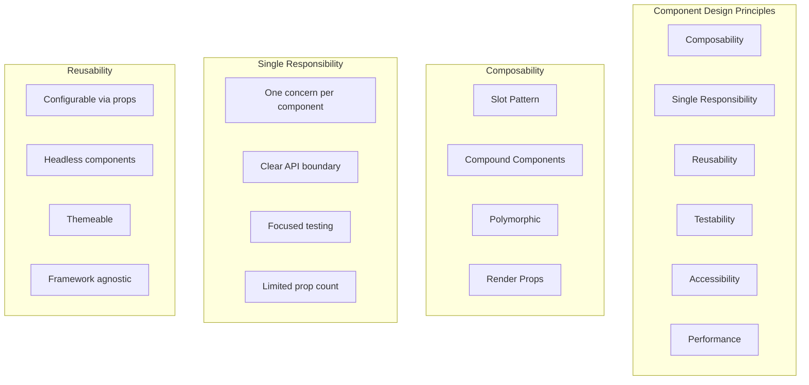
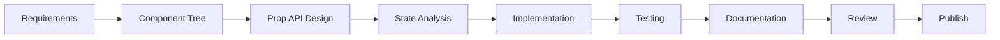

# Component System Design

A well-designed component system is the foundation of scalable, maintainable frontend applications. It enables teams to build consistently, reuse efficiently, and compose freely.

## Design Principles



## Component API Design

### Props Design Guidelines

```typescript
// DO: Use explicit, typed props
interface ButtonProps {
  variant: 'primary' | 'secondary' | 'ghost';
  size: 'sm' | 'md' | 'lg';
  loading?: boolean;
  disabled?: boolean;
  fullWidth?: boolean;
  onClick?: () => void;
  children: React.ReactNode;
}

// DO: Extend native HTML attributes
interface InputProps extends Omit<React.InputHTMLAttributes<HTMLInputElement>, 'size'> {
  label: string;
  error?: string;
  hint?: string;
}

// DON'T: Too many unrelated props
interface CardProps {
  title: string;
  image: string;
  onClick: () => void;
  variant: string;
  isLoading: boolean;
  isSelected: boolean;
  badge: string;
  actions: Action[];
  // ... 15 more props
}
// BETTER: Break into smaller components
```

### Polymorphic Components

Render as different HTML elements while maintaining type safety:

```typescript
// Polymorphic component with `as` prop
type TextProps<C extends React.ElementType> = {
  as?: C;
  variant?: 'h1' | 'h2' | 'body' | 'caption';
  children: React.ReactNode;
} & React.ComponentPropsWithoutRef<C>;

function Text<C extends React.ElementType = 'span'>({
  as,
  variant = 'body',
  children,
  ...props
}: TextProps<C>) {
  const Component = as || 'span';
  const className = getVariantStyles(variant);
  
  return <Component className={className} {...props}>{children}</Component>;
}

// Usage
<Text as="h1" variant="h1">Heading</Text>
<Text as="p" variant="body">Body text</Text>
<Text as="label" variant="caption" htmlFor="input">Label</Text>
```

### Slot Pattern

Allow content injection at specific positions:

```typescript
interface CardProps {
  title: React.ReactNode;
  subtitle?: React.ReactNode;
  media?: React.ReactNode;
  actions?: React.ReactNode;
  children: React.ReactNode;
}

function Card({ title, subtitle, media, actions, children }: CardProps) {
  return (
    <div className="card">
      {media && <div className="card-media">{media}</div>}
      <div className="card-body">
        <h2 className="card-title">{title}</h2>
        {subtitle && <p className="card-subtitle">{subtitle}</p>}
        <div className="card-content">{children}</div>
      </div>
      {actions && <div className="card-actions">{actions}</div>}
    </div>
  );
}

// Usage
<Card
  title="Project Overview"
  subtitle="Last updated 2 hours ago"
  media={}
  actions={<Button onClick={edit}>Edit</Button>}
>
  <p>Project description here...</p>
</Card>
```

### Compound Components

Related components that work together implicitly:

```typescript
// Compound component pattern
interface SelectContextType {
  value: string;
  onChange: (value: string) => void;
  isOpen: boolean;
  toggle: () => void;
}

const SelectContext = createContext<SelectContextType | null>(null);

function Select({ value, onChange, children }: SelectProps) {
  const [isOpen, setIsOpen] = useState(false);
  
  return (
    <SelectContext.Provider value={{ value, onChange, isOpen, toggle: () => setIsOpen(!isOpen) }}>
      <div className="select">{children}</div>
    </SelectContext.Provider>
  );
}

Select.Trigger = function Trigger({ children }: { children: React.ReactNode }) {
  const { value, toggle } = useSelectContext();
  return (
    <button className="select-trigger" onClick={toggle}>
      {children || value}
      <ChevronDown />
    </button>
  );
};

Select.Options = function Options({ children }: { children: React.ReactNode }) {
  const { isOpen } = useSelectContext();
  if (!isOpen) return null;
  return <div className="select-options">{children}</div>;
};

Select.Option = function Option({ value, children }: OptionProps) {
  const { value: selectedValue, onChange, toggle } = useSelectContext();
  const isSelected = value === selectedValue;
  
  return (
    <div
      className={`select-option ${isSelected ? 'selected' : ''}`}
      onClick={() => { onChange(value); toggle(); }}
      role="option"
      aria-selected={isSelected}
    >
      {children}
    </div>
  );
};

// Usage
<Select value={country} onChange={setCountry}>
  <Select.Trigger />
  <Select.Options>
    <Select.Option value="us">United States</Select.Option>
    <Select.Option value="ca">Canada</Select.Option>
    <Select.Option value="mx">Mexico</Select.Option>
  </Select.Options>
</Select>
```

## Headless Components

Separate logic from presentation for maximum flexibility:

```typescript
// Headless component - no built-in styles
interface UseSelectOptions {
  items: SelectItem[];
  onChange: (item: SelectItem) => void;
  labelKey?: string;
  valueKey?: string;
}

function useSelect({ items, onChange }: UseSelectOptions) {
  const [isOpen, setIsOpen] = useState(false);
  const [selectedIndex, setSelectedIndex] = useState(-1);
  const [inputValue, setInputValue] = useState('');

  const filteredItems = items.filter(item =>
    item.label.toLowerCase().includes(inputValue.toLowerCase())
  );

  const getMenuProps = () => ({
    role: 'listbox',
    'aria-expanded': isOpen,
    hidden: !isOpen,
  });

  const getItemProps = (index: number) => ({
    role: 'option',
    'aria-selected': index === selectedIndex,
    onClick: () => {
      onChange(filteredItems[index]);
      setIsOpen(false);
    },
    onMouseEnter: () => setSelectedIndex(index),
  });

  return {
    isOpen,
    setIsOpen,
    selectedIndex,
    filteredItems,
    inputValue,
    setInputValue,
    getMenuProps,
    getItemProps,
  };
}

// Usage - full control over rendering
function CustomSelect() {
  const { filteredItems, inputValue, setInputValue, getMenuProps, getItemProps } = useSelect({
    items: countries,
    onChange: (item) => console.log(item),
  });

  return (
    <div className="custom-select">
      <input
        value={inputValue}
        onChange={(e) => setInputValue(e.target.value)}
        placeholder="Search countries..."
      />
      <ul {...getMenuProps()} className="custom-dropdown">
        {filteredItems.map((item, i) => (
          <li key={item.value} {...getItemProps(i)} className="custom-option">
            
            <span>{item.label}</span>
          </li>
        ))}
      </ul>
    </div>
  );
}
```

## Design Process



### Step 1: Component Tree

```
Page
├── Header
│   ├── Logo
│   ├── Navigation
│   │   ├── NavItem
│   │   └── NavItem
│   ├── SearchBar
│   └── UserMenu
│       ├── Avatar
│       └── DropdownMenu
├── Main
│   ├── Sidebar
│   │   └── SidebarNav
│   └── Content
│       ├── Breadcrumbs
│       ├── DataTable
│       │   ├── TableHeader
│       │   ├── TableRow
│       │   └── Pagination
│       └── Modal
│           ├── ModalHeader
│           ├── ModalBody
│           └── ModalFooter
└── Footer
```

### Step 2: Prop API

```typescript
// Each component's API surface
interface DataTableProps<T> {
  data: T[];
  columns: Column<T>[];
  loading?: boolean;
  sortable?: boolean;
  selectable?: boolean;
  pagination?: PaginationConfig;
  onRowClick?: (row: T) => void;
  emptyState?: React.ReactNode;
  errorState?: React.ReactNode;
}

interface Column<T> {
  key: keyof T | string;
  header: string;
  render?: (value: T[keyof T], row: T) => React.ReactNode;
  sortable?: boolean;
  width?: string | number;
  align?: 'left' | 'center' | 'right';
}
```

### Step 3: State Analysis

```typescript
interface ComponentState {
  // Loading states
  isLoading: boolean;
  loadingSkeleton?: React.ReactNode;

  // Empty states
  isEmpty: boolean;
  emptyState?: React.ReactNode;

  // Error states
  error: Error | null;
  errorState?: React.ReactNode | ((error: Error) => React.ReactNode);

  // Edge cases
  isDisabled: boolean;
  isReadOnly: boolean;
  maxLength?: number;
  minValue?: number;
}
```

### Step 4: Testing Strategy

```typescript
// tests/components/DataTable.test.tsx
describe('DataTable', () => {
  // States to test
  describe('Loading state', () => {
    it('renders skeleton while loading');
    it('shows loading indicator when data is null');
  });

  describe('Empty state', () => {
    it('shows empty state message when no data');
    it('shows custom empty state component');
    it('does not render table headers when empty');
  });

  describe('Error state', () => {
    it('shows error state when API fails');
    it('shows retry button on error');
    it('calls onRetry when retry button clicked');
  });

  describe('Normal state', () => {
    it('renders all rows from data');
    it('renders custom cell content');
    it('handles row click');
    it('supports sorting');
    it('supports pagination');
  });

  describe('Edge cases', () => {
    it('handles single row');
    it('handles very long text');
    it('handles special characters');
    it('handles null/undefined values');
  });
});
```

## Styled vs Unstyled Libraries

| Approach | Example | Pros | Cons |
|----------|---------|------|------|
| Styled | MUI, Ant Design | Ready to use out of box | Hard to customize, large bundle |
| Headless | Radix UI, React Aria | Full control, accessible | More setup work |
| Styled System | Chakra, Tailwind UI | Good balance | Design system lock-in |
| CSS Framework | Tailwind CSS | Utility classes, small bundle | Verbose HTML |
| Zero Runtime | Linaria, vanilla-extract | No runtime CSS, typesafe | Build tool integration |

## Resources
- [Radix UI Primitives](https://www.radix-ui.com/)
- [React Aria Components](https://react-spectrum.adobe.com/react-aria/)
- [Compound Component Pattern](https://kentcdodds.com/blog/compound-components)
- [Polymorphic React Components](https://www.benmvp.com/blog/polymorphic-react-components/)
- [Headless Component Pattern](https://www.merrickchristensen.com/articles/headless-user-interface-components/)
