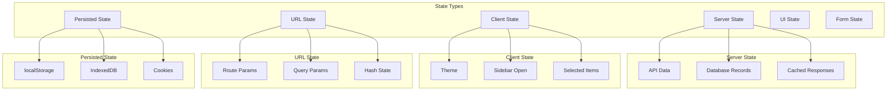
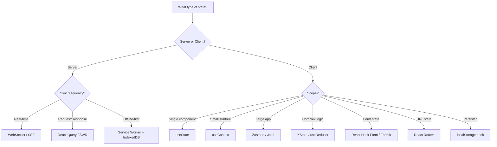
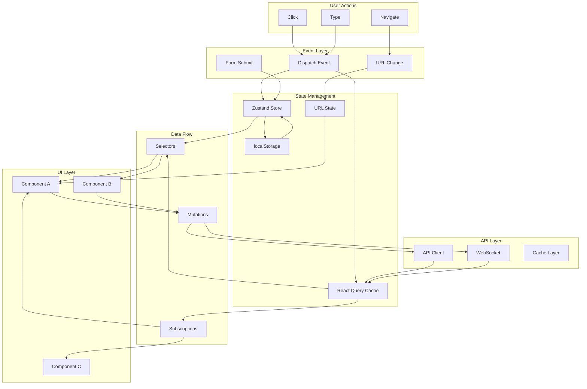

# State Architecture

State architecture is the backbone of any frontend application. Choosing the right state management approach determines how data flows through the application, how components communicate, and how maintainable the codebase remains as it grows.

## State Categories



## State Management Decision Tree



## Local vs Global State

```typescript
// LOCAL STATE - useState
function Counter() {
  const [count, setCount] = useState(0);
  // Only this component and its children need this state
  return <button onClick={() => setCount(c => c + 1)}>{count}</button>;
}

// LIFTED STATE - shared context
function Parent() {
  const [value, setValue] = useState('');
  // Shared between sibling components
  return (
    <>
      <Input value={value} onChange={setValue} />
      <Display value={value} />
    </>
  );
}

// GLOBAL STATE - Zustand
import { create } from 'zustand';

const useStore = create((set) => ({
  user: null,
  theme: 'light',
  notifications: [],
  setUser: (user) => set({ user }),
  toggleTheme: () => set((s) => ({ theme: s.theme === 'light' ? 'dark' : 'light' })),
  addNotification: (n) => set((s) => ({ notifications: [...s.notifications, n] })),
}));

function Profile() {
  const user = useStore((s) => s.user);
  return <div>{user?.name}</div>;
}
```

## State Normalization

Normalize nested data to avoid duplication and inconsistencies:

```typescript
// BEFORE: Nested structure
const state = {
  posts: [
    {
      id: '1',
      title: 'Post 1',
      author: { id: 'a1', name: 'Alice' },
      comments: [
        { id: 'c1', text: 'Great!', author: { id: 'a2', name: 'Bob' } }
      ],
    },
  ],
};
// Problem: Same author data duplicated across posts

// AFTER: Normalized
const normalizedState = {
  users: {
    'a1': { id: 'a1', name: 'Alice' },
    'a2': { id: 'a2', name: 'Bob' },
  },
  posts: {
    '1': { id: '1', title: 'Post 1', authorId: 'a1', commentIds: ['c1'] },
  },
  comments: {
    'c1': { id: 'c1', text: 'Great!', authorId: 'a2', postId: '1' },
  },
};

// Selectors to reconstruct
const selectPostWithDetails = (postId) => {
  const post = normalizedState.posts[postId];
  return {
    ...post,
    author: normalizedState.users[post.authorId],
    comments: post.commentIds.map(id => ({
      ...normalizedState.comments[id],
      author: normalizedState.users[normalizedState.comments[id].authorId],
    })),
  };
};
```

## State Machines (XState)

Complex state with clear transitions and side effects:

```typescript
import { createMachine, interpret } from 'xstate';

// Define a state machine for a form submission flow
const submitFormMachine = createMachine({
  id: 'form',
  initial: 'idle',
  states: {
    idle: {
      on: { SUBMIT: 'validating' },
    },
    validating: {
      entry: 'validate',
      on: {
        VALID: 'submitting',
        INVALID: 'error',
      },
    },
    submitting: {
      invoke: {
        src: 'submitToServer',
        onDone: 'success',
        onError: 'error',
      },
    },
    success: {
      type: 'final',
    },
    error: {
      on: {
        RETRY: 'submitting',
        RESET: 'idle',
      },
    },
  },
});

// Use in React
function FormMachine() {
  const [state, send] = useMachine(submitFormMachine, {
    services: {
      submitToServer: (context, event) => api.submitForm(context.formData),
    },
    actions: {
      validate: (context) => {
        if (isValid(context.formData)) {
          send('VALID');
        } else {
          send('INVALID');
        }
      },
    },
  });

  return (
    <div>
      {state.matches('idle') && <Form onsubmit={() => send('SUBMIT')} />}
      {state.matches('validating') && <Spinner />}
      {state.matches('submitting') && <Progress />}
      {state.matches('success') && <SuccessMessage />}
      {state.matches('error') && (
        <Error onRetry={() => send('RETRY')} onReset={() => send('RESET')} />
      )}
    </div>
  );
}
```

## Optimistic Updates

Update UI immediately, then confirm or rollback:

```javascript
function useOptimisticTodos() {
  const queryClient = useQueryClient();

  const addTodo = useMutation({
    mutationFn: (newTodo) => api.createTodo(newTodo),

    // Optimistic update
    onMutate: async (newTodo) => {
      await queryClient.cancelQueries(['todos']);
      const previousTodos = queryClient.getQueryData(['todos']);

      queryClient.setQueryData(['todos'], (old) => [
        ...old,
        { ...newTodo, id: 'temp-' + Date.now(), status: 'pending' },
      ]);

      return { previousTodos };
    },

    // On success, replace temp with real data
    onSuccess: (result, variables, context) => {
      queryClient.setQueryData(['todos'], (old) =>
        old.map(todo =>
          todo.id.startsWith('temp-') ? { ...result, status: 'confirmed' } : todo
        )
      );
    },

    // On error, rollback
    onError: (error, variables, context) => {
      queryClient.setQueryData(['todos'], context.previousTodos);
      showToast('Failed to create todo');
    },
  });

  return addTodo;
}
```

## Undo/Redo Pattern

```typescript
function useUndoRedo(initialState) {
  const [past, setPast] = useState([]);
  const [present, setPresent] = useState(initialState);
  const [future, setFuture] = useState([]);

  const setState = useCallback((newState) => {
    setPast((p) => [...p, present]);
    setPresent(newState);
    setFuture([]); // Clear redo on new action
  }, [present]);

  const undo = useCallback(() => {
    if (past.length === 0) return;
    const previous = past[past.length - 1];
    setPast((p) => p.slice(0, -1));
    setFuture((f) => [present, ...f]);
    setPresent(previous);
  }, [past, present]);

  const redo = useCallback(() => {
    if (future.length === 0) return;
    const next = future[0];
    setFuture((f) => f.slice(1));
    setPast((p) => [...p, present]);
    setPresent(next);
  }, [future, present]);

  const canUndo = past.length > 0;
  const canRedo = future.length > 0;

  return { state: present, setState, undo, redo, canUndo, canRedo };
}

// Usage
function TodoApp() {
  const { state: todos, setState, undo, redo, canUndo, canRedo } = useUndoRedo([]);

  return (
    <div>
      <button disabled={!canUndo} onClick={undo}>Undo</button>
      <button disabled={!canRedo} onClick={redo}>Redo</button>
      <TodoList todos={todos} onReorder={setState} />
    </div>
  );
}
```

## State Persistence

```typescript
// Zustand with persistence middleware
import { create } from 'zustand';
import { persist } from 'zustand/middleware';

const useSettingsStore = create(
  persist(
    (set) => ({
      theme: 'system',
      locale: 'en',
      fontSize: 16,
      sidebarCollapsed: false,
      setTheme: (theme) => set({ theme }),
      setLocale: (locale) => set({ locale }),
      toggleSidebar: () => set((s) => ({ sidebarCollapsed: !s.sidebarCollapsed })),
    }),
    {
      name: 'app-settings', // localStorage key
      partialize: (state) => ({
        theme: state.theme,
        locale: state.locale,
        fontSize: state.fontSize,
      }), // Only persist these fields
    }
  )
);
```

## State Architecture Diagram



## State Management Library Comparison

| Library | Type | Size | Learning Curve | Best For |
|---------|------|------|----------------|----------|
| React Query | Server state | 13KB | Low | API data caching |
| Zustand | Client state | 1KB | Low | Simple global state |
| Jotai | Atomic state | 3KB | Low | Granular re-renders |
| Redux Toolkit | General state | 12KB | Medium | Large enterprise |
| XState | State machines | 15KB | High | Complex workflows |
| React Context | Shared state | 0KB | Low | Small shared state |
| valtio | Proxy state | 3KB | Low | Reactive patterns |

## Resources
- [TanStack Query Docs](https://tanstack.com/query/latest)
- [Zustand](https://github.com/pmndrs/zustand)
- [XState](https://xstate.js.org/)
- [Jotai](https://jotai.org/)
- [Redux Toolkit](https://redux-toolkit.js.org/)
- [State Normalization](https://redux.js.org/usage/structuring-reducers/normalizing-state-shape)
