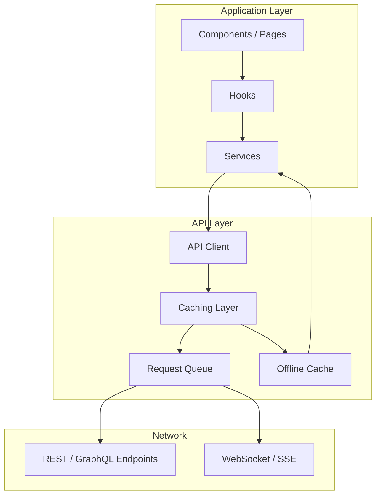
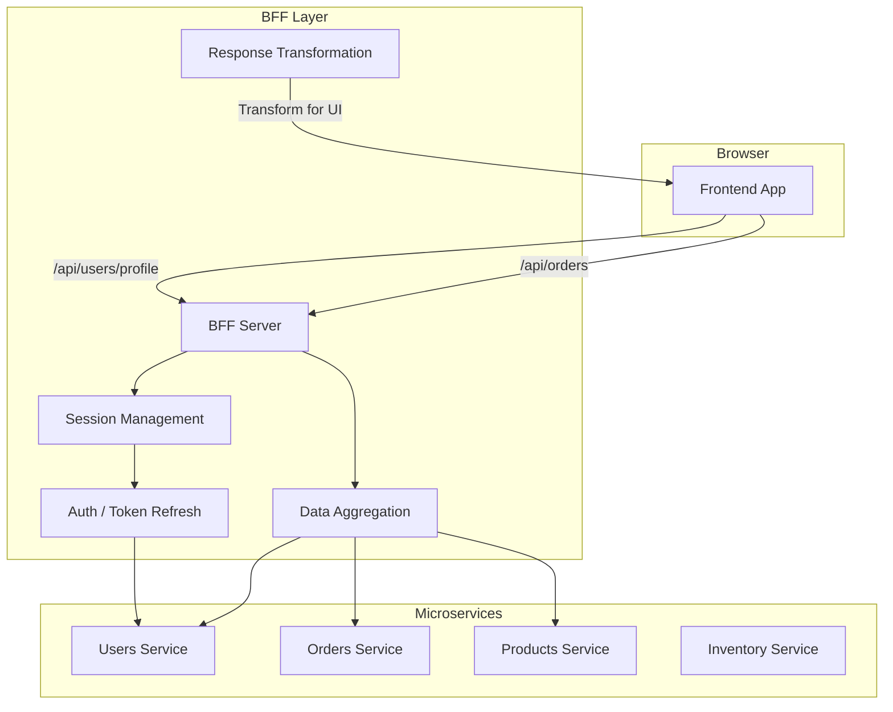
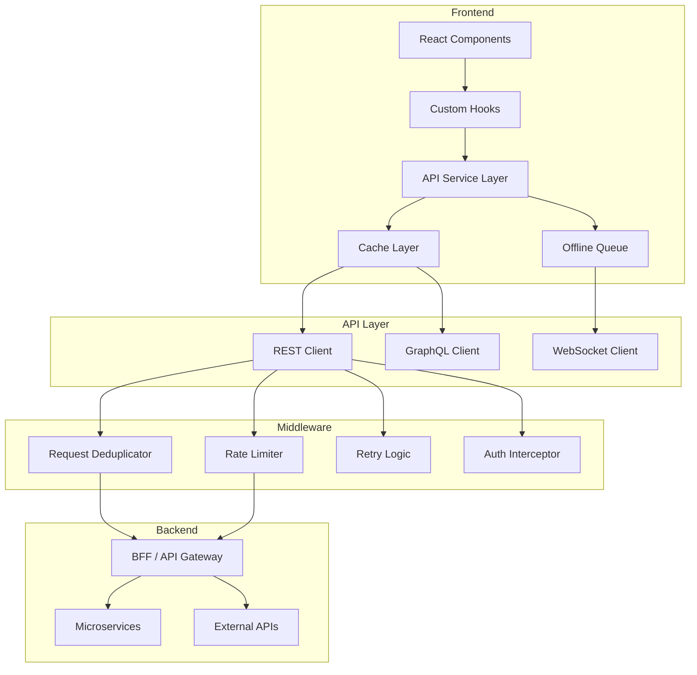

# API Architecture

A well-designed API integration layer separates data fetching concerns from UI logic, provides caching and deduplication, and enables resilient data handling patterns.

## API Integration Layer



## API Client Architecture

```typescript
// src/api/client.ts
type HttpMethod = 'GET' | 'POST' | 'PUT' | 'PATCH' | 'DELETE';

interface ApiConfig {
  baseURL: string;
  headers?: Record<string, string>;
  timeout?: number;
  retryCount?: number;
  retryDelay?: number;
}

interface RequestOptions {
  headers?: Record<string, string>;
  params?: Record<string, string>;
  signal?: AbortSignal;
  retry?: boolean;
  cache?: boolean;
}

class ApiClient {
  private config: ApiConfig;
  private interceptors: Interceptor[];

  constructor(config: ApiConfig) {
    this.config = {
      timeout: 10000,
      retryCount: 3,
      retryDelay: 1000,
      ...config,
    };
    this.interceptors = [];
  }

  async get<T>(path: string, options?: RequestOptions): Promise<T> {
    return this.request('GET', path, undefined, options);
  }

  async post<T>(path: string, body?: unknown, options?: RequestOptions): Promise<T> {
    return this.request('POST', path, body, options);
  }

  async put<T>(path: string, body?: unknown, options?: RequestOptions): Promise<T> {
    return this.request('PUT', path, body, options);
  }

  async patch<T>(path: string, body?: unknown, options?: RequestOptions): Promise<T> {
    return this.request('PATCH', path, body, options);
  }

  async delete<T>(path: string, options?: RequestOptions): Promise<T> {
    return this.request('DELETE', path, undefined, options);
  }

  private async request<T>(
    method: HttpMethod,
    path: string,
    body?: unknown,
    options?: RequestOptions
  ): Promise<T> {
    const url = this.buildURL(path, options?.params);
    const controller = new AbortController();
    const timeoutId = setTimeout(() => controller.abort(), this.config.timeout);

    const fetchOptions: RequestInit = {
      method,
      headers: {
        'Content-Type': 'application/json',
        ...this.config.headers,
        ...options?.headers,
      },
      signal: options?.signal || controller.signal,
    };

    if (body && method !== 'GET') {
      fetchOptions.body = JSON.stringify(body);
    }

    // Run request interceptors
    let modifiedOptions = fetchOptions;
    for (const interceptor of this.interceptors) {
      modifiedOptions = (await interceptor.onRequest?.(modifiedOptions)) || modifiedOptions;
    }

    let lastError: Error | null = null;
    const maxRetries = options?.retry !== false ? this.config.retryCount : 0;

    for (let attempt = 0; attempt <= maxRetries; attempt++) {
      try {
        const response = await fetch(url, modifiedOptions);
        clearTimeout(timeoutId);

        // Run response interceptors
        let modifiedResponse = response;
        for (const interceptor of this.interceptors) {
          modifiedResponse = (await interceptor.onResponse?.(modifiedResponse)) || modifiedResponse;
        }

        if (!modifiedResponse.ok) {
          const error = await this.parseError(modifiedResponse);
          // Token refresh flow
          if (modifiedResponse.status === 401) {
            const refreshed = await this.handleTokenRefresh();
            if (refreshed) continue;
          }
          throw error;
        }

        return modifiedResponse.json();
      } catch (error) {
        lastError = error as Error;
        if (attempt < maxRetries && this.shouldRetry(error)) {
          await this.delay(this.config.retryDelay * Math.pow(2, attempt));
          continue;
        }
        break;
      } finally {
        clearTimeout(timeoutId);
      }
    }

    throw lastError || new Error('Request failed');
  }

  private shouldRetry(error: unknown): boolean {
    if (error instanceof ApiError) {
      return [408, 429, 500, 502, 503, 504].includes(error.status);
    }
    return true; // Network errors
  }

  private buildURL(path: string, params?: Record<string, string>): string {
    const url = new URL(`${this.config.baseURL}${path}`);
    if (params) {
      Object.entries(params).forEach(([key, value]) => {
        url.searchParams.set(key, value);
      });
    }
    return url.toString();
  }

  // Interceptor pattern
  addInterceptor(interceptor: Interceptor) {
    this.interceptors.push(interceptor);
  }
}

// Interceptor for auth token
const authInterceptor: Interceptor = {
  onRequest: async (options) => {
    const token = await getAccessToken();
    if (token) {
      options.headers = {
        ...options.headers,
        'Authorization': `Bearer ${token}`,
      };
    }
    return options;
  },
  onResponse: async (response) => {
    if (response.status === 401) {
      // Token refresh handled in request method
    }
    return response;
  },
};
```

## Data Fetching Patterns

### 1. Custom Hook with React Query

```typescript
// src/hooks/useTodos.ts
import { useQuery, useMutation, useQueryClient } from '@tanstack/react-query';
import { api } from '../api/client';

interface Todo {
  id: string;
  title: string;
  completed: boolean;
}

// Query hook
function useTodos(filters?: TodoFilters) {
  return useQuery({
    queryKey: ['todos', filters],
    queryFn: () => api.get<Todo[]>('/todos', { params: filters }),
    staleTime: 30_000, // 30 seconds
    gcTime: 5 * 60_000, // 5 minutes
    select: (data) => data.sort((a, b) => a.title.localeCompare(b.title)),
  });
}

// Mutation hook
function useCreateTodo() {
  const queryClient = useQueryClient();

  return useMutation({
    mutationFn: (newTodo: Omit<Todo, 'id'>) =>
      api.post<Todo>('/todos', newTodo),

    onSuccess: (createdTodo) => {
      queryClient.setQueryData(['todos'], (old: Todo[]) =>
        old ? [...old, createdTodo] : [createdTodo]
      );
      queryClient.invalidateQueries({ queryKey: ['todos'] });
    },
  });
}

// Usage
function TodoList() {
  const { data: todos, isLoading, error } = useTodos({ completed: false });
  const createTodo = useCreateTodo();

  if (isLoading) return <TodoSkeleton />;
  if (error) return <ErrorState />;

  return (
    <div>
      {todos?.map(todo => <TodoItem key={todo.id} todo={todo} />)}
      <AddTodoForm onSubmit={(data) => createTodo.mutate(data)} />
    </div>
  );
}
```

### 2. Request Deduplication

```typescript
// src/api/deduplicator.ts
class RequestDeduplicator {
  private pendingRequests = new Map<string, Promise<any>>();

  async deduplicate<T>(key: string, fetcher: () => Promise<T>): Promise<T> {
    if (this.pendingRequests.has(key)) {
      return this.pendingRequests.get(key)!;
    }

    const promise = fetcher().finally(() => {
      this.pendingRequests.delete(key);
    });

    this.pendingRequests.set(key, promise);
    return promise;
  }
}

// Usage
const deduplicator = new RequestDeduplicator();

async function fetchUserProfile(userId: string) {
  return deduplicator.deduplicate(
    `user-${userId}`,
    () => api.get(`/users/${userId}`)
  );
}

// Multiple components calling at the same time
// Only one network request is made
ComponentA: fetchUserProfile('123'); // in useEffect
ComponentB: fetchUserProfile('123'); // in useEffect - deduplicated!
```

### 3. Offline Queue

```typescript
// src/api/offline-queue.ts
class OfflineQueue {
  private queue: QueuedRequest[] = [];
  private processing = false;

  async enqueue(request: QueuedRequest) {
    this.queue.push(request);
    await this.persistQueue();
    
    if (navigator.onLine) {
      this.processQueue();
    }
  }

  async processQueue() {
    if (this.processing || this.queue.length === 0) return;
    this.processing = true;

    while (this.queue.length > 0) {
      const request = this.queue[0];
      
      try {
        await fetch(request.url, request.options);
        this.queue.shift(); // Remove on success
        await this.persistQueue();
      } catch (error) {
        // Keep in queue, try again later
        break;
      }
    }

    this.processing = false;
  }

  private async persistQueue() {
    await localStorage.setItem('offline-queue', JSON.stringify(this.queue));
  }

  private async loadQueue() {
    const stored = localStorage.getItem('offline-queue');
    this.queue = stored ? JSON.parse(stored) : [];
  }
}

// Initialize and listen for online
const offlineQueue = new OfflineQueue();
window.addEventListener('online', () => offlineQueue.processQueue());
```

## Caching Layer

```typescript
// src/api/cache.ts
interface CacheEntry<T> {
  data: T;
  timestamp: number;
  ttl: number;
}

class ApiCache {
  private cache = new Map<string, CacheEntry<unknown>>();
  private maxEntries = 100;

  get<T>(key: string): T | null {
    const entry = this.cache.get(key) as CacheEntry<T> | undefined;
    
    if (!entry) return null;
    
    if (Date.now() - entry.timestamp > entry.ttl) {
      this.cache.delete(key);
      return null;
    }
    
    return entry.data;
  }

  set<T>(key: string, data: T, ttl: number = 300000): void {
    if (this.cache.size >= this.maxEntries) {
      const oldestKey = this.cache.keys().next().value;
      this.cache.delete(oldestKey!);
    }

    this.cache.set(key, {
      data,
      timestamp: Date.now(),
      ttl,
    });
  }

  invalidate(pattern?: RegExp): void {
    if (!pattern) {
      this.cache.clear();
      return;
    }
    
    for (const key of this.cache.keys()) {
      if (pattern.test(key)) {
        this.cache.delete(key);
      }
    }
  }
}
```

## BFF (Backend for Frontend)



```typescript
// BFF server (Express.js)
// server/index.ts
import express from 'express';

const app = express();

// Dashboard endpoint - aggregates data from multiple services
app.get('/api/dashboard', authenticate, async (req, res) => {
  const userId = req.user.id;

  // Parallel requests to microservices
  const [user, orders, recommendations] = await Promise.all([
    usersService.getUser(userId),
    ordersService.getRecentOrders(userId),
    productsService.getRecommendations(userId),
  ]);

  // Transform for frontend consumption
  res.json({
    user: {
      name: user.name,
      avatar: user.avatar,
      memberSince: user.createdAt,
    },
    recentOrders: orders.map(order => ({
      id: order.id,
      date: order.createdAt,
      total: order.total,
      status: order.status,
      items: order.items.length,
    })),
    recommendations: recommendations.slice(0, 5),
    summary: {
      totalOrders: orders.length,
      totalSpent: orders.reduce((sum, o) => sum + o.total, 0),
      activeSubscriptions: user.subscriptions?.length || 0,
    },
  });
});
```

## API Architecture Diagram



## Resources
- [TanStack Query](https://tanstack.com/query/latest)
- [React Query Patterns](https://tkdodo.eu/blog/practical-react-query)
- [BFF Pattern](https://samnewman.io/patterns/architectural/bff/)
- [Offline First with Service Workers](https://developers.google.com/web/fundamentals/primers/service-workers)
- [API Client Design Patterns](https://www.patterns.dev/posts/api-client/)
